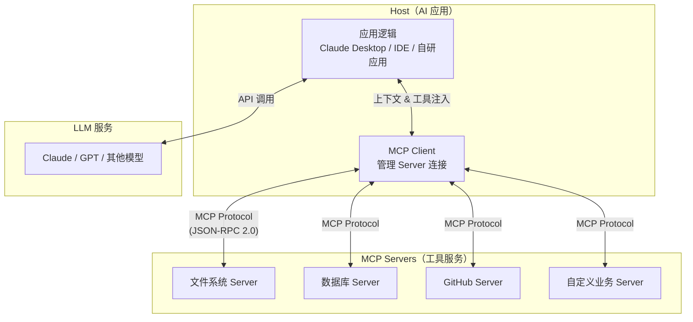
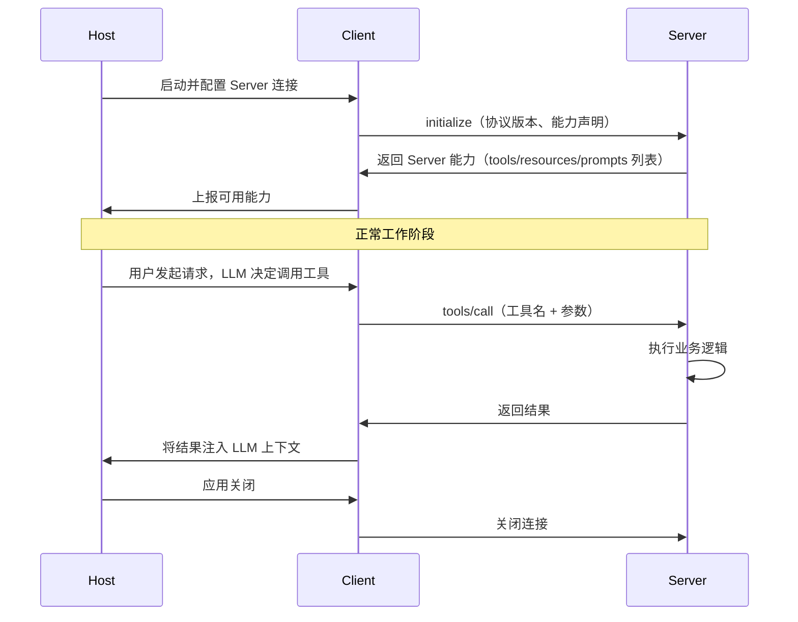

# Model Context Protocol（MCP）

## 一、概念与原理

### 什么是 MCP

**Model Context Protocol（MCP）** 是由 Anthropic 于 2024 年 11 月开源的一套开放协议，定义了 AI 应用（Host）、LLM 客户端（Client）与外部数据/工具服务（Server）之间的标准通信接口。

MCP 的核心目标：解决 AI Agent 与外部世界集成的**碎片化问题**。在 MCP 出现之前，每个 AI 应用都需要针对每个数据源或工具单独实现集成逻辑，形成 M×N 的复杂依赖矩阵。MCP 通过标准化协议，将其简化为 M+N 的插件式架构。

```
传统方式（M×N 集成矩阵）：
  Claude ──► GitHub 适配器
  Claude ──► Slack 适配器
  ChatGPT ──► GitHub 适配器  （重复实现）
  ChatGPT ──► Slack 适配器   （重复实现）

MCP 方式（M+N 标准协议）：
  Claude ──► MCP Client ──► MCP Protocol ──► GitHub MCP Server
  ChatGPT ──► MCP Client ──►               ──► Slack MCP Server
```

### 设计理念

MCP 的设计遵循以下核心原则：

1. **标准化优先**：基于 JSON-RPC 2.0，跨语言、跨平台通用
2. **能力分层**：将外部能力划分为 Resources（数据）、Tools（操作）、Prompts（模板）三类
3. **安全隔离**：Server 运行在独立进程，通过受控接口暴露能力
4. **双向通信**：支持 Server 主动向 Client 发起 Sampling 请求（让 LLM 参与 Server 端逻辑）
5. **渐进增强**：Host 可按需启用不同能力，向后兼容

### MCP 与传统 Function Calling 的关系

| 维度 | Function Calling | MCP |
|------|-----------------|-----|
| **范围** | 单次对话内的工具调用 | 跨应用的通用集成协议 |
| **标准化** | 各厂商 API 不同（OpenAI/Claude/Gemini 格式各异） | 统一开放标准 |
| **部署** | 工具逻辑嵌入应用代码 | 工具以独立 Server 形式部署 |
| **复用** | 工具实现与 LLM 平台绑定 | 一个 MCP Server 可服务多个 Host |
| **传输** | HTTP API 调用 | stdio / SSE / HTTP Stream |
| **能力** | 仅支持工具调用 | Tools + Resources + Prompts + Sampling |

**关系**：MCP 在内部使用类似 Function Calling 的机制实现 Tools 能力，但 MCP 是更高层的架构协议，Function Calling 是 MCP 的底层实现手段之一。

---

## 二、技术详解

### MCP 三层架构



**三层职责说明：**

- **Host**：承载 AI 交互的应用程序（如 Claude Desktop、VS Code Copilot、自研 Agent 应用）。Host 内嵌 MCP Client，负责发现和管理 MCP Server 连接。
- **MCP Client**：协议客户端，负责与 Server 建立连接、能力协商、消息路由。每个 Client 通常维护一个 Server 连接。
- **MCP Server**：轻量级服务进程，对外暴露标准化的 Resources、Tools、Prompts 能力。可以是本地进程（stdio）或远程服务（SSE/HTTP）。

### 核心能力

#### 1. Resources（资源）

Resources 是 Server 向 LLM 暴露的**只读数据**，类比文件系统中的文件。

```
资源 URI 示例：
  file:///home/user/project/README.md   （本地文件）
  db://customers/recent                  （数据库查询结果）
  github://repos/myorg/myrepo/issues    （GitHub Issues）
  screen://current                       （当前屏幕截图）
```

LLM 可以订阅资源变更通知，实现实时上下文更新。

#### 2. Tools（工具）

Tools 是 Server 暴露的**可执行操作**，LLM 可以调用它们产生副作用（写入数据、发送请求等）。

每个 Tool 包含：
- `name`：唯一标识符
- `description`：自然语言描述（LLM 理解工具用途的关键）
- `inputSchema`：JSON Schema 格式的参数定义

#### 3. Prompts（提示模板）

Prompts 是 Server 提供的**可复用提示词模板**，支持参数化。Host 可让用户通过 Slash Command 等方式触发。

#### 4. Sampling（采样）

Sampling 允许 MCP Server **主动请求 LLM 推理**，实现 Server 端的 AI 增强逻辑，同时让 Host 保持对 LLM 访问的控制权。

### 传输层协议

MCP 支持三种传输方式：

| 传输方式 | 适用场景 | 特点 |
|---------|---------|------|
| **stdio** | 本地进程通信 | 低延迟，标准输入输出，最常用 |
| **SSE（Server-Sent Events）** | 远程 HTTP 服务 | 单向推送，适合只读通知 |
| **HTTP Stream** | 远程双向通信 | 完整双向流式通信 |

### 协议消息格式（JSON-RPC 2.0）

```json
// Client → Server：调用工具请求
{
  "jsonrpc": "2.0",
  "id": 1,
  "method": "tools/call",
  "params": {
    "name": "query_database",
    "arguments": {
      "sql": "SELECT * FROM orders WHERE status = 'pending'",
      "limit": 10
    }
  }
}

// Server → Client：工具调用结果
{
  "jsonrpc": "2.0",
  "id": 1,
  "result": {
    "content": [
      {
        "type": "text",
        "text": "[{\"id\":1,\"product\":\"Java Book\",\"status\":\"pending\"}]"
      }
    ],
    "isError": false
  }
}
```

### 生命周期



---

## 三、Java 代码示例

### Maven 依赖配置

```xml
<!-- Spring AI MCP（推荐，Spring 生态集成最佳） -->
<dependency>
    <groupId>org.springframework.ai</groupId>
    <artifactId>spring-ai-mcp-core</artifactId>
    <version>1.0.0</version>
</dependency>
<dependency>
    <groupId>org.springframework.ai</groupId>
    <artifactId>spring-ai-mcp-spring</artifactId>
    <version>1.0.0</version>
</dependency>

<!-- LangChain4j MCP（LangChain4j 生态） -->
<dependency>
    <groupId>dev.langchain4j</groupId>
    <artifactId>langchain4j-mcp</artifactId>
    <version>0.36.0</version>
</dependency>

<!-- JSON-RPC 基础支持 -->
<dependency>
    <groupId>com.fasterxml.jackson.core</groupId>
    <artifactId>jackson-databind</artifactId>
    <version>2.17.0</version>
</dependency>
```

### 示例一：使用 Spring AI 构建 MCP Server

```java
package com.example.mcp.server;

import org.springframework.ai.mcp.server.McpServer;
import org.springframework.ai.mcp.server.McpSyncServerExchange;
import org.springframework.ai.mcp.server.annotation.McpTool;
import org.springframework.ai.mcp.server.annotation.McpResource;
import org.springframework.ai.mcp.spec.McpSchema;
import org.springframework.stereotype.Component;
import org.springframework.beans.factory.annotation.Autowired;

import java.util.List;
import java.util.Map;

/**
 * 订单管理 MCP Server
 * 对外暴露订单查询和状态更新能力
 */
@Component
public class OrderMcpServer {

    @Autowired
    private OrderRepository orderRepository;

    @Autowired
    private OrderService orderService;

    /**
     * Tool：查询订单列表
     * LLM 可调用此工具获取用户订单信息
     *
     * @param userId  用户 ID（必填）
     * @param status  订单状态过滤（可选：pending/shipped/delivered/cancelled）
     * @param limit   返回数量上限（默认 10）
     */
    @McpTool(
        name = "query_orders",
        description = "查询指定用户的订单列表，支持按状态过滤。返回订单ID、商品名称、金额和当前状态。"
    )
    public List<OrderDTO> queryOrders(
            String userId,
            String status,
            Integer limit
    ) {
        // 1. 参数校验
        if (userId == null || userId.isBlank()) {
            throw new IllegalArgumentException("userId 不能为空");
        }
        int pageLimit = (limit != null && limit > 0) ? Math.min(limit, 100) : 10;

        // 2. 执行查询
        if (status != null) {
            return orderRepository.findByUserIdAndStatus(userId, status, pageLimit);
        }
        return orderRepository.findByUserId(userId, pageLimit);
    }

    /**
     * Tool：更新订单状态
     * 需要谨慎授权，建议在 Host 侧加入用户确认步骤
     *
     * @param orderId   订单 ID
     * @param newStatus 新状态
     * @return          操作结果描述
     */
    @McpTool(
        name = "update_order_status",
        description = "更新订单状态。仅允许特定状态转换：pending→processing，processing→shipped，shipped→delivered。"
    )
    public Map<String, Object> updateOrderStatus(String orderId, String newStatus) {
        // 1. 权限与状态转换合法性校验
        Order order = orderRepository.findById(orderId)
            .orElseThrow(() -> new RuntimeException("订单不存在：" + orderId));

        if (!orderService.isValidTransition(order.getStatus(), newStatus)) {
            return Map.of(
                "success", false,
                "message", String.format("非法状态转换：%s → %s", order.getStatus(), newStatus)
            );
        }

        // 2. 执行更新
        orderService.updateStatus(orderId, newStatus);

        // 3. 返回操作结果（结构化，便于 LLM 解析）
        return Map.of(
            "success", true,
            "orderId", orderId,
            "previousStatus", order.getStatus(),
            "currentStatus", newStatus,
            "message", "订单状态已更新"
        );
    }

    /**
     * Resource：暴露订单统计报表
     * LLM 可以读取此资源获取业务概况
     */
    @McpResource(
        uri = "orders://dashboard/summary",
        name = "订单统计概览",
        description = "今日订单统计：总数、各状态分布、销售额",
        mimeType = "application/json"
    )
    public String getOrderSummary() {
        // 查询今日统计数据并序列化为 JSON
        OrderSummary summary = orderService.getTodaySummary();
        return JsonUtils.toJson(summary);
    }
}
```

### 示例二：Spring AI MCP Client 接入（Host 侧）

```java
package com.example.mcp.client;

import org.springframework.ai.mcp.client.McpClient;
import org.springframework.ai.mcp.client.McpSyncClient;
import org.springframework.ai.mcp.client.transport.StdioClientTransport;
import org.springframework.ai.mcp.client.transport.SseClientTransport;
import org.springframework.ai.mcp.spec.McpSchema.Tool;
import org.springframework.ai.chat.client.ChatClient;
import org.springframework.ai.tool.ToolCallbackProvider;
import org.springframework.context.annotation.Bean;
import org.springframework.context.annotation.Configuration;

import java.time.Duration;
import java.util.List;

/**
 * MCP Client 配置
 * 连接本地和远程 MCP Server，将其能力注入 Spring AI ChatClient
 */
@Configuration
public class McpClientConfig {

    /**
     * 配置本地 stdio 传输的 MCP Server（适合本地工具进程）
     */
    @Bean
    public McpSyncClient localOrderMcpClient() {
        // 1. 配置 stdio 传输：启动本地 MCP Server 进程
        StdioClientTransport transport = new StdioClientTransport(
            List.of("java", "-jar", "/opt/mcp-servers/order-server.jar")
        );

        // 2. 构建客户端并初始化连接
        McpSyncClient client = McpClient.sync(transport)
            .requestTimeout(Duration.ofSeconds(30))
            .build();

        client.initialize(); // 执行 MCP 握手，获取 Server 能力列表

        return client;
    }

    /**
     * 配置远程 SSE 传输的 MCP Server（适合远程 HTTP 服务）
     */
    @Bean
    public McpSyncClient remoteSearchMcpClient() {
        // 1. 配置 SSE 传输：连接远程 MCP Server
        SseClientTransport transport = SseClientTransport.builder()
            .url("https://mcp.internal.example.com/search")
            .build();

        McpSyncClient client = McpClient.sync(transport)
            .requestTimeout(Duration.ofSeconds(10))
            .build();

        client.initialize();
        return client;
    }

    /**
     * 将 MCP Server 的 Tools 注入 ChatClient
     * LLM 在对话中可自动发现并调用这些工具
     */
    @Bean
    public ChatClient chatClientWithMcp(
            ChatClient.Builder builder,
            McpSyncClient localOrderMcpClient,
            McpSyncClient remoteSearchMcpClient,
            ToolCallbackProvider toolCallbackProvider
    ) {
        return builder
            .defaultTools(toolCallbackProvider)  // 注入 MCP Tools 作为 Function Calling 工具
            .build();
    }
}
```

### 示例三：使用 LangChain4j 集成 MCP

```java
package com.example.mcp.langchain4j;

import dev.langchain4j.mcp.McpToolProvider;
import dev.langchain4j.mcp.client.DefaultMcpClient;
import dev.langchain4j.mcp.client.McpClient;
import dev.langchain4j.mcp.client.transport.McpTransport;
import dev.langchain4j.mcp.client.transport.stdio.StdioMcpTransport;
import dev.langchain4j.mcp.client.transport.http.HttpMcpTransport;
import dev.langchain4j.model.openai.OpenAiChatModel;
import dev.langchain4j.service.AiServices;
import dev.langchain4j.agent.tool.ToolProvider;
import org.springframework.stereotype.Service;
import org.springframework.beans.factory.annotation.Value;

import jakarta.annotation.PreDestroy;
import java.time.Duration;
import java.util.List;

/**
 * LangChain4j MCP 集成示例
 * 展示如何使用 LangChain4j 的 MCP 支持连接外部工具
 */
@Service
public class LangChain4jMcpService {

    @Value("${mcp.filesystem.server.path:/usr/local/bin/mcp-server-filesystem}")
    private String filesystemServerPath;

    @Value("${mcp.database.server.url:http://localhost:8080/mcp}")
    private String databaseServerUrl;

    private McpClient filesystemClient;
    private McpClient databaseClient;

    /**
     * 初始化 MCP Clients 并构建具有工具能力的 AI Service
     */
    public AgentAssistant buildAgent(OpenAiChatModel chatModel) {
        // 1. 创建文件系统 MCP Client（stdio 传输）
        McpTransport stdioTransport = new StdioMcpTransport.Builder()
            .command(List.of(filesystemServerPath, "/workspace"))
            .logEvents(true)   // 开启协议日志，便于调试
            .build();

        filesystemClient = new DefaultMcpClient.Builder()
            .transport(stdioTransport)
            .toolExecutionTimeout(Duration.ofSeconds(60))
            .build();

        // 2. 创建数据库 MCP Client（HTTP 传输）
        McpTransport httpTransport = new HttpMcpTransport.Builder()
            .sseUrl(databaseServerUrl + "/sse")
            .build();

        databaseClient = new DefaultMcpClient.Builder()
            .transport(httpTransport)
            .toolExecutionTimeout(Duration.ofSeconds(30))
            .build();

        // 3. 组合多个 MCP Server 的工具能力
        ToolProvider toolProvider = McpToolProvider.builder()
            .mcpClients(List.of(filesystemClient, databaseClient))
            .build();

        // 4. 使用 AiServices 构建类型安全的 Agent 接口
        return AiServices.builder(AgentAssistant.class)
            .chatLanguageModel(chatModel)
            .toolProvider(toolProvider)
            .build();
    }

    /**
     * 应用关闭时优雅断开 MCP 连接
     */
    @PreDestroy
    public void cleanup() {
        try {
            if (filesystemClient != null) filesystemClient.close();
            if (databaseClient != null) databaseClient.close();
        } catch (Exception e) {
            // 记录日志但不影响关闭流程
            System.err.println("MCP Client 关闭时出错: " + e.getMessage());
        }
    }
}

/**
 * 类型安全的 Agent 接口定义
 */
interface AgentAssistant {
    String chat(String userMessage);
}
```

### 示例四：自定义 MCP Server（Spring Boot 完整实现）

```java
package com.example.mcp.server;

import org.springframework.ai.mcp.server.McpServer;
import org.springframework.ai.mcp.server.McpServerFeatures;
import org.springframework.ai.mcp.server.transport.StdioServerTransportProvider;
import org.springframework.ai.mcp.spec.McpSchema;
import org.springframework.ai.mcp.spec.McpSchema.Tool;
import org.springframework.boot.SpringApplication;
import org.springframework.boot.autoconfigure.SpringBootApplication;
import org.springframework.context.annotation.Bean;

import java.util.List;
import java.util.Map;

/**
 * 独立部署的 MCP Server 应用
 * 通过 stdio 与 Host 通信，暴露知识库检索能力
 */
@SpringBootApplication
public class KnowledgeBaseMcpServerApp {

    public static void main(String[] args) {
        SpringApplication.run(KnowledgeBaseMcpServerApp.class, args);
    }

    @Bean
    public McpServer mcpServer(
            KnowledgeBaseService knowledgeBaseService,
            StdioServerTransportProvider transportProvider
    ) {
        // 1. 定义工具列表（会在 initialize 握手时发送给 Client）
        var searchTool = new Tool(
            "search_knowledge_base",
            "在内部知识库中检索相关文档。返回最相关的文档片段及来源路径。",
            McpSchema.ofJsonSchema(Map.of(
                "type", "object",
                "properties", Map.of(
                    "query", Map.of("type", "string", "description", "检索关键词或问题"),
                    "topK",  Map.of("type", "integer", "description", "返回结果数量，默认 5")
                ),
                "required", List.of("query")
            ))
        );

        // 2. 构建并启动 MCP Server
        return McpServer.sync(transportProvider)
            .serverInfo("knowledge-base-server", "1.0.0")
            .capabilities(McpServerFeatures.ServerCapabilities.builder()
                .tools(true)
                .resources(true, false)  // 支持资源列表，不支持订阅
                .build())
            .tools(
                // 注册工具处理器
                new McpServerFeatures.SyncToolSpecification(
                    searchTool,
                    (exchange, args) -> {
                        // 3. 执行知识库检索
                        String query = (String) args.get("query");
                        int topK = args.containsKey("topK") ? (int) args.get("topK") : 5;

                        List<DocumentChunk> results = knowledgeBaseService.search(query, topK);

                        // 4. 格式化结果为 LLM 友好的文本
                        String resultText = formatSearchResults(results);
                        return new McpSchema.CallToolResult(
                            List.of(new McpSchema.TextContent(resultText)),
                            false
                        );
                    }
                )
            )
            .build();
    }

    private String formatSearchResults(List<DocumentChunk> chunks) {
        var sb = new StringBuilder();
        for (int i = 0; i < chunks.size(); i++) {
            DocumentChunk chunk = chunks.get(i);
            sb.append(String.format("[%d] 来源：%s\n内容：%s\n\n", i + 1, chunk.getSource(), chunk.getContent()));
        }
        return sb.toString().trim();
    }
}
```

---

## 四、最佳实践

### 1. Server 设计原则

**单一职责**：每个 MCP Server 专注于一个领域（订单、文件、数据库），避免过度耦合。

```
推荐：
  order-mcp-server      → 订单相关工具
  filesystem-mcp-server → 文件操作工具
  database-mcp-server   → 数据库查询工具

不推荐：
  all-in-one-mcp-server → 所有工具（难以维护，权限难以隔离）
```

### 2. Tool 描述质量

Tool 的 `description` 是 LLM 决定是否调用的关键依据，质量直接影响调用准确率：

```java
// ❌ 描述不足：LLM 难以判断何时调用
@McpTool(name = "get_data", description = "获取数据")

// ✅ 描述完整：包含用途、输入输出、适用场景
@McpTool(
    name = "query_inventory",
    description = "查询商品库存数量。输入商品SKU，返回当前库存量和最近入库时间。"
        + "当用户询问某商品是否有货、库存多少时使用此工具。"
)
```

### 3. 错误处理策略

MCP Server 的错误应**对 LLM 友好**，提供可理解的错误原因和建议：

```java
@McpTool(name = "query_user_profile", description = "查询用户资料")
public Map<String, Object> queryUserProfile(String userId) {
    try {
        UserProfile profile = userService.findById(userId);
        return Map.of("success", true, "data", profile);
    } catch (UserNotFoundException e) {
        // 返回结构化错误，而非抛出异常
        return Map.of(
            "success", false,
            "errorCode", "USER_NOT_FOUND",
            "message", "用户 " + userId + " 不存在，请确认用户ID是否正确",
            "suggestion", "可以使用 search_users 工具按用户名搜索"
        );
    } catch (Exception e) {
        return Map.of(
            "success", false,
            "errorCode", "INTERNAL_ERROR",
            "message", "查询失败，请稍后重试"
        );
    }
}
```

### 4. 安全与权限控制

```java
/**
 * 在 MCP Server 层实现工具级别的权限控制
 */
@Component
public class SecureMcpServer {

    @Autowired
    private McpRequestContext requestContext;  // 从 Host 传入的请求上下文

    @McpTool(name = "delete_record", description = "删除数据库记录（需要管理员权限）")
    public Map<String, Object> deleteRecord(String recordId) {
        // 1. 鉴权：验证 Host 传入的调用方标识
        if (!requestContext.hasPermission("data:delete")) {
            return Map.of("success", false, "message", "权限不足，需要 data:delete 权限");
        }

        // 2. 审计日志：记录敏感操作
        auditLogger.log("DELETE_RECORD", recordId, requestContext.getCallerId());

        // 3. 执行操作
        dataRepository.deleteById(recordId);
        return Map.of("success", true, "deletedId", recordId);
    }
}
```

### 5. 性能优化建议

| 场景 | 建议 |
|------|------|
| 频繁查询的 Resources | 使用内存缓存（Caffeine），设置合理 TTL |
| 耗时较长的 Tools | 设置明确的超时时间（`toolExecutionTimeout`），返回异步任务 ID |
| 大量数据返回 | 分页返回，避免单次结果超过 LLM 上下文窗口 |
| 多 Server 并发调用 | Host 侧使用异步 Client（`McpAsyncClient`）并行调用 |

### 6. 本地开发调试

```bash
# 使用 MCP Inspector 调试 Server（官方调试工具）
npx @modelcontextprotocol/inspector java -jar your-mcp-server.jar

# 开启 Spring AI MCP 协议日志
logging.level.org.springframework.ai.mcp=DEBUG

# LangChain4j 开启 MCP 事件日志
StdioMcpTransport transport = new StdioMcpTransport.Builder()
    .command(serverCommand)
    .logEvents(true)   // 输出所有 JSON-RPC 消息到 stderr
    .build();
```

---

## 五、常见问题

### Q1：MCP Server 和普通 REST API 服务有什么区别？

**A**：主要区别在于通信模型和集成方式：
- REST API 是无状态的请求/响应，每次调用需要开发者手动集成
- MCP Server 通过标准协议自我描述能力，Host 可以**自动发现**工具，无需额外集成代码
- MCP 支持双向通信（Server 可主动推送 Resource 变更），REST API 通常单向
- MCP 天然与 LLM 工具调用对接，LLM 可直接使用其工具；REST API 需要手动封装成 Function Calling 格式

### Q2：什么时候选择 Spring AI MCP vs LangChain4j MCP？

| 场景 | 推荐 |
|------|------|
| 已有 Spring Boot 项目，使用 Spring AI | **Spring AI MCP** |
| 已有 LangChain4j 项目 | **LangChain4j MCP** |
| 需要构建独立 MCP Server（不依赖特定框架）| **Spring AI MCP Server** 或原生 MCP SDK |
| 追求最小依赖 | 原生 MCP Java SDK（`io.modelcontextprotocol.sdk`） |

### Q3：MCP Server 如何处理并发请求？

**A**：MCP Server 基于 JSON-RPC 的请求 ID 机制支持并发：
- 每个请求带有唯一 `id`，响应通过 `id` 关联
- Spring AI MCP Server 内部使用线程池处理并发请求
- 建议 Server 内的 Repository/Service 是线程安全的（如 Spring 默认的 Singleton Bean）
- 对于 stdio 传输，消息通过单线程串行读写，并发处理在 Server 内部进行

### Q4：MCP 协议目前的生态成熟度如何？

**A**：截至 2024 年底，MCP 生态正在快速发展：
- **官方 Server**：Anthropic 提供文件系统、GitHub、Slack、数据库等常用 Server
- **IDE 集成**：VS Code、JetBrains、Zed 等已支持 MCP
- **框架支持**：Spring AI 1.0、LangChain4j 0.36+ 已提供 MCP 集成
- **Java SDK**：官方提供 `io.modelcontextprotocol.sdk:mcp` 基础 SDK
- **注意**：协议本身（spec）相对稳定，但各框架的 API 仍在迭代，升级时注意查看 Changelog

### Q5：如何迁移现有的 Function Calling 工具到 MCP？

**A**：迁移步骤：

```
1. 将工具实现提取为独立的 MCP Server 模块
2. 用 @McpTool 注解替换原有工具接口（描述、参数保持一致）
3. 在 Host 侧用 McpClient + ToolCallbackProvider 替换原有工具注册
4. 测试：验证 LLM 调用路径与原有行为一致
5. 逐步迁移：可先接入 MCP，保留原有 Function Calling 作为回退
```

### Q6：MCP Resources 和 RAG 检索有什么关系？

**A**：两者解决不同层面的问题：
- **RAG** 是将文档分块向量化，在推理时检索相关片段注入上下文，关注**语义检索**
- **MCP Resources** 是将数据源以标准接口暴露给 LLM，关注**数据访问协议**
- 两者可以结合：MCP Server 内部使用 RAG 引擎检索，通过 `tools/call` 对外提供检索能力；或者将 RAG 索引作为 Resource 暴露，供 Host 读取后注入 LLM 上下文

---

*参考资料：[MCP 官方文档](https://modelcontextprotocol.io) | [Spring AI MCP](https://docs.spring.io/spring-ai/reference/api/mcp/) | [LangChain4j MCP](https://docs.langchain4j.dev/integrations/mcp)*
