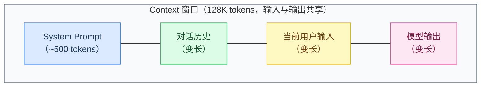

# Tokens 与 Context 窗口

## 什么是 Token

Token 是大语言模型处理文本的**基本单位**。LLM 并不直接处理字符或单词，而是先通过**分词器（Tokenizer）**将文本切分为 Token 序列，再进行处理。

### Token 的形态

```
英文：  "Hello, world!"
Tokens: ["Hello", ",", " world", "!"]   → 4 tokens

中文：  "我是一名程序员"
Tokens: ["我", "是", "一", "名", "程序", "员"]  → 6 tokens（以 GPT-4 为例，中文通常1字≈1-2 tokens）

代码：  "def add(a, b): return a + b"
Tokens: ["def", " add", "(", "a", ",", " b", "):", " return", " a", " +", " b"]  → 11 tokens
```

### 主流 Tokenizer 对比

| 模型 | Tokenizer 类型 | 特点 |
|------|--------------|------|
| GPT-4 / GPT-3.5 | BPE（Byte Pair Encoding）| 使用 `tiktoken` 库，英文约 0.75 词/token |
| Claude | BPE 变体 | 与 GPT 系列相近 |
| LLaMA / Qwen | SentencePiece BPE | 中文支持更友好 |
| BERT | WordPiece | 字幕级分割，以 `[CLS]`/`[SEP]` 标记为特征 |

> **实用工具**：可使用 [https://platform.openai.com/tokenizer](https://platform.openai.com/tokenizer) 在线计算 GPT 系列模型的 token 数量。

---

## Context 窗口（Context Window）

Context 窗口（也称为 **上下文长度** 或 **Context Length**）是 LLM 在**一次推理调用中能够同时处理的最大 token 数**，包括输入（Prompt）和输出（Completion）。

### 主流模型 Context 窗口对比

| 模型 | 最大 Context 窗口 | 适用场景 |
|------|----------------|---------|
| GPT-4o | 128K tokens | 长文档处理、多轮对话 |
| Claude 3.5 Sonnet | 200K tokens | 超长文档分析 |
| Gemini 1.5 Pro | 1M tokens | 百万级长上下文 |
| GPT-3.5 Turbo | 16K tokens | 一般对话任务 |
| LLaMA 3 (70B) | 8K～128K tokens | 本地部署场景 |

### Context 窗口的组成



> **注意**：Context 窗口的输入和输出**共享**总长度限制。如果 System Prompt 和对话历史过长，可用于输出的空间就会减少。

---

## Token 与成本

LLM API 通常**按 token 数量计费**，分别对输入 token 和输出 token 收费（输出通常更贵）：

| 模型 | 输入价格（每百万 tokens） | 输出价格（每百万 tokens） |
|------|----------------------|----------------------|
| GPT-4o | $2.50 | $10.00 |
| GPT-4o mini | $0.15 | $0.60 |
| Claude 3.5 Sonnet | $3.00 | $15.00 |
| Gemini 1.5 Flash | $0.075 | $0.30 |

**成本估算公式**：
```
总成本 = (输入 tokens × 输入单价 + 输出 tokens × 输出单价) / 1,000,000
```

---

## 上下文管理策略

### 1. 滑动窗口（Sliding Window）

只保留最近 N 轮对话，丢弃更早的历史：

```java
public List<Message> applySlideWindow(List<Message> history, int maxMessages) {
    if (history.size() <= maxMessages) {
        return history;
    }
    // 始终保留 SystemMessage（第一条），滑动其余消息
    List<Message> truncated = new ArrayList<>();
    truncated.add(history.get(0)); // System prompt
    int startIdx = Math.max(1, history.size() - maxMessages + 1);
    truncated.addAll(history.subList(startIdx, history.size()));
    return truncated;
}
```

### 2. 摘要压缩（Summary Compression）

将较早的对话历史用 LLM 生成摘要，压缩后保存：

```java
public String summarizeHistory(List<Message> oldMessages) {
    String historyText = oldMessages.stream()
        .map(m -> m.getRole() + ": " + m.getContent())
        .collect(Collectors.joining("\n"));
    
    String prompt = "请将以下对话历史压缩为简洁的摘要，保留关键信息：\n" + historyText;
    return llmClient.complete(prompt);
}
```

### 3. Token 预算分配

在构建 Prompt 时，预先分配各部分的 token 预算：

```java
public static final int MAX_CONTEXT_TOKENS = 100_000;
public static final int SYSTEM_PROMPT_BUDGET = 2_000;
public static final int HISTORY_BUDGET = 30_000;
public static final int TOOL_RESULT_BUDGET = 20_000;
public static final int OUTPUT_BUDGET = 4_000;
// 剩余用于当前用户输入
public static final int INPUT_BUDGET = MAX_CONTEXT_TOKENS
    - SYSTEM_PROMPT_BUDGET - HISTORY_BUDGET - TOOL_RESULT_BUDGET - OUTPUT_BUDGET;
```

---

## Java 工程实践

### 计算 Token 数量（使用 tiktoken-java）

```java
// 使用 knuddelsgmbh/jtokkit 库
import com.knuddels.jtokkit.Encodings;
import com.knuddels.jtokkit.api.EncodingRegistry;
import com.knuddels.jtokkit.api.ModelType;

EncodingRegistry registry = Encodings.newDefaultEncodingRegistry();
var encoding = registry.getEncodingForModel(ModelType.GPT_4O);

int tokenCount = encoding.countTokens("Hello, world!");
System.out.println("Token count: " + tokenCount); // 4
```

### 流式输出（Streaming）降低首字延迟

```java
// 使用 Streaming 避免等待完整响应
llmClient.streamChat(messages, chunk -> {
    // 每收到一个 token 片段立即推送给前端
    sseEmitter.send(chunk.getDelta());
});
```

---

## 实用建议

| 场景 | 建议 |
|------|------|
| 控制 System Prompt 大小 | 保持在 500-1000 tokens 以内，避免占用过多上下文 |
| 多轮对话管理 | 使用滑动窗口或摘要策略，控制历史长度 |
| RAG 检索结果注入 | 限制检索文档总 token 数（建议 ≤ 4000 tokens/次） |
| 减少输出 token | 指定输出格式（JSON/列表），避免冗余描述 |
| 成本监控 | 记录每次请求的 prompt_tokens + completion_tokens，接入告警 |

---
