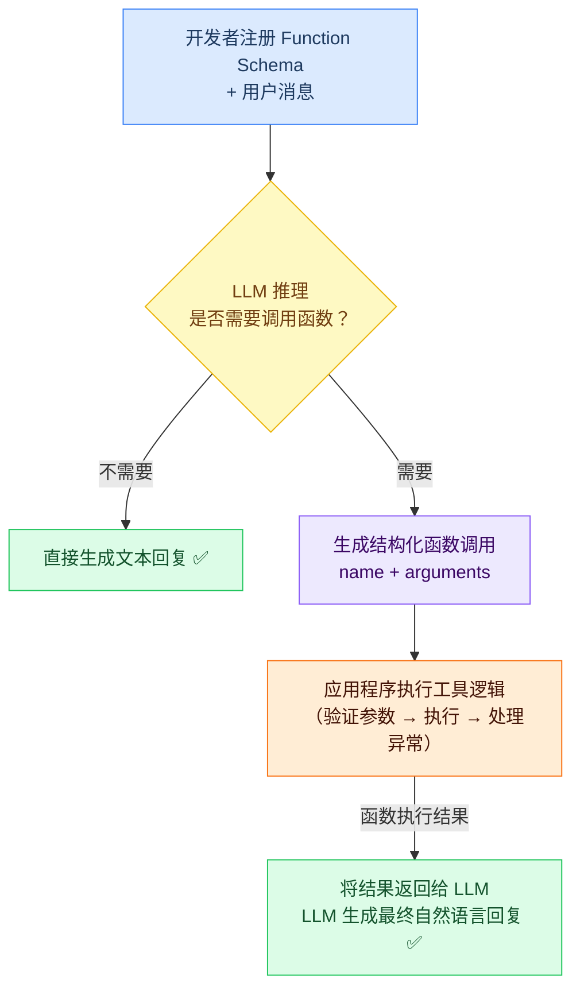

# Function Calling（函数调用）

## 什么是 Function Calling

Function Calling（函数调用，也称 Tool Use）是现代 LLM 的核心能力之一。它允许开发者向模型**注册一组可用的函数（工具）及其说明**，模型在推理时可以决定：
1. 是否需要调用某个函数
2. 调用哪个函数
3. 传入什么参数

这使得 LLM 能够突破纯文本生成的局限，与真实世界的系统交互。

---

## Function Calling 工作流程



---

## Function Schema 定义

每个函数需要提供完整的 JSON Schema 描述，让 LLM 理解何时调用以及如何调用：

```json
{
  "type": "function",
  "function": {
    "name": "get_weather",
    "description": "查询指定城市的当前天气信息。当用户询问某地天气、温度或气象状况时调用此函数。",
    "parameters": {
      "type": "object",
      "properties": {
        "city": {
          "type": "string",
          "description": "城市名称，如'北京'、'上海'、'深圳'"
        },
        "date": {
          "type": "string",
          "description": "查询日期，格式 YYYY-MM-DD。不指定则查询今天。",
          "default": "today"
        },
        "unit": {
          "type": "string",
          "enum": ["celsius", "fahrenheit"],
          "description": "温度单位",
          "default": "celsius"
        }
      },
      "required": ["city"]
    }
  }
}
```

**关键原则**：
- `description` 要准确描述函数的**用途**和**触发条件**，这直接影响 LLM 是否正确调用
- `required` 中只放真正必填的参数，其余提供默认值
- 使用 `enum` 约束有限范围的参数值

---

## 多函数并行调用

现代 LLM（GPT-4o、Claude 3.5 等）支持在一次响应中**并行调用多个函数**：

```
用户: "查一下北京和上海今天的天气"

LLM 响应（并行）:
[
  {"name": "get_weather", "arguments": {"city": "北京"}},
  {"name": "get_weather", "arguments": {"city": "上海"}}
]
```

工程侧可以并发执行两次工具调用，然后将两个结果一并返回给 LLM：

```java
// 并行执行多个函数调用
List<ToolCall> toolCalls = response.getToolCalls();
List<CompletableFuture<ToolResult>> futures = toolCalls.stream()
    .map(tc -> CompletableFuture.supplyAsync(() -> 
        toolExecutor.execute(tc.getName(), tc.getArguments())
    ))
    .toList();

List<ToolResult> results = CompletableFuture.allOf(
    futures.toArray(new CompletableFuture[0])
).thenApply(v -> futures.stream()
    .map(CompletableFuture::join)
    .toList()
).join();
```

---

## Java 工程实现

### 函数注册与管理

```java
/**
 * 工具注册中心
 */
@Component
public class ToolRegistry {
    private final Map<String, AgentTool> tools = new HashMap<>();

    public void register(AgentTool tool) {
        tools.put(tool.getName(), tool);
    }

    /** 获取所有工具的 JSON Schema 定义（用于 LLM 请求） */
    public List<Map<String, Object>> getToolSchemas() {
        return tools.values().stream()
            .map(tool -> Map.of(
                "type", "function",
                "function", Map.of(
                    "name", tool.getName(),
                    "description", tool.getDescription(),
                    "parameters", tool.getParameterSchema()
                )
            ))
            .toList();
    }

    /** 根据名称执行工具 */
    public String execute(String toolName, String arguments) {
        AgentTool tool = tools.get(toolName);
        if (tool == null) {
            return "{\"error\": \"Unknown tool: " + toolName + "\"}";
        }
        try {
            return tool.execute(arguments);
        } catch (Exception e) {
            log.error("Tool execution failed: {}", toolName, e);
            return "{\"error\": \"" + e.getMessage() + "\"}";
        }
    }
}
```

### 完整 Function Calling 循环

```java
/**
 * 支持多轮 Function Calling 的 Agent 执行器
 */
public AgentResponse runWithTools(String userInput) {
    List<Message> messages = new ArrayList<>();
    messages.add(new SystemMessage(systemPrompt));
    messages.add(new UserMessage(userInput));
    
    List<Map<String, Object>> tools = toolRegistry.getToolSchemas();
    
    // Function Calling 循环
    for (int step = 0; step < MAX_STEPS; step++) {
        LLMResponse response = llmClient.chat(messages, tools);
        
        // 无工具调用 → 返回最终答案
        if (!response.hasToolCalls()) {
            return AgentResponse.success(response.getContent());
        }
        
        // 将模型输出加入对话历史
        messages.add(new AssistantMessage(response));
        
        // 执行工具并收集结果
        for (ToolCall toolCall : response.getToolCalls()) {
            String result = toolRegistry.execute(
                toolCall.getName(), 
                toolCall.getArguments()
            );
            messages.add(new ToolMessage(toolCall.getId(), result));
            log.info("Tool call: {} -> {}", toolCall.getName(), result);
        }
    }
    
    return AgentResponse.maxStepsReached();
}
```

---

## 参数验证与安全控制

Function Calling 是外部输入的一种形式，**必须进行严格的参数验证**：

```java
public String execute(String arguments) {
    JsonObject params;
    try {
        params = JsonParser.parseString(arguments).getAsJsonObject();
    } catch (Exception e) {
        return "{\"error\": \"Invalid JSON parameters\"}";
    }
    
    // 1. 必填参数检查
    if (!params.has("user_id") || params.get("user_id").isJsonNull()) {
        return "{\"error\": \"user_id is required\"}";
    }
    
    // 2. 参数类型验证
    String userId = params.get("user_id").getAsString();
    if (!userId.matches("^[a-zA-Z0-9_-]{1,50}$")) {
        return "{\"error\": \"Invalid user_id format\"}";
    }
    
    // 3. 权限校验（防止越权访问）
    if (!authService.hasPermission(currentUser, "read_orders", userId)) {
        return "{\"error\": \"Permission denied\"}";
    }
    
    // 4. 执行业务逻辑
    List<Order> orders = orderRepository.findByUserId(userId);
    return objectMapper.writeValueAsString(orders);
}
```

---

## 错误处理与重试策略

```java
public String executeWithRetry(String toolName, String arguments, int maxRetries) {
    for (int attempt = 0; attempt < maxRetries; attempt++) {
        try {
            String result = toolRegistry.execute(toolName, arguments);
            
            // 检查是否为软错误（可重试）
            JsonObject resultJson = JsonParser.parseString(result).getAsJsonObject();
            if (resultJson.has("error") && isRetryable(resultJson.get("error").getAsString())) {
                log.warn("Retryable error on attempt {}/{}: {}", attempt + 1, maxRetries, result);
                Thread.sleep(1000L * (attempt + 1)); // 指数退避
                continue;
            }
            
            return result;
        } catch (Exception e) {
            if (attempt == maxRetries - 1) {
                return "{\"error\": \"Tool failed after " + maxRetries + " retries: " + e.getMessage() + "\"}";
            }
        }
    }
    return "{\"error\": \"Max retries exceeded\"}";
}
```

---

## Function Calling vs 工具描述注入（比较）

| 维度 | Function Calling（原生）| 工具描述注入 Prompt |
|------|----------------------|------------------|
| 结构化程度 | 高（JSON Schema 强约束）| 低（自由文本描述）|
| 参数提取可靠性 | 高 | 中（需解析自然语言）|
| 模型支持 | GPT-4、Claude 3、Gemini | 所有模型 |
| 并行调用支持 | ✅ 原生支持 | ❌ 需手动拆分 |
| 推荐场景 | 生产环境 Agent | 快速原型/旧模型兼容 |

---
