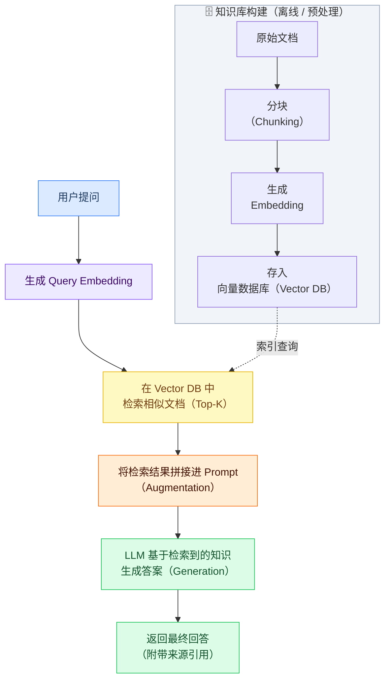

# Embeddings 与向量表示（Embeddings & Vector Representations）

## 什么是 Embedding

Embedding（向量嵌入）是将文本（词语、句子、段落）**映射到高维数值向量**的技术。语义相近的文本，其向量在高维空间中的距离也更近。

```
"今天天气很好"  → [0.12, -0.45, 0.78, 0.03, ...]  (1536维向量)
"今天阳光明媚"  → [0.11, -0.44, 0.79, 0.02, ...]  (语义相近，向量相近)
"明天要开会"   → [-0.32, 0.21, -0.15, 0.88, ...]  (语义不同，向量差异大)
```

Embedding 是语义搜索、RAG（检索增强生成）、文本聚类和推荐系统的核心基础技术。

---

## 主流 Embedding 模型

### 云端 API

| 模型 | 向量维度 | 最大 Token | 特点 |
|------|---------|-----------|------|
| OpenAI `text-embedding-3-large` | 3072 | 8191 | 最高精度，支持维度压缩 |
| OpenAI `text-embedding-3-small` | 1536 | 8191 | 性价比高，适合大规模场景 |
| OpenAI `text-embedding-ada-002` | 1536 | 8191 | 旧版，仍广泛使用 |
| Cohere `embed-multilingual-v3.0` | 1024 | 512 | 多语言支持优秀 |

### 本地部署模型（开源）

| 模型 | 向量维度 | 特点 |
|------|---------|------|
| BGE-M3（智源研究院）| 1024 | 中文效果最佳，支持多粒度检索 |
| BGE-large-zh | 1024 | 中文语义理解强 |
| Sentence-BERT | 768 | 英文通用场景 |
| E5-large | 1024 | 多语言，MTEB 排行榜靠前 |

**中文场景推荐**：本地部署优先选择 BGE-M3；云端 API 优先选择 OpenAI `text-embedding-3-small`。

---

## 向量相似度计算

Embedding 的核心应用是计算两段文本的语义相似度：

### 余弦相似度（最常用）

$$\text{cosine similarity}(\mathbf{A},\ \mathbf{B}) = \frac{\mathbf{A} \cdot \mathbf{B}}{\lVert\mathbf{A}\rVert \cdot \lVert\mathbf{B}\rVert}$$

```java
public double cosineSimilarity(double[] vecA, double[] vecB) {
    double dotProduct = 0.0;
    double normA = 0.0;
    double normB = 0.0;
    
    for (int i = 0; i < vecA.length; i++) {
        dotProduct += vecA[i] * vecB[i];
        normA += vecA[i] * vecA[i];
        normB += vecB[i] * vecB[i];
    }
    
    return dotProduct / (Math.sqrt(normA) * Math.sqrt(normB));
}
// 返回值范围: [-1, 1]，越接近 1 表示越相似
```

### 欧式距离（L2 距离）

```java
public double euclideanDistance(double[] vecA, double[] vecB) {
    double sum = 0.0;
    for (int i = 0; i < vecA.length; i++) {
        double diff = vecA[i] - vecB[i];
        sum += diff * diff;
    }
    return Math.sqrt(sum);
}
// 返回值越小，表示越相似
```

**OpenAI 的 `text-embedding-3` 系列建议使用余弦相似度**；向量数据库通常也以此为默认度量方式。

---

## RAG（检索增强生成）

RAG 是 Embedding 最重要的应用场景，解决了 LLM 的"知识截止"和"幻觉"问题：

### RAG 工作流程



### Java RAG 实现示例

```java
@Service
public class RagService {
    private final EmbeddingClient embeddingClient;
    private final VectorStore vectorStore;
    private final LLMClient llmClient;

    /**
     * RAG 检索增强生成
     */
    public String query(String userQuestion) {
        // 1. 将问题向量化
        double[] queryEmbedding = embeddingClient.embed(userQuestion);
        
        // 2. 检索相关文档（Top-5）
        List<Document> relevantDocs = vectorStore.search(queryEmbedding, 5, 0.7);
        
        if (relevantDocs.isEmpty()) {
            // 没有相关文档，直接让 LLM 回答
            return llmClient.complete(userQuestion);
        }
        
        // 3. 构建增强 Prompt
        String context = relevantDocs.stream()
            .map(doc -> "来源：" + doc.getSource() + "\n内容：" + doc.getContent())
            .collect(Collectors.joining("\n\n---\n\n"));
        
        String prompt = """
            请根据以下参考资料回答用户的问题。
            如果参考资料中没有相关信息，请如实说明。
            
            参考资料：
            %s
            
            用户问题：%s
            """.formatted(context, userQuestion);
        
        return llmClient.complete(prompt);
    }
}
```

---

## 文档分块策略（Chunking）

文档分块质量直接影响 RAG 检索效果：

### 固定大小分块

```java
public List<String> fixedSizeChunking(String text, int chunkSize, int overlap) {
    List<String> chunks = new ArrayList<>();
    int start = 0;
    while (start < text.length()) {
        int end = Math.min(start + chunkSize, text.length());
        chunks.add(text.substring(start, end));
        start += chunkSize - overlap; // overlap 确保上下文连续
    }
    return chunks;
}
// 推荐: chunkSize=500-1000 tokens, overlap=50-100 tokens
```

### 语义分块（推荐）

按段落、标题或句子边界进行分割，保持语义完整性：

```java
public List<String> semanticChunking(String markdownText) {
    // 按 Markdown 标题分割
    String[] sections = markdownText.split("(?=#{1,3} )");
    List<String> chunks = new ArrayList<>();
    
    for (String section : sections) {
        if (section.length() > MAX_CHUNK_TOKENS) {
            // 超长段落继续按段落分割
            chunks.addAll(splitByParagraph(section));
        } else {
            chunks.add(section.trim());
        }
    }
    return chunks;
}
```

### 分块策略对比

| 策略 | 优点 | 缺点 | 适用场景 |
|------|------|------|---------|
| 固定大小 | 实现简单 | 可能切断语义完整性 | 非结构化文本 |
| 语义分块 | 保持语义完整 | 实现复杂 | Markdown/代码文档 |
| 递归分块 | 自适应文档结构 | 需要调优 | 混合格式文档 |
| 句子滑动窗口 | 上下文丰富 | 存储量增大 | 精准语义检索 |

---

## 向量数据库选型

| 数据库 | 部署方式 | 特点 | 适用场景 |
|--------|---------|------|---------|
| **Milvus** | 自托管/云 | 高性能、企业级 | 大规模生产环境 |
| **Chroma** | 本地/自托管 | 轻量，开发友好 | 本地开发/原型 |
| **Pinecone** | SaaS | 全托管，零运维 | 快速上线 |
| **pgvector** | 插件（PostgreSQL）| 与业务 DB 统一 | 向量数据量不大 |
| **Weaviate** | 自托管/云 | 内置 BM25+向量混合 | 混合检索 |
| **Redis (RedisVL)** | 自托管/云 | 低延迟，内存存储 | 实时推荐场景 |

**Java 开发推荐**：
- 快速原型：Chroma（有 Java 客户端）
- 生产环境（已有 PostgreSQL）：pgvector
- 大规模生产：Milvus

---

## 混合检索（Hybrid Search）

单纯的向量检索有时效果不如混合方式：

```
向量检索（语义相似性）
    +
关键词检索（BM25/TF-IDF）
    ↓
RRF（Reciprocal Rank Fusion）融合排序
    ↓
最终检索结果（精准度和召回率更高）
```

```java
public List<Document> hybridSearch(String query, int topK) {
    // 向量检索
    double[] queryEmbedding = embeddingClient.embed(query);
    List<RankedDocument> vectorResults = vectorStore.search(queryEmbedding, topK * 2);
    
    // 关键词检索（BM25）
    List<RankedDocument> keywordResults = bm25Index.search(query, topK * 2);
    
    // RRF 融合
    return rrfFusion(vectorResults, keywordResults, topK);
}
```

---

## 工程实践建议

| 建议 | 说明 |
|------|------|
| **缓存 Embedding** | 相同文本的 Embedding 计算结果进行缓存，避免重复调用 API |
| **批量 Embed** | 使用批量 API（batch embedding）降低延迟和成本 |
| **选择合适维度** | 高维向量精度高但存储成本大，`text-embedding-3-small` 支持压缩到 256/512 维 |
| **定期更新索引** | 业务数据变化时，增量更新向量数据库而非全量重建 |
| **相似度阈值** | 设置最低相似度阈值（如 0.7），过滤无关检索结果，避免噪音注入 Prompt |
| **监控召回质量** | 记录检索到的文档和相似度分数，定期评估 RAG 效果 |

---
