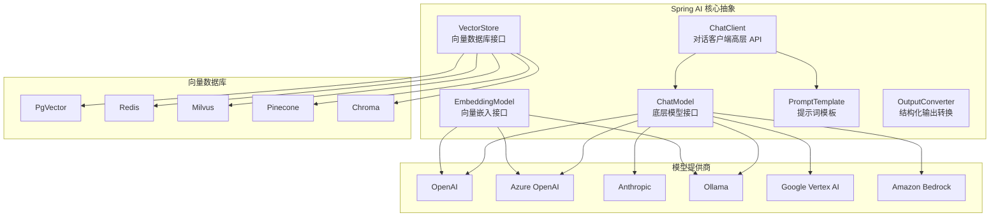
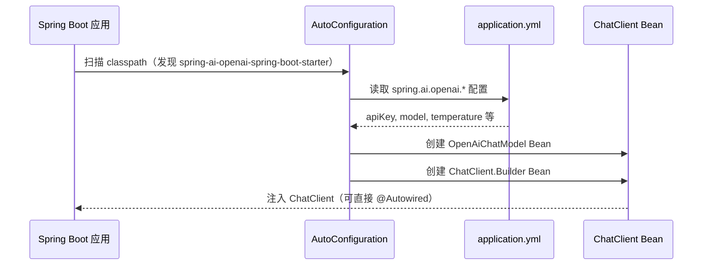
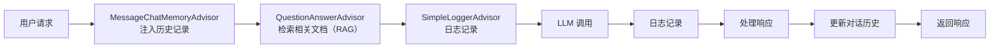
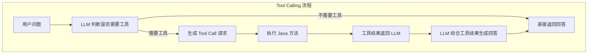

# Spring AI 框架详解

> Spring AI 是 Spring 官方推出的 AI 集成框架，将 LLM 能力无缝接入 Spring Boot 生态，让 Java 开发者以熟悉的编程模型构建 AI 应用。

---

## 一、概念与原理

### 1.1 Spring AI 是什么

Spring AI 是 Spring 团队于 2023 年推出的开源框架（隶属 Spring 官方生态），目标是为 Java/Spring 开发者提供一套**统一、可移植的 AI 编程模型**，屏蔽不同 LLM 提供商的 API 差异，类似于 Spring Data 屏蔽不同数据库的接口差异。

**核心设计哲学：**
- **可移植性**：一次编写，切换模型提供商无需大改代码
- **Spring 原生**：与 Spring Boot 自动配置、依赖注入无缝整合
- **模块化**：按需引入对应的 Starter，不引入不需要的依赖
- **工程完整性**：覆盖对话、嵌入、向量检索、多模态等完整链路

### 1.2 核心抽象层

Spring AI 通过一组核心接口/类屏蔽底层差异：



### 1.3 关键概念说明

| 概念 | 类/接口 | 说明 |
|------|---------|------|
| **ChatClient** | `org.springframework.ai.chat.client.ChatClient` | 高层对话 API，流式构建请求，推荐主要入口 |
| **ChatModel** | `org.springframework.ai.chat.model.ChatModel` | 底层模型接口，直接调用 LLM |
| **Prompt** | `org.springframework.ai.chat.prompt.Prompt` | 封装消息列表和调用选项 |
| **PromptTemplate** | `org.springframework.ai.chat.prompt.PromptTemplate` | 变量占位符模板，支持 `{variable}` 语法 |
| **EmbeddingModel** | `org.springframework.ai.embedding.EmbeddingModel` | 将文本转换为向量 |
| **VectorStore** | `org.springframework.ai.vectorstore.VectorStore` | 向量检索存储抽象 |
| **Document** | `org.springframework.ai.document.Document` | 文档单元，含内容和 metadata |
| **OutputConverter** | `org.springframework.ai.converter.OutputConverter` | 将模型输出转换为 Java 对象 |
| **Advisor** | `org.springframework.ai.chat.client.advisor.api.Advisor` | 对话流水线拦截器（历史记录、RAG 等） |
| **ToolCallback** | `org.springframework.ai.tool.ToolCallback` | Function Calling / Tool Use 工具定义 |

### 1.4 与 Spring Boot 的自动配置

Spring AI 深度整合 Spring Boot 自动配置机制：



只需添加 Starter 依赖 + `application.yml` 配置，即可获得完全配置好的 `ChatClient`，无需任何手动 Bean 定义。

---

## 二、技术详解

### 2.1 支持的模型提供商

| 提供商 | Starter artifactId | 功能支持 |
|--------|-------------------|---------|
| **OpenAI** | `spring-ai-openai-spring-boot-starter` | Chat, Embedding, Image, TTS, STT |
| **Azure OpenAI** | `spring-ai-azure-openai-spring-boot-starter` | Chat, Embedding, Image |
| **Anthropic Claude** | `spring-ai-anthropic-spring-boot-starter` | Chat（含多模态）|
| **Ollama（本地）** | `spring-ai-ollama-spring-boot-starter` | Chat, Embedding |
| **Google Vertex AI** | `spring-ai-vertex-ai-gemini-spring-boot-starter` | Chat（Gemini 系列）|
| **Amazon Bedrock** | `spring-ai-bedrock-ai-spring-boot-starter` | Chat, Embedding（多模型）|
| **MistralAI** | `spring-ai-mistral-ai-spring-boot-starter` | Chat, Embedding |
| **Zhipu AI（智谱）** | `spring-ai-zhipuai-spring-boot-starter` | Chat, Embedding |
| **Moonshot（月之暗面）** | `spring-ai-moonshot-spring-boot-starter` | Chat |

### 2.2 ChatClient 流式构建器模式

`ChatClient` 采用 Builder 模式构建请求，支持链式调用：

```
ChatClient
  .prompt()           // 创建 Prompt
    .system(...)      // 系统提示词
    .user(...)        // 用户消息
    .advisors(...)    // 拦截器（RAG、历史记录等）
    .options(...)     // 调用参数（temperature 等）
  .call()             // 同步调用
    .content()        // 获取文本内容
    .entity(Class)    // 结构化输出
  .stream()           // 流式调用
    .content()        // Flux<String>
```

### 2.3 Advisor 拦截器机制

Advisor 是 Spring AI 1.0 引入的核心机制，类似 Spring AOP，在对话请求的前后插入处理逻辑：



内置 Advisor：
- `MessageChatMemoryAdvisor`：基于内存的对话历史管理
- `QuestionAnswerAdvisor`：RAG 检索增强
- `SimpleLoggerAdvisor`：请求/响应日志
- `SafeGuardAdvisor`：敏感词过滤

### 2.4 结构化输出（Structured Output）

Spring AI 支持将 LLM 输出直接映射到 Java 对象：

- **BeanOutputConverter**：映射到任意 Java 类（通过 JSON Schema 约束）
- **ListOutputConverter**：映射到 `List<String>`
- **MapOutputConverter**：映射到 `Map<String, Object>`

框架会自动在 Prompt 中追加格式指令，并在输出时进行反序列化。

### 2.5 Function Calling / Tool Use

Spring AI 统一了各提供商的 Tool Use 机制：



---

## 三、Java 代码示例

### 3.1 Maven 依赖配置

```xml
<properties>
    <spring-ai.version>1.0.0</spring-ai.version>
</properties>

<dependencyManagement>
    <dependencies>
        <!-- Spring AI BOM：统一管理所有 spring-ai 依赖版本 -->
        <dependency>
            <groupId>org.springframework.ai</groupId>
            <artifactId>spring-ai-bom</artifactId>
            <version>${spring-ai.version}</version>
            <type>pom</type>
            <scope>import</scope>
        </dependency>
    </dependencies>
</dependencyManagement>

<dependencies>
    <dependency>
        <groupId>org.springframework.boot</groupId>
        <artifactId>spring-boot-starter-web</artifactId>
    </dependency>

    <!-- OpenAI（按需替换为其他提供商） -->
    <dependency>
        <groupId>org.springframework.ai</groupId>
        <artifactId>spring-ai-openai-spring-boot-starter</artifactId>
    </dependency>

    <!-- PgVector（可选，用于 RAG） -->
    <dependency>
        <groupId>org.springframework.ai</groupId>
        <artifactId>spring-ai-pgvector-store-spring-boot-starter</artifactId>
    </dependency>
</dependencies>
```

### 3.2 application.yml 配置

```yaml
spring:
  ai:
    openai:
      api-key: ${OPENAI_API_KEY}          # 从环境变量读取，不要硬编码
      base-url: https://api.openai.com    # 可替换为代理地址
      chat:
        options:
          model: gpt-4o
          temperature: 0.7
          max-tokens: 2048
      embedding:
        options:
          model: text-embedding-3-small

    # Ollama 本地模型（与 OpenAI 可以同时配置）
    ollama:
      base-url: http://localhost:11434
      chat:
        options:
          model: llama3.2

    # PgVector 向量数据库
    vectorstore:
      pgvector:
        initialize-schema: true           # 自动建表
        dimensions: 1536                  # text-embedding-3-small 维度

  datasource:
    url: jdbc:postgresql://localhost:5432/ai_demo
    username: postgres
    password: ${DB_PASSWORD}
```

### 3.3 基础对话：ChatClient 使用

```java
/**
 * 基础对话服务
 *
 * 使用场景：单轮问答、内容生成
 * 核心思想：通过 ChatClient 的流式 Builder API 构建请求
 */
@Service
public class BasicChatService {

    private final ChatClient chatClient;

    // Spring AI 1.0 推荐通过 ChatClient.Builder 注入
    public BasicChatService(ChatClient.Builder chatClientBuilder) {
        this.chatClient = chatClientBuilder
                .defaultSystem("你是一个专业的 Java 技术顾问，回答简洁准确。")
                .build();
    }

    /**
     * 简单问答
     *
     * @param question 用户问题
     * @return 模型回答
     */
    public String ask(String question) {
        return chatClient.prompt()
                .user(question)
                .call()
                .content();
    }

    /**
     * 带参数的模板问答
     *
     * @param language 编程语言
     * @param topic    技术主题
     * @return 生成的技术说明
     */
    public String explainTech(String language, String topic) {
        return chatClient.prompt()
                .user(u -> u.text("请用 {language} 代码示例解释 {topic}，要求代码可运行。")
                             .param("language", language)
                             .param("topic", topic))
                .call()
                .content();
    }

    /**
     * 结构化输出：直接映射到 Java Record
     *
     * @param codeSnippet 代码片段
     * @return 代码审查结果
     */
    public CodeReview reviewCode(String codeSnippet) {
        return chatClient.prompt()
                .user(u -> u.text("请对以下代码进行审查，分析其优缺点和改进建议：\n{code}")
                             .param("code", codeSnippet))
                .call()
                .entity(CodeReview.class);  // 自动解析为 Java 对象
    }

    /**
     * 代码审查结果 Record
     */
    public record CodeReview(
            List<String> strengths,      // 优点
            List<String> weaknesses,     // 缺点
            List<String> suggestions,    // 改进建议
            String overallScore          // 综合评分
    ) {}
}
```

### 3.4 流式响应（Streaming）

```java
/**
 * 流式对话服务
 *
 * 使用场景：长文本生成、实时显示打字效果（Server-Sent Events）
 */
@RestController
@RequestMapping("/api/chat")
public class StreamChatController {

    private final ChatClient chatClient;

    public StreamChatController(ChatClient.Builder builder) {
        this.chatClient = builder.build();
    }

    /**
     * SSE 流式接口：前端可通过 EventSource 接收
     *
     * @param question 用户问题
     * @return Flux<ServerSentEvent> 事件流
     */
    @GetMapping(value = "/stream", produces = MediaType.TEXT_EVENT_STREAM_VALUE)
    public Flux<ServerSentEvent<String>> streamChat(
            @RequestParam String question) {

        return chatClient.prompt()
                .user(question)
                .stream()
                .content()                       // 返回 Flux<String>
                .map(chunk -> ServerSentEvent.<String>builder()
                        .data(chunk)
                        .build())
                .concatWith(Flux.just(           // 流结束标记
                        ServerSentEvent.<String>builder()
                                .data("[DONE]")
                                .build()))
                .onErrorResume(ex -> {
                    // 流式调用异常处理
                    return Flux.just(ServerSentEvent.<String>builder()
                            .event("error")
                            .data("生成失败：" + ex.getMessage())
                            .build());
                });
    }

    /**
     * 流式响应并收集完整内容（用于后台异步任务）
     *
     * @param prompt 提示词
     * @return 完整生成内容的 Mono
     */
    public Mono<String> generateAndCollect(String prompt) {
        return chatClient.prompt()
                .user(prompt)
                .stream()
                .content()
                .collectList()
                .map(chunks -> String.join("", chunks));
    }
}
```

### 3.5 多轮对话（对话历史管理）

```java
/**
 * 多轮对话服务
 *
 * 使用场景：聊天机器人、客服系统
 * 核心思想：通过 MessageChatMemoryAdvisor 自动管理对话历史
 */
@Service
public class MultiTurnChatService {

    private final ChatClient chatClient;
    // InMemoryChatMemory 存储对话历史（生产环境可替换为 Redis）
    private final ChatMemory chatMemory = new InMemoryChatMemory();

    public MultiTurnChatService(ChatClient.Builder builder) {
        this.chatClient = builder
                .defaultAdvisors(
                        new MessageChatMemoryAdvisor(chatMemory),
                        new SimpleLoggerAdvisor()  // 开启请求/响应日志
                )
                .build();
    }

    /**
     * 多轮对话，每个 conversationId 对应独立的对话历史
     *
     * @param conversationId 会话 ID（可用 UUID 或用户 ID）
     * @param userMessage    用户消息
     * @return 模型回复
     */
    public String chat(String conversationId, String userMessage) {
        return chatClient.prompt()
                .user(userMessage)
                .advisors(advisorSpec -> advisorSpec
                        // 指定会话 ID，Advisor 自动加载/保存该会话的历史
                        .param(AbstractChatMemoryAdvisor.CHAT_MEMORY_CONVERSATION_ID_KEY,
                               conversationId)
                        .param(AbstractChatMemoryAdvisor.CHAT_MEMORY_RETRIEVE_SIZE_KEY, 10))
                .call()
                .content();
    }

    /**
     * 清除指定会话的历史记录
     *
     * @param conversationId 会话 ID
     */
    public void clearHistory(String conversationId) {
        chatMemory.clear(conversationId);
    }
}
```

### 3.6 Embedding 与向量存储

```java
/**
 * 文档向量化与存储服务
 *
 * 使用场景：知识库构建、语义搜索
 */
@Service
@Slf4j
public class DocumentEmbeddingService {

    private final VectorStore vectorStore;
    private final EmbeddingModel embeddingModel;

    @Autowired
    public DocumentEmbeddingService(VectorStore vectorStore,
                                    EmbeddingModel embeddingModel) {
        this.vectorStore = vectorStore;
        this.embeddingModel = embeddingModel;
    }

    /**
     * 批量加载文档到向量数据库
     *
     * @param textContents 文档内容列表
     * @param source       来源标识（用于过滤）
     */
    public void loadDocuments(List<String> textContents, String source) {
        // 1. 构建 Document 列表，附加 metadata
        List<Document> documents = textContents.stream()
                .map(content -> new Document(
                        content,
                        Map.of("source", source, "timestamp", Instant.now().toString())))
                .toList();

        // 2. 分块处理（大文档切片）
        TokenTextSplitter splitter = new TokenTextSplitter(
                512,    // chunkSize：每块 token 数
                100,    // chunkOverlap：块间重叠 token 数
                5,      // minChunkSizeChars
                10000,  // maxNumChunks
                true    // keepSeparator
        );
        List<Document> splitDocs = splitter.apply(documents);

        // 3. 向量化并存储（Spring AI 自动调用 EmbeddingModel）
        vectorStore.add(splitDocs);
        log.info("已向量化并存储 {} 个文档块（来源：{}）", splitDocs.size(), source);
    }

    /**
     * 语义相似度搜索
     *
     * @param query     查询文本
     * @param topK      返回最相似的 K 个结果
     * @param threshold 相似度阈值（0-1）
     * @return 相似文档列表
     */
    public List<Document> semanticSearch(String query, int topK, double threshold) {
        SearchRequest request = SearchRequest.query(query)
                .withTopK(topK)
                .withSimilarityThreshold(threshold);
        return vectorStore.similaritySearch(request);
    }

    /**
     * 带 metadata 过滤的语义搜索
     *
     * @param query  查询文本
     * @param source 来源过滤（只搜索指定来源的文档）
     * @return 过滤后的相似文档
     */
    public List<Document> filteredSearch(String query, String source) {
        SearchRequest request = SearchRequest.query(query)
                .withTopK(5)
                .withFilterExpression("source == '" + source + "'");
        return vectorStore.similaritySearch(request);
    }

    /**
     * 计算两段文本的余弦相似度
     *
     * @param text1 文本1
     * @param text2 文本2
     * @return 余弦相似度（-1 到 1）
     */
    public double cosineSimilarity(String text1, String text2) {
        EmbeddingResponse response = embeddingModel.embedForResponse(
                List.of(text1, text2));
        float[] vec1 = response.getResults().get(0).getOutput();
        float[] vec2 = response.getResults().get(1).getOutput();
        return computeCosine(vec1, vec2);
    }

    private double computeCosine(float[] a, float[] b) {
        double dot = 0, normA = 0, normB = 0;
        for (int i = 0; i < a.length; i++) {
            dot += a[i] * b[i];
            normA += a[i] * a[i];
            normB += b[i] * b[i];
        }
        return dot / (Math.sqrt(normA) * Math.sqrt(normB));
    }
}
```

### 3.7 RAG（检索增强生成）

```java
/**
 * RAG 知识库问答服务
 *
 * 使用场景：基于企业内部文档的智能问答
 * 核心思想：QuestionAnswerAdvisor 自动完成检索 → 注入上下文 → 生成回答
 */
@Service
@Slf4j
public class RagQaService {

    private final ChatClient chatClient;

    public RagQaService(ChatClient.Builder builder, VectorStore vectorStore) {
        this.chatClient = builder
                .defaultSystem("""
                        你是一个企业内部知识库助手。
                        请严格基于提供的文档内容回答问题，如文档中没有相关信息，
                        请明确告知"文档中未找到相关内容"，不要凭空推测。
                        回答时请引用来源文档。
                        """)
                .defaultAdvisors(
                        // RAG Advisor：自动检索相关文档并注入到 Prompt
                        new QuestionAnswerAdvisor(
                                vectorStore,
                                SearchRequest.defaults()
                                        .withTopK(4)
                                        .withSimilarityThreshold(0.7)
                        )
                )
                .build();
    }

    /**
     * 知识库问答
     *
     * @param question 用户问题
     * @return 基于知识库的回答
     */
    public RagAnswer answer(String question) {
        ChatResponse response = chatClient.prompt()
                .user(question)
                .call()
                .chatResponse();

        // 从 metadata 中获取引用的文档（QuestionAnswerAdvisor 自动填充）
        @SuppressWarnings("unchecked")
        List<Document> referenceDocs = (List<Document>) response.getMetadata()
                .getOrDefault(QuestionAnswerAdvisor.RETRIEVED_DOCUMENTS, List.of());

        String answer = response.getResult().getOutput().getContent();
        List<String> sources = referenceDocs.stream()
                .map(doc -> (String) doc.getMetadata().getOrDefault("source", "未知来源"))
                .distinct()
                .toList();

        log.debug("问题：{}，检索到 {} 个相关文档片段", question, referenceDocs.size());
        return new RagAnswer(answer, sources, referenceDocs.size());
    }

    /**
     * RAG 回答结果
     */
    public record RagAnswer(
            String content,         // 回答内容
            List<String> sources,   // 引用的文档来源
            int retrievedDocs       // 检索到的文档片段数
    ) {}
}
```

### 3.8 Function Calling / Tool Use

```java
/**
 * Tool Calling 示例
 *
 * 使用场景：让 LLM 调用真实 API 获取实时数据
 */
@Service
public class ToolCallingService {

    private final ChatClient chatClient;

    public ToolCallingService(ChatClient.Builder builder) {
        this.chatClient = builder.build();
    }

    /**
     * 注册工具并执行对话
     *
     * @param userQuestion 用户问题
     * @return 调用工具后的回答
     */
    public String chatWithTools(String userQuestion) {
        return chatClient.prompt()
                .user(userQuestion)
                // 注册工具：传入包含 @Tool 方法的对象实例
                .tools(new WeatherTools(), new CalendarTools())
                .call()
                .content();
    }

    /**
     * 天气查询工具
     */
    static class WeatherTools {

        /**
         * @Tool 注解声明该方法为 LLM 可调用的工具
         * 方法注释会作为工具描述传给 LLM
         */
        @Tool(description = "查询指定城市的当前天气状况，包括温度、湿度和天气描述")
        public WeatherInfo getCurrentWeather(
                @ToolParam(description = "城市名称，如：北京、上海") String city,
                @ToolParam(description = "温度单位：celsius（摄氏度）或 fahrenheit（华氏度）")
                String unit) {
            // 实际项目中调用天气 API
            return new WeatherInfo(city, 22.5, 65, "晴转多云", unit);
        }

        record WeatherInfo(String city, double temperature, int humidity,
                           String description, String unit) {}
    }

    /**
     * 日历工具
     */
    static class CalendarTools {

        @Tool(description = "获取今天的日期和星期几")
        public String getTodayDate() {
            return LocalDate.now().toString() + "，" +
                   LocalDate.now().getDayOfWeek().getDisplayName(
                           TextStyle.FULL, Locale.CHINESE);
        }

        @Tool(description = "计算两个日期之间相差的天数")
        public long daysBetween(
                @ToolParam(description = "开始日期，格式 yyyy-MM-dd") String startDate,
                @ToolParam(description = "结束日期，格式 yyyy-MM-dd") String endDate) {
            return ChronoUnit.DAYS.between(
                    LocalDate.parse(startDate), LocalDate.parse(endDate));
        }
    }
}
```

### 3.9 多模型切换（运行时动态选择模型）

```java
/**
 * 多模型路由服务
 *
 * 使用场景：根据任务类型、成本、质量要求动态选择模型
 */
@Service
public class MultiModelRoutingService {

    @Qualifier("openAiChatModel")
    @Autowired
    private ChatModel openAiModel;   // GPT-4o

    @Qualifier("ollamaChatModel")
    @Autowired
    private ChatModel ollamaModel;   // 本地 Llama3

    /**
     * 根据任务类型路由到不同模型
     *
     * @param task    任务描述
     * @param taskType 任务类型
     * @return 生成结果
     */
    public String route(String task, TaskType taskType) {
        ChatModel selectedModel = switch (taskType) {
            case COMPLEX_REASONING -> openAiModel;   // 复杂推理用 GPT-4o
            case SIMPLE_QA, CODE_COMPLETION -> ollamaModel;  // 简单任务用本地模型（省成本）
            case SENSITIVE_DATA -> ollamaModel;      // 敏感数据用本地模型（数据不出境）
        };

        ChatClient client = ChatClient.create(selectedModel);
        return client.prompt().user(task).call().content();
    }

    public enum TaskType {
        COMPLEX_REASONING, SIMPLE_QA, CODE_COMPLETION, SENSITIVE_DATA
    }
}
```

---

## 四、最佳实践

### 4.1 配置管理

**始终从环境变量读取 API Key，不要硬编码：**

```yaml
# ✅ 正确：从环境变量读取
spring:
  ai:
    openai:
      api-key: ${OPENAI_API_KEY}

# ❌ 错误：硬编码 API Key（会泄露到 Git 仓库）
spring:
  ai:
    openai:
      api-key: sk-proj-xxxxxxxx
```

**使用 Spring Profiles 区分环境：**

```yaml
# application-dev.yml（开发环境用 Ollama 本地模型，零成本）
spring:
  ai:
    ollama:
      chat:
        options:
          model: llama3.2

# application-prod.yml（生产环境用 OpenAI）
spring:
  ai:
    openai:
      api-key: ${OPENAI_API_KEY}
      chat:
        options:
          model: gpt-4o
```

### 4.2 ChatClient 复用与线程安全

```java
// ✅ 推荐：ChatClient 是线程安全的，在 @Service 级别复用
@Service
public class ChatService {
    private final ChatClient chatClient;

    public ChatService(ChatClient.Builder builder) {
        // 在构造时构建，全局复用
        this.chatClient = builder
                .defaultSystem("你是专业助手")
                .build();
    }
}

// ⚠️ 注意：每次调用 .prompt() 会创建新的请求上下文，是线程安全的
// 不要在多线程间共享 .prompt() 返回的 ChatClientRequestSpec 对象
```

### 4.3 异常处理与重试

```java
@Service
@Slf4j
public class ResilientChatService {

    private final ChatClient chatClient;

    // Spring Retry 重试配置
    @Retryable(
        retryFor = {OpenAiHttpException.class},
        maxAttempts = 3,
        backoff = @Backoff(delay = 1000, multiplier = 2)  // 指数退避
    )
    public String callWithRetry(String prompt) {
        try {
            return chatClient.prompt()
                    .user(prompt)
                    .call()
                    .content();
        } catch (OpenAiHttpException e) {
            if (e.statusCode == 429) {
                log.warn("触发限流（Rate Limit），将重试");
                throw e;  // 抛出以触发重试
            }
            log.error("调用失败，状态码：{}", e.statusCode);
            throw e;
        }
    }

    @Recover
    public String fallback(OpenAiHttpException e, String prompt) {
        // 所有重试失败后的降级处理
        log.error("重试耗尽，使用降级回答。原始问题：{}", prompt);
        return "抱歉，服务暂时不可用，请稍后重试。";
    }
}
```

### 4.4 成本控制

| 策略 | 实现方式 | 效果 |
|------|---------|------|
| **缓存相同请求** | 对 Prompt + 参数做 MD5，Redis 缓存结果 | 减少重复调用 |
| **本地模型兜底** | 简单任务路由到 Ollama 本地模型 | 节省 API 费用 |
| **限制 max-tokens** | `options.maxTokens(1024)` | 控制单次输出长度 |
| **限制历史轮次** | `MessageWindowChatMemory(10)` | 避免上下文过长 |
| **监控 Token 用量** | 解析 `ChatResponse.getMetadata().getUsage()` | 实时追踪费用 |

```java
// 监控 Token 用量
ChatResponse response = chatClient.prompt()
        .user(question)
        .call()
        .chatResponse();

Usage usage = response.getMetadata().getUsage();
log.info("Token 用量 - 输入：{}，输出：{}，合计：{}",
         usage.getPromptTokens(),
         usage.getGenerationTokens(),
         usage.getTotalTokens());
```

### 4.5 RAG 质量优化

```java
// 1. 合理设置相似度阈值（太低会引入噪音，太高可能找不到文档）
SearchRequest.defaults()
        .withTopK(4)
        .withSimilarityThreshold(0.7)  // 根据数据集调整

// 2. 文档分块策略：overlap 避免信息在边界处截断
new TokenTextSplitter(512, 100, 5, 10000, true)
//                    ^^^  ^^^
//                 chunkSize overlap

// 3. Metadata 过滤：精准定位文档范围，避免跨领域污染
SearchRequest.query(query)
        .withFilterExpression("department == 'finance' && year == '2024'")

// 4. Hybrid Search：结合语义相似度 + 关键词匹配（取决于 VectorStore 支持）
```

---

## 五、常见问题

### 5.1 与 LangChain4j 对比

| 维度 | Spring AI | LangChain4j |
|------|-----------|-------------|
| **背景** | Spring 官方出品 | 社区主导（受 LangChain Python 启发）|
| **上手门槛** | 低（Spring 开发者零学习成本）| 中等 |
| **Spring Boot 集成** | 原生，Auto-configuration | 有官方 Starter，但不如 Spring AI 深度 |
| **模型支持** | 主流商业 + Ollama | 更广泛，包含更多小众模型 |
| **Agent 能力** | 基础 Tool Calling | 完整 Agent 框架（ReAct, Plan&Execute 等）|
| **社区活跃度** | 高（Spring 官方背书）| 高（独立社区，迭代快）|
| **生产稳定性** | 1.0 GA 后稳定 | 迭代较快，API 有时有 Breaking Change |
| **企业支持** | VMware/Broadcom 背书 | 社区支持 |
| **适用场景** | 已有 Spring Boot 项目 | 需要复杂 Agent 能力 |

**选型建议：**
- 团队以 Spring Boot 为主栈 → 优先选 **Spring AI**
- 需要复杂 Agent 工作流（多步推理、ReAct）→ 考虑 **LangChain4j** 或两者结合
- 对 API 稳定性要求高的企业项目 → **Spring AI**（语义版本号承诺）

### 5.2 常见报错排查

**Q: `No ChatModel bean found` 或 `No qualifying bean of type 'ChatClient.Builder'`**

```
原因：未正确引入 Starter 依赖，或缺少 API Key 配置
解决：
1. 确认 pom.xml 引入了对应 Starter（如 spring-ai-openai-spring-boot-starter）
2. 确认 application.yml 中配置了 spring.ai.openai.api-key
3. 确认 Spring AI BOM 已在 dependencyManagement 中声明
```

**Q: 调用时报 `401 Unauthorized`**

```
原因：API Key 无效或未生效
解决：
1. 检查环境变量是否正确设置：echo $OPENAI_API_KEY
2. 确认 application.yml 使用 ${OPENAI_API_KEY} 占位符而非硬编码
3. 重启应用（环境变量修改后需重启）
```

**Q: `429 Too Many Requests` / Rate Limit**

```java
// 解决方案：使用 Spring Retry 实现指数退避重试
@Retryable(
    retryFor = OpenAiHttpException.class,
    maxAttempts = 3,
    backoff = @Backoff(delay = 2000, multiplier = 2)
)
```

**Q: 流式响应（Streaming）在 Spring MVC 中不工作**

```
原因：Spring MVC 默认不支持响应式流，需要 Spring WebFlux
解决方案 A：切换到 Spring WebFlux（推荐）
解决方案 B：在 Spring MVC 中使用 SseEmitter：
```

```java
@GetMapping("/stream")
public SseEmitter streamMvc(@RequestParam String question) {
    SseEmitter emitter = new SseEmitter(60_000L);
    chatClient.prompt().user(question)
            .stream().content()
            .subscribe(
                    chunk -> {
                        try { emitter.send(chunk); }
                        catch (IOException e) { emitter.completeWithError(e); }
                    },
                    emitter::completeWithError,
                    emitter::complete
            );
    return emitter;
}
```

**Q: VectorStore 存储后搜索不到文档**

```
排查步骤：
1. 确认 vectorStore.add() 调用成功（无异常）
2. 检查 EmbeddingModel 的维度配置与 VectorStore 维度是否一致
   - text-embedding-3-small → 1536 维
   - text-embedding-3-large → 3072 维
3. 降低 similarityThreshold（如从 0.8 降到 0.6）测试
4. 确认 PgVector 扩展已安装：CREATE EXTENSION vector;
```

**Q: ChatClient 默认 System Prompt 和调用时 System Prompt 哪个优先？**

```
答：二者会合并，调用时设置的优先级更高。
如果调用时通过 .system() 覆盖，默认 System Prompt 会被替换（非追加）。
建议：通用指令放 defaultSystem()，业务特定指令放调用时的 .system()。
```

### 5.3 版本兼容性说明

| Spring AI 版本 | Spring Boot 版本 | Java 版本 | 状态 |
|--------------|----------------|---------|------|
| 1.0.x GA | 3.3.x, 3.4.x | 17+ | ✅ 当前推荐 |
| 1.0.0-M6 | 3.3.x | 17+ | ⚠️ Milestone，不建议生产 |
| 0.8.x | 3.2.x | 17+ | ❌ 已停止维护 |

> 💡 **提示**：Spring AI 1.0 GA 起遵循语义版本号，在 1.x 范围内保证 API 向后兼容。
> 生产项目请使用 GA 版本，避免使用 Milestone（-M）或 Snapshot 版本。

### 5.4 性能调优建议

```java
// 1. 复用 ChatClient 实例（已是线程安全的单例）
// 2. Embedding 批量化：减少网络往返
embeddingModel.embedForResponse(List.of(text1, text2, text3));  // 一次请求

// 3. 异步并发调用（Reactor 响应式）
Flux.fromIterable(questions)
    .flatMap(q -> Mono.fromCallable(() -> chatClient.prompt().user(q).call().content())
                      .subscribeOn(Schedulers.boundedElastic()), 5)  // 并发度 5
    .collectList()
    .block();

// 4. VectorStore 预热（应用启动时加载常用文档）
@EventListener(ApplicationReadyEvent.class)
public void warmUp() {
    vectorStore.similaritySearch(SearchRequest.query("warmup").withTopK(1));
}
```

---

## 参考资料

- [Spring AI 官方文档](https://docs.spring.io/spring-ai/reference/)
- [Spring AI GitHub](https://github.com/spring-projects/spring-ai)
- [Spring AI Samples](https://github.com/spring-projects/spring-ai-examples)
- [Spring AI Release Notes](https://github.com/spring-projects/spring-ai/releases)
