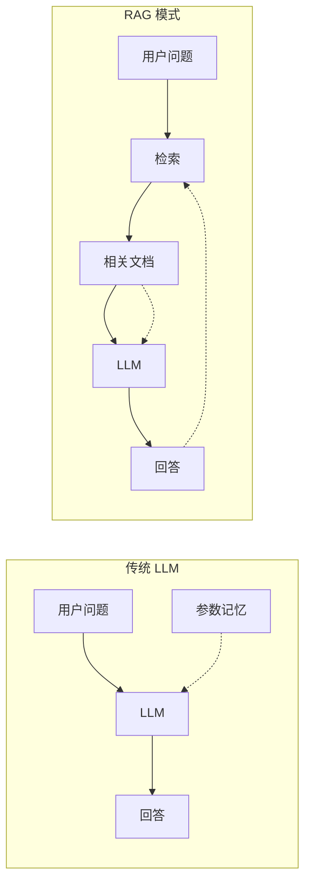
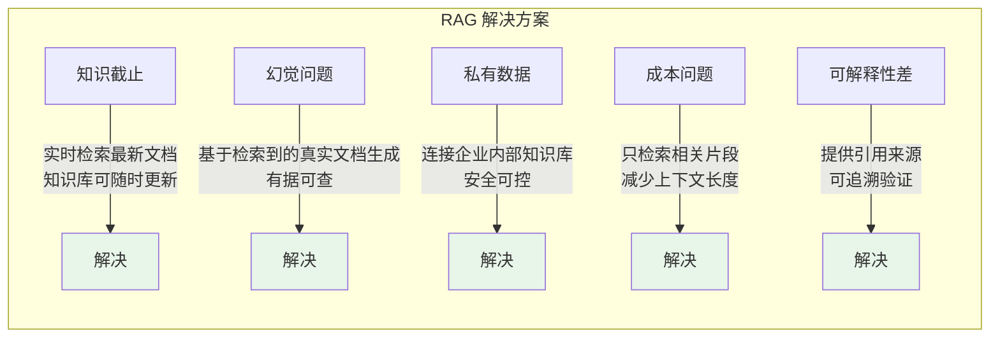
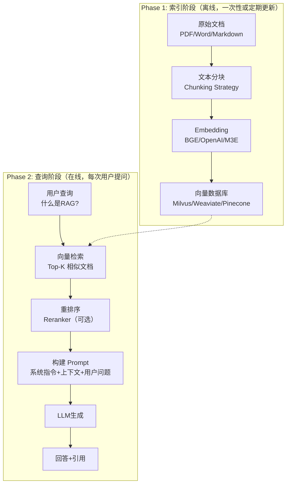
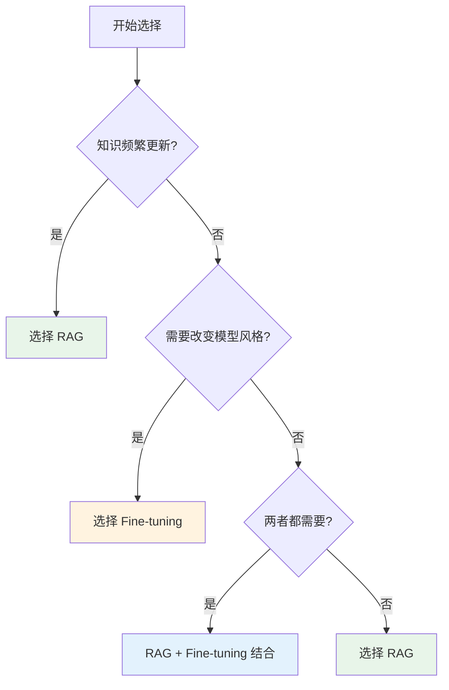
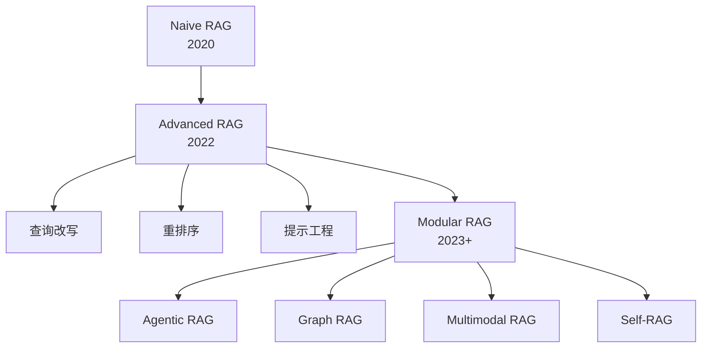

# 01 - RAG 基础概念

## 1.1 什么是 RAG？

RAG（Retrieval-Augmented Generation，检索增强生成）是一种将**信息检索系统**与**大语言模型（LLM）**相结合的架构模式。

### 核心思想

> 不要只依赖 LLM 的参数记忆，而是让 LLM 在生成回答前先检索相关的外部知识。



### 一个简单的类比

想象 LLM 是一个博学但"闭关修炼"的学者：
- **传统方式**：只能依靠他记忆中的知识回答问题
- **RAG 方式**：允许他先查阅图书馆的资料，再基于查到的资料回答问题

## 1.2 为什么需要 RAG？

### LLM 的固有局限

| 问题 | 说明 | 影响 |
|------|------|------|
| **知识截止** | 模型训练数据有截止日期 | 无法回答最新事件 |
| **幻觉问题** | 模型会生成看似合理但错误的内容 | 降低可信度 |
| **私有数据** | 无法访问企业内部的私有文档 | 无法回答业务问题 |
| **成本问题** | 长上下文推理成本高 | 难以处理大量文档 |
| **可解释性差** | 不知道回答基于什么依据 | 难以验证 |

### RAG 如何解决这些问题



## 1.3 RAG 核心流程

### 两阶段架构

RAG 系统分为两个阶段：**索引阶段**（离线）和**查询阶段**（在线）。


│                              ↓                            │
│                        ┌──────────┐                      │
│                        │   LLM    │                      │
│                        │          │                      │
│                        │ GPT-4    │                      │
│                        │ Claude   │                      │
│                        │ Qwen     │                      │
│                        └────┬─────┘                      │
│                             ↓                            │
│                        ┌──────────┐                      │
│                        │ 生成回答  │                      │
│                        │ + 引用   │                      │
│                        └──────────┘                      │
│                                                             │
└─────────────────────────────────────────────────────────────┘
```

## 1.4 RAG vs 其他技术

### RAG vs Fine-tuning

| 对比维度 | RAG | Fine-tuning |
|---------|-----|-------------|
| **核心思想** | 检索外部知识 + 生成 | 调整模型参数 |
| **知识更新** | 实时更新向量数据库 | 需要重新训练 |
| **实现成本** | 低（构建检索系统） | 高（训练资源） |
| **数据需求** | 无需训练数据 | 需要高质量标注数据 |
| **适用场景** | 知识库频繁更新 | 需要改变模型行为/风格 |
| **可解释性** | 高（可追溯来源） | 低（黑盒） |
| **推荐选择** | ✅ 大多数场景首选 | 特定场景补充 |

**决策建议**：


### RAG vs 传统搜索引擎

| 对比维度 | 传统搜索 | RAG |
|---------|---------|-----|
| **输出形式** | 文档列表 | 自然语言回答 |
| **理解能力** | 关键词匹配 | 语义理解 + 推理 |
| **用户体验** | 需要用户自行阅读 | 直接给出答案 |
| **技术栈** | 倒排索引 | 向量检索 + LLM |

## 1.5 RAG 的应用场景

### 典型应用场景

| 场景 | 说明 | 示例 |
|------|------|------|
| **企业知识库问答** | 基于内部文档回答问题 | 员工手册问答、产品文档查询 |
| **客服机器人** | 基于知识库自动回复 | 电商客服、技术支持 |
| **代码文档助手** | 基于代码库回答问题 | API 文档查询、代码示例 |
| **法律法规查询** | 基于法规条文回答 | 法律咨询、合规检查 |
| **医疗知识问答** | 基于医学文献回答 | 症状查询、用药指导 |
| **学术论文助手** | 基于论文库回答 | 文献综述、研究问题 |

### 成功案例

- **OpenAI**: ChatGPT 的 Browse 功能
- **Microsoft**: Bing Chat 的检索增强
- **Notion**: AI 问答基于用户文档
- **Glean**: 企业搜索 + RAG

## 1.6 RAG 的挑战

### 技术挑战

| 挑战 | 说明 | 解决方向 |
|------|------|---------|
| **检索精度** | 检索不到相关文档 | 优化 Embedding、混合检索 |
| **上下文长度** | 检索文档过多超出限制 | 重排序、压缩、筛选 |
| **多跳推理** | 需要多个文档联合推理 | Agentic RAG、Graph RAG |
| **表格/图片** | 非文本内容处理 | 多模态 RAG |
| **实时性** | 知识更新延迟 | 实时索引、流式更新 |

### 评估挑战

- 如何衡量检索质量？
- 如何衡量生成质量？
- 如何端到端评估？

详见 [07-rag-evaluation.md](./07-rag-evaluation.md)

## 1.7 RAG 的发展趋势

### 从 Naive RAG 到 Modular RAG



详见 [05-rag-architectures.md](./05-rag-architectures.md)

## 1.8 总结

### RAG 的核心价值

1. **解决 LLM 知识局限**：实时、可更新的知识
2. **提高回答可信度**：有据可查，减少幻觉
3. **降低应用成本**：无需训练，按需检索
4. **增强可解释性**：提供引用来源

### 下一步学习

| 文档 | 内容 |
|------|------|
| [02 - Embedding 模型选型](./02-embedding-models.md) | 主流 Embedding 模型对比与选型建议 |
| [03 - 向量数据库对比](./03-vector-databases.md) | 向量数据库特性对比与 Java 集成 |
| [04 - 检索策略与优化](./04-retrieval-strategies.md) | Dense/Sparse/Hybrid 检索与重排序技术 |

---

> 💡 **关键概念回顾**：
> - RAG = 检索 + 生成
> - 两阶段：索引（离线）+ 查询（在线）
> - 核心组件：Embedding 模型 + 向量数据库 + LLM
> - 与 Fine-tuning 互补而非替代
