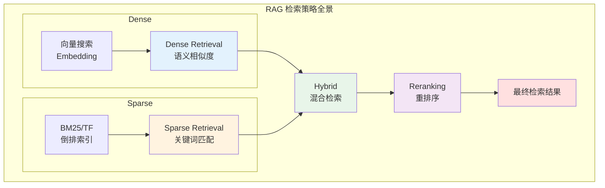
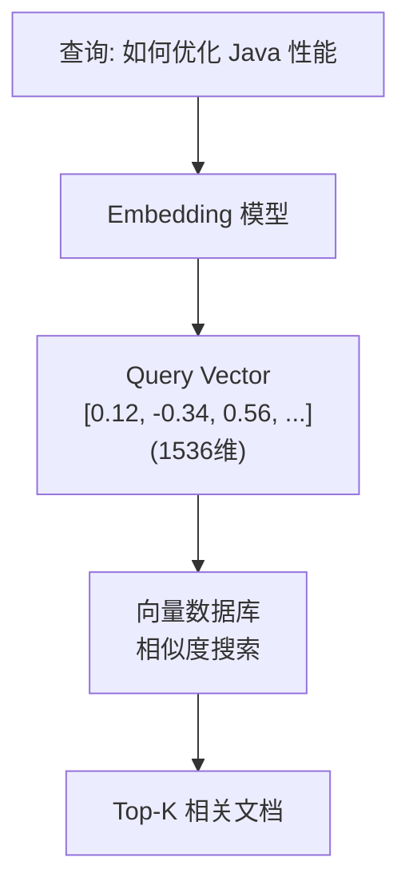
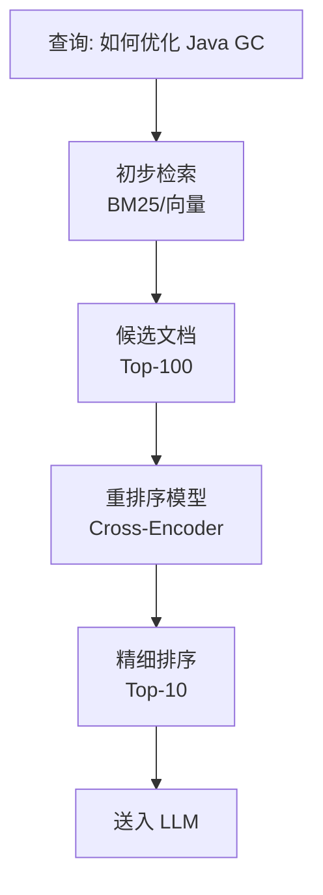

# 检索策略与优化

> 面向 Java 后端开发者的 RAG 检索策略指南，涵盖 Dense、Sparse、Hybrid 检索及重排序技术。

---

## 目录

- [检索策略概述](#检索策略概述)
- [Dense Retrieval（稠密检索）](#dense-retrieval稠密检索)
- [Sparse Retrieval（稀疏检索）](#sparse-retrieval稀疏检索)
- [Hybrid Retrieval（混合检索）](#hybrid-retrieval混合检索)
- [重排序（Reranking）技术](#重排序reranking技术)
- [检索优化技巧](#检索优化技巧)
- [Java 实现示例](#java-实现示例)

---

## 检索策略概述

RAG 系统的检索质量直接影响最终生成效果。不同的检索策略有各自的优缺点，理解它们的特点有助于构建更强大的检索系统。



### 三种检索策略对比

| 策略 | 原理 | 优点 | 缺点 |
|------|------|------|------|
| **Dense** | 向量相似度 | 语义理解强，容错性好 | 计算成本高，可能丢失关键词 |
| **Sparse** | 关键词匹配 | 精准匹配，可解释性强 | 无法理解语义，同义词问题 |
| **Hybrid** | 两者结合 | 兼顾语义和关键词 | 实现复杂，需要调参 |

---

## Dense Retrieval（稠密检索）

### 原理

使用 Embedding 模型将查询和文档编码为稠密向量，通过计算向量间的相似度（余弦相似度、点积等）来检索相关文档。



### 相似度计算方法

```java
@Component
public class SimilarityCalculator {
    
    /**
     * 余弦相似度 [-1, 1]，越接近 1 越相似
     * 最常用，适合归一化后的向量
     */
    public double cosineSimilarity(float[] vecA, float[] vecB) {
        double dotProduct = 0.0;
        double normA = 0.0;
        double normB = 0.0;
        
        for (int i = 0; i < vecA.length; i++) {
            dotProduct += vecA[i] * vecB[i];
            normA += vecA[i] * vecA[i];
            normB += vecB[i] * vecB[i];
        }
        
        return dotProduct / (Math.sqrt(normA) * Math.sqrt(normB));
    }
    
    /**
     * 欧氏距离 [0, +∞)，越小越相似
     * 适合需要绝对距离的场景
     */
    public double euclideanDistance(float[] vecA, float[] vecB) {
        double sum = 0.0;
        for (int i = 0; i < vecA.length; i++) {
            double diff = vecA[i] - vecB[i];
            sum += diff * diff;
        }
        return Math.sqrt(sum);
    }
    
    /**
     * 点积 (-∞, +∞)，越大越相似
     * 计算最快，但受向量模长影响
     */
    public double dotProduct(float[] vecA, float[] vecB) {
        double sum = 0.0;
        for (int i = 0; i < vecA.length; i++) {
            sum += vecA[i] * vecB[i];
        }
        return sum;
    }
}
```

### Dense Retrieval 优缺点

| 优点 | 缺点 |
|------|------|
| 理解语义，支持同义词 | 对罕见词效果差 |
| 容错性好，拼写错误不影响 | 计算资源消耗大 |
| 跨语言检索能力 | 需要预训练模型 |
| 适合长文本语义匹配 | 可能丢失精确关键词 |

### 适用场景

- 语义搜索（"苹果"可以匹配"iPhone"）
- 问答系统（问题与答案语义匹配）
- 推荐系统（基于内容相似度）
- 多语言检索

---

## Sparse Retrieval（稀疏检索）

### 原理

基于传统的信息检索算法（BM25、TF-IDF），通过关键词匹配和词频统计来检索文档。向量是稀疏的（大部分为 0）。

```
查询: "Java 性能优化"
       ↓
分词: ["java", "性能", "优化"]
       ↓
倒排索引查询
       ↓
计算 BM25 分数
       ↓
Top-K 相关文档
```

### BM25 算法

```java
@Component
public class BM25Calculator {
    
    private static final double K1 = 1.5;  // 词频饱和参数
    private static final double B = 0.75;  // 文档长度归一化参数
    
    /**
     * 计算 BM25 分数
     * @param term 查询词
     * @param docFreq 包含该词的文档数
     * @param totalDocs 总文档数
     * @param termFreqInDoc 该词在当前文档出现次数
     * @param docLength 当前文档长度
     * @param avgDocLength 平均文档长度
     */
    public double calculateBM25(
            String term,
            int docFreq,
            int totalDocs,
            int termFreqInDoc,
            int docLength,
            double avgDocLength) {
        
        // IDF 计算
        double idf = Math.log(1 + (totalDocs - docFreq + 0.5) / (docFreq + 0.5));
        
        // 词频归一化
        double tfNormalized = (termFreqInDoc * (K1 + 1)) 
            / (termFreqInDoc + K1 * (1 - B + B * docLength / avgDocLength));
        
        return idf * tfNormalized;
    }
    
    /**
     * 多词查询的 BM25 分数
     */
    public double calculateQueryBM25(
            List<String> queryTerms,
            Map<String, Integer> docFreqMap,
            int totalDocs,
            Map<String, Integer> termFreqInDoc,
            int docLength,
            double avgDocLength) {
        
        double score = 0.0;
        for (String term : queryTerms) {
            int docFreq = docFreqMap.getOrDefault(term, 0);
            int tf = termFreqInDoc.getOrDefault(term, 0);
            score += calculateBM25(term, docFreq, totalDocs, tf, docLength, avgDocLength);
        }
        return score;
    }
}
```

### Lucene 集成示例

```java
@Service
public class LuceneSearchService {
    
    private final Directory directory;
    private final Analyzer analyzer;
    private final IndexWriter indexWriter;
    
    public LuceneSearchService() throws IOException {
        this.directory = new MMapDirectory(Path.of("index"));
        // 中文分词器
        this.analyzer = new IKAnalyzer();
        IndexWriterConfig config = new IndexWriterConfig(analyzer);
        this.indexWriter = new IndexWriter(directory, config);
    }
    
    /**
     * 索引文档
     */
    public void indexDocument(String id, String content, Map<String, String> metadata) 
            throws IOException {
        Document doc = new Document();
        doc.add(new StringField("id", id, Field.Store.YES));
        doc.add(new TextField("content", content, Field.Store.YES));
        doc.add(new TextField("content_keyword", content, Field.Store.NO));
        
        // 元数据字段
        for (Map.Entry<String, String> entry : metadata.entrySet()) {
            doc.add(new StringField("meta_" + entry.getKey(), entry.getValue(), Field.Store.YES));
        }
        
        indexWriter.addDocument(doc);
        indexWriter.commit();
    }
    
    /**
     * BM25 搜索
     */
    public List<SearchResult> search(String query, int topK) throws IOException {
        try (IndexReader reader = DirectoryReader.open(directory)) {
            IndexSearcher searcher = new IndexSearcher(reader);
            // 使用 BM25 相似度
            searcher.setSimilarity(new BM25Similarity());
            
            // 构建查询
            QueryParser parser = new QueryParser("content_keyword", analyzer);
            Query luceneQuery = parser.parse(query);
            
            // 执行搜索
            TopDocs results = searcher.search(luceneQuery, topK);
            
            List<SearchResult> searchResults = new ArrayList<>();
            for (ScoreDoc scoreDoc : results.scoreDocs) {
                Document doc = searcher.storedFields().document(scoreDoc.doc);
                searchResults.add(new SearchResult(
                    doc.get("id"),
                    doc.get("content"),
                    scoreDoc.score,
                    null
                ));
            }
            
            return searchResults;
        }
    }
}
```

### Sparse Retrieval 优缺点

| 优点 | 缺点 |
|------|------|
| 精确匹配关键词 | 无法理解语义 |
| 可解释性强 | 同义词问题（"手机"≠"电话"） |
| 无需预训练模型 | 对拼写错误敏感 |
| 计算效率高 | 长尾词效果差 |

### 适用场景

- 精确关键词匹配
- 产品型号、ID 搜索
- 代码搜索
- 需要可解释性的场景

---

## Hybrid Retrieval（混合检索）

### 原理

结合 Dense 和 Sparse 两种检索方式的优势，通过融合算法（如 RRF、加权求和）整合两种检索结果。

```
查询: "Spring Boot 性能调优"
       ↓
    ┌──────────┬──────────┐
    ↓          ↓          ↓
Dense检索   Sparse检索   元数据过滤
(OpenAI)    (BM25)       (category=java)
    ↓          ↓          ↓
  结果A      结果B       过滤条件
    └──────────┬──────────┘
               ↓
          融合排序 (RRF)
               ↓
          最终 Top-K
```

### 融合算法：RRF（Reciprocal Rank Fusion）

```java
@Component
public class ReciprocalRankFusion {
    
    private static final int K = 60;  // RRF 常数，防止低排名文档分数过高
    
    /**
     * RRF 融合多个列表的结果
     * @param resultLists 多个检索结果列表，每个列表已按相关性排序
     * @param topK 返回前 K 个结果
     */
    public List<FusedResult> fuse(List<List<ScoredDocument>> resultLists, int topK) {
        Map<String, Double> rrfScores = new HashMap<>();
        Map<String, ScoredDocument> docMap = new HashMap<>();
        
        // 计算每个文档的 RRF 分数
        for (List<ScoredDocument> resultList : resultLists) {
            for (int rank = 0; rank < resultList.size(); rank++) {
                ScoredDocument doc = resultList.get(rank);
                String docId = doc.getId();
                
                // RRF 公式: 1 / (k + rank)
                double rrfScore = 1.0 / (K + rank + 1);
                rrfScores.merge(docId, rrfScore, Double::sum);
                
                // 保留文档信息
                docMap.putIfAbsent(docId, doc);
            }
        }
        
        // 按 RRF 分数排序
        return rrfScores.entrySet().stream()
            .sorted(Map.Entry.<String, Double>comparingByValue().reversed())
            .limit(topK)
            .map(entry -> new FusedResult(
                docMap.get(entry.getKey()),
                entry.getValue()
            ))
            .collect(Collectors.toList());
    }
    
    /**
     * 带权重的 RRF
     */
    public List<FusedResult> fuseWeighted(
            List<List<ScoredDocument>> resultLists,
            List<Double> weights,
            int topK) {
        
        Map<String, Double> rrfScores = new HashMap<>();
        Map<String, ScoredDocument> docMap = new HashMap<>();
        
        for (int i = 0; i < resultLists.size(); i++) {
            List<ScoredDocument> resultList = resultLists.get(i);
            double weight = weights.get(i);
            
            for (int rank = 0; rank < resultList.size(); rank++) {
                ScoredDocument doc = resultList.get(rank);
                String docId = doc.getId();
                
                // 加权 RRF
                double rrfScore = weight * (1.0 / (K + rank + 1));
                rrfScores.merge(docId, rrfScore, Double::sum);
                
                docMap.putIfAbsent(docId, doc);
            }
        }
        
        return rrfScores.entrySet().stream()
            .sorted(Map.Entry.<String, Double>comparingByValue().reversed())
            .limit(topK)
            .map(entry -> new FusedResult(
                docMap.get(entry.getKey()),
                entry.getValue()
            ))
            .collect(Collectors.toList());
    }
}

@Data
public class FusedResult {
    private final ScoredDocument document;
    private final double rrfScore;
}
```

### 线性加权融合

```java
@Component
public class LinearScoreFusion {
    
    /**
     * 线性加权融合（需要先归一化分数）
     */
    public List<ScoredDocument> fuse(
            List<ScoredDocument> denseResults,
            List<ScoredDocument> sparseResults,
            double denseWeight,
            double sparseWeight,
            int topK) {
        
        Map<String, Double> fusedScores = new HashMap<>();
        Map<String, ScoredDocument> docMap = new HashMap<>();
        
        // 归一化 Dense 分数（余弦相似度已在 [0,1]）
        double maxDenseScore = denseResults.stream()
            .mapToDouble(ScoredDocument::getScore)
            .max().orElse(1.0);
        
        // 归一化 Sparse 分数
        double maxSparseScore = sparseResults.stream()
            .mapToDouble(ScoredDocument::getScore)
            .max().orElse(1.0);
        
        // 融合 Dense 结果
        for (ScoredDocument doc : denseResults) {
            double normalizedScore = doc.getScore() / maxDenseScore;
            fusedScores.merge(doc.getId(), 
                denseWeight * normalizedScore, Double::sum);
            docMap.put(doc.getId(), doc);
        }
        
        // 融合 Sparse 结果
        for (ScoredDocument doc : sparseResults) {
            double normalizedScore = doc.getScore() / maxSparseScore;
            fusedScores.merge(doc.getId(), 
                sparseWeight * normalizedScore, Double::sum);
            docMap.putIfAbsent(doc.getId(), doc);
        }
        
        // 排序返回
        return fusedScores.entrySet().stream()
            .sorted(Map.Entry.<String, Double>comparingByValue().reversed())
            .limit(topK)
            .map(entry -> {
                ScoredDocument doc = docMap.get(entry.getKey());
                return new ScoredDocument(doc.getId(), doc.getContent(), 
                    entry.getValue(), doc.getMetadata());
            })
            .collect(Collectors.toList());
    }
}
```

### Hybrid Retrieval 完整实现

```java
@Service
public class HybridSearchService {
    
    @Autowired
    private DenseSearchService denseSearch;
    
    @Autowired
    private SparseSearchService sparseSearch;
    
    @Autowired
    private ReciprocalRankFusion rrfFusion;
    
    /**
     * 混合检索（RRF 融合）
     */
    public List<SearchResult> hybridSearch(
            String query,
            float[] queryVector,
            int topK,
            Map<String, Object> filters) {
        
        // 1. Dense 检索（取更多结果用于融合）
        List<ScoredDocument> denseResults = denseSearch.search(
            queryVector, topK * 3, filters);
        
        // 2. Sparse 检索
        List<ScoredDocument> sparseResults = sparseSearch.search(
            query, topK * 3, filters);
        
        // 3. RRF 融合
        List<FusedResult> fusedResults = rrfFusion.fuse(
            Arrays.asList(denseResults, sparseResults), topK);
        
        // 4. 转换为最终结果
        return fusedResults.stream()
            .map(fr -> new SearchResult(
                fr.getDocument().getId(),
                fr.getDocument().getContent(),
                fr.getRrfScore(),
                fr.getDocument().getMetadata()
            ))
            .collect(Collectors.toList());
    }
    
    /**
     * 混合检索（带权重）
     */
    public List<SearchResult> hybridSearchWeighted(
            String query,
            float[] queryVector,
            int topK,
            double denseWeight,
            double sparseWeight,
            Map<String, Object> filters) {
        
        List<ScoredDocument> denseResults = denseSearch.search(
            queryVector, topK * 3, filters);
        
        List<ScoredDocument> sparseResults = sparseSearch.search(
            query, topK * 3, filters);
        
        List<FusedResult> fusedResults = rrfFusion.fuseWeighted(
            Arrays.asList(denseResults, sparseResults),
            Arrays.asList(denseWeight, sparseWeight),
            topK);
        
        return fusedResults.stream()
            .map(fr -> new SearchResult(
                fr.getDocument().getId(),
                fr.getDocument().getContent(),
                fr.getRrfScore(),
                fr.getDocument().getMetadata()
            ))
            .collect(Collectors.toList());
    }
}
```

---

## 重排序（Reranking）技术

### 原理

在初步检索得到候选文档后，使用更精确的模型（通常是 Cross-Encoder）对文档进行精细排序，提高最终结果的准确性。



### Cross-Encoder vs Bi-Encoder

| 特性 | Bi-Encoder | Cross-Encoder |
|------|-----------|---------------|
| **架构** | 分别编码查询和文档 | 拼接查询和文档一起编码 |
| **速度** | 快（预计算文档向量） | 慢（需要实时计算） |
| **精度** | 中等 | 高 |
| **适用阶段** | 初筛/召回 | 精排 |
| **计算成本** | 低 | 高 |

### 重排序模型选择

| 模型 | 特点 | 适用场景 |
|------|------|----------|
| **BGE-Reranker** | 中文效果好，开源 | 中文场景首选 |
| **Cohere Rerank** | 云端 API，效果好 | 快速上线 |
| **Jina Reranker** | 多语言，开源 | 多语言场景 |
| **bge-reranker-v2-m3** | 轻量，速度快 | 资源受限 |

### Java 重排序实现

```java
@Service
public class RerankService {
    
    @Autowired
    private RerankerClient rerankerClient;
    
    /**
     * 使用 Cross-Encoder 重排序
     */
    public List<RerankedResult> rerank(String query, 
                                       List<SearchResult> candidates,
                                       int topK) {
        // 准备输入
        List<RerankInput> inputs = candidates.stream()
            .map(doc -> new RerankInput(query, doc.getContent()))
            .collect(Collectors.toList());
        
        // 调用重排序模型
        List<Double> scores = rerankerClient.predict(inputs);
        
        // 合并结果并排序
        List<RerankedResult> results = new ArrayList<>();
        for (int i = 0; i < candidates.size(); i++) {
            results.add(new RerankedResult(
                candidates.get(i),
                scores.get(i)
            ));
        }
        
        return results.stream()
            .sorted(Comparator.comparing(RerankedResult::getScore).reversed())
            .limit(topK)
            .collect(Collectors.toList());
    }
    
    /**
     * 本地 ONNX 重排序模型
     */
    public List<RerankedResult> rerankLocal(String query,
                                            List<SearchResult> candidates,
                                            int topK) throws OrtException {
        
        OrtEnvironment env = OrtEnvironment.getEnvironment();
        OrtSession.SessionOptions options = new OrtSession.SessionOptions();
        OrtSession session = env.createSession("models/reranker.onnx", options);
        
        List<RerankedResult> results = new ArrayList<>();
        
        for (SearchResult doc : candidates) {
            // 构建输入: [CLS] query [SEP] document [SEP]
            String pair = query + " [SEP] " + doc.getContent();
            
            // Tokenize（使用对应的分词器）
            long[] inputIds = tokenize(pair);
            long[] attentionMask = createAttentionMask(inputIds.length);
            
            OnnxTensor inputTensor = OnnxTensor.createTensor(
                env, new long[][]{inputIds});
            OnnxTensor maskTensor = OnnxTensor.createTensor(
                env, new long[][]{attentionMask});
            
            OrtSession.Result output = session.run(Map.of(
                "input_ids", inputTensor,
                "attention_mask", maskTensor
            ));
            
            float[][] logits = (float[][]) output.get(0).getValue();
            double score = sigmoid(logits[0][0]);
            
            results.add(new RerankedResult(doc, score));
        }
        
        return results.stream()
            .sorted(Comparator.comparing(RerankedResult::getScore).reversed())
            .limit(topK)
            .collect(Collectors.toList());
    }
    
    private double sigmoid(float x) {
        return 1.0 / (1.0 + Math.exp(-x));
    }
}
```

### 完整 RAG Pipeline

```java
@Service
public class AdvancedRAGService {
    
    @Autowired
    private HybridSearchService hybridSearch;
    
    @Autowired
    private RerankService rerankService;
    
    @Autowired
    private EmbeddingService embeddingService;
    
    @Autowired
    private LLMService llmService;
    
    /**
     * 完整 RAG 流程：Hybrid + Rerank
     */
    public RAGResponse query(String userQuery, RAGConfig config) {
        // 1. 生成查询向量
        float[] queryVector = embeddingService.embed(userQuery);
        
        // 2. Hybrid 检索（召回更多候选）
        List<SearchResult> candidates = hybridSearch.hybridSearch(
            userQuery, queryVector, config.getCandidateCount(), config.getFilters());
        
        // 3. 重排序（精排）
        List<RerankedResult> reranked = rerankService.rerank(
            userQuery, candidates, config.getFinalCount());
        
        // 4. 构建上下文
        String context = buildContext(reranked);
        
        // 5. 生成回答
        String answer = llmService.generate(userQuery, context);
        
        // 6. 返回结果
        return new RAGResponse(
            answer,
            reranked.stream()
                .map(RerankedResult::getDocument)
                .collect(Collectors.toList()),
            context
        );
    }
    
    private String buildContext(List<RerankedResult> documents) {
        StringBuilder sb = new StringBuilder();
        for (int i = 0; i < documents.size(); i++) {
            RerankedResult doc = documents.get(i);
            sb.append("[").append(i + 1).append("] ");
            sb.append("来源: ").append(doc.getDocument().getMetadata().get("source")).append("\n");
            sb.append(doc.getDocument().getContent()).append("\n\n");
        }
        return sb.toString();
    }
}

@Data
public class RAGConfig {
    private int candidateCount = 50;   // 初步检索数量
    private int finalCount = 5;        // 最终送入 LLM 的数量
    private Map<String, Object> filters = new HashMap<>();
    private boolean useRerank = true;  // 是否启用重排序
}
```

---

## 检索优化技巧

### 1. 查询改写（Query Rewriting）

```java
@Service
public class QueryRewritingService {
    
    @Autowired
    private LLMService llmService;
    
    /**
     * HyDE（Hypothetical Document Embeddings）
     * 生成假设答案再检索
     */
    public String hydeRewrite(String query) {
        String prompt = """
            请根据以下问题，生成一段可能包含答案的假设文档。
            这段文档应该包含回答该问题所需的关键信息。
            
            问题: %s
            
            假设文档:
            """.formatted(query);
        
        return llmService.complete(prompt);
    }
    
    /**
     * 查询扩展（Query Expansion）
     */
    public List<String> expandQuery(String query) {
        String prompt = """
            请为以下查询生成 3-5 个相关的同义查询，用换行分隔。
            保持语义一致，使用不同的表达方式。
            
            原查询: %s
            
            扩展查询:
            """.formatted(query);
        
        String expanded = llmService.complete(prompt);
        List<String> queries = new ArrayList<>();
        queries.add(query);  // 保留原查询
        queries.addAll(Arrays.asList(expanded.split("\\n")));
        return queries.stream().filter(s -> !s.isBlank()).collect(Collectors.toList());
    }
    
    /**
     * 子查询分解（用于复杂问题）
     */
    public List<String> decomposeQuery(String complexQuery) {
        String prompt = """
            请将以下复杂问题分解为 2-4 个简单的子问题。
            每个子问题应该可以独立回答。
            
            复杂问题: %s
            
            子问题列表（每行一个）:
            """.formatted(complexQuery);
        
        String result = llmService.complete(prompt);
        return Arrays.asList(result.split("\\n"));
    }
}
```

### 2. 多向量表示

```java
@Service
public class MultiVectorService {
    
    @Autowired
    private EmbeddingService embeddingService;
    
    /**
     * 为文档生成多种表示
     */
    public MultiVectorRepresentation createMultiVectorRepresentation(
            String document, String summary, List<String> keywords) {
        
        // 原文向量
        float[] documentVector = embeddingService.embed(document);
        
        // 摘要向量
        float[] summaryVector = embeddingService.embed(summary);
        
        // 关键词向量（拼接后编码）
        String keywordText = String.join(" ", keywords);
        float[] keywordVector = embeddingService.embed(keywordText);
        
        // 假设性问题向量（HyDE）
        String hypotheticalQuestion = generateHypotheticalQuestion(document);
        float[] questionVector = embeddingService.embed(hypotheticalQuestion);
        
        return new MultiVectorRepresentation(
            documentVector, summaryVector, keywordVector, questionVector
        );
    }
    
    /**
     * 多向量检索
     */
    public List<SearchResult> multiVectorSearch(
            String query,
            MultiVectorRepresentation queryVectors,
            int topK) {
        
        // 并行检索多种表示
        CompletableFuture<List<SearchResult>> docSearch = 
            CompletableFuture.supplyAsync(() -> 
                vectorStore.search(queryVectors.getDocumentVector(), topK * 2));
        
        CompletableFuture<List<SearchResult>> summarySearch = 
            CompletableFuture.supplyAsync(() -> 
                vectorStore.search(queryVectors.getSummaryVector(), topK * 2));
        
        CompletableFuture<List<SearchResult>> questionSearch = 
            CompletableFuture.supplyAsync(() -> 
                vectorStore.search(queryVectors.getQuestionVector(), topK * 2));
        
        // 等待所有结果
        CompletableFuture.allOf(docSearch, summarySearch, questionSearch).join();
        
        try {
            List<List<SearchResult>> allResults = Arrays.asList(
                docSearch.get(), summarySearch.get(), questionSearch.get()
            );
            
            // RRF 融合
            return rrfFusion.fuse(allResults, topK);
            
        } catch (Exception e) {
            throw new RuntimeException("Multi-vector search failed", e);
        }
    }
}
```

### 3. 元数据过滤优化

```java
@Service
public class MetadataFilteringService {
    
    /**
     * 智能元数据过滤
     */
    public Map<String, Object> extractFilters(String query) {
        Map<String, Object> filters = new HashMap<>();
        
        // 从查询中提取过滤条件
        // 例如: "Java 相关的 Spring Boot 文档" -> category=java, tag=spring-boot
        
        if (query.toLowerCase().contains("java")) {
            filters.put("category", "java");
        }
        if (query.toLowerCase().contains("python")) {
            filters.put("category", "python");
        }
        if (query.toLowerCase().contains("spring")) {
            filters.put("tags", Arrays.asList("spring", "spring-boot"));
        }
        
        // 时间过滤
        if (query.contains("最新") || query.contains("最近")) {
            filters.put("created_after", 
                LocalDateTime.now().minusMonths(3));
        }
        
        return filters;
    }
    
    /**
     * 预过滤 vs 后过滤
     */
    public List<SearchResult> searchWithPreFilter(
            float[] queryVector,
            Map<String, Object> filters,
            int topK) {
        
        // 方式1: 预过滤（在向量搜索前应用）
        // 优点: 减少搜索空间
        // 缺点: 可能错过相关文档
        return vectorStore.searchWithFilter(queryVector, filters, topK);
    }
    
    public List<SearchResult> searchWithPostFilter(
            float[] queryVector,
            Map<String, Object> filters,
            int topK) {
        
        // 方式2: 后过滤（向量搜索后过滤）
        // 优点: 不会错过相关文档
        // 缺点: 可能返回不足 topK
        List<SearchResult> results = vectorStore.search(queryVector, topK * 3);
        
        return results.stream()
            .filter(doc -> matchesFilters(doc, filters))
            .limit(topK)
            .collect(Collectors.toList());
    }
}
```

### 4. 检索参数调优

```java
@Component
public class RetrievalTuningConfig {
    
    // HNSW 索引参数
    private int hnswM = 16;              // 每层最大连接数
    private int hnswEfConstruction = 128; // 构建时的搜索深度
    private int hnswEfSearch = 100;       // 查询时的搜索深度
    
    // 检索参数
    private double similarityThreshold = 0.7;  // 最低相似度阈值
    private int candidateMultiplier = 3;        // 候选集倍数
    
    /**
     * 动态调整参数
     */
    public RetrievalParams tuneForQuery(String query, QueryType type) {
        switch (type) {
            case FACTUAL:
                // 事实性查询: 提高精确度
                return RetrievalParams.builder()
                    .similarityThreshold(0.8)
                    .topK(3)
                    .useRerank(true)
                    .build();
                
            case EXPLORATORY:
                // 探索性查询: 提高召回率
                return RetrievalParams.builder()
                    .similarityThreshold(0.5)
                    .topK(10)
                    .candidateMultiplier(5)
                    .build();
                
            case COMPARISON:
                // 对比查询: 平衡精度和召回
                return RetrievalParams.builder()
                    .similarityThreshold(0.65)
                    .topK(8)
                    .useRerank(true)
                    .build();
                
            default:
                return RetrievalParams.defaultParams();
        }
    }
}
```

---

## Java 实现示例

### 完整 RAG 检索服务

```java
@Service
public class RAGRetrievalService {
    
    @Autowired
    private VectorStore vectorStore;
    
    @Autowired
    private BM25SearchService bm25Search;
    
    @Autowired
    private RerankService rerankService;
    
    @Autowired
    private EmbeddingService embeddingService;
    
    /**
     * 统一检索接口
     */
    public RetrievalResult retrieve(RetrievalRequest request) {
        switch (request.getStrategy()) {
            case DENSE:
                return retrieveDense(request);
            case SPARSE:
                return retrieveSparse(request);
            case HYBRID:
                return retrieveHybrid(request);
            case HYBRID_WITH_RERANK:
                return retrieveHybridWithRerank(request);
            default:
                throw new IllegalArgumentException("Unknown strategy");
        }
    }
    
    private RetrievalResult retrieveDense(RetrievalRequest request) {
        float[] queryVector = embeddingService.embed(request.getQuery());
        
        List<SearchResult> results = vectorStore.search(
            queryVector, 
            request.getTopK(),
            request.getFilters()
        );
        
        return RetrievalResult.builder()
            .results(results)
            .strategy(RetrievalStrategy.DENSE)
            .latency(System.currentTimeMillis() - request.getStartTime())
            .build();
    }
    
    private RetrievalResult retrieveSparse(RetrievalRequest request) {
        List<SearchResult> results = bm25Search.search(
            request.getQuery(),
            request.getTopK(),
            request.getFilters()
        );
        
        return RetrievalResult.builder()
            .results(results)
            .strategy(RetrievalStrategy.SPARSE)
            .build();
    }
    
    private RetrievalResult retrieveHybrid(RetrievalRequest request) {
        float[] queryVector = embeddingService.embed(request.getQuery());
        
        // 并行执行两种检索
        CompletableFuture<List<SearchResult>> denseFuture = 
            CompletableFuture.supplyAsync(() -> 
                vectorStore.search(queryVector, request.getTopK() * 3, request.getFilters()));
        
        CompletableFuture<List<SearchResult>> sparseFuture = 
            CompletableFuture.supplyAsync(() -> 
                bm25Search.search(request.getQuery(), request.getTopK() * 3, request.getFilters()));
        
        CompletableFuture.allOf(denseFuture, sparseFuture).join();
        
        try {
            List<SearchResult> denseResults = denseFuture.get();
            List<SearchResult> sparseResults = sparseFuture.get();
            
            // RRF 融合
            List<SearchResult> fused = fuseResults(denseResults, sparseResults, request.getTopK());
            
            return RetrievalResult.builder()
                .results(fused)
                .strategy(RetrievalStrategy.HYBRID)
                .denseResults(denseResults.size())
                .sparseResults(sparseResults.size())
                .build();
                
        } catch (Exception e) {
            throw new RuntimeException("Hybrid retrieval failed", e);
        }
    }
    
    private RetrievalResult retrieveHybridWithRerank(RetrievalRequest request) {
        // 1. Hybrid 检索（获取更多候选）
        RetrievalRequest candidateRequest = RetrievalRequest.builder()
            .query(request.getQuery())
            .topK(request.getTopK() * 10)
            .strategy(RetrievalStrategy.HYBRID)
            .build();
        
        RetrievalResult candidates = retrieveHybrid(candidateRequest);
        
        // 2. 重排序
        List<RerankedResult> reranked = rerankService.rerank(
            request.getQuery(), 
            candidates.getResults(), 
            request.getTopK()
        );
        
        // 3. 转换结果
        List<SearchResult> finalResults = reranked.stream()
            .map(RerankedResult::getDocument)
            .collect(Collectors.toList());
        
        return RetrievalResult.builder()
            .results(finalResults)
            .strategy(RetrievalStrategy.HYBRID_WITH_RERANK)
            .rerankScores(reranked.stream()
                .map(RerankedResult::getScore)
                .collect(Collectors.toList()))
            .build();
    }
}

@Data
@Builder
public class RetrievalRequest {
    private String query;
    private int topK = 5;
    private RetrievalStrategy strategy = RetrievalStrategy.HYBRID_WITH_RERANK;
    private Map<String, Object> filters = new HashMap<>();
    private long startTime = System.currentTimeMillis();
}

public enum RetrievalStrategy {
    DENSE, SPARSE, HYBRID, HYBRID_WITH_RERANK
}
```

---

## 参考资源

| 资源 | 链接 |
|------|------|
| RAG Survey Paper | https://arxiv.org/abs/2312.10997 |
| Dense Passage Retrieval | https://arxiv.org/abs/2004.04906 |
| BM25 Algorithm | https://www.elastic.co/blog/practical-bm25-part-2-the-bm25-algorithm-and-its-variables |
| RRF Paper | https://plg.uwaterloo.ca/~gvcormac/cormacksigir09-rrf.pdf |
| BGE Reranker | https://github.com/FlagOpen/FlagEmbedding |
| Cohere Rerank | https://docs.cohere.com/docs/rerank |

---

*最后更新：2026-03-10*
