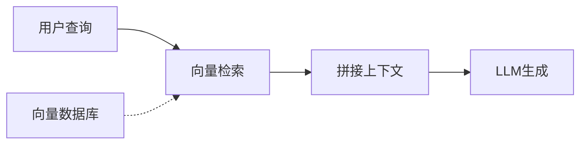
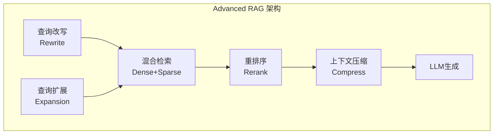
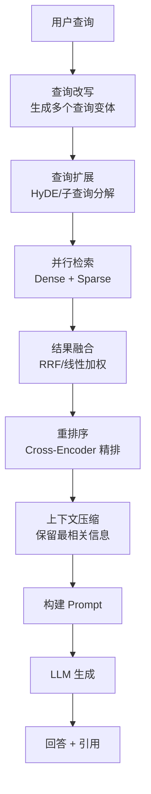
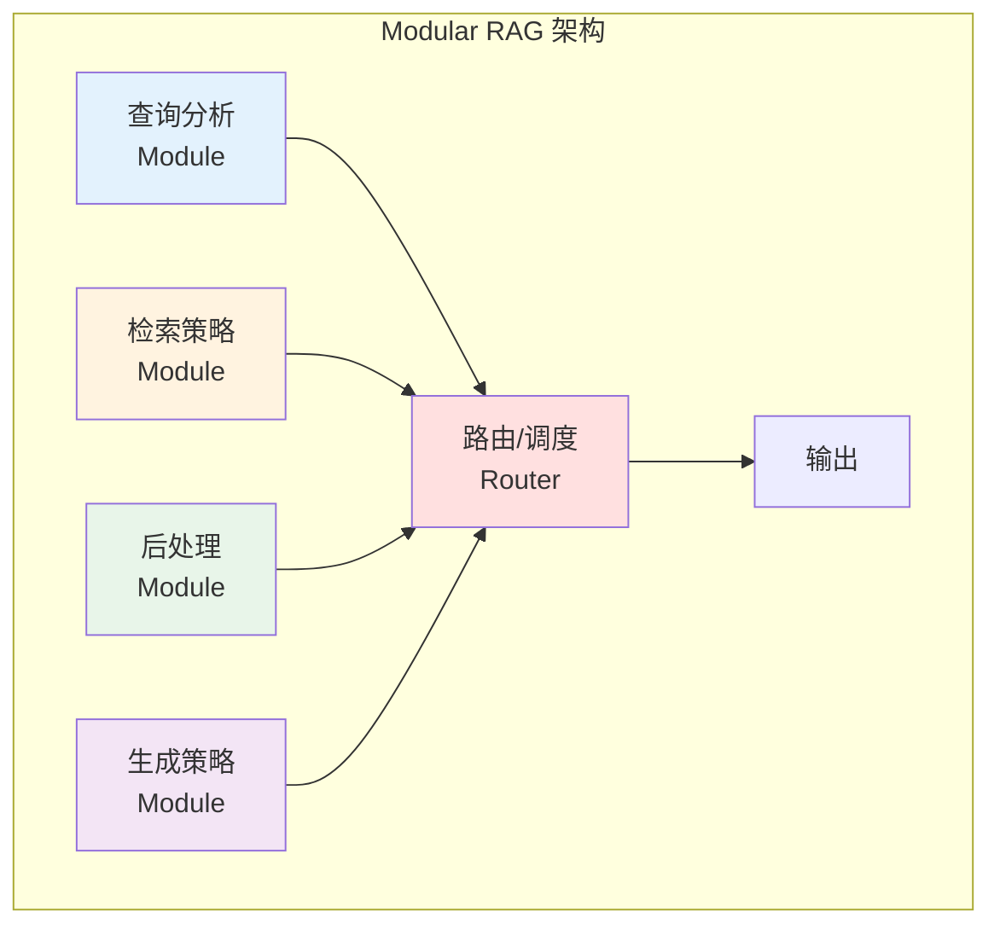
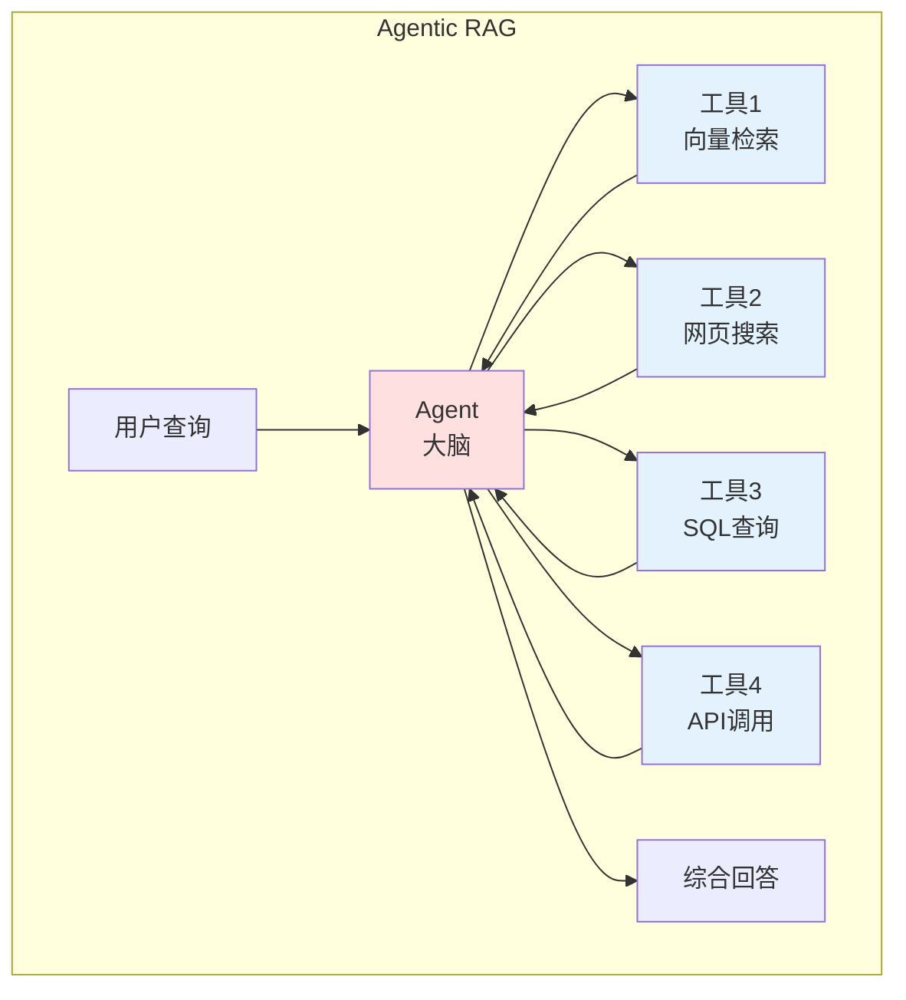
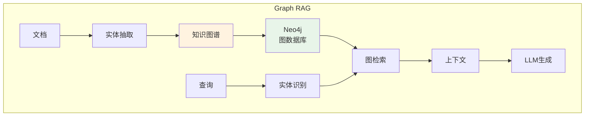
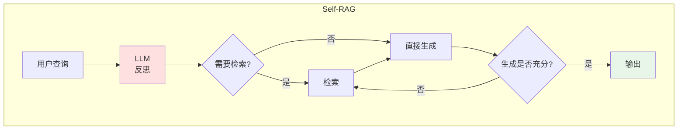
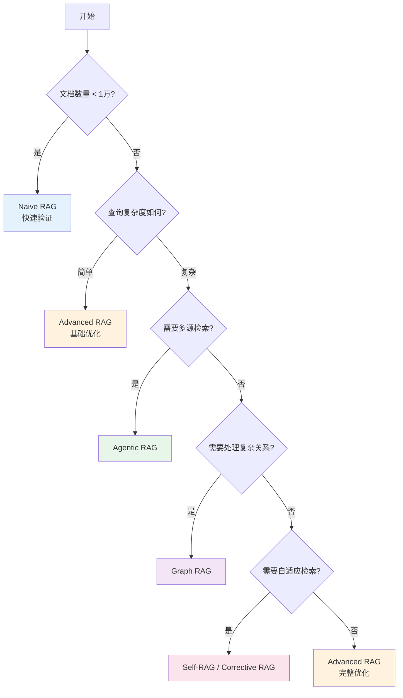
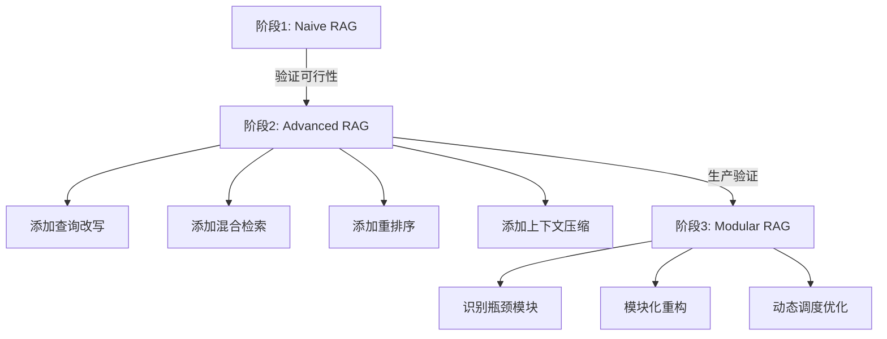
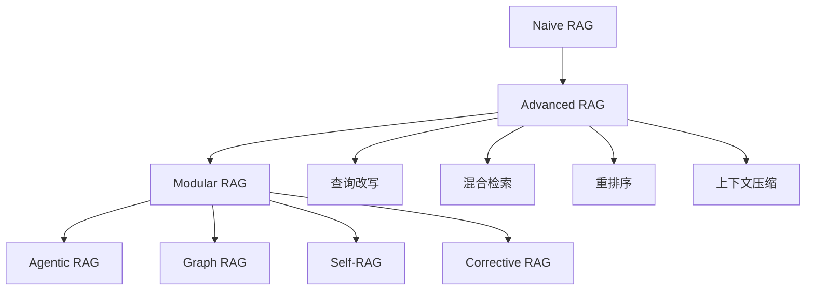

# 05 - RAG 架构演进

## 目录

1. [Naive RAG（朴素 RAG）](#1-naive-rag朴素-rag)
2. [Advanced RAG（高级 RAG）](#2-advanced-rag高级-rag)
3. [Modular RAG（模块化 RAG）](#3-modular-rag模块化-rag)
4. [架构选型建议](#4-架构选型建议)

---

## 1. Naive RAG（朴素 RAG）

### 1.1 架构概述

Naive RAG 是最基础的 RAG 实现，直接遵循"检索-生成"的两阶段流程。



### 1.2 核心流程

```java
// Naive RAG 伪代码
public String naiveRag(String query) {
    // 1. 将查询转为向量
    float[] queryVector = embeddingModel.embed(query);
    
    // 2. 检索 Top-K 文档
    List<Document> docs = vectorDB.search(queryVector, topK);
    
    // 3. 拼接上下文
    String context = docs.stream()
        .map(Document::getContent)
        .collect(Collectors.joining("\n\n"));
    
    // 4. 构建 Prompt
    String prompt = String.format("""
        基于以下上下文回答问题：
        %s
        
        问题：%s
        """, context, query);
    
    // 5. 调用 LLM
    return llm.generate(prompt);
}
```

### 1.3 优点与局限

| 优点 | 局限 |
|------|------|
| 实现简单 | 检索质量依赖 Embedding |
| 开发成本低 | 无法处理复杂查询 |
| 适合快速验证 | 上下文可能包含无关信息 |
| | 无查询优化 |
| | 无重排序 |

### 1.4 适用场景

- ✅ 概念验证（POC）
- ✅ 简单问答场景
- ✅ 文档数量较少（< 1万）
- ❌ 复杂多跳推理
- ❌ 高精度要求场景

---

## 2. Advanced RAG（高级 RAG）

### 2.1 架构概述

Advanced RAG 在 Naive RAG 基础上增加了多个优化环节。


│                   ↓                                        │
│            ┌──────────────┐                              │
│            │   重排序     │                              │
│            │ (Rerank)    │                              │
│            └──────┬───────┘                              │
│                   ↓                                        │
│            ┌──────────────┐                              │
│            │  上下文压缩  │                              │
│            │ (Compress)  │                              │
│            └──────┬───────┘                              │
│                   ↓                                        │
│            ┌──────────────┐                              │
│            │   LLM生成    │                              │
│            └──────────────┘                              │
│                                                             │
└─────────────────────────────────────────────────────────────┘
```

### 2.2 关键优化技术

#### 2.2.1 查询改写（Query Rewriting）

将用户原始查询改写为更适合检索的形式。

```java
// 查询改写示例
public String rewriteQuery(String originalQuery) {
    String rewritePrompt = String.format("""
        将以下用户查询改写为更适合向量检索的形式。
        保持原意，但使其更具体、包含更多关键词。
        
        原始查询：%s
        改写后：
        """, originalQuery);
    
    return llm.generate(rewritePrompt);
}

// 示例
// 输入: "RAG是什么"
// 输出: "RAG检索增强生成技术原理架构介绍"
```

**常见改写策略**：
- **HyDE**（Hypothetical Document Embedding）：生成假设回答再嵌入
- **Query Expansion**：扩展同义词、相关词
- **Sub-query Decomposition**：分解为子查询

#### 2.2.2 混合检索（Hybrid Retrieval）

结合 Dense 和 Sparse 检索的优势。

```java
// 混合检索示例
public List<Document> hybridSearch(String query, float[] queryVector) {
    // Dense 检索
    List<Document> denseResults = vectorDB.search(queryVector, topK);
    
    // Sparse 检索（BM25）
    List<Document> sparseResults = bm25Search(query, topK);
    
    // RRF 融合
    return reciprocalRankFusion(denseResults, sparseResults);
}

// RRF 融合算法
public List<Document> reciprocalRankFusion(
    List<Document> list1, 
    List<Document> list2,
    int k = 60
) {
    Map<String, Double> scores = new HashMap<>();
    
    // 计算 RRF 分数
    for (int i = 0; i < list1.size(); i++) {
        String id = list1.get(i).getId();
        scores.merge(id, 1.0 / (k + i + 1), Double::sum);
    }
    
    for (int i = 0; i < list2.size(); i++) {
        String id = list2.get(i).getId();
        scores.merge(id, 1.0 / (k + i + 1), Double::sum);
    }
    
    // 按分数排序返回
    return scores.entrySet().stream()
        .sorted(Map.Entry.<String, Double>comparingByValue().reversed())
        .map(e -> getDocumentById(e.getKey()))
        .collect(Collectors.toList());
}
```

#### 2.2.3 重排序（Reranking）

使用更精确的模型对初步检索结果重排。

```java
// 重排序示例
public List<Document> rerank(String query, List<Document> candidates) {
    // 使用 Cross-Encoder 计算相关性分数
    List<ScoredDocument> scored = candidates.stream()
        .map(doc -> {
            double score = crossEncoder.score(query, doc.getContent());
            return new ScoredDocument(doc, score);
        })
        .sorted(Comparator.comparing(ScoredDocument::getScore).reversed())
        .collect(Collectors.toList());
    
    // 返回 Top-N
    return scored.stream()
        .limit(rerankTopN)
        .map(ScoredDocument::getDocument)
        .collect(Collectors.toList());
}
```

#### 2.2.4 上下文压缩（Context Compression）

压缩检索到的文档，保留最相关信息。

```java
// 上下文压缩示例
public String compressContext(String query, List<Document> docs) {
    // 方法1：基于相关性的句子选择
    List<String> sentences = extractSentences(docs);
    
    return sentences.stream()
        .map(sent -> Map.entry(sent, embeddingModel.similarity(query, sent)))
        .sorted(Map.Entry.<String, Double>comparingByValue().reversed())
        .limit(maxSentences)
        .map(Map.Entry::getKey)
        .collect(Collectors.joining("\n"));
    
    // 方法2：使用 LLM 压缩
    // String compressPrompt = "提取与问题相关的关键信息...";
    // return llm.generate(compressPrompt);
}
```

### 2.3 Advanced RAG 流程图


[LLM 生成]
    ↓
回答 + 引用
```

### 2.4 适用场景

- ✅ 生产环境部署
- ✅ 中等复杂度查询
- ✅ 对检索质量有要求
- ✅ 文档数量中等（1万-100万）

---

## 3. Modular RAG（模块化 RAG）

### 3.1 架构概述

Modular RAG 将 RAG 流程拆分为独立的模块，支持灵活组合和动态调度。



### 3.2 典型模块化架构

#### 3.2.1 Agentic RAG

使用 Agent 动态决策检索策略。



```java
// Agentic RAG 伪代码
public String agenticRag(String query) {
    Agent agent = new Agent();
    
    // Agent 决定使用哪些工具
    List<Tool> tools = agent.decideTools(query);
    
    // 并行执行多个检索
    List<RetrievalResult> results = tools.parallelStream()
        .map(tool -> tool.execute(query))
        .collect(Collectors.toList());
    
    // Agent 综合结果
    return agent.synthesize(query, results);
}
```

#### 3.2.2 Graph RAG

结合知识图谱的 RAG。



#### 3.2.3 Self-RAG

让模型自我反思和检索。


│   [是] ──→ 输出                                            │
│   [否] ──→ 再次检索 ──→ 生成                                │
│                                                             │
│   特点：自适应检索次数，避免过度检索                          │
│                                                             │
└─────────────────────────────────────────────────────────────┘
```

#### 3.2.4 Corrective RAG

动态评估检索质量并修正。

```java
// Corrective RAG 伪代码
public String correctiveRag(String query) {
    // 1. 初始检索
    List<Document> docs = retrieve(query);
    
    // 2. 评估检索质量
    RetrievalQuality quality = assessQuality(query, docs);
    
    switch (quality) {
        case HIGH:
            // 直接使用检索结果
            return generate(query, docs);
            
        case LOW:
            // 检索质量差，改用网络搜索
            List<Document> webDocs = webSearch(query);
            return generate(query, webDocs);
            
        case MEDIUM:
            // 扩展查询再次检索
            String expanded = expandQuery(query);
            List<Document> moreDocs = retrieve(expanded);
            docs.addAll(moreDocs);
            return generate(query, docs);
    }
}
```

### 3.3 模块化设计原则

| 原则 | 说明 |
|------|------|
| **单一职责** | 每个模块只做一件事 |
| **可插拔** | 模块可独立替换 |
| **可组合** | 支持多种组合方式 |
| **可配置** | 通过配置调整行为 |
| **可观测** | 每个模块可独立监控 |

### 3.4 适用场景

- ✅ 复杂业务场景
- ✅ 需要多源检索
- ✅ 动态决策需求
- ✅ 大规模文档（> 100万）
- ✅ 多跳推理需求

---

## 4. 架构选型建议

### 4.1 选型决策树



### 4.2 各架构对比

| 维度 | Naive | Advanced | Modular |
|------|-------|----------|---------|
| **实现复杂度** | ⭐ | ⭐⭐⭐ | ⭐⭐⭐⭐⭐ |
| **检索质量** | ⭐⭐ | ⭐⭐⭐⭐ | ⭐⭐⭐⭐⭐ |
| **灵活性** | ⭐⭐ | ⭐⭐⭐ | ⭐⭐⭐⭐⭐ |
| **维护成本** | ⭐ | ⭐⭐⭐ | ⭐⭐⭐⭐ |
| **适用规模** | 小 | 中 | 大 |
| **开发周期** | 短 | 中 | 长 |

### 4.3 渐进式演进建议



### 4.4 Java 生态推荐

| 架构 | 推荐框架/库 |
|------|------------|
| Naive RAG | Spring AI、LangChain4j |
| Advanced RAG | Spring AI + 自定义组件 |
| Agentic RAG | LangChain4j Agent、Spring AI |
| Graph RAG | Neo4j + Spring Data Neo4j |

---

## 5. 总结

### 架构演进路线



### 选择建议

- **从简单开始**：先用 Naive RAG 验证可行性
- **逐步优化**：根据问题添加 Advanced RAG 技术
- **按需模块化**：复杂场景再考虑 Modular RAG
- **持续评估**：建立评估体系指导优化方向

---

> 📌 下一步学习：
> - [06-document-processing.md](./06-document-processing.md) - 文档处理与分块
> - [07-rag-evaluation.md](./07-rag-evaluation.md) - RAG 评估与优化
> - [08-java-rag-practice.md](./08-java-rag-practice.md) - Java 实战
