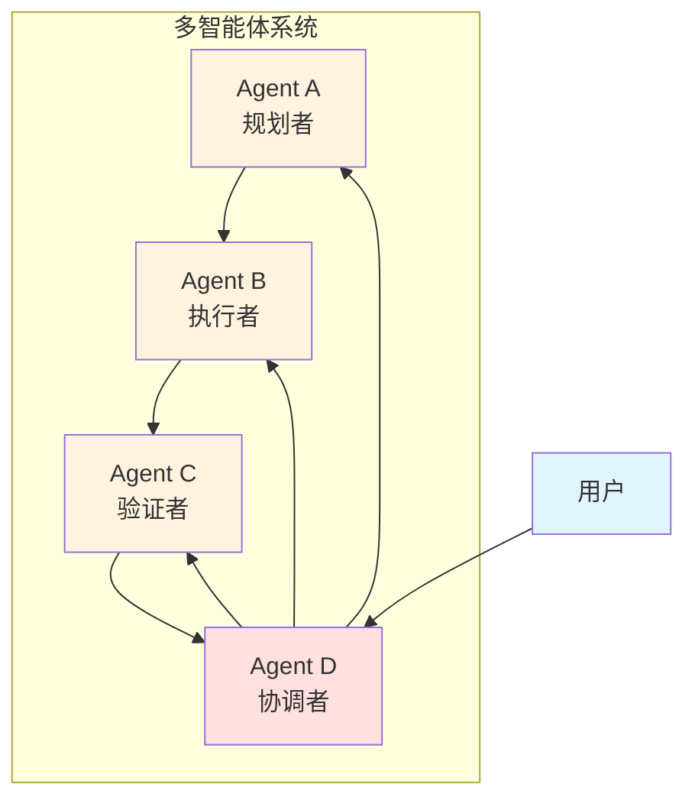
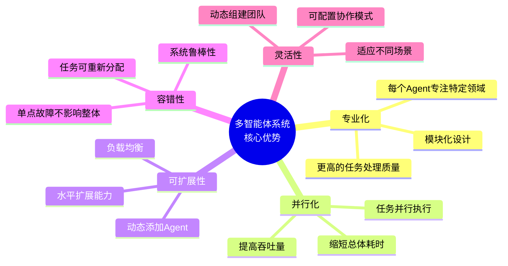
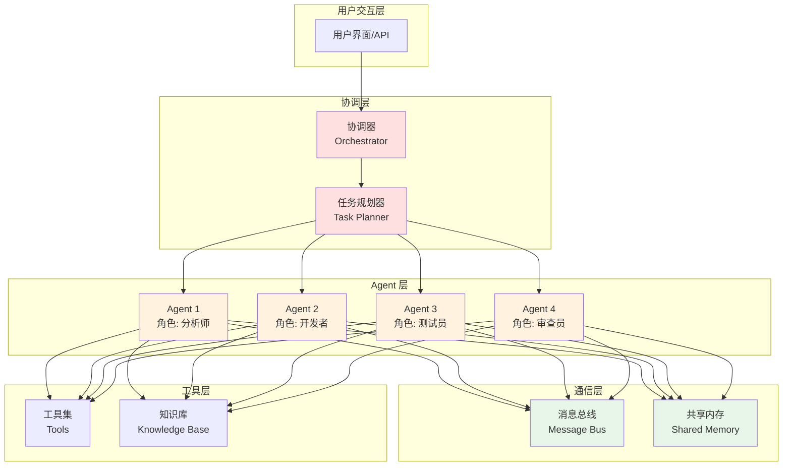
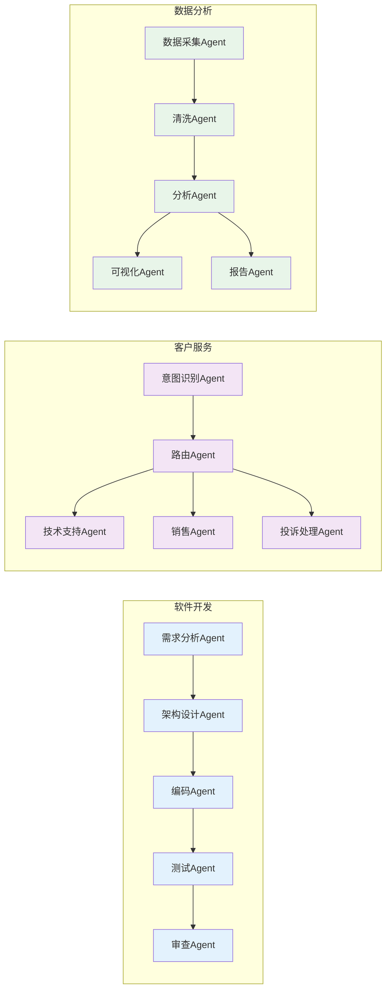
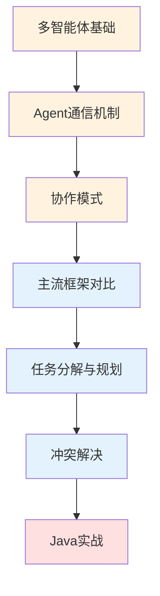

# 07 - 多智能体系统（Multi-Agent Systems）

本模块系统介绍多智能体系统（Multi-Agent Systems, MAS）的核心概念、架构模式、通信机制与协作策略，重点面向 Java 后端开发者构建分布式智能 Agent 应用。

## 目录

| # | 文档 | 简介 |
|---|------|------|
| 1 | [多智能体基础](./07-multi-agent-systems/01-multi-agent-basics.md) | 什么是多智能体系统、单Agent vs 多Agent、核心概念 |
| 2 | [Agent 通信机制](./07-multi-agent-systems/02-agent-communication.md) | 对话式通信、共享内存、消息队列 |
| 3 | [协作模式](./07-multi-agent-systems/03-coordination-patterns.md) | 分工协作、竞争模式、层级结构 |
| 4 | [主流框架对比](./07-multi-agent-systems/04-frameworks-comparison.md) | AutoGen、CrewAI、LangGraph、MetaGPT 对比 |
| 5 | [任务分解与规划](./07-multi-agent-systems/05-task-decomposition.md) | 任务分解策略、规划算法 |
| 6 | [冲突解决](./07-multi-agent-systems/06-conflict-resolution.md) | 冲突类型、解决策略 |
| 7 | [Java 实战](./07-multi-agent-systems/07-java-multi-agent-practice.md) | Spring Boot 实现多智能体系统 |

## 核心概念速览

### 什么是多智能体系统？

多智能体系统（Multi-Agent System, MAS）是由多个自主 Agent 组成的分布式系统，这些 Agent 通过协作、通信和协调来完成单个 Agent 难以完成的复杂任务。

### 单 Agent vs 多 Agent

| 维度 | 单 Agent | 多 Agent |
|------|----------|----------|
| 任务复杂度 | 适合简单、线性的任务 | 适合复杂、并行的任务 |
| 专业化程度 | 通用能力 | 各司其职，专业化处理 |
| 容错能力 | 单点故障 | 分布式容错 |
| 可扩展性 | 受限于单个 LLM 上下文 | 可水平扩展 |
| 开发复杂度 | 低 | 高 |
| 协调开销 | 无 | 需要通信和协调机制 |
| 适用场景 | 问答、简单工具调用 | 复杂工作流、团队协作模拟 |

### 多智能体核心优势

## 多智能体系统架构

## 典型应用场景

## 学习路径建议

## 与其他模块的关系

- 本模块依赖 [01 - Agent 基础](./01-agent-basics.md) 中的核心概念
- 本模块依赖 [04 - Agent 框架](./04-agent-frameworks.md) 中的框架基础
- 本模块可与 [06 - RAG / 知识检索](./06-rag-knowledge-retrieval.md) 结合实现分布式知识检索
- 本模块为复杂 Agent 应用提供分布式架构支持

## 推荐资源

### 论文
- **Multi-Agent Reinforcement Learning: A Selective Overview of Theories and Algorithms** (2021)
- **CAMEL: Communicative Agents for "Mind" Exploration of Large Scale Language Model Society** (2023)
- **AutoGen: Enabling Next-Gen LLM Applications via Multi-Agent Conversation** (2023)
- **MetaGPT: Meta Programming for Multi-Agent Collaborative Framework** (2023)

### 开源项目
- **AutoGen**: 微软开源的多 Agent 对话框架
- **CrewAI**: 用于编排角色扮演 Agent 的框架
- **LangGraph**: LangChain 的图结构 Agent 编排
- **MetaGPT**: 多 Agent 协作软件开发框架

---

> 📌 详细内容见各子章节，Java 实战示例见 [07-java-multi-agent-practice.md](./07-multi-agent-systems/07-java-multi-agent-practice.md)
