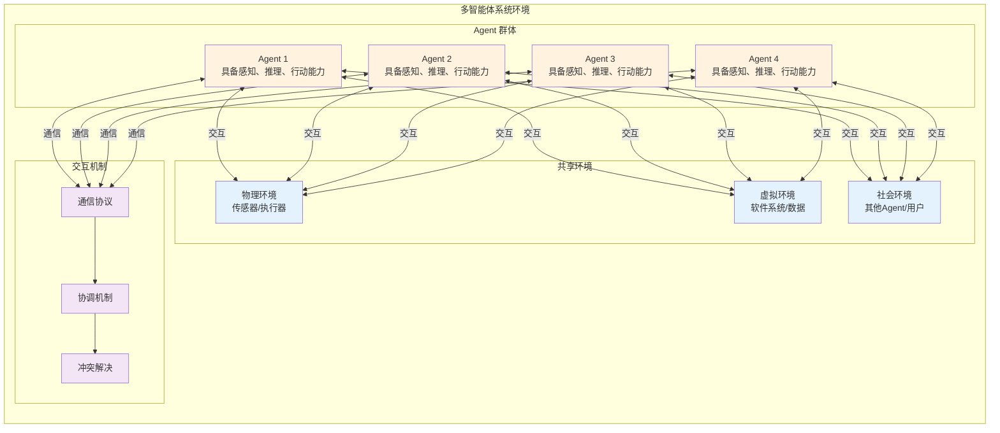
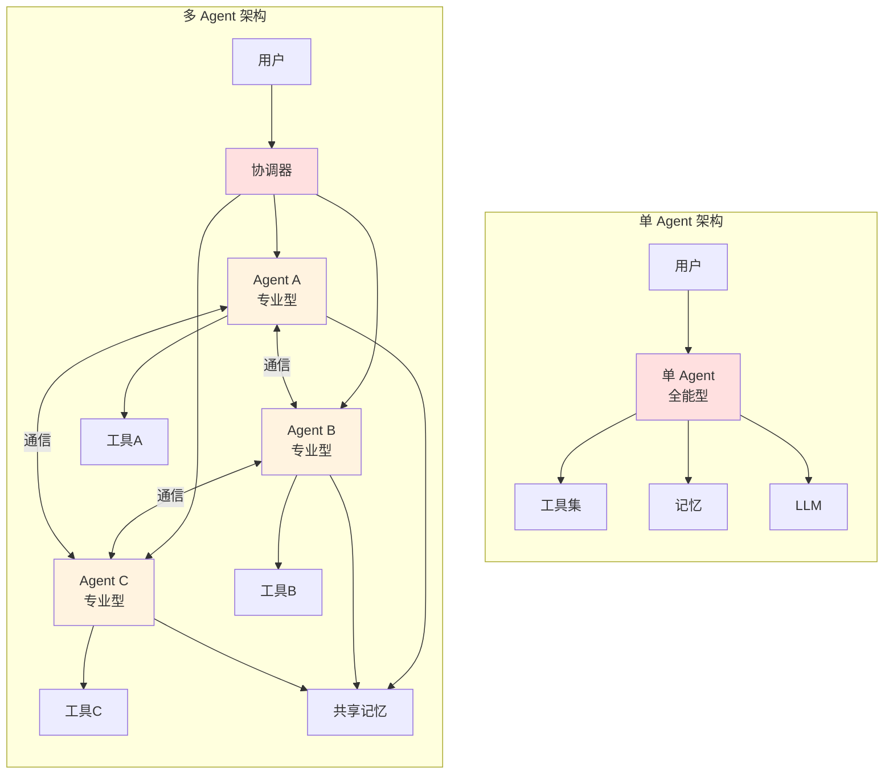
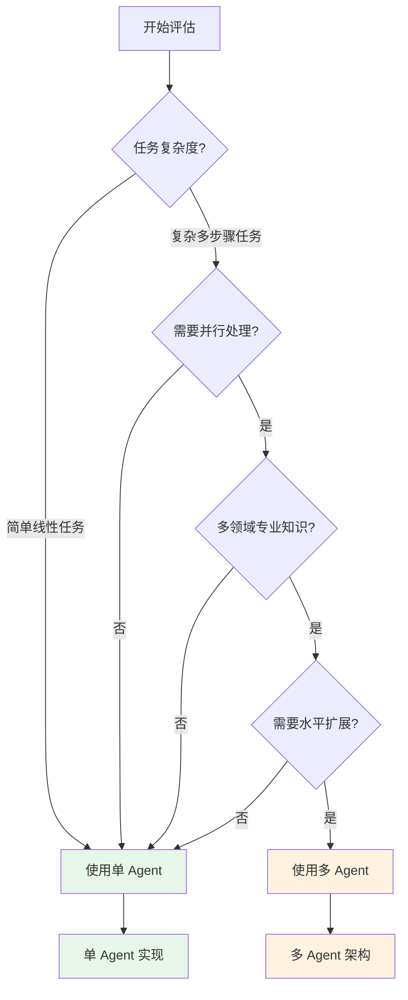
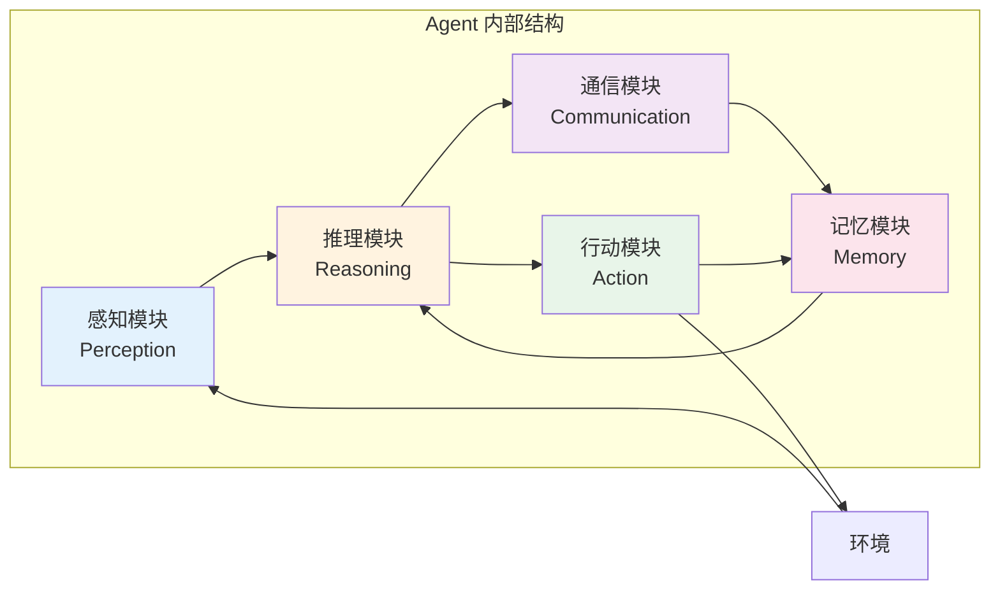
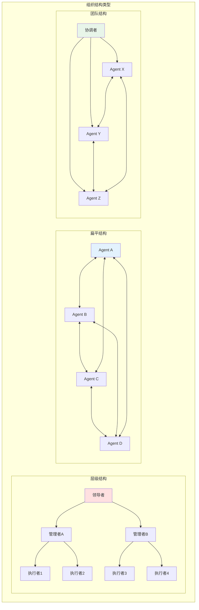
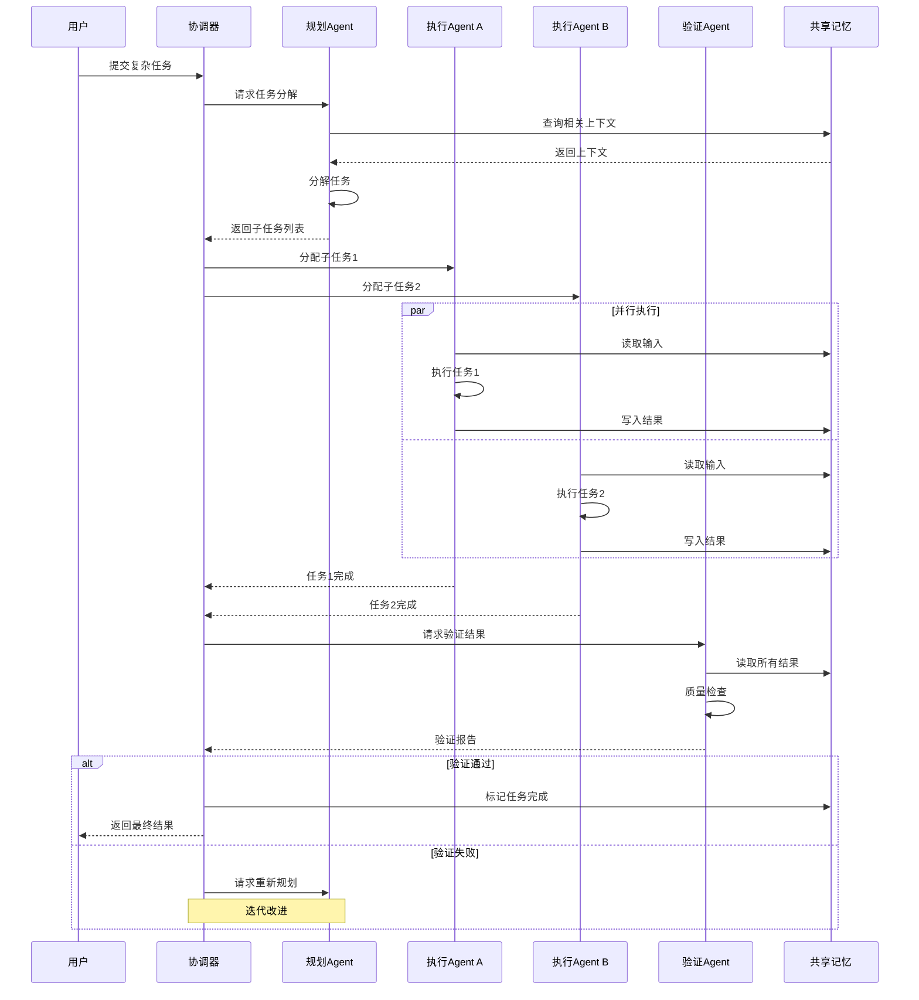
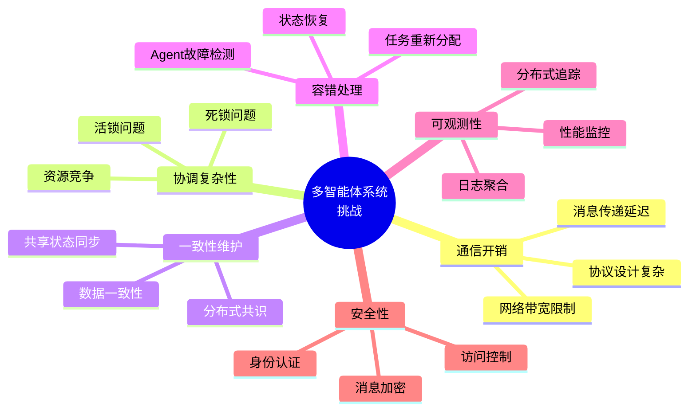

# 01 - 多智能体基础

## 什么是多智能体系统

多智能体系统（Multi-Agent System, MAS）是由多个自主、智能的 Agent 组成的分布式计算系统。这些 Agent 能够感知环境、进行自主决策，并通过相互协作、通信和协调来完成复杂的任务目标。

### 核心定义

> **多智能体系统**：由多个交互的 Agent 组成的系统，这些 Agent 在共享环境中运作，通过协作、竞争或协调来达成个体或集体的目标。

## 单 Agent vs 多 Agent

### 架构对比

### 详细对比

| 维度 | 单 Agent | 多 Agent |
|------|----------|----------|
| **任务处理能力** | 适合简单、线性的任务 | 适合复杂、并行的任务 |
| **专业化程度** | 通用能力，样样通样样松 | 各司其职，深度专业化 |
| **上下文管理** | 受限于单个 LLM 上下文窗口 | 分布式上下文，可扩展 |
| **容错能力** | 单点故障，整体失效 | 分布式容错，任务可重分配 |
| **可扩展性** | 垂直扩展（更大模型） | 水平扩展（更多 Agent） |
| **开发复杂度** | 低，易于理解和调试 | 高，需要设计通信和协调 |
| **协调开销** | 无 | 需要通信和协调机制 |
| **成本效益** | 简单任务成本低 | 复杂任务整体成本可能更低 |
| **适用场景** | 问答、简单工具调用、单轮对话 | 复杂工作流、团队协作、模拟 |

### 选择建议

## 核心概念和术语

### 1. Agent（智能体）

Agent 是多智能体系统的基本组成单元，具备以下特征：

- **自主性（Autonomy）**：能够在没有外部干预的情况下自主运作
- **反应性（Reactivity）**：能够感知环境并做出响应
- **主动性（Pro-activeness）**：能够主动追求目标
- **社会性（Social Ability）**：能够与其他 Agent 交互

### 2. 角色（Role）

在多智能体系统中，每个 Agent 通常被赋予特定的角色：

| 角色类型 | 职责 | 示例 |
|---------|------|------|
| **规划者（Planner）** | 任务分解、制定执行计划 | 项目经理 Agent |
| **执行者（Executor）** | 执行具体任务 | 开发 Agent、写作 Agent |
| **验证者（Verifier）** | 检查结果质量 | 测试 Agent、审查 Agent |
| **协调者（Coordinator）** | 协调多个 Agent 工作 | 团队领导 Agent |
| **专家（Expert）** | 提供专业领域知识 | 法律顾问 Agent、技术专家 Agent |

```mermaid
graph TB
    subgraph "软件开发团队角色示例"
        PM[项目经理<br/>规划者]
        Arch[架构师<br/>设计者]
        Dev1[开发Agent A<br/>执行者]
        Dev2[开发Agent B<br/>执行者]
        QA[测试Agent<br/>验证者]
        Reviewer[代码审查Agent<br/>验证者]
    end
    
    PM --> Arch
    Arch --> Dev1
    Arch --> Dev2
    Dev1 --> Reviewer
    Dev2 --> Reviewer
    Reviewer --> QA
    QA --> PM
    
    style PM fill:#ffe0e0
    style Arch fill:#fff3e0
    style Dev1 fill:#e3f2fd
    style Dev2 fill:#e3f2fd
    style QA fill:#e8f5e9
    style Reviewer fill:#f3e5f5
```

### 3. 环境（Environment）

Agent 运作的上下文，可以是：

- **物理环境**：机器人、传感器等物理世界
- **虚拟环境**：软件系统、模拟器
- **社会环境**：其他 Agent、人类用户

### 4. 通信（Communication）

Agent 之间交换信息的方式：

- **直接通信**：点对点消息传递
- **间接通信**：通过共享内存、黑板系统等
- **广播通信**：向所有 Agent 发送消息

### 5. 协调（Coordination）

管理多个 Agent 行动的过程：

- **协作（Cooperation）**：共同完成目标
- **竞争（Competition）**：争夺有限资源
- **协商（Negotiation）**：达成共识

### 6. 组织（Organization）

Agent 之间的结构关系：

- **层级结构（Hierarchical）**：上下级关系
- **扁平结构（Flat）**：平等关系
- **团队结构（Team）**：临时组合

## 多智能体系统的工作流程

## 多智能体系统的挑战

## 总结

多智能体系统通过将复杂任务分解给多个专业化 Agent，实现了：

1. **更高的任务处理能力**：并行处理、专业化分工
2. **更好的可扩展性**：水平扩展、动态调整
3. **更强的容错能力**：分布式架构、故障隔离
4. **更灵活的架构**：模块化设计、可配置协作

但同时也带来了通信、协调、一致性等方面的挑战，需要仔细设计架构和协议。
