# 02 - Agent 通信机制

在多智能体系统中，Agent 之间的通信是实现协作的基础。有效的通信机制能够确保信息准确传递、任务协调顺畅、系统整体高效运作。

## 通信方式概览

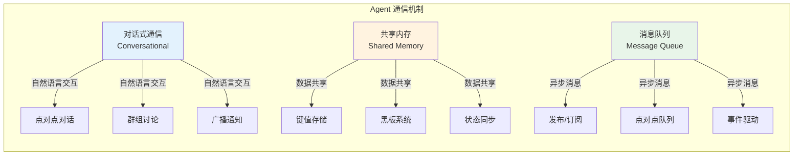

## 对话式通信

对话式通信是最自然的 Agent 交互方式，Agent 使用自然语言进行信息交换和协商。

### 架构模式

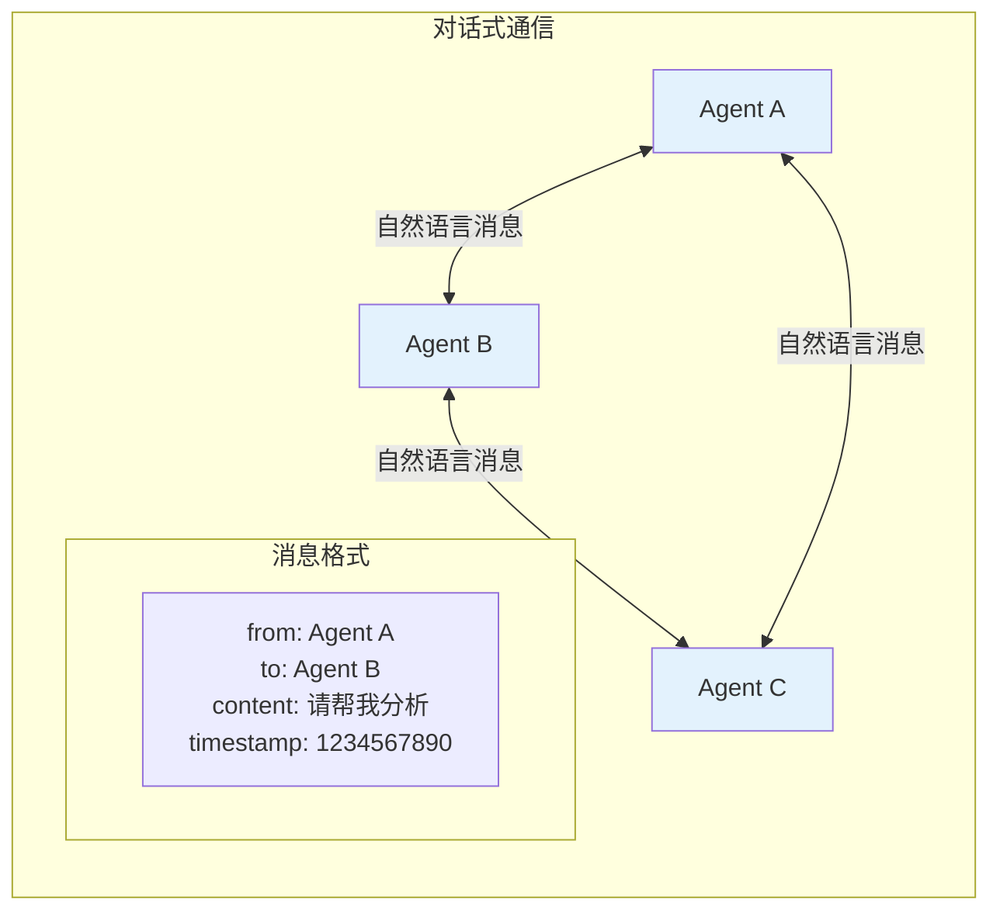

### 通信模式

#### 1. 点对点对话（Point-to-Point）

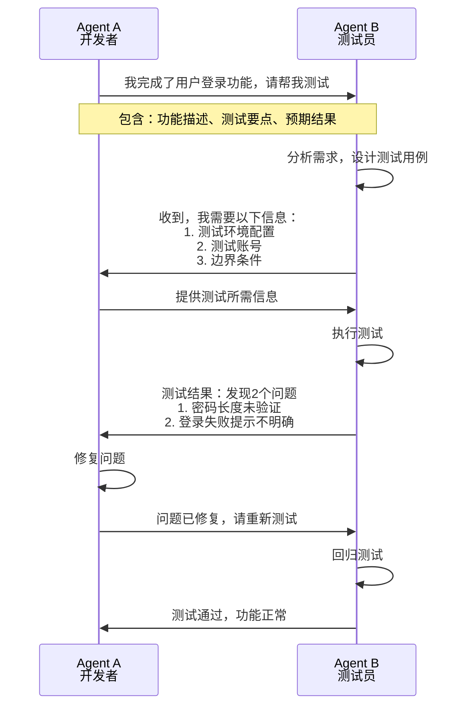

#### 2. 群组讨论（Group Discussion）

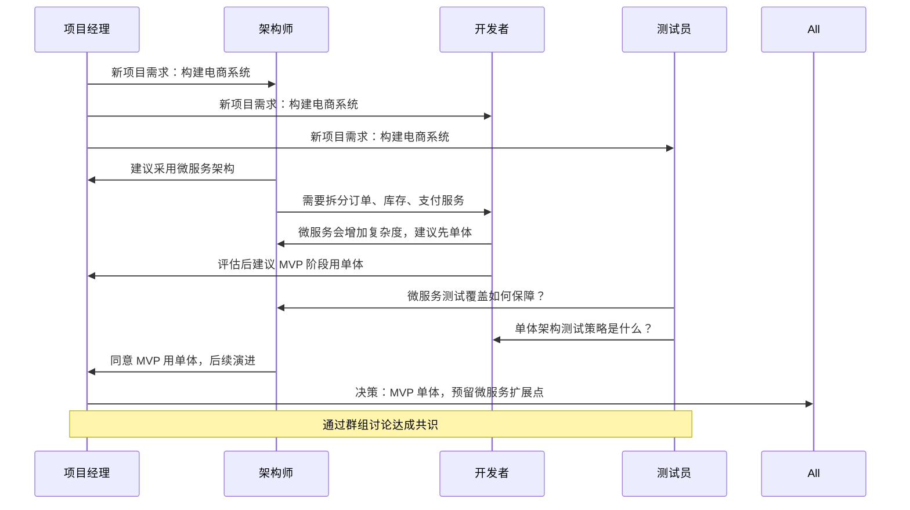

#### 3. 广播通知（Broadcast）

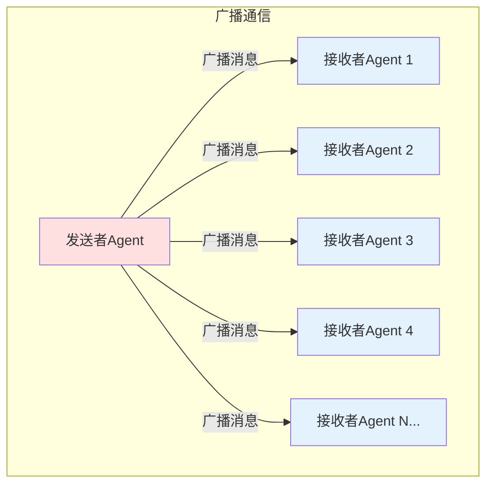

### 消息结构设计

```java
/**
 * Agent 消息基类
 */
public class AgentMessage {
    private String messageId;        // 消息唯一标识
    private String fromAgent;        // 发送者
    private String toAgent;          // 接收者（null表示广播）
    private MessageType type;        // 消息类型
    private String content;          // 消息内容
    private long timestamp;          // 时间戳
    private String conversationId;   // 会话ID
    private Map<String, Object> metadata; // 元数据
    
    // 枚举：消息类型
    public enum MessageType {
        REQUEST,      // 请求
        RESPONSE,     // 响应
        NOTIFICATION, // 通知
        BROADCAST,    // 广播
        HEARTBEAT     // 心跳
    }
    
    // Getters and Setters
}

/**
 * 任务消息
 */
public class TaskMessage extends AgentMessage {
    private String taskId;           // 任务ID
    private TaskStatus status;       // 任务状态
    private String taskDescription;  // 任务描述
    private Object taskResult;       // 任务结果
    private int priority;            // 优先级
    
    public enum TaskStatus {
        PENDING, IN_PROGRESS, COMPLETED, FAILED
    }
}
```

## 共享内存

共享内存是一种高效的 Agent 通信方式，Agent 通过读写共享数据空间来交换信息。

### 架构模式

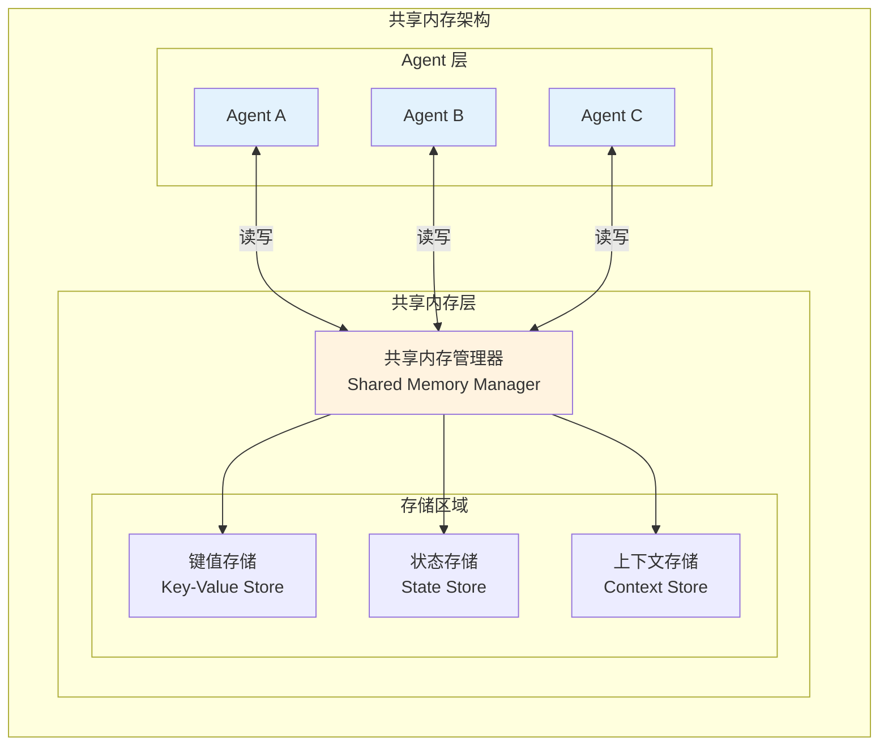

### 黑板系统（Blackboard Pattern）

黑板系统是一种经典的共享内存模式，多个 Agent 共同读写一个共享的"黑板"。

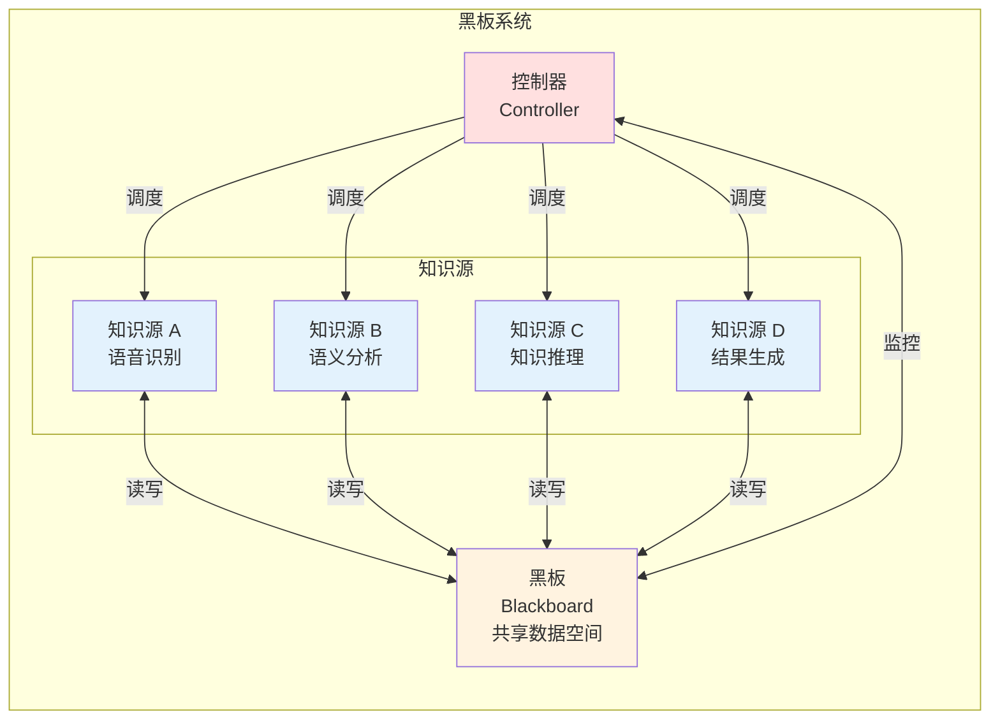

### 共享内存工作流程

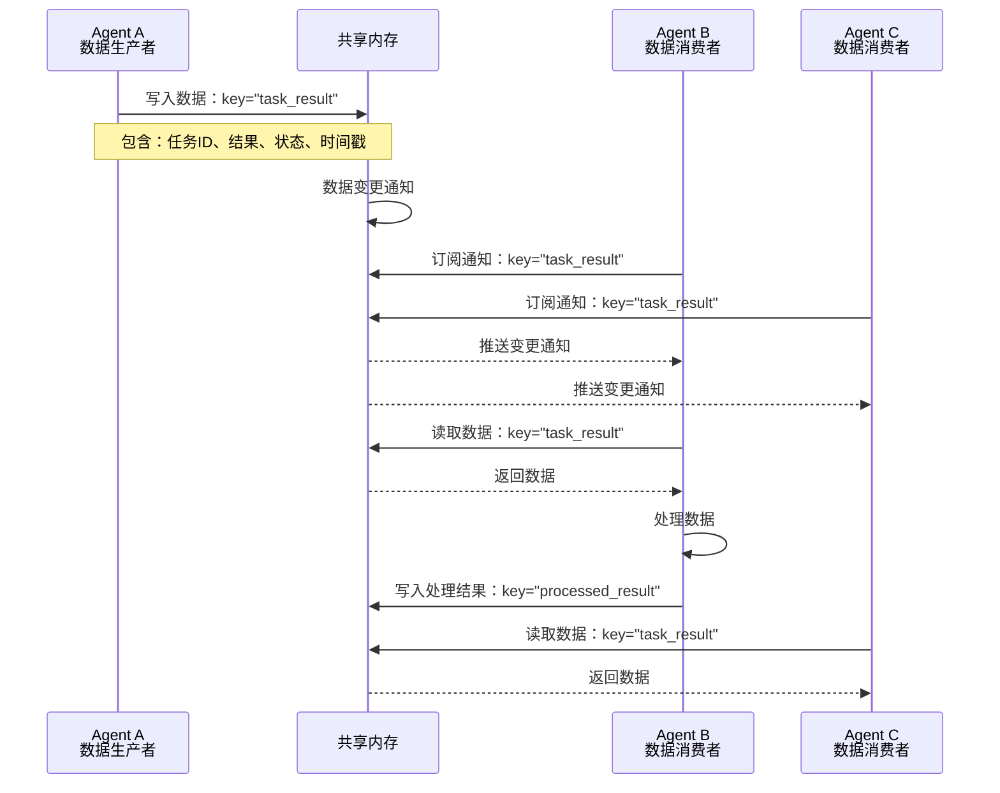

### Java 实现示例

```java
/**
 * 共享内存管理器
 */
@Component
public class SharedMemoryManager {
    
    private final ConcurrentHashMap<String, SharedEntry> memory = new ConcurrentHashMap<>();
    private final List<SharedMemoryListener> listeners = new CopyOnWriteArrayList<>();
    
    /**
     * 写入数据
     */
    public void write(String key, Object value, String agentId) {
        SharedEntry entry = new SharedEntry(value, agentId, System.currentTimeMillis());
        SharedEntry oldValue = memory.put(key, entry);
        
        // 通知监听器
        notifyListeners(key, oldValue != null ? oldValue.getValue() : null, value, agentId);
    }
    
    /**
     * 读取数据
     */
    public <T> T read(String key, Class<T> type) {
        SharedEntry entry = memory.get(key);
        return entry != null ? type.cast(entry.getValue()) : null;
    }
    
    /**
     * 订阅变更
     */
    public void subscribe(String keyPattern, SharedMemoryListener listener) {
        listeners.add(listener);
    }
    
    private void notifyListeners(String key, Object oldValue, Object newValue, String agentId) {
        for (SharedMemoryListener listener : listeners) {
            if (listener.matches(key)) {
                listener.onChange(key, oldValue, newValue, agentId);
            }
        }
    }
}

/**
 * 共享条目
 */
@Data
public class SharedEntry {
    private final Object value;
    private final String writtenBy;
    private final long timestamp;
    private final String version = UUID.randomUUID().toString();
}

/**
 * 共享内存监听器
 */
public interface SharedMemoryListener {
    boolean matches(String key);
    void onChange(String key, Object oldValue, Object newValue, String agentId);
}
```

## 消息队列

消息队列提供异步、可靠的 Agent 通信机制，适用于解耦和削峰场景。

### 架构模式

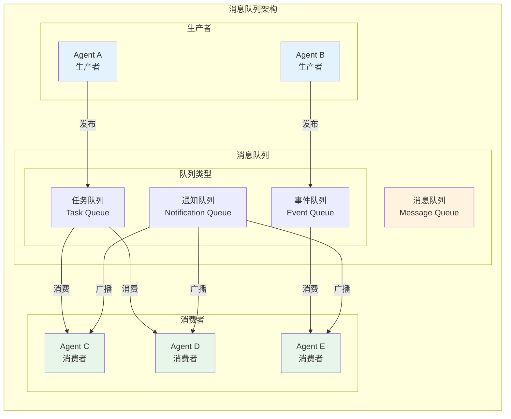

### 发布/订阅模式（Pub/Sub）

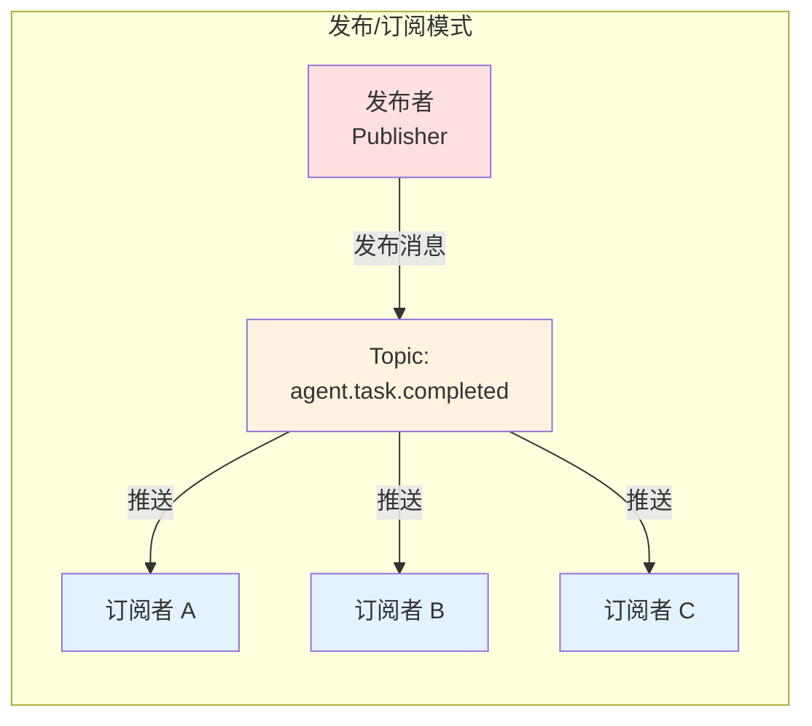

### 消息队列工作流程

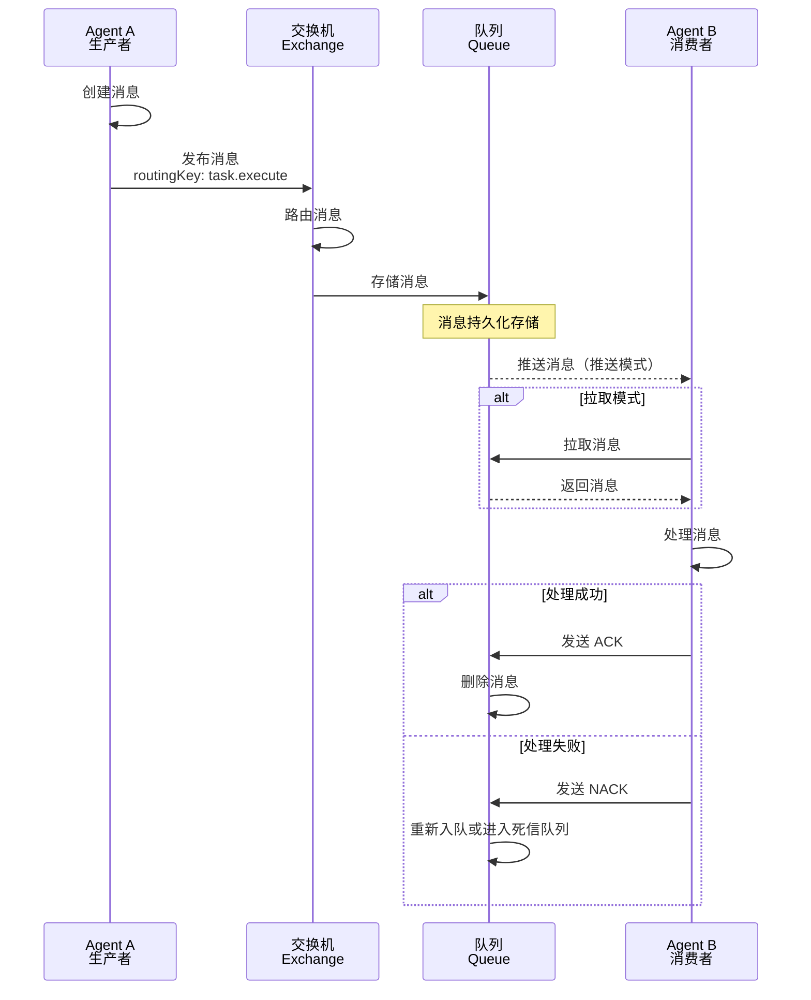

### Java 实现示例（使用 Spring AMQP）

```java
/**
 * 消息队列配置
 */
@Configuration
public class AgentMessageQueueConfig {
    
    public static final String AGENT_EXCHANGE = "agent.exchange";
    public static final String TASK_QUEUE = "agent.task.queue";
    public static final String EVENT_QUEUE = "agent.event.queue";
    public static final String TASK_ROUTING_KEY = "agent.task.*";
    public static final String EVENT_ROUTING_KEY = "agent.event.*";
    
    @Bean
    public TopicExchange agentExchange() {
        return new TopicExchange(AGENT_EXCHANGE);
    }
    
    @Bean
    public Queue taskQueue() {
        return QueueBuilder.durable(TASK_QUEUE)
            .withArgument("x-dead-letter-exchange", "agent.dlx")
            .withArgument("x-dead-letter-routing-key", "agent.task.failed")
            .build();
    }
    
    @Bean
    public Queue eventQueue() {
        return QueueBuilder.durable(EVENT_QUEUE).build();
    }
    
    @Bean
    public Binding taskBinding(Queue taskQueue, TopicExchange agentExchange) {
        return BindingBuilder.bind(taskQueue).to(agentExchange).with(TASK_ROUTING_KEY);
    }
    
    @Bean
    public Binding eventBinding(Queue eventQueue, TopicExchange agentExchange) {
        return BindingBuilder.bind(eventQueue).to(agentExchange).with(EVENT_ROUTING_KEY);
    }
}

/**
 * 消息生产者
 */
@Service
public class AgentMessageProducer {
    
    @Autowired
    private RabbitTemplate rabbitTemplate;
    
    public void sendTask(String agentId, TaskMessage task) {
        String routingKey = "agent.task." + agentId;
        rabbitTemplate.convertAndSend(
            AgentMessageQueueConfig.AGENT_EXCHANGE,
            routingKey,
            task,
            message -> {
                message.getMessageProperties().setMessageId(UUID.randomUUID().toString());
                message.getMessageProperties().setTimestamp(new Date());
                return message;
            }
        );
    }
    
    public void broadcastEvent(EventMessage event) {
        rabbitTemplate.convertAndSend(
            AgentMessageQueueConfig.AGENT_EXCHANGE,
            "agent.event.broadcast",
            event
        );
    }
}

/**
 * 消息消费者
 */
@Service
public class AgentMessageConsumer {
    
    private static final Logger logger = LoggerFactory.getLogger(AgentMessageConsumer.class);
    
    @Autowired
    private TaskExecutor taskExecutor;
    
    @RabbitListener(queues = AgentMessageQueueConfig.TASK_QUEUE)
    public void handleTask(TaskMessage task, Channel channel, 
                          @Header(AmqpHeaders.DELIVERY_TAG) long tag) throws IOException {
        try {
            logger.info("收到任务: {} from {}", task.getTaskId(), task.getFromAgent());
            
            // 执行任务
            taskExecutor.execute(task);
            
            // 确认消息
            channel.basicAck(tag, false);
            
        } catch (Exception e) {
            logger.error("任务处理失败: {}", task.getTaskId(), e);
            // 拒绝消息，重新入队
            channel.basicNack(tag, false, true);
        }
    }
    
    @RabbitListener(queues = AgentMessageQueueConfig.EVENT_QUEUE)
    public void handleEvent(EventMessage event) {
        logger.info("收到事件: {} - {}", event.getEventType(), event.getContent());
        // 处理事件
    }
}
```

## 通信机制对比

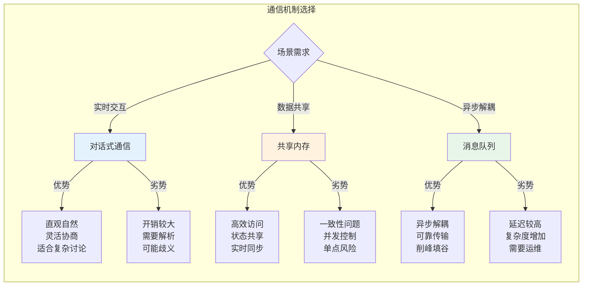

| 特性 | 对话式通信 | 共享内存 | 消息队列 |
|------|-----------|----------|----------|
| **实时性** | 高 | 极高 | 中 |
| **吞吐量** | 中 | 高 | 高 |
| **可靠性** | 中 | 低（需额外保障） | 高 |
| **复杂度** | 低 | 中 | 高 |
| **适用场景** | 协商讨论、决策 | 状态同步、数据共享 | 任务分发、事件通知 |
| **持久化** | 可选 | 可选 | 内置支持 |
| **扩展性** | 中 | 中 | 高 |

## 混合通信模式

在实际系统中，通常会组合使用多种通信机制：

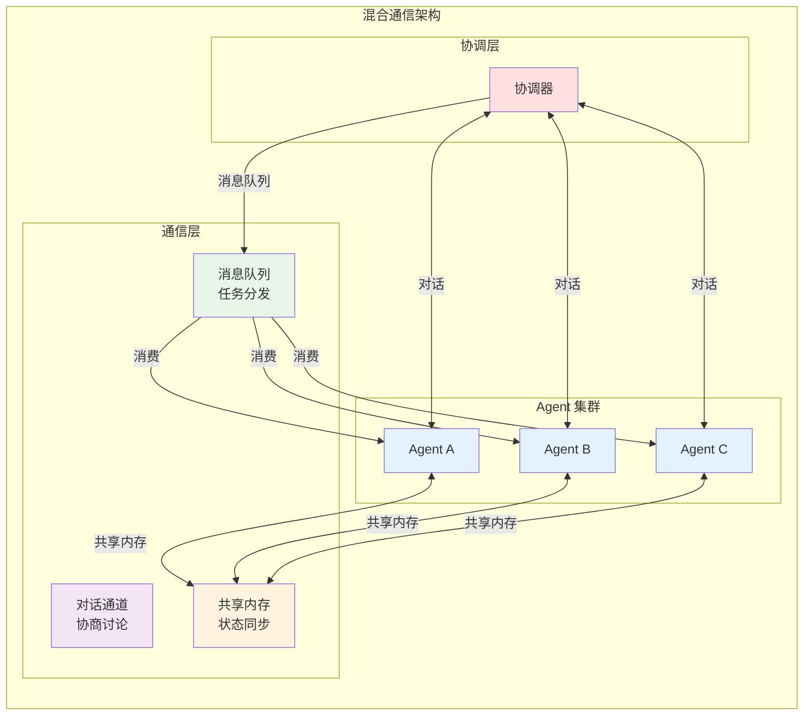

## 最佳实践

1. **选择合适的通信机制**：根据场景需求选择对话、共享内存或消息队列
2. **设计清晰的消息格式**：统一的消息结构便于解析和处理
3. **实现消息确认机制**：确保重要消息的可靠传递
4. **处理消息顺序**：考虑消息的顺序性和因果关系
5. **监控和日志**：记录通信日志便于调试和审计
6. **错误处理**：实现重试、死信队列等容错机制
