# 03 - 协作模式

多智能体系统的核心在于 Agent 之间的协作。不同的协作模式适用于不同的场景，选择合适的协作模式对于系统效率和任务完成质量至关重要。

## 协作模式概览

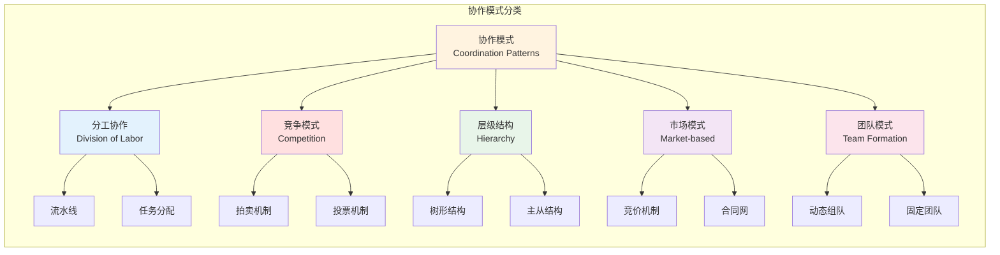

## 分工协作

分工协作是最常见的多智能体协作模式，每个 Agent 负责特定的子任务，通过协作完成整体目标。

### 流水线模式（Pipeline）

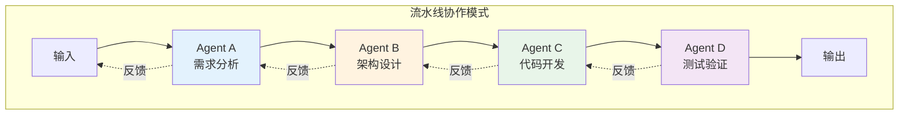

**工作流程：**

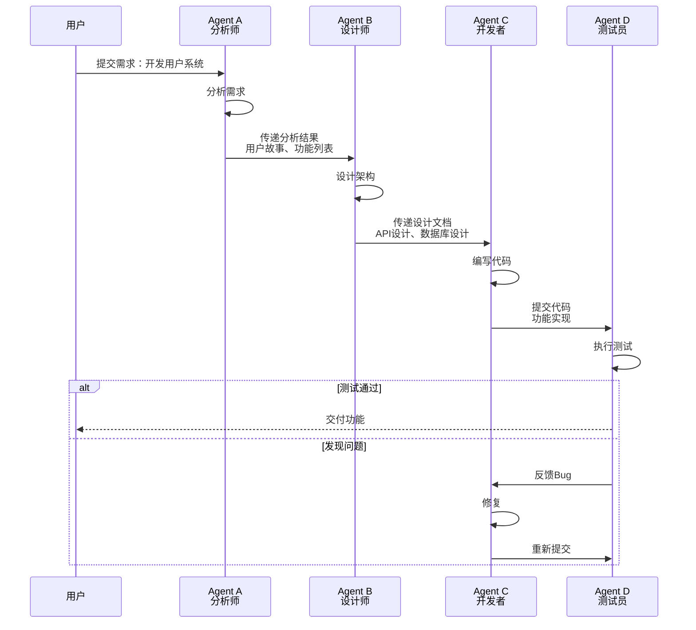

### 任务分配模式（Task Assignment）

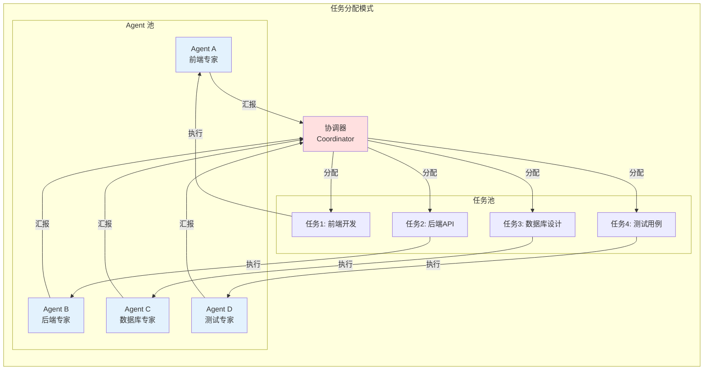

### Java 实现示例

```java
/**
 * 任务分配器
 */
@Service
public class TaskDistributor {
    
    @Autowired
    private AgentRegistry agentRegistry;
    
    /**
     * 分配任务给最适合的 Agent
     */
    public Agent assignTask(Task task) {
        List<Agent> availableAgents = agentRegistry.getAvailableAgents();
        
        // 基于能力匹配选择 Agent
        Agent bestAgent = availableAgents.stream()
            .filter(agent -> agent.hasCapability(task.getRequiredCapabilities()))
            .max(Comparator.comparingInt(agent -> 
                calculateMatchScore(agent, task)))
            .orElseThrow(() -> new NoSuitableAgentException("没有合适的Agent"));
        
        // 分配任务
        bestAgent.assignTask(task);
        return bestAgent;
    }
    
    /**
     * 流水线模式执行
     */
    public void executePipeline(Task task, List<String> agentRoles) {
        Task currentTask = task;
        
        for (String role : agentRoles) {
            Agent agent = agentRegistry.findByRole(role);
            TaskResult result = agent.execute(currentTask);
            
            if (!result.isSuccess()) {
                throw new PipelineException("流水线执行失败: " + role);
            }
            
            currentTask = createNextTask(result);
        }
    }
    
    private int calculateMatchScore(Agent agent, Task task) {
        int score = 0;
        // 能力匹配度
        score += agent.getCapabilities().stream()
            .filter(task.getRequiredCapabilities()::contains)
            .count() * 10;
        // 当前负载
        score -= agent.getCurrentLoad() * 5;
        // 历史成功率
        score += agent.getSuccessRate() * 20;
        return score;
    }
}

/**
 * Agent 注册表
 */
@Component
public class AgentRegistry {
    
    private final Map<String, Agent> agents = new ConcurrentHashMap<>();
    
    public void register(Agent agent) {
        agents.put(agent.getId(), agent);
    }
    
    public List<Agent> getAvailableAgents() {
        return agents.values().stream()
            .filter(Agent::isAvailable)
            .collect(Collectors.toList());
    }
    
    public Agent findByRole(String role) {
        return agents.values().stream()
            .filter(agent -> agent.getRole().equals(role))
            .findFirst()
            .orElseThrow(() -> new AgentNotFoundException(role));
    }
}
```

## 竞争模式

竞争模式适用于资源有限或需要最优解的场景，Agent 通过竞争获得任务执行权。

### 拍卖机制（Auction）

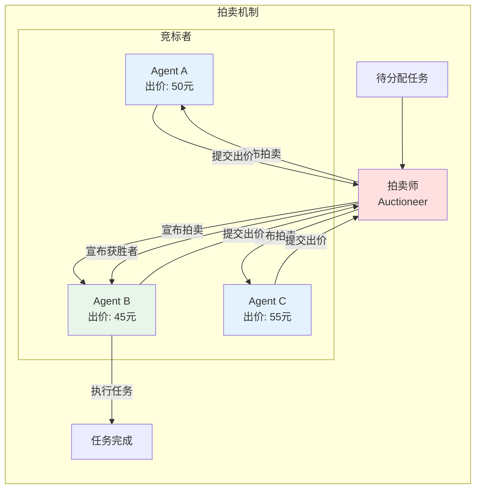

**拍卖流程：**

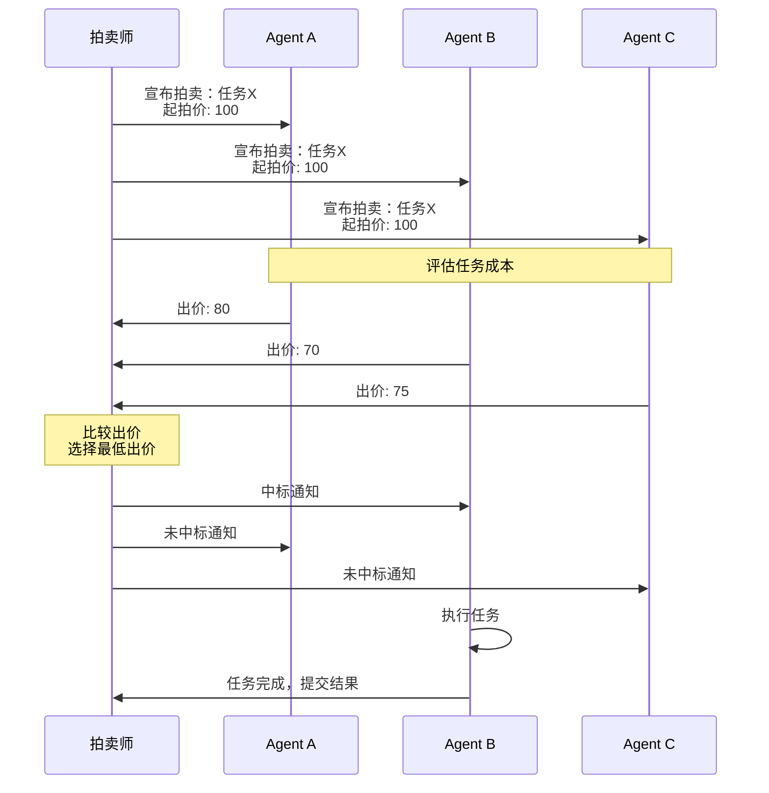

### 投票机制（Voting）

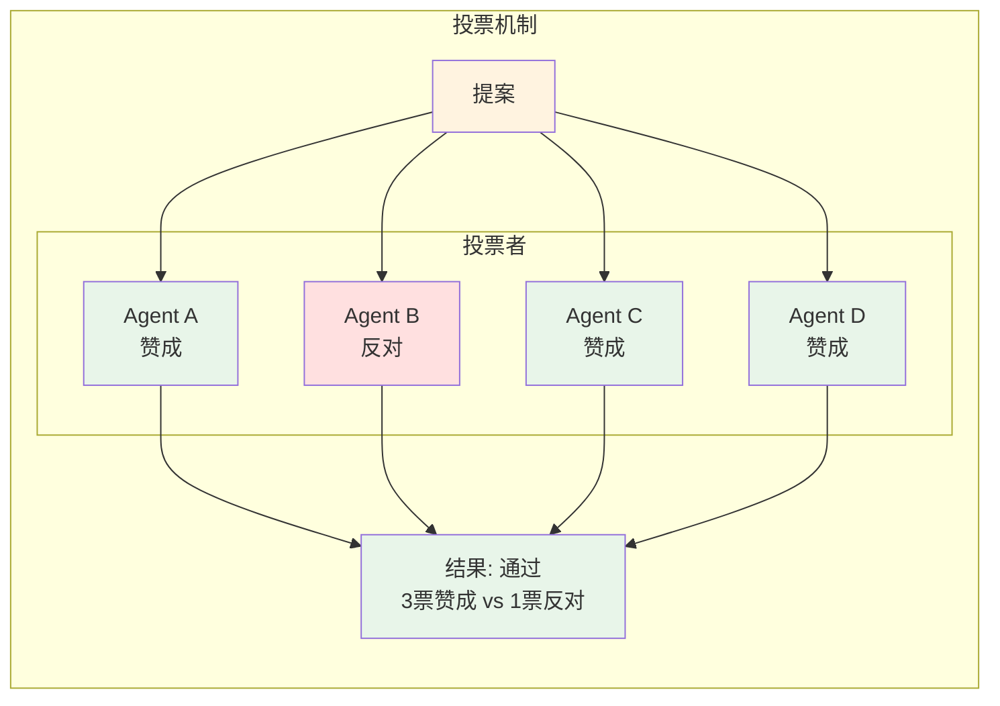

### Java 实现示例

```java
/**
 * 拍卖管理器
 */
@Service
public class AuctionManager {
    
    /**
     * 执行拍卖
     */
    public AuctionResult conductAuction(Task task, List<Agent> bidders) {
        // 创建拍卖
        Auction auction = new Auction(task);
        
        // 收集出价
        List<Bid> bids = new ArrayList<>();
        for (Agent bidder : bidders) {
            Bid bid = bidder.submitBid(task);
            if (bid != null) {
                bids.add(bid);
            }
        }
        
        // 选择获胜者（最低出价）
        Bid winningBid = bids.stream()
            .min(Comparator.comparingDouble(Bid::getAmount))
            .orElseThrow(() -> new NoBidException("没有出价"));
        
        // 通知结果
        notifyWinner(winningBid.getAgent(), task);
        notifyLosers(bids.stream()
            .filter(b -> !b.equals(winningBid))
            .map(Bid::getAgent)
            .collect(Collectors.toList()), task);
        
        return new AuctionResult(winningBid.getAgent(), winningBid.getAmount());
    }
}

/**
 * 投票管理器
 */
@Service
public class VotingManager {
    
    public VotingResult conductVote(Proposal proposal, List<Agent> voters, VotingStrategy strategy) {
        Map<Agent, Vote> votes = new HashMap<>();
        
        // 收集投票
        for (Agent voter : voters) {
            Vote vote = voter.vote(proposal);
            votes.put(voter, vote);
        }
        
        // 计算结果
        long approveCount = votes.values().stream()
            .filter(v -> v == Vote.APPROVE)
            .count();
        long rejectCount = votes.values().stream()
            .filter(v -> v == Vote.REJECT)
            .count();
        
        boolean passed = strategy.evaluate(approveCount, rejectCount, voters.size());
        
        return new VotingResult(passed, approveCount, rejectCount, votes);
    }
}

/**
 * 投票策略
 */
public interface VotingStrategy {
    boolean evaluate(long approveCount, long rejectCount, long totalVoters);
}

/**
 * 简单多数策略
 */
public class SimpleMajorityStrategy implements VotingStrategy {
    @Override
    public boolean evaluate(long approveCount, long rejectCount, long totalVoters) {
        return approveCount > rejectCount;
    }
}

/**
 * 绝对多数策略
 */
public class AbsoluteMajorityStrategy implements VotingStrategy {
    @Override
    public boolean evaluate(long approveCount, long rejectCount, long totalVoters) {
        return approveCount > totalVoters / 2;
    }
}
```

## 层级结构

层级结构通过明确的上下级关系组织 Agent，适合需要统一指挥的场景。

### 树形结构（Tree Structure）

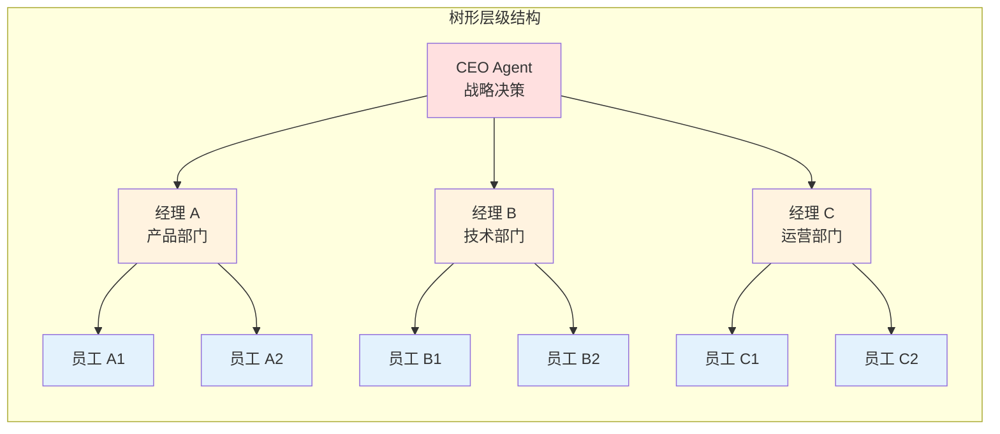

### 主从结构（Master-Slave）

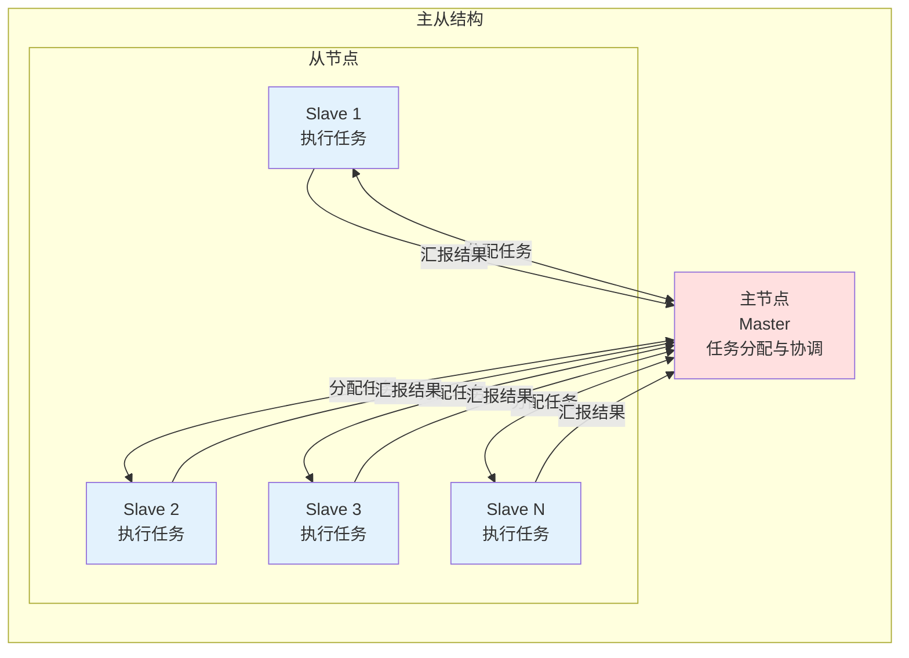

### Java 实现示例

```java
/**
 * 层级节点
 */
public abstract class HierarchicalAgent implements Agent {
    
    private String id;
    private String role;
    private HierarchicalAgent parent;
    private List<HierarchicalAgent> children = new ArrayList<>();
    
    public void setParent(HierarchicalAgent parent) {
        this.parent = parent;
        if (parent != null) {
            parent.addChild(this);
        }
    }
    
    public void addChild(HierarchicalAgent child) {
        children.add(child);
    }
    
    /**
     * 向下委派任务
     */
    public void delegateDown(Task task, String targetRole) {
        HierarchicalAgent target = findChildByRole(targetRole);
        if (target != null) {
            target.receiveTask(task);
        }
    }
    
    /**
     * 向上汇报
     */
    public void reportUp(TaskResult result) {
        if (parent != null) {
            parent.receiveReport(this, result);
        }
    }
    
    /**
     * 广播给所有子节点
     */
    public void broadcastToChildren(Message message) {
        for (HierarchicalAgent child : children) {
            child.receiveMessage(message);
        }
    }
    
    private HierarchicalAgent findChildByRole(String role) {
        return children.stream()
            .filter(c -> c.getRole().equals(role))
            .findFirst()
            .orElse(null);
    }
}

/**
 * 主节点
 */
@Service
public class MasterAgent extends HierarchicalAgent {
    
    private final ExecutorService executor = Executors.newFixedThreadPool(10);
    
    /**
     * 分配任务给从节点
     */
    public void distributeTask(Task task) {
        // 选择负载最低的从节点
        SlaveAgent slave = findLeastLoadedSlave();
        
        CompletableFuture.supplyAsync(() -> {
            slave.execute(task);
            return slave.getResult();
        }, executor).thenAccept(result -> {
            collectResult(task.getId(), result);
        });
    }
    
    /**
     * 收集结果
     */
    private void collectResult(String taskId, TaskResult result) {
        // 聚合结果
        // 触发下一步操作
    }
    
    private SlaveAgent findLeastLoadedSlave() {
        return getChildren().stream()
            .filter(a -> a instanceof SlaveAgent)
            .map(a -> (SlaveAgent) a)
            .min(Comparator.comparingInt(SlaveAgent::getLoad))
            .orElseThrow();
    }
}

/**
 * 从节点
 */
@Service
public class SlaveAgent extends HierarchicalAgent {
    
    private int load = 0;
    private TaskResult lastResult;
    
    @Override
    public TaskResult execute(Task task) {
        load++;
        try {
            // 执行任务
            TaskResult result = doExecute(task);
            lastResult = result;
            return result;
        } finally {
            load--;
        }
    }
    
    private TaskResult doExecute(Task task) {
        // 具体执行逻辑
        return new TaskResult(true, "执行完成");
    }
    
    public int getLoad() {
        return load;
    }
    
    public TaskResult getResult() {
        return lastResult;
    }
}
```

## 市场模式

市场模式模拟经济系统中的交易行为，Agent 通过合同和竞价进行协作。

### 合同网协议（Contract Net Protocol）

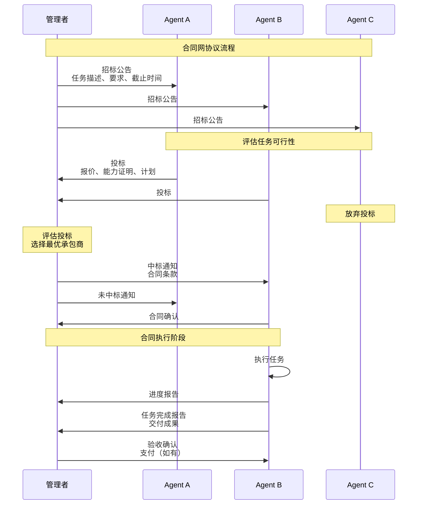

### Java 实现示例

```java
/**
 * 合同网协议实现
 */
@Service
public class ContractNetProtocol {
    
    /**
     * 管理者发起招标
     */
    public void announceTask(TaskAnnouncement announcement, List<Agent> contractors) {
        for (Agent contractor : contractors) {
            contractor.receiveAnnouncement(announcement);
        }
    }
    
    /**
     * 收集投标并选择承包商
     */
    public Contract awardContract(TaskAnnouncement announcement, List<Bid> bids) {
        // 评估投标
        Bid winningBid = evaluateBids(bids);
        
        // 创建合同
        Contract contract = new Contract(
            announcement.getTaskId(),
            winningBid.getAgent(),
            winningBid.getProposal(),
            winningBid.getPrice()
        );
        
        // 通知中标者
        winningBid.getAgent().receiveAward(contract);
        
        // 通知未中标者
        bids.stream()
            .filter(b -> !b.equals(winningBid))
            .forEach(b -> b.getAgent().receiveReject(announcement.getTaskId()));
        
        return contract;
    }
    
    private Bid evaluateBids(List<Bid> bids) {
        return bids.stream()
            .max(Comparator.comparingDouble(this::calculateBidScore))
            .orElseThrow();
    }
    
    private double calculateBidScore(Bid bid) {
        // 综合考虑价格、能力、历史表现
        double priceScore = 1.0 / bid.getPrice();
        double capabilityScore = bid.getAgent().getCapabilityScore();
        double reputationScore = bid.getAgent().getReputation();
        
        return priceScore * 0.4 + capabilityScore * 0.4 + reputationScore * 0.2;
    }
}

/**
 * 任务公告
 */
@Data
public class TaskAnnouncement {
    private String taskId;
    private String description;
    private List<String> requiredCapabilities;
    private LocalDateTime deadline;
    private double maxBudget;
}

/**
 * 投标
 */
@Data
public class Bid {
    private Agent agent;
    private String taskId;
    private double price;
    private String proposal;
    private LocalDateTime estimatedCompletion;
}

/**
 * 合同
 */
@Data
public class Contract {
    private String contractId;
    private String taskId;
    private Agent contractor;
    private String terms;
    private double price;
    private ContractStatus status;
    
    public enum ContractStatus {
        PENDING, ACTIVE, COMPLETED, CANCELLED
    }
}
```

## 协作模式对比

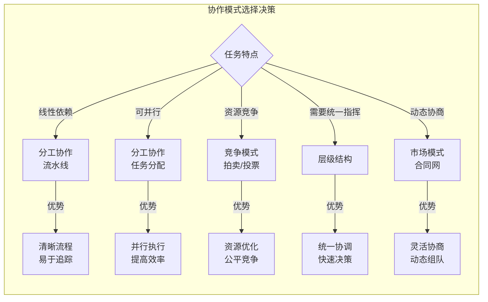

| 协作模式 | 适用场景 | 优势 | 劣势 |
|---------|---------|------|------|
| **流水线** | 任务有明确步骤依赖 | 流程清晰、责任明确 | 存在等待时间、单点瓶颈 |
| **任务分配** | 任务可并行、Agent 专业化 | 并行执行、效率高 | 需要协调、可能有负载不均 |
| **拍卖** | 资源竞争、成本敏感 | 资源优化、公平 | 拍卖开销、可能非理性竞价 |
| **投票** | 需要集体决策 | 民主、容错 | 决策慢、可能僵局 |
| **层级** | 需要统一指挥 | 决策快、责任明确 | 单点故障、信息传递失真 |
| **市场** | 动态环境、灵活协商 | 灵活、自适应 | 复杂度高、协商开销 |

## 混合协作模式

实际系统中通常会组合使用多种协作模式：

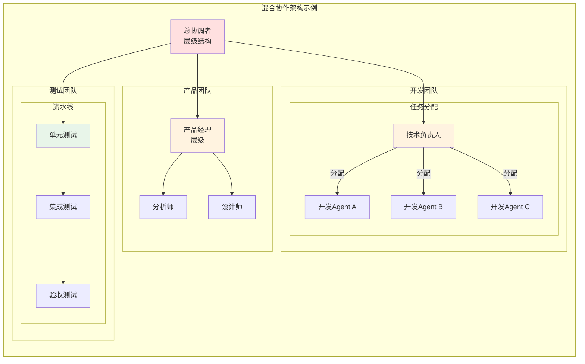

## 最佳实践

1. **根据任务特点选择模式**：线性任务用流水线，可并行任务用任务分配
2. **考虑 Agent 能力**：专业化 Agent 适合分工，通用 Agent 适合竞争
3. **平衡效率与公平**：竞争模式公平但开销大，分工模式高效但可能不均
4. **设计容错机制**：单点故障时能够重新分配任务
5. **监控与调整**：实时监控协作效率，动态调整策略
