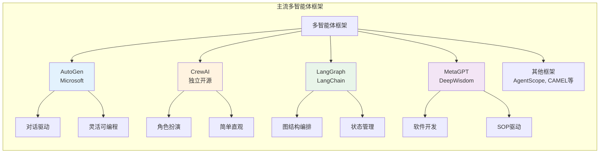
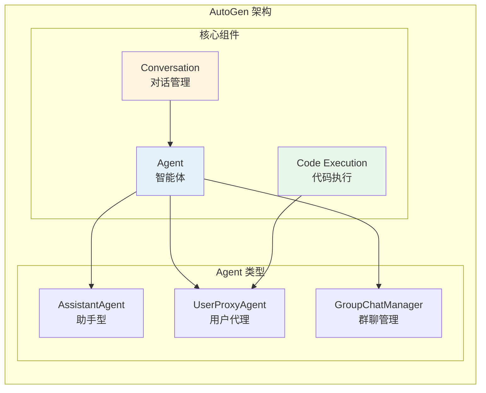
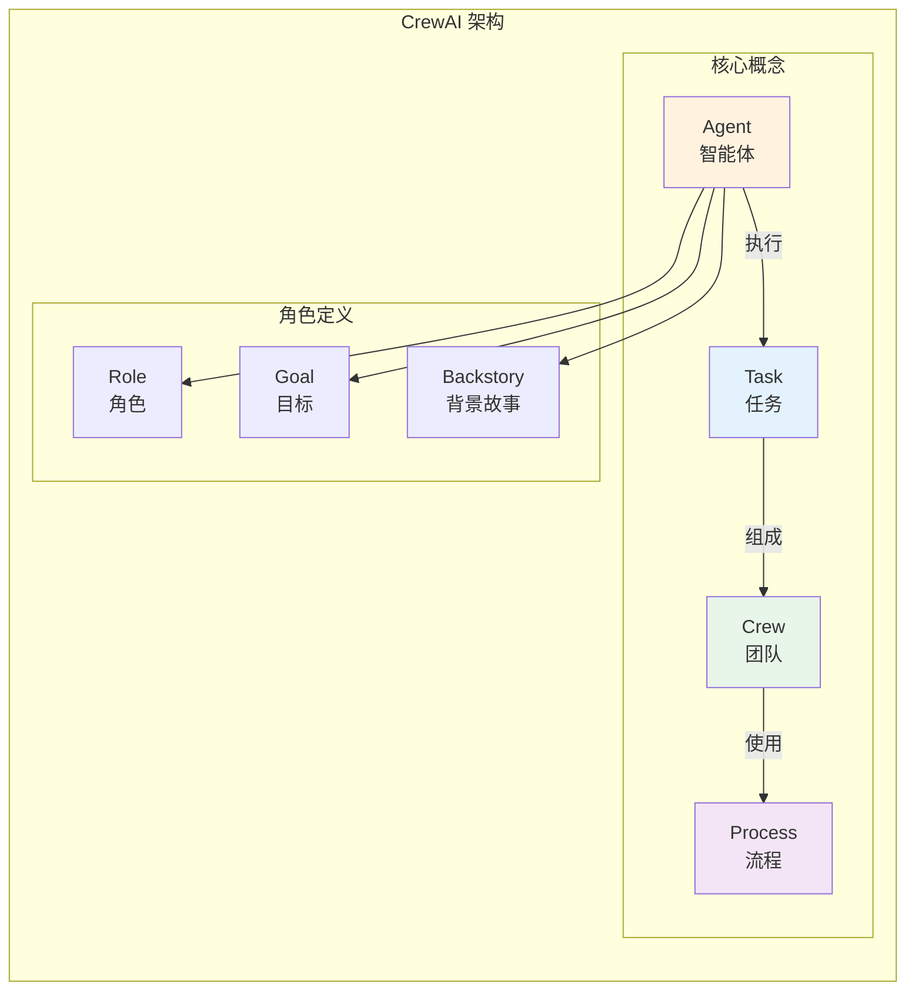
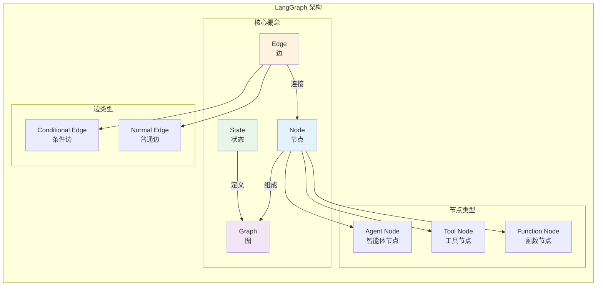
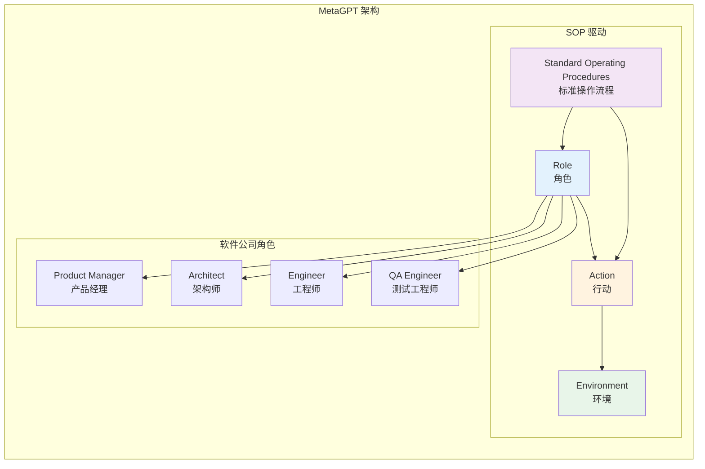
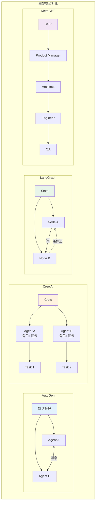
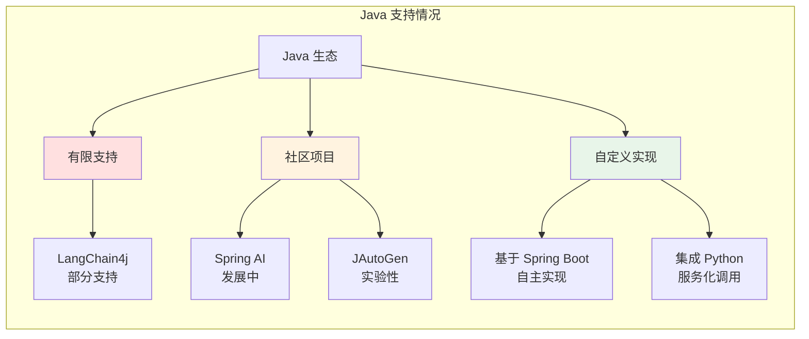
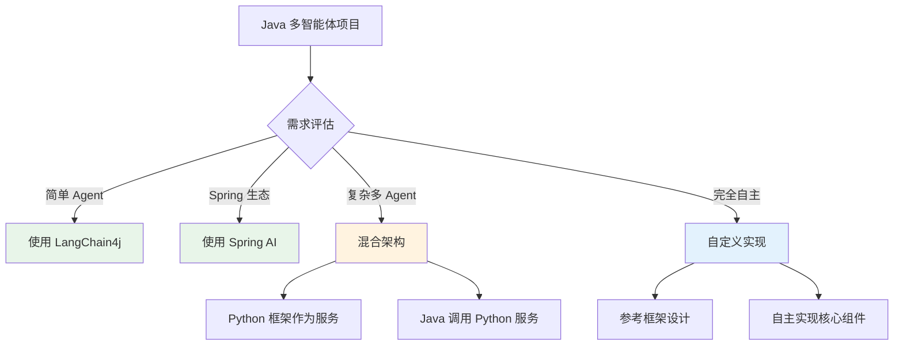
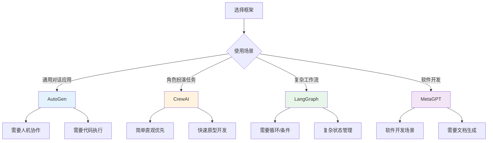

# 04 - 主流框架对比

多智能体系统的发展催生了众多优秀的开源框架。本章对比分析当前主流的多智能体框架，帮助开发者选择合适的工具。

## 主流框架概览



## AutoGen

AutoGen 是微软研究院开发的开源多智能体对话框架，支持构建基于 LLM 的应用程序。

### 架构特点



### 核心特性

| 特性 | 说明 |
|------|------|
| **对话驱动** | Agent 通过自然语言对话进行协作 |
| **可定制 Agent** | 支持自定义 Agent 行为和角色 |
| **人机协作** | 支持人类参与 Agent 对话 |
| **代码执行** | 内置代码执行环境，支持工具调用 |
| **灵活编排** | 支持顺序、群聊、嵌套等多种对话模式 |

### 代码示例

```python
# AutoGen 示例（Python）
import autogen

# 配置 LLM
config_list = [
    {
        "model": "gpt-4",
        "api_key": "your-api-key"
    }
]

# 创建助手 Agent
assistant = autogen.AssistantAgent(
    name="assistant",
    llm_config={"config_list": config_list},
    system_message="你是一个 helpful AI 助手。"
)

# 创建用户代理 Agent
user_proxy = autogen.UserProxyAgent(
    name="user_proxy",
    human_input_mode="NEVER",
    max_consecutive_auto_reply=10,
    code_execution_config={"work_dir": "coding"}
)

# 启动对话
user_proxy.initiate_chat(
    assistant,
    message="写一个 Python 程序计算斐波那契数列"
)
```

## CrewAI

CrewAI 是一个用于编排角色扮演多智能体系统的框架，强调简单直观的 API 设计。

### 架构特点



### 核心特性

| 特性 | 说明 |
|------|------|
| **角色扮演** | 强调 Agent 角色、目标和背景故事的定义 |
| **任务驱动** | 以任务为核心组织工作流程 |
| **简单直观** | API 设计简洁，易于上手 |
| **工具集成** | 支持 LangChain 工具集成 |
| **流程控制** | 支持顺序和层级两种流程模式 |

### 代码示例

```python
# CrewAI 示例（Python）
from crewai import Agent, Task, Crew
from langchain.tools import DuckDuckGoSearchRun

# 定义工具
search_tool = DuckDuckGoSearchRun()

# 创建研究员 Agent
researcher = Agent(
    role='研究员',
    goal='深入研究给定主题',
    backstory='你是一位经验丰富的研究员，擅长信息收集和分析',
    tools=[search_tool],
    verbose=True
)

# 创建作家 Agent
writer = Agent(
    role='作家',
    goal='基于研究结果撰写文章',
    backstory='你是一位专业作家，擅长将复杂信息转化为易懂内容',
    verbose=True
)

# 定义任务
research_task = Task(
    description='研究人工智能在医疗领域的应用',
    agent=researcher
)

writing_task = Task(
    description='基于研究结果撰写一篇博客文章',
    agent=writer
)

# 创建团队
crew = Crew(
    agents=[researcher, writer],
    tasks=[research_task, writing_task],
    process='sequential'  # 顺序执行
)

# 执行任务
result = crew.kickoff()
```

## LangGraph

LangGraph 是 LangChain 生态系统中的图结构编排框架，用于构建复杂的多智能体工作流。

### 架构特点



### 核心特性

| 特性 | 说明 |
|------|------|
| **图结构** | 使用有向图建模工作流 |
| **状态管理** | 显式状态管理，支持复杂状态流转 |
| **循环支持** | 天然支持循环和条件分支 |
| **可视化** | 支持工作流可视化 |
| **LangChain 集成** | 与 LangChain 生态系统深度集成 |

### 代码示例

```python
# LangGraph 示例（Python）
from langgraph.graph import StateGraph, END
from typing import TypedDict, Annotated
import operator

# 定义状态
class AgentState(TypedDict):
    messages: Annotated[list, operator.add]
    next_step: str

# 定义节点函数
def agent_node(state):
    # Agent 处理逻辑
    return {"messages": ["Agent 处理结果"], "next_step": "tool"}

def tool_node(state):
    # 工具执行逻辑
    return {"messages": ["工具执行结果"], "next_step": "agent"}

# 条件函数
def should_continue(state):
    if len(state["messages"]) > 5:
        return END
    return state["next_step"]

# 构建图
workflow = StateGraph(AgentState)

# 添加节点
workflow.add_node("agent", agent_node)
workflow.add_node("tool", tool_node)

# 添加边
workflow.set_entry_point("agent")
workflow.add_conditional_edges(
    "agent",
    should_continue,
    {
        "tool": "tool",
        END: END
    }
)
workflow.add_edge("tool", "agent")

# 编译图
app = workflow.compile()

# 执行
result = app.invoke({"messages": []})
```

## MetaGPT

MetaGPT 是一个多智能体协作框架，专注于模拟软件开发团队的工作流程。

### 架构特点



### 核心特性

| 特性 | 说明 |
|------|------|
| **SOP 驱动** | 基于标准操作流程组织 Agent 行为 |
| **软件公司模拟** | 模拟真实软件开发团队角色 |
| **文档生成** | 自动生成 PRD、设计文档、代码等 |
| **角色专业化** | 每个角色有明确的职责和技能 |
| **可扩展** | 支持自定义角色和 SOP |

### 代码示例

```python
# MetaGPT 示例（Python）
import asyncio
from metagpt.roles import ProductManager, Architect, Engineer
from metagpt.team import Team

async def main()):
    # 创建团队
    team = Team()
    
    # 添加角色
    team.hire([
        ProductManager(),
        Architect(),
        Engineer(n_borg=3),  # 3个工程师
    ])
    
    # 投资（设置项目）
    team.invest(investment=3.0)  # 预算限制
    
    # 启动项目
    await team.run(idea="开发一个待办事项管理应用")

if __name__ == "__main__":
    asyncio.run(main())
```

## 框架对比

### 功能对比表

| 特性 | AutoGen | CrewAI | LangGraph | MetaGPT |
|------|---------|--------|-----------|---------|
| **开发方** | Microsoft | 开源社区 | LangChain | DeepWisdom |
| **主要语言** | Python | Python | Python | Python |
| **核心范式** | 对话驱动 | 角色扮演 | 图编排 | SOP 驱动 |
| **学习曲线** | 中等 | 低 | 中等 | 中等 |
| **灵活性** | 高 | 中 | 高 | 中 |
| **可视化** | 有限 | 无 | 支持 | 有限 |
| **人机协作** | 强 | 弱 | 中 | 弱 |
| **适用场景** | 通用对话 | 角色任务 | 复杂工作流 | 软件开发 |

### 架构对比



### 性能与扩展性

| 维度 | AutoGen | CrewAI | LangGraph | MetaGPT |
|------|---------|--------|-----------|---------|
| **执行效率** | 中 | 高 | 高 | 中 |
| **内存占用** | 中 | 低 | 中 | 高 |
| **扩展性** | 高 | 中 | 高 | 中 |
| **调试难度** | 中 | 低 | 中 | 高 |
| **社区活跃度** | 高 | 高 | 高 | 中 |

## Java 支持情况

### 当前状态

目前主流的多智能体框架主要以 Python 为主，Java 支持情况如下：



### LangChain4j

LangChain4j 是 LangChain 的 Java 实现，提供了基础的 Agent 支持：

```java
// LangChain4j 示例
import dev.langchain4j.agent.tool.Tool;
import dev.langchain4j.memory.chat.MessageWindowChatMemory;
import dev.langchain4j.model.openai.OpenAiChatModel;
import dev.langchain4j.service.AiServices;

public class AgentExample {
    
    interface Assistant {
        String chat(String userMessage);
    }
    
    static class Tools {
        @Tool("获取天气信息")
        String getWeather(String city) {
            return city + "天气晴朗，25°C";
        }
    }
    
    public static void main(String[] args) {
        Assistant assistant = AiServices.builder(Assistant.class)
            .chatLanguageModel(OpenAiChatModel.withApiKey("api-key"))
            .tools(new Tools())
            .chatMemory(MessageWindowChatMemory.withMaxMessages(10))
            .build();
        
        String response = assistant.chat("北京今天天气怎么样？");
        System.out.println(response);
    }
}
```

### Spring AI

Spring AI 是 Spring 生态系统的 AI 框架，正在快速发展中：

```java
// Spring AI 示例
import org.springframework.ai.chat.ChatClient;
import org.springframework.ai.chat.prompt.Prompt;
import org.springframework.stereotype.Service;

@Service
public class AgentService {
    
    private final ChatClient chatClient;
    
    public AgentService(ChatClient chatClient) {
        this.chatClient = chatClient;
    }
    
    public String executeTask(String task) {
        return chatClient.call(new Prompt(task))
            .getResult()
            .getOutput()
            .getContent();
    }
}
```

### Java 多智能体实现建议

对于 Java 开发者，建议采用以下策略：



1. **简单场景**：使用 LangChain4j 或 Spring AI
2. **复杂场景**：Python 框架服务化，Java 作为编排层
3. **企业场景**：参考主流框架设计，自主实现核心组件

## 框架选择建议



## 其他框架

### AgentScope

阿里巴巴开源的多智能体框架，专注于分布式部署：

- 支持分布式 Agent 部署
- 提供 Web UI 监控
- 支持多种 LLM 后端

### CAMEL

CAMEL（Communicative Agents for "Mind" Exploration）专注于角色扮演：

- 强调角色扮演和对话
- 支持多 Agent 协作研究
- 提供丰富的场景模板

### OpenAGI

面向任务的多智能体框架：

- 任务分解与分配
- 工具集成
- 结果评估

## 总结

| 框架 | 推荐指数 | 最佳适用场景 |
|------|---------|-------------|
| **AutoGen** | ⭐⭐⭐⭐⭐ | 通用多智能体对话应用 |
| **CrewAI** | ⭐⭐⭐⭐ | 角色扮演、任务驱动场景 |
| **LangGraph** | ⭐⭐⭐⭐⭐ | 复杂工作流、需要状态管理 |
| **MetaGPT** | ⭐⭐⭐⭐ | 软件开发、文档生成 |

对于 Java 开发者，建议：
1. 关注 LangChain4j 和 Spring AI 的发展
2. 考虑 Python 服务化架构
3. 参考主流框架设计自主实现
