# 05 - 任务分解与规划

任务分解与规划是多智能体系统的核心能力。将复杂任务分解为可管理的子任务，并制定合理的执行计划，是确保多智能体系统高效运作的关键。

## 任务分解概述

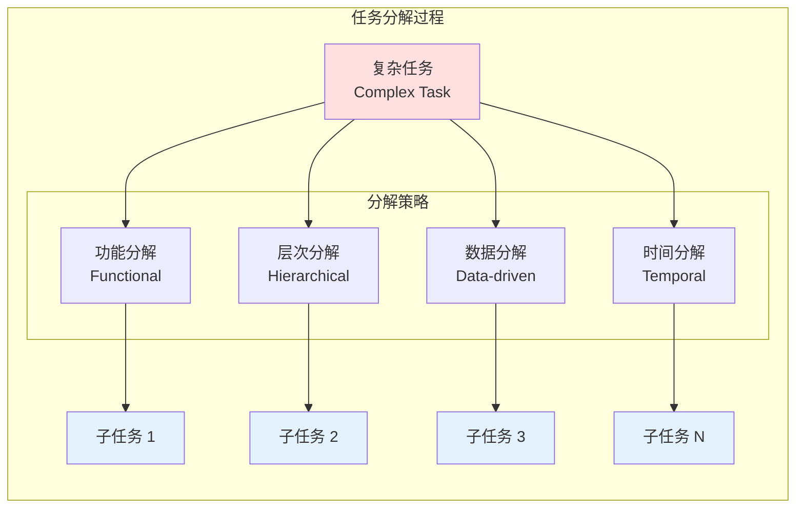

## 任务分解策略

### 1. 功能分解（Functional Decomposition）

按功能模块将任务分解为独立的子任务。

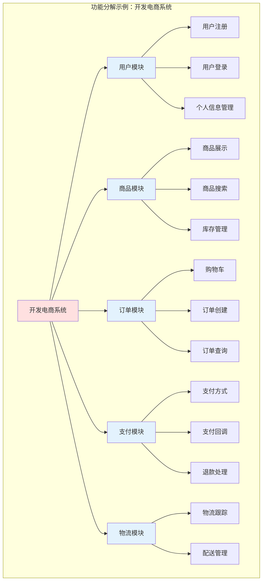

### 2. 层次分解（Hierarchical Decomposition）

按抽象层次将任务分解为不同级别的子任务。

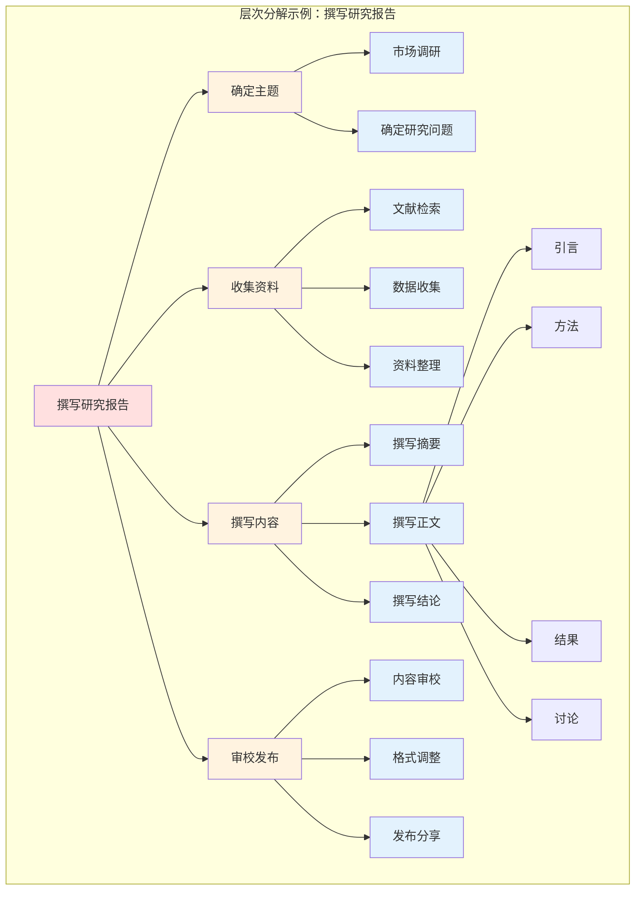

### 3. 数据分解（Data-driven Decomposition）

按数据维度将任务分解为可并行处理的子任务。

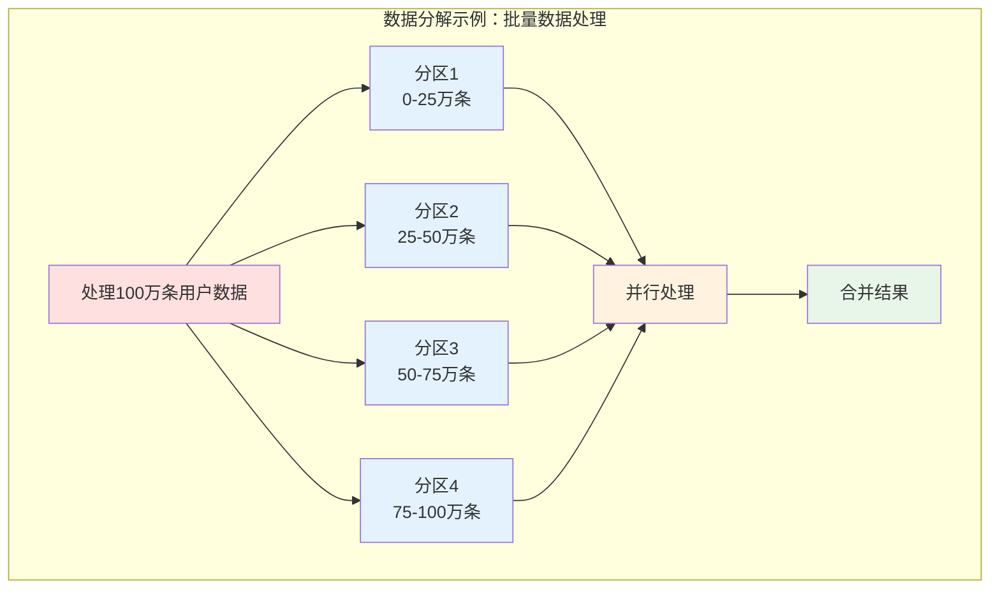

### 4. 时间分解（Temporal Decomposition）

按时间顺序将任务分解为阶段性的子任务。

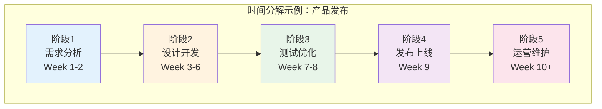

## 任务依赖关系

### 依赖类型

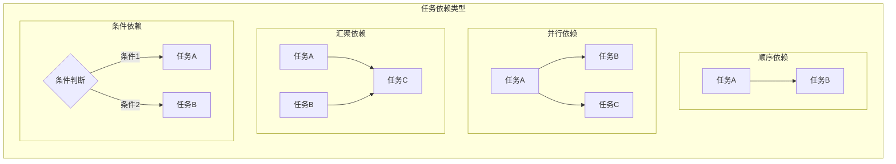

### 依赖关系图示例

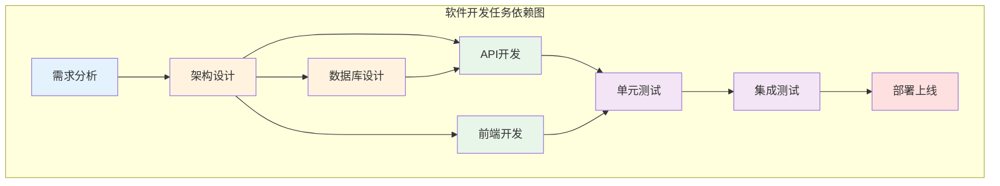

## 规划算法

### 1. 基于规则的规划

使用预定义规则进行任务规划。

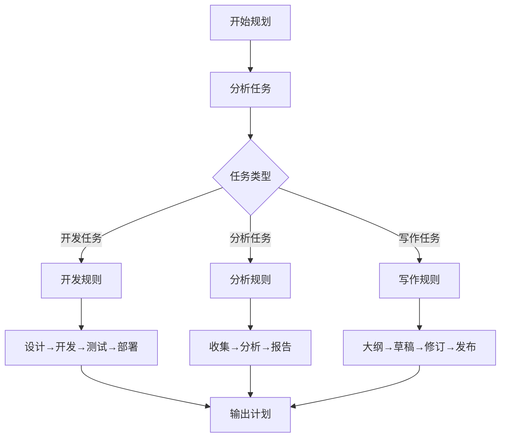

### 2. 基于 LLM 的规划

利用大语言模型的推理能力进行任务规划。

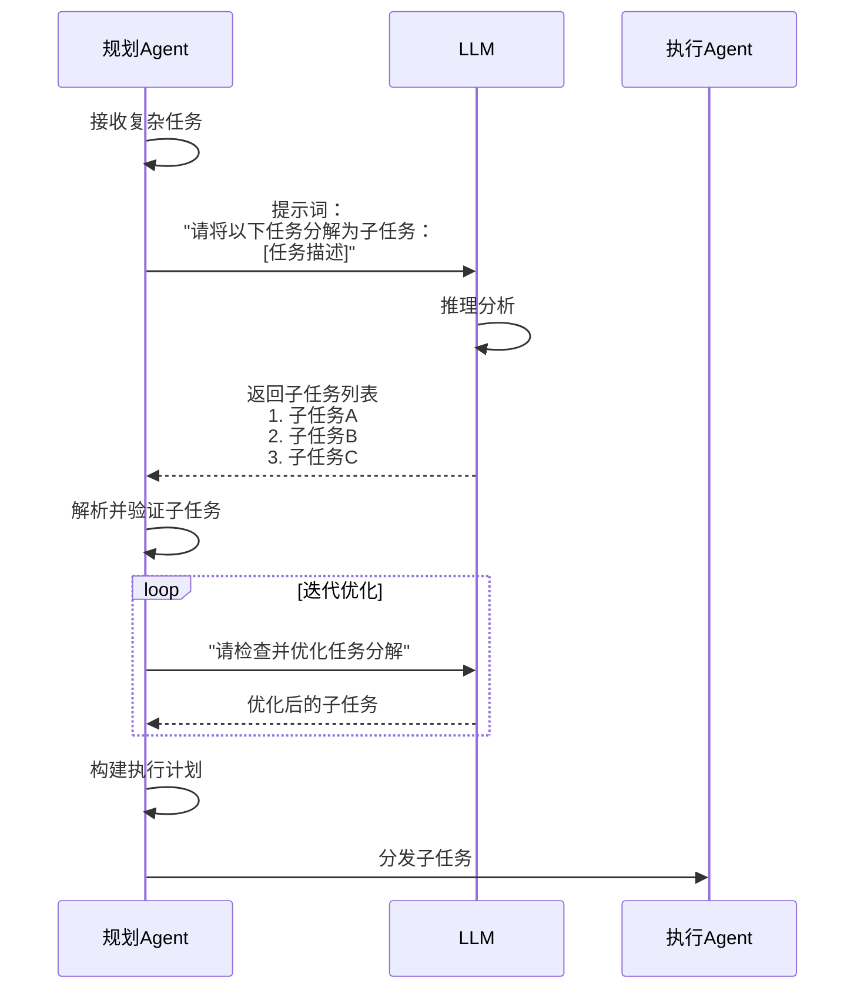

### 3. ReAct 规划

结合推理（Reasoning）和行动（Acting）的规划方法。

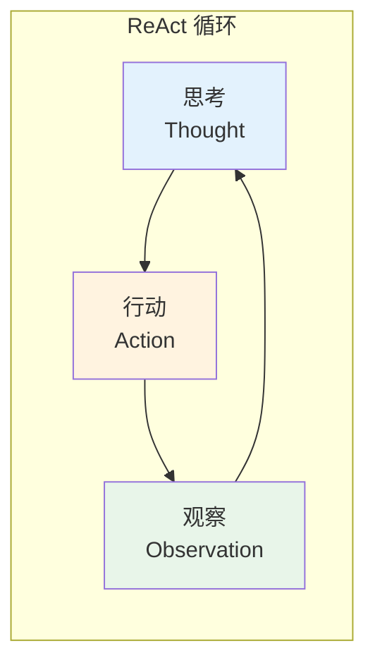

### 4. 树状搜索规划

使用树状搜索算法（如 MCTS）进行任务规划。

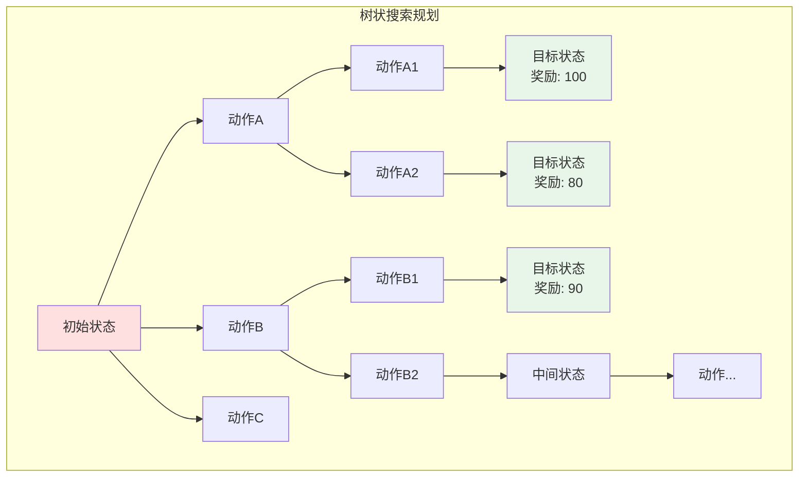

## Java 实现示例

### 任务分解器

```java
/**
 * 任务分解器接口
 */
public interface TaskDecomposer {
    List<SubTask> decompose(Task task);
}

/**
 * 基于 LLM 的任务分解器
 */
@Service
public class LLMTaskDecomposer implements TaskDecomposer {
    
    @Autowired
    private ChatClient chatClient;
    
    private static final String DECOMPOSITION_PROMPT = """
        请将以下复杂任务分解为具体的子任务。
        
        任务描述：%s
        
        要求：
        1. 每个子任务应该是可独立执行的
        2. 子任务之间如果有依赖关系，请明确说明
        3. 为每个子任务分配预估工作量（小时）
        4. 指定每个子任务需要的技能
        
        请以 JSON 格式返回：
        {
            "subTasks": [
                {
                    "id": "任务ID",
                    "description": "任务描述",
                    "estimatedHours": 预估工时,
                    "requiredSkills": ["技能1", "技能2"],
                    "dependencies": ["依赖任务ID"]
                }
            ]
        }
        """;
    
    @Override
    public List<SubTask> decompose(Task task) {
        String prompt = String.format(DECOMPOSITION_PROMPT, task.getDescription());
        
        String response = chatClient.call(prompt);
        
        // 解析 JSON 响应
        DecompositionResult result = parseJson(response);
        
        // 构建子任务列表
        return result.getSubTasks().stream()
            .map(this::convertToSubTask)
            .collect(Collectors.toList());
    }
    
    private DecompositionResult parseJson(String json) {
        ObjectMapper mapper = new ObjectMapper();
        try {
            return mapper.readValue(json, DecompositionResult.class);
        } catch (JsonProcessingException e) {
            throw new DecompositionException("解析分解结果失败", e);
        }
    }
}

/**
 * 基于规则的分解器
 */
@Component
public class RuleBasedDecomposer implements TaskDecomposer {
    
    private final Map<String, DecompositionRule> rules = new HashMap<>();
    
    public RuleBasedDecomposer() {
        // 初始化规则
        rules.put("software_development", new SoftwareDevelopmentRule());
        rules.put("data_analysis", new DataAnalysisRule());
        rules.put("content_creation", new ContentCreationRule());
    }
    
    @Override
    public List<SubTask> decompose(Task task) {
        DecompositionRule rule = rules.get(task.getType());
        if (rule == null) {
            throw new UnsupportedTaskTypeException(task.getType());
        }
        return rule.apply(task);
    }
}

/**
 * 软件开发分解规则
 */
public class SoftwareDevelopmentRule implements DecompositionRule {
    
    @Override
    public List<SubTask> apply(Task task) {
        List<SubTask> subTasks = new ArrayList<>();
        
        // 需求分析
        subTasks.add(SubTask.builder()
            .id(task.getId() + "_1")
            .description("需求分析和文档编写")
            .estimatedHours(8)
            .requiredSkills(Arrays.asList("需求分析", "文档编写"))
            .dependencies(Collections.emptyList())
            .build());
        
        // 架构设计
        subTasks.add(SubTask.builder()
            .id(task.getId() + "_2")
            .description("系统架构设计")
            .estimatedHours(16)
            .requiredSkills(Arrays.asList("架构设计", "技术选型"))
            .dependencies(Arrays.asList(task.getId() + "_1"))
            .build());
        
        // 开发实现
        subTasks.add(SubTask.builder()
            .id(task.getId() + "_3")
            .description("代码开发和单元测试")
            .estimatedHours(40)
            .requiredSkills(Arrays.asList("编程", "测试"))
            .dependencies(Arrays.asList(task.getId() + "_2"))
            .build());
        
        // 集成测试
        subTasks.add(SubTask.builder()
            .id(task.getId() + "_4")
            .description("集成测试和Bug修复")
            .estimatedHours(16)
            .requiredSkills(Arrays.asList("测试", "调试"))
            .dependencies(Arrays.asList(task.getId() + "_3"))
            .build());
        
        // 部署上线
        subTasks.add(SubTask.builder()
            .id(task.getId() + "_5")
            .description("部署和上线")
            .estimatedHours(8)
            .requiredSkills(Arrays.asList("DevOps", "运维"))
            .dependencies(Arrays.asList(task.getId() + "_4"))
            .build());
        
        return subTasks;
    }
}
```

### 任务规划器

```java
/**
 * 任务规划器
 */
@Service
public class TaskPlanner {
    
    @Autowired
    private TaskDecomposer decomposer;
    
    @Autowired
    private AgentRegistry agentRegistry;
    
    /**
     * 创建执行计划
     */
    public ExecutionPlan createPlan(Task task) {
        // 1. 任务分解
        List<SubTask> subTasks = decomposer.decompose(task);
        
        // 2. 构建依赖图
        DependencyGraph graph = buildDependencyGraph(subTasks);
        
        // 3. 拓扑排序
        List<SubTask> orderedTasks = topologicalSort(graph);
        
        // 4. 分配 Agent
        Map<String, Agent> assignments = assignAgents(orderedTasks);
        
        // 5. 生成执行计划
        return ExecutionPlan.builder()
            .taskId(task.getId())
            .subTasks(orderedTasks)
            .assignments(assignments)
            .estimatedDuration(calculateDuration(orderedTasks))
            .build();
    }
    
    /**
     * 构建依赖图
     */
    private DependencyGraph buildDependencyGraph(List<SubTask> subTasks) {
        DependencyGraph graph = new DependencyGraph();
        
        // 添加节点
        for (SubTask subTask : subTasks) {
            graph.addNode(subTask);
        }
        
        // 添加边
        for (SubTask subTask : subTasks) {
            for (String depId : subTask.getDependencies()) {
                SubTask dependency = findSubTask(subTasks, depId);
                if (dependency != null) {
                    graph.addEdge(dependency, subTask);
                }
            }
        }
        
        return graph;
    }
    
    /**
     * 拓扑排序
     */
    private List<SubTask> topologicalSort(DependencyGraph graph) {
        List<SubTask> result = new ArrayList<>();
        Set<SubTask> visited = new HashSet<>();
        Set<SubTask> visiting = new HashSet<>();
        
        for (SubTask node : graph.getNodes()) {
            if (!visited.contains(node)) {
                dfs(node, graph, visited, visiting, result);
            }
        }
        
        return result;
    }
    
    private void dfs(SubTask node, DependencyGraph graph, 
                     Set<SubTask> visited, Set<SubTask> visiting,
                     List<SubTask> result) {
        if (visiting.contains(node)) {
            throw new CircularDependencyException("检测到循环依赖");
        }
        
        if (visited.contains(node)) {
            return;
        }
        
        visiting.add(node);
        
        for (SubTask neighbor : graph.getNeighbors(node)) {
            dfs(neighbor, graph, visited, visiting, result);
        }
        
        visiting.remove(node);
        visited.add(node);
        result.add(0, node);
    }
    
    /**
     * 分配 Agent
     */
    private Map<String, Agent> assignAgents(List<SubTask> subTasks) {
        Map<String, Agent> assignments = new HashMap<>();
        
        for (SubTask subTask : subTasks) {
            Agent bestAgent = findBestAgent(subTask);
            assignments.put(subTask.getId(), bestAgent);
        }
        
        return assignments;
    }
    
    private Agent findBestAgent(SubTask subTask) {
        return agentRegistry.getAvailableAgents().stream()
            .filter(agent -> hasRequiredSkills(agent, subTask.getRequiredSkills()))
            .min(Comparator.comparingInt(this::getAgentLoad))
            .orElseThrow(() -> new NoSuitableAgentException(subTask.getId()));
    }
    
    private boolean hasRequiredSkills(Agent agent, List<String> requiredSkills) {
        return agent.getSkills().containsAll(requiredSkills);
    }
    
    private int getAgentLoad(Agent agent) {
        return agent.getAssignedTasks().size();
    }
    
    private Duration calculateDuration(List<SubTask> subTasks) {
        int totalHours = subTasks.stream()
            .mapToInt(SubTask::getEstimatedHours)
            .sum();
        return Duration.ofHours(totalHours);
    }
}

/**
 * 执行计划
 */
@Data
@Builder
public class ExecutionPlan {
    private String taskId;
    private List<SubTask> subTasks;
    private Map<String, Agent> assignments;
    private Duration estimatedDuration;
    private LocalDateTime createdAt;
    
    public List<SubTask> getExecutableTasks() {
        return subTasks.stream()
            .filter(task -> task.getStatus() == TaskStatus.PENDING)
            .filter(task -> task.getDependencies().stream()
                .allMatch(depId -> isTaskCompleted(depId)))
            .collect(Collectors.toList());
    }
    
    private boolean isTaskCompleted(String taskId) {
        return subTasks.stream()
            .filter(t -> t.getId().equals(taskId))
            .anyMatch(t -> t.getStatus() == TaskStatus.COMPLETED);
    }
}
```

### 动态规划调整

```java
/**
 * 动态规划器
 */
@Service
public class DynamicPlanner {
    
    @Autowired
    private TaskPlanner taskPlanner;
    
    /**
     * 根据执行反馈调整计划
     */
    public ExecutionPlan adjustPlan(ExecutionPlan currentPlan, ExecutionFeedback feedback) {
        if (feedback.isOnTrack()) {
            return currentPlan;
        }
        
        // 重新评估剩余任务
        List<SubTask> remainingTasks = currentPlan.getSubTasks().stream()
            .filter(t -> t.getStatus() != TaskStatus.COMPLETED)
            .collect(Collectors.toList());
        
        // 根据反馈调整
        for (SubTask task : remainingTasks) {
            if (feedback.hasIssue(task.getId())) {
                // 增加预估时间
                task.setEstimatedHours((int) (task.getEstimatedHours() * 1.5));
                
                // 重新分配 Agent
                if (feedback.needsReassignment(task.getId())) {
                    Agent newAgent = findAlternativeAgent(task, currentPlan);
                    currentPlan.getAssignments().put(task.getId(), newAgent);
                }
            }
        }
        
        // 重新计算时间线
        recalculateTimeline(currentPlan);
        
        return currentPlan;
    }
    
    /**
     * 处理任务失败
     */
    public ExecutionPlan handleFailure(ExecutionPlan plan, String failedTaskId, String reason) {
        SubTask failedTask = plan.getSubTasks().stream()
            .filter(t -> t.getId().equals(failedTaskId))
            .findFirst()
            .orElseThrow();
        
        // 标记失败
        failedTask.setStatus(TaskStatus.FAILED);
        
        // 分析失败原因
        if (isRetryable(reason)) {
            // 重新分配并重试
            Agent newAgent = findAlternativeAgent(failedTask, plan);
            plan.getAssignments().put(failedTaskId, newAgent);
            failedTask.setStatus(TaskStatus.PENDING);
        } else {
            // 需要重新分解
            List<SubTask> replacementTasks = decomposeAlternative(failedTask, reason);
            
            // 更新计划
            plan.getSubTasks().remove(failedTask);
            plan.getSubTasks().addAll(replacementTasks);
            
            // 重新规划
            return taskPlanner.createPlan(new Task(plan.getTaskId(), "调整后的任务"));
        }
        
        return plan;
    }
    
    private boolean isRetryable(String reason) {
        // 判断失败是否可重试
        return !reason.contains("逻辑错误") && !reason.contains("需求不清");
    }
    
    private List<SubTask> decomposeAlternative(SubTask task, String reason) {
        // 根据失败原因重新分解任务
        // 实现逻辑...
        return Collections.emptyList();
    }
    
    private Agent findAlternativeAgent(SubTask task, ExecutionPlan plan) {
        Agent currentAgent = plan.getAssignments().get(task.getId());
        // 寻找其他可用 Agent
        return null;
    }
    
    private void recalculateTimeline(ExecutionPlan plan) {
        // 重新计算时间线
        // 实现逻辑...
    }
}
```

## 规划策略选择

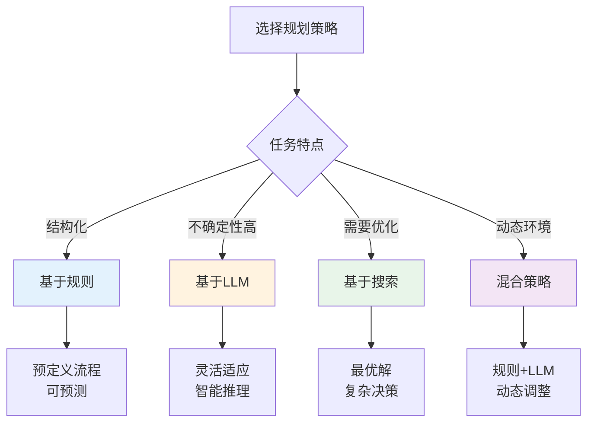

## 最佳实践

1. **分层规划**：高层规划使用 LLM，低层规划使用规则
2. **迭代优化**：根据执行反馈持续优化计划
3. **依赖管理**：明确任务依赖，避免循环依赖
4. **资源预估**：合理预估任务资源需求
5. **容错设计**：设计失败重试和替代方案
6. **可视化**：提供规划结果的可视化展示
