# 06 - 冲突解决

在多智能体系统中，由于 Agent 的自主性、资源竞争、目标差异等因素，冲突不可避免。有效的冲突解决机制是确保系统稳定运行的关键。

## 冲突类型

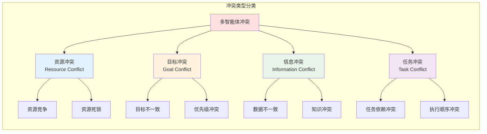

### 1. 资源冲突

当多个 Agent 竞争有限资源时产生的冲突。

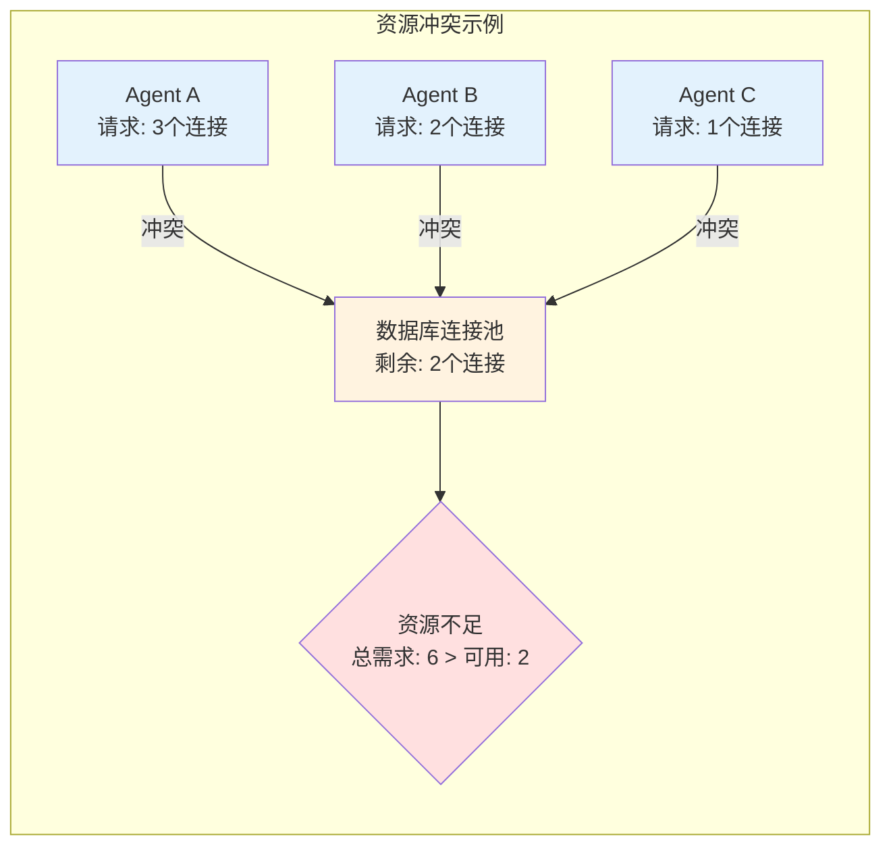

### 2. 目标冲突

当 Agent 的目标相互矛盾或不一致时产生的冲突。

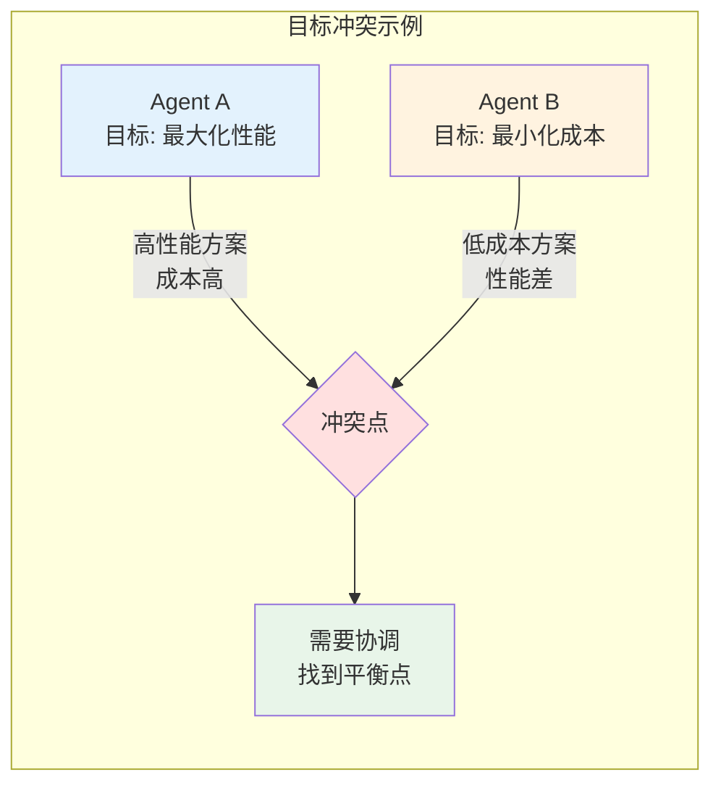

### 3. 信息冲突

当 Agent 对同一信息有不同的认知时产生的冲突。

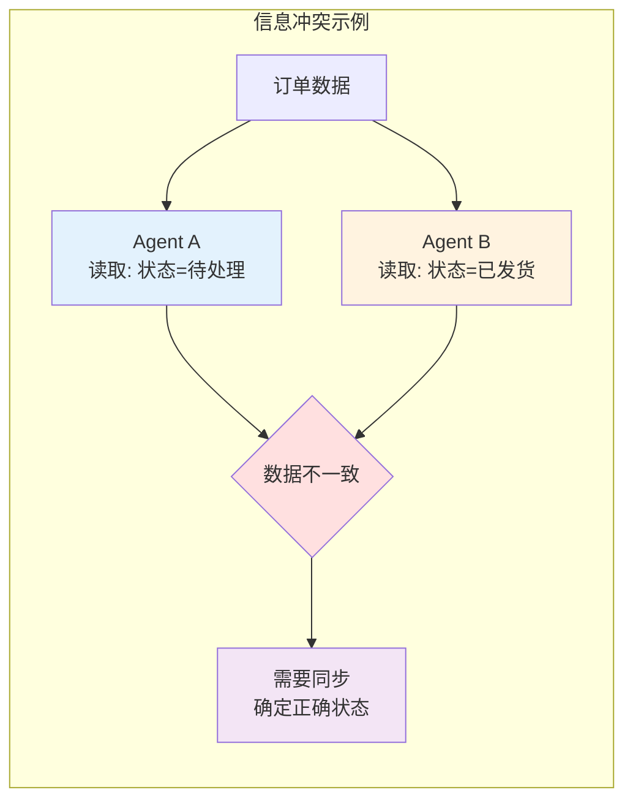

### 4. 任务冲突

当任务之间存在依赖或执行顺序矛盾时产生的冲突。

```mermaid
graph TB
    subgraph "任务冲突示例"
        direction TB
        
        TaskA[任务A: 修改API接口]
        TaskB[任务B: 编写API文档]
        TaskC[任务C: 前端集成]
        
        Conflict1{冲突: B依赖A完成}
        Conflict2{冲突: C依赖A完成}
        
        TaskA --> Conflict1
        TaskB --> Conflict1
        
        TaskA --> Conflict2
        TaskC --> Conflict2
        
        Note: 如果并行执行会导致问题
    end
    
    style TaskA fill:#ffe0e0
    style TaskB fill:#e3f2fd
    style TaskC fill:#fff3e0
```

## 冲突检测

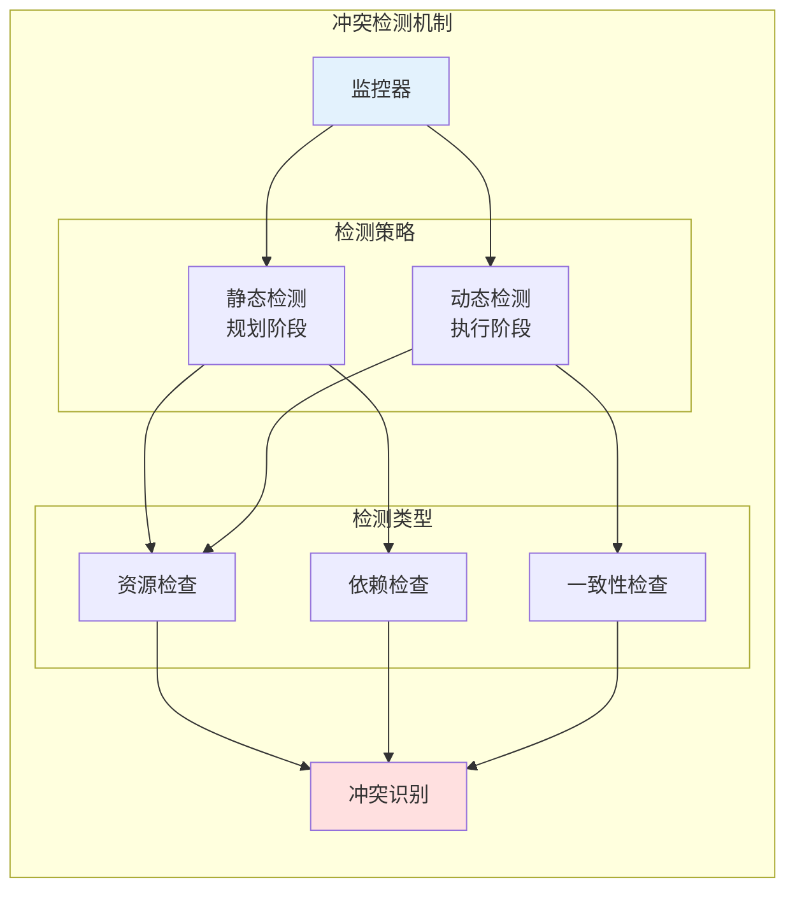

### Java 实现示例

```java
/**
 * 冲突检测器
 */
@Service
public class ConflictDetector {
    
    @Autowired
    private ResourceManager resourceManager;
    
    @Autowired
    private TaskManager taskManager;
    
    /**
     * 静态冲突检测（规划阶段）
     */
    public List<Conflict> detectStaticConflicts(ExecutionPlan plan) {
        List<Conflict> conflicts = new ArrayList<>();
        
        // 检测资源冲突
        conflicts.addAll(detectResourceConflicts(plan));
        
        // 检测依赖冲突
        conflicts.addAll(detectDependencyConflicts(plan));
        
        // 检测任务冲突
        conflicts.addAll(detectTaskConflicts(plan));
        
        return conflicts;
    }
    
    /**
     * 动态冲突检测（执行阶段）
     */
    public List<Conflict> detectDynamicConflicts() {
        List<Conflict> conflicts = new ArrayList<>();
        
        // 检测运行时资源冲突
        conflicts.addAll(detectRuntimeResourceConflicts());
        
        // 检测数据一致性冲突
        conflicts.addAll(detectConsistencyConflicts());
        
        // 检测死锁
        conflicts.addAll(detectDeadlocks());
        
        return conflicts;
    }
    
    /**
     * 检测资源冲突
     */
    private List<Conflict> detectResourceConflicts(ExecutionPlan plan) {
        List<Conflict> conflicts = new ArrayList<>();
        Map<String, Integer> resourceDemand = new HashMap<>();
        
        // 统计各时段资源需求
        for (SubTask task : plan.getSubTasks()) {
            for (String resource : task.getRequiredResources()) {
                resourceDemand.merge(resource, 1, Integer::sum);
            }
        }
        
        // 检查是否超过可用资源
        for (Map.Entry<String, Integer> entry : resourceDemand.entrySet()) {
            String resourceId = entry.getKey();
            int demand = entry.getValue();
            int available = resourceManager.getAvailableCapacity(resourceId);
            
            if (demand > available) {
                conflicts.add(Conflict.builder()
                    .type(ConflictType.RESOURCE)
                    .severity(ConflictSeverity.HIGH)
                    .description(String.format("资源 %s 不足: 需求 %d, 可用 %d", 
                        resourceId, demand, available))
                    .involvedResources(Collections.singletonList(resourceId))
                    .build());
            }
        }
        
        return conflicts;
    }
    
    /**
     * 检测依赖冲突
     */
    private List<Conflict> detectDependencyConflicts(ExecutionPlan plan) {
        List<Conflict> conflicts = new ArrayList<>();
        
        // 检查循环依赖
        DependencyGraph graph = buildDependencyGraph(plan);
        List<List<SubTask>> cycles = graph.findCycles();
        
        for (List<SubTask> cycle : cycles) {
            conflicts.add(Conflict.builder()
                .type(ConflictType.DEPENDENCY)
                .severity(ConflictSeverity.CRITICAL)
                .description("检测到循环依赖: " + 
                    cycle.stream().map(SubTask::getId).collect(Collectors.joining(" -> ")))
                .involvedTasks(cycle.stream().map(SubTask::getId).collect(Collectors.toList()))
                .build());
        }
        
        return conflicts;
    }
    
    /**
     * 检测死锁
     */
    private List<Conflict> detectDeadlocks() {
        List<Conflict> conflicts = new ArrayList<>();
        
        // 构建资源分配图
        ResourceAllocationGraph graph = buildResourceAllocationGraph();
        
        // 检测循环等待
        List<List<String>> waitCycles = graph.findWaitCycles();
        
        for (List<String> cycle : waitCycles) {
            conflicts.add(Conflict.builder()
                .type(ConflictType.DEADLOCK)
                .severity(ConflictSeverity.CRITICAL)
                .description("检测到死锁: " + String.join(" -> ", cycle))
                .build());
        }
        
        return conflicts;
    }
}

/**
 * 冲突定义
 */
@Data
@Builder
public class Conflict {
    private String id;
    private ConflictType type;
    private ConflictSeverity severity;
    private String description;
    private List<String> involvedAgents;
    private List<String> involvedTasks;
    private List<String> involvedResources;
    private LocalDateTime detectedAt;
    private ConflictStatus status;
    
    public enum ConflictType {
        RESOURCE,      // 资源冲突
        GOAL,          // 目标冲突
        INFORMATION,   // 信息冲突
        TASK,          // 任务冲突
        DEPENDENCY,    // 依赖冲突
        DEADLOCK       // 死锁
    }
    
    public enum ConflictSeverity {
        LOW, MEDIUM, HIGH, CRITICAL
    }
    
    public enum ConflictStatus {
        DETECTED, RESOLVING, RESOLVED, ESCALATED
    }
}
```

## 冲突解决策略

### 1. 协商（Negotiation）

通过对话协商达成共识。

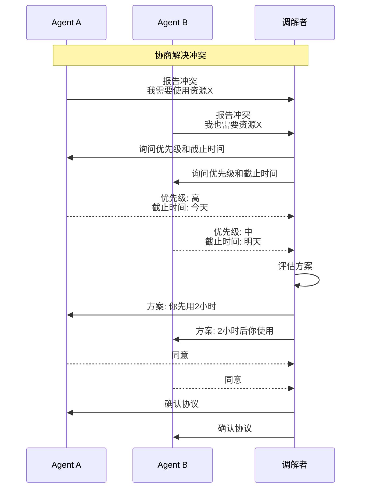

### 2. 仲裁（Arbitration）

由第三方仲裁者做出决策。

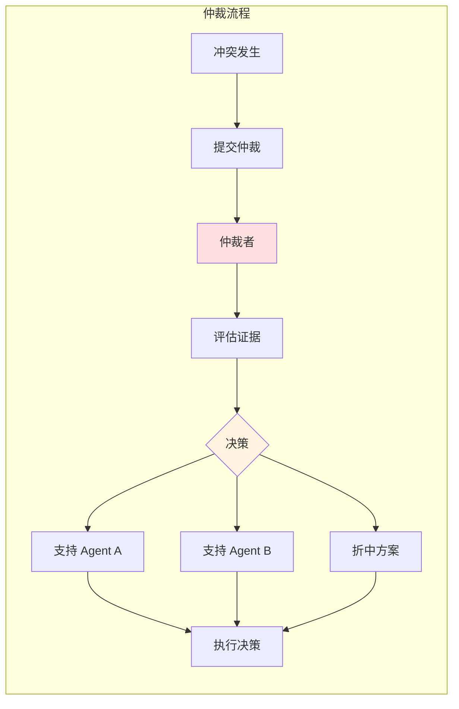

### 3. 投票（Voting）

通过集体投票决定。

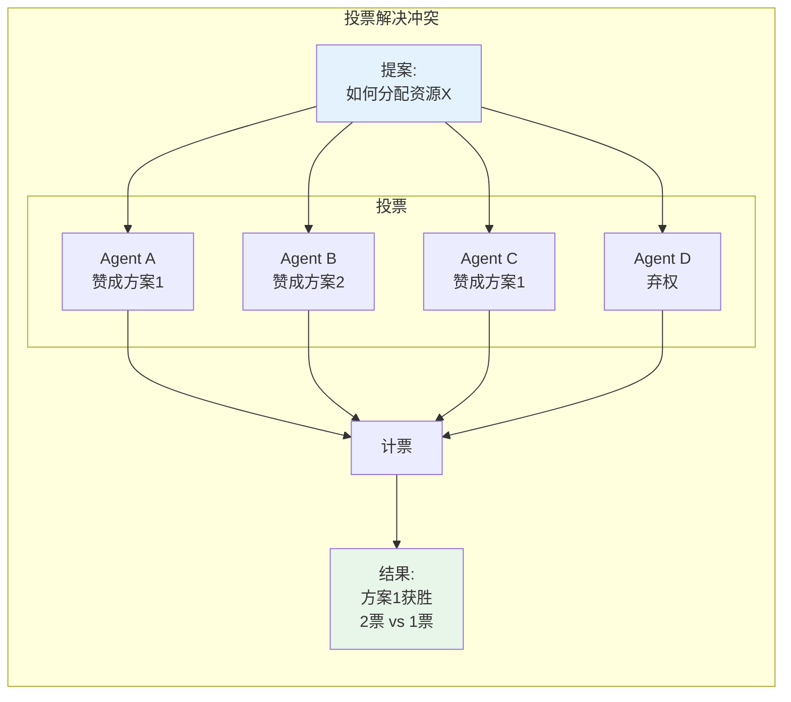

### 4. 优先级（Priority）

基于优先级规则自动解决。

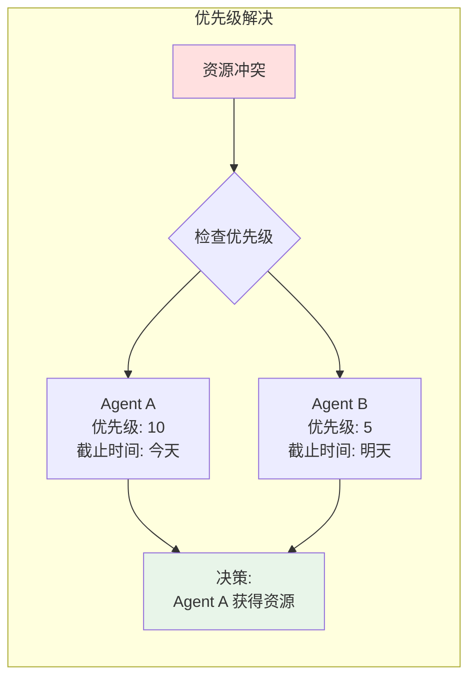

### 5. 资源重分配（Resource Reallocation）

动态调整资源分配。

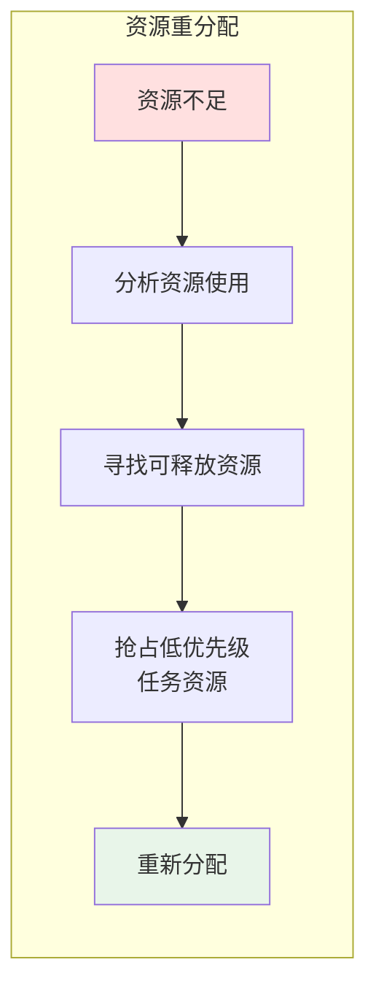

## Java 实现示例

### 冲突解决器

```java
/**
 * 冲突解决器接口
 */
public interface ConflictResolver {
    Resolution resolve(Conflict conflict);
}

/**
 * 协商解决器
 */
@Service
public class NegotiationResolver implements ConflictResolver {
    
    @Autowired
    private CommunicationService communicationService;
    
    @Override
    public Resolution resolve(Conflict conflict) {
        // 获取冲突各方
        List<Agent> parties = getInvolvedAgents(conflict);
        
        // 收集各方诉求
        Map<String, Proposal> proposals = new HashMap<>();
        for (Agent agent : parties) {
            Proposal proposal = agent.makeProposal(conflict);
            proposals.put(agent.getId(), proposal);
        }
        
        // 寻找共同接受的方案
        Resolution resolution = findMutuallyAcceptableSolution(proposals);
        
        if (resolution == null) {
            // 无法协商一致，升级处理
            return escalate(conflict);
        }
        
        // 记录协议
        recordAgreement(conflict, parties, resolution);
        
        return resolution;
    }
    
    private Resolution findMutuallyAcceptableSolution(Map<String, Proposal> proposals) {
        // 实现协商逻辑
        // 可以尝试妥协、轮流、时间分割等策略
        return null;
    }
    
    private Resolution escalate(Conflict conflict) {
        // 升级到仲裁
        return null;
    }
}

/**
 * 仲裁解决器
 */
@Service
public class ArbitrationResolver implements ConflictResolver {
    
    @Autowired
    private ArbitrationPolicy policy;
    
    @Override
    public Resolution resolve(Conflict conflict) {
        // 根据仲裁策略做出决策
        switch (policy.getStrategy()) {
            case PRIORITY:
                return resolveByPriority(conflict);
            case FIRST_COME_FIRST_SERVED:
                return resolveByFCFS(conflict);
            case FAIR_SHARE:
                return resolveByFairShare(conflict);
            case ADMINISTRATOR_DECISION:
                return resolveByAdministrator(conflict);
            default:
                throw new UnsupportedOperationException();
        }
    }
    
    private Resolution resolveByPriority(Conflict conflict) {
        // 按优先级解决
        List<Agent> sortedAgents = conflict.getInvolvedAgents().stream()
            .map(this::getAgent)
            .sorted(Comparator.comparingInt(Agent::getPriority).reversed())
            .collect(Collectors.toList());
        
        Agent winner = sortedAgents.get(0);
        
        return Resolution.builder()
            .conflictId(conflict.getId())
            .winner(winner.getId())
            .reason("优先级最高: " + winner.getPriority())
            .build();
    }
    
    private Resolution resolveByFCFS(Conflict conflict) {
        // 按先到先得解决
        Agent winner = conflict.getInvolvedAgents().stream()
            .map(this::getAgent)
            .min(Comparator.comparing(Agent::getRequestTime))
            .orElseThrow();
        
        return Resolution.builder()
            .conflictId(conflict.getId())
            .winner(winner.getId())
            .reason("最先请求")
            .build();
    }
    
    private Resolution resolveByFairShare(Conflict conflict) {
        // 公平分配
        // 实现资源按比例或时间分割
        return Resolution.builder()
            .conflictId(conflict.getId())
            .solution("时间分割")
            .allocation(calculateFairAllocation(conflict))
            .build();
    }
    
    private Map<String, Double> calculateFairAllocation(Conflict conflict) {
        // 计算公平分配方案
        return Collections.emptyMap();
    }
}

/**
 * 投票解决器
 */
@Service
public class VotingResolver implements ConflictResolver {
    
    @Autowired
    private AgentRegistry agentRegistry;
    
    @Override
    public Resolution resolve(Conflict conflict) {
        // 提出候选方案
        List<Proposal> candidates = generateCandidates(conflict);
        
        // 收集投票
        Map<String, String> votes = new HashMap<>();
        for (Agent agent : agentRegistry.getAllAgents()) {
            String vote = agent.vote(candidates, conflict);
            votes.put(agent.getId(), vote);
        }
        
        // 计票
        Map<String, Integer> voteCount = new HashMap<>();
        for (String vote : votes.values()) {
            voteCount.merge(vote, 1, Integer::sum);
        }
        
        // 选出获胜方案
        String winner = voteCount.entrySet().stream()
            .max(Map.Entry.comparingByValue())
            .map(Map.Entry::getKey)
            .orElseThrow();
        
        return Resolution.builder()
            .conflictId(conflict.getId())
            .winningProposal(winner)
            .voteCount(voteCount)
            .build();
    }
    
    private List<Proposal> generateCandidates(Conflict conflict) {
        // 生成候选解决方案
        List<Proposal> candidates = new ArrayList<>();
        
        // 方案1: 优先级
        candidates.add(new Proposal("priority", "按优先级分配"));
        
        // 方案2: 轮流
        candidates.add(new Proposal("round_robin", "轮流使用"));
        
        // 方案3: 时间分割
        candidates.add(new Proposal("time_slice", "时间片分配"));
        
        return candidates;
    }
}

/**
 * 冲突解决管理器
 */
@Service
public class ConflictResolutionManager {
    
    @Autowired
    private ConflictDetector detector;
    
    private final Map<ConflictType, ConflictResolver> resolvers = new HashMap<>();
    
    public ConflictResolutionManager() {
        // 注册解决器
        resolvers.put(ConflictType.RESOURCE, new ArbitrationResolver());
        resolvers.put(ConflictType.GOAL, new NegotiationResolver());
        resolvers.put(ConflictType.INFORMATION, new VotingResolver());
        resolvers.put(ConflictType.TASK, new ArbitrationResolver());
    }
    
    /**
     * 处理冲突
     */
    public void handleConflicts() {
        List<Conflict> conflicts = detector.detectDynamicConflicts();
        
        for (Conflict conflict : conflicts) {
            if (conflict.getStatus() == ConflictStatus.DETECTED) {
                resolve(conflict);
            }
        }
    }
    
    /**
     * 解决单个冲突
     */
    public Resolution resolve(Conflict conflict) {
        conflict.setStatus(ConflictStatus.RESOLVING);
        
        try {
            ConflictResolver resolver = resolvers.get(conflict.getType());
            if (resolver == null) {
                resolver = new ArbitrationResolver(); // 默认使用仲裁
            }
            
            Resolution resolution = resolver.resolve(conflict);
            
            // 执行解决方案
            executeResolution(resolution);
            
            conflict.setStatus(ConflictStatus.RESOLVED);
            
            return resolution;
            
        } catch (Exception e) {
            conflict.setStatus(ConflictStatus.ESCALATED);
            throw new ConflictResolutionException("冲突解决失败", e);
        }
    }
    
    private void executeResolution(Resolution resolution) {
        // 执行解决方案
        // 例如：重新分配资源、调整任务等
    }
}

/**
 * 解决方案
 */
@Data
@Builder
public class Resolution {
    private String conflictId;
    private String winner;
    private String winningProposal;
    private String solution;
    private String reason;
    private Map<String, Object> allocation;
    private Map<String, Integer> voteCount;
    private LocalDateTime resolvedAt;
}
```

## 冲突预防

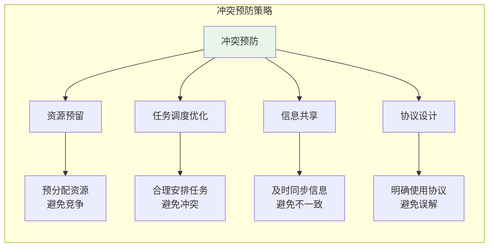

### 预防策略

1. **资源预留**：提前预留关键资源
2. **任务调度优化**：合理安排任务执行顺序
3. **信息共享**：及时同步状态信息
4. **协议设计**：制定明确的使用协议
5. **监控预警**：实时监控潜在冲突

## 总结

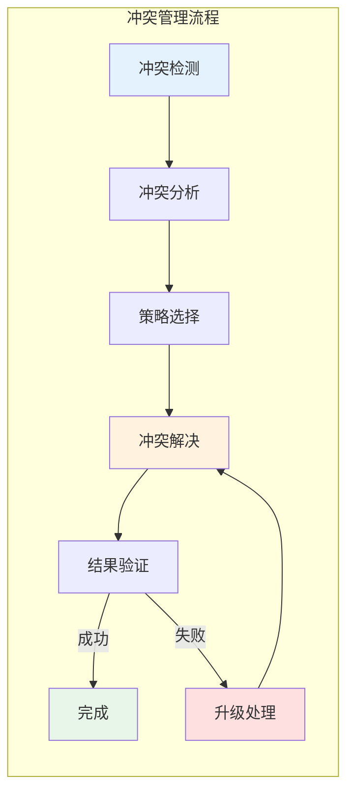

有效的冲突管理需要：
1. **及时检测**：快速发现冲突
2. **合理分析**：准确判断冲突类型和严重程度
3. **策略选择**：根据情况选择合适的解决策略
4. **公平解决**：确保解决方案公平合理
5. **持续优化**：总结经验，预防未来冲突
