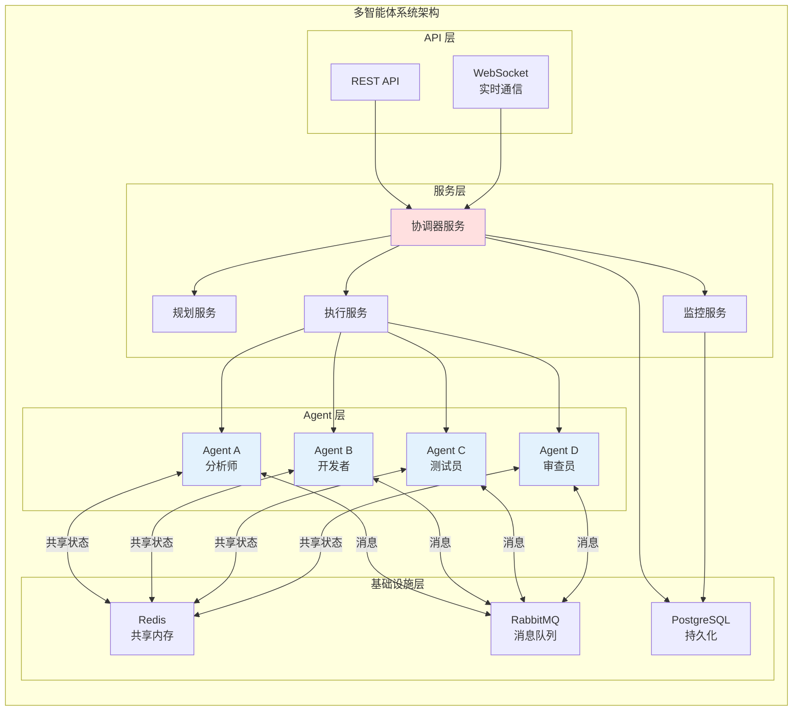

# 07 - Java 实战：Spring Boot 实现多智能体系统

本章通过完整的 Spring Boot 项目示例，展示如何在 Java 环境中构建一个实用的多智能体系统。

## 项目架构



## 项目结构

```
multi-agent-system/
├── src/
│   ├── main/
│   │   ├── java/
│   │   │   └── com/
│   │   │       └── example/
│   │   │           └── multiagent/
│   │   │               ├── MultiAgentApplication.java
│   │   │               ├── config/
│   │   │               │   ├── RedisConfig.java
│   │   │               │   ├── RabbitConfig.java
│   │   │               │   └── WebSocketConfig.java
│   │   │               ├── controller/
│   │   │               │   └── TaskController.java
│   │   │               ├── service/
│   │   │               │   ├── orchestrator/
│   │   │               │   │   └── OrchestratorService.java
│   │   │               │   ├── planner/
│   │   │               │   │   └── TaskPlanner.java
│   │   │               │   ├── executor/
│   │   │               │   │   └── TaskExecutor.java
│   │   │               │   └── agent/
│   │   │               │       ├── Agent.java
│   │   │               │       ├── AgentRegistry.java
│   │   │               │       ├── BaseAgent.java
│   │   │               │       ├── AnalystAgent.java
│   │   │               │       ├── DeveloperAgent.java
│   │   │               │       ├── TesterAgent.java
│   │   │               │       └── ReviewerAgent.java
│   │   │               ├── communication/
│   │   │               │   ├── MessageBus.java
│   │   │               │   ├── SharedMemory.java
│   │   │               │   └── AgentMessage.java
│   │   │               ├── model/
│   │   │               │   ├── Task.java
│   │   │               │   ├── SubTask.java
│   │   │               │   ├── ExecutionPlan.java
│   │   │               │   └── AgentStatus.java
│   │   │               └── repository/
│   │   │                   └── TaskRepository.java
│   │   └── resources/
│   │       ├── application.yml
│   │       └── schema.sql
│   └── test/
│       └── java/
│           └── com/
│               └── example/
│                   └── multiagent/
│                       └── MultiAgentSystemTest.java
├── pom.xml
└── README.md
```

## 核心代码实现

### 1. 项目依赖 (pom.xml)

```xml
<?xml version="1.0" encoding="UTF-8"?>
<project xmlns="http://maven.apache.org/POM/4.0.0"
         xmlns:xsi="http://www.w3.org/2001/XMLSchema-instance"
         xsi:schemaLocation="http://maven.apache.org/POM/4.0.0 
         http://maven.apache.org/xsd/maven-4.0.0.xsd">
    <modelVersion>4.0.0</modelVersion>
    
    <parent>
        <groupId>org.springframework.boot</groupId>
        <artifactId>spring-boot-starter-parent</artifactId>
        <version>3.2.0</version>
    </parent>
    
    <groupId>com.example</groupId>
    <artifactId>multi-agent-system</artifactId>
    <version>1.0.0</version>
    
    <properties>
        <java.version>17</java.version>
        <langchain4j.version>0.24.0</langchain4j.version>
    </properties>
    
    <dependencies>
        <!-- Spring Boot Starters -->
        <dependency>
            <groupId>org.springframework.boot</groupId>
            <artifactId>spring-boot-starter-web</artifactId>
        </dependency>
        <dependency>
            <groupId>org.springframework.boot</groupId>
            <artifactId>spring-boot-starter-websocket</artifactId>
        </dependency>
        <dependency>
            <groupId>org.springframework.boot</groupId>
            <artifactId>spring-boot-starter-data-jpa</artifactId>
        </dependency>
        <dependency>
            <groupId>org.springframework.boot</groupId>
            <artifactId>spring-boot-starter-data-redis</artifactId>
        </dependency>
        <dependency>
            <groupId>org.springframework.boot</groupId>
            <artifactId>spring-boot-starter-amqp</artifactId>
        </dependency>
        
        <!-- LangChain4j -->
        <dependency>
            <groupId>dev.langchain4j</groupId>
            <artifactId>langchain4j</artifactId>
            <version>${langchain4j.version}</version>
        </dependency>
        <dependency>
            <groupId>dev.langchain4j</groupId>
            <artifactId>langchain4j-open-ai</artifactId>
            <version>${langchain4j.version}</version>
        </dependency>
        
        <!-- Database -->
        <dependency>
            <groupId>org.postgresql</groupId>
            <artifactId>postgresql</artifactId>
        </dependency>
        
        <!-- Lombok -->
        <dependency>
            <groupId>org.projectlombok</groupId>
            <artifactId>lombok</artifactId>
            <optional>true</optional>
        </dependency>
        
        <!-- Test -->
        <dependency>
            <groupId>org.springframework.boot</groupId>
            <artifactId>spring-boot-starter-test</artifactId>
            <scope>test</scope>
        </dependency>
    </dependencies>
    
    <build>
        <plugins>
            <plugin>
                <groupId>org.springframework.boot</groupId>
                <artifactId>spring-boot-maven-plugin</artifactId>
            </plugin>
        </plugins>
    </build>
</project>
```

### 2. 应用配置 (application.yml)

```yaml
server:
  port: 8080

spring:
  application:
    name: multi-agent-system
  
  datasource:
    url: jdbc:postgresql://localhost:5432/multiagent
    username: postgres
    password: password
    driver-class-name: org.postgresql.Driver
  
  jpa:
    hibernate:
      ddl-auto: update
    show-sql: true
    properties:
      hibernate:
        dialect: org.hibernate.dialect.PostgreSQLDialect
  
  redis:
    host: localhost
    port: 6379
    database: 0
  
  rabbitmq:
    host: localhost
    port: 5672
    username: guest
    password: guest

# LLM Configuration
llm:
  openai:
    api-key: ${OPENAI_API_KEY}
    model: gpt-4
    temperature: 0.7

# Agent Configuration
agent:
  max-concurrent-tasks: 5
  task-timeout-seconds: 300
```

### 3. 核心模型类

```java
/**
 * 任务实体
 */
@Entity
@Table(name = "tasks")
@Data
@Builder
@NoArgsConstructor
@AllArgsConstructor
public class Task {
    
    @Id
    @GeneratedValue(strategy = GenerationType.UUID)
    private String id;
    
    @Column(nullable = false)
    private String title;
    
    @Column(length = 2000)
    private String description;
    
    @Enumerated(EnumType.STRING)
    private TaskType type;
    
    @Enumerated(EnumType.STRING)
    private TaskStatus status;
    
    @Column(name = "created_at")
    private LocalDateTime createdAt;
    
    @Column(name = "updated_at")
    private LocalDateTime updatedAt;
    
    @Column(name = "completed_at")
    private LocalDateTime completedAt;
    
    @OneToMany(mappedBy = "task", cascade = CascadeType.ALL, fetch = FetchType.EAGER)
    private List<SubTask> subTasks;
    
    @PrePersist
    protected void onCreate() {
        createdAt = LocalDateTime.now();
        updatedAt = LocalDateTime.now();
        if (status == null) {
            status = TaskStatus.PENDING;
        }
    }
    
    @PreUpdate
    protected void onUpdate() {
        updatedAt = LocalDateTime.now();
    }
    
    public enum TaskType {
        ANALYSIS, DEVELOPMENT, TESTING, REVIEW, COMPOSITE
    }
    
    public enum TaskStatus {
        PENDING, PLANNING, IN_PROGRESS, COMPLETED, FAILED
    }
}

/**
 * 子任务
 */
@Entity
@Table(name = "sub_tasks")
@Data
@Builder
@NoArgsConstructor
@AllArgsConstructor
public class SubTask {
    
    @Id
    @GeneratedValue(strategy = GenerationType.UUID)
    private String id;
    
    @Column(nullable = false)
    private String title;
    
    @Column(length = 1000)
    private String description;
    
    @ManyToOne
    @JoinColumn(name = "task_id")
    private Task task;
    
    @Column(name = "assigned_agent")
    private String assignedAgent;
    
    @Enumerated(EnumType.STRING)
    private SubTaskStatus status;
    
    @Column(name = "execution_order")
    private Integer executionOrder;
    
    @ElementCollection
    @CollectionTable(name = "subtask_dependencies", joinColumns = @JoinColumn(name = "subtask_id"))
    @Column(name = "dependency_id")
    private List<String> dependencies;
    
    @Column(name = "estimated_duration_minutes")
    private Integer estimatedDurationMinutes;
    
    @Column(name = "started_at")
    private LocalDateTime startedAt;
    
    @Column(name = "completed_at")
    private LocalDateTime completedAt;
    
    @Column(name = "result_data", length = 4000)
    private String resultData;
    
    public enum SubTaskStatus {
        PENDING, ASSIGNED, IN_PROGRESS, COMPLETED, FAILED
    }
}

/**
 * Agent 状态
 */
@Data
@Builder
public class AgentStatus {
    private String agentId;
    private String agentType;
    private AgentState state;
    private String currentTask;
    private List<String> capabilities;
    private int completedTasks;
    private int failedTasks;
    private LocalDateTime lastHeartbeat;
    
    public enum AgentState {
        IDLE, BUSY, OFFLINE, ERROR
    }
}
```

### 4. Agent 基类与实现

```java
/**
 * Agent 接口
 */
public interface Agent {
    String getId();
    String getType();
    List<String> getCapabilities();
    boolean canHandle(SubTask task);
    CompletableFuture<TaskResult> execute(SubTask task);
    AgentStatus getStatus();
}

/**
 * Agent 基类
 */
@Slf4j
public abstract class BaseAgent implements Agent {
    
    protected final String id;
    protected final String type;
    protected final List<String> capabilities;
    protected volatile AgentStatus status;
    protected final ChatLanguageModel llm;
    
    @Autowired
    protected MessageBus messageBus;
    
    @Autowired
    protected SharedMemory sharedMemory;
    
    public BaseAgent(String type, List<String> capabilities, ChatLanguageModel llm) {
        this.id = type + "_" + UUID.randomUUID().toString().substring(0, 8);
        this.type = type;
        this.capabilities = capabilities;
        this.llm = llm;
        this.status = AgentStatus.builder()
            .agentId(id)
            .agentType(type)
            .state(AgentStatus.AgentState.IDLE)
            .capabilities(capabilities)
            .completedTasks(0)
            .failedTasks(0)
            .lastHeartbeat(LocalDateTime.now())
            .build();
    }
    
    @Override
    public String getId() {
        return id;
    }
    
    @Override
    public String getType() {
        return type;
    }
    
    @Override
    public List<String> getCapabilities() {
        return capabilities;
    }
    
    @Override
    public boolean canHandle(SubTask task) {
        // 检查 Agent 是否有能力处理该任务
        return capabilities.stream()
            .anyMatch(cap -> task.getDescription().toLowerCase().contains(cap.toLowerCase()));
    }
    
    @Override
    public CompletableFuture<TaskResult> execute(SubTask task) {
        return CompletableFuture.supplyAsync(() -> {
            try {
                // 更新状态为忙碌
                updateState(AgentStatus.AgentState.BUSY, task.getId());
                
                // 发送开始消息
                messageBus.send(AgentMessage.builder()
                    .fromAgent(id)
                    .toAgent("orchestrator")
                    .type(AgentMessage.MessageType.STATUS)
                    .content("开始执行任务: " + task.getId())
                    .build());
                
                // 执行具体逻辑
                TaskResult result = doExecute(task);
                
                // 更新状态
                status.setCompletedTasks(status.getCompletedTasks() + 1);
                updateState(AgentStatus.AgentState.IDLE, null);
                
                // 存储结果到共享内存
                sharedMemory.write("task_result_" + task.getId(), result, id);
                
                return result;
                
            } catch (Exception e) {
                log.error("任务执行失败", e);
                status.setFailedTasks(status.getFailedTasks() + 1);
                updateState(AgentStatus.AgentState.IDLE, null);
                return TaskResult.failure(e.getMessage());
            }
        });
    }
    
    protected abstract TaskResult doExecute(SubTask task);
    
    protected void updateState(AgentStatus.AgentState state, String currentTask) {
        status.setState(state);
        status.setCurrentTask(currentTask);
        status.setLastHeartbeat(LocalDateTime.now());
    }
    
    @Override
    public AgentStatus getStatus() {
        return status;
    }
}

/**
 * 分析师 Agent
 */
@Component
public class AnalystAgent extends BaseAgent {
    
    public AnalystAgent(@Autowired ChatLanguageModel llm) {
        super("analyst", 
              Arrays.asList("分析", "调研", "需求", "研究", "评估"),
              llm);
    }
    
    @Override
    protected TaskResult doExecute(SubTask task) {
        // 构建分析提示词
        String prompt = String.format("""
            你是一位专业的分析师。请对以下内容进行深入分析：
            
            任务：%s
            
            要求：
            1. 分析核心需求和目标
            2. 识别关键问题和挑战
            3. 提出可行性建议
            4. 输出结构化的分析报告
            
            请用中文回答。
            """, task.getDescription());
        
        // 调用 LLM
        String analysis = llm.generate(prompt);
        
        return TaskResult.success(analysis);
    }
}

/**
 * 开发者 Agent
 */
@Component
public class DeveloperAgent extends BaseAgent {
    
    public DeveloperAgent(@Autowired ChatLanguageModel llm) {
        super("developer", 
              Arrays.asList("开发", "编程", "代码", "实现", "设计"),
              llm);
    }
    
    @Override
    protected TaskResult doExecute(SubTask task) {
        // 从共享内存获取前置任务结果
        String requirement = sharedMemory.read("task_result_" + task.getDependencies().get(0), String.class);
        
        String prompt = String.format("""
            你是一位资深的 Java 开发工程师。请根据以下需求编写代码：
            
            需求分析：
            %s
            
            开发任务：%s
            
            要求：
            1. 编写高质量、可维护的 Java 代码
            2. 包含必要的注释
            3. 遵循 Spring Boot 最佳实践
            4. 包含单元测试思路
            
            请用中文回答，代码使用标准格式。
            """, requirement, task.getDescription());
        
        String code = llm.generate(prompt);
        
        return TaskResult.success(code);
    }
}

/**
 * 测试员 Agent
 */
@Component
public class TesterAgent extends BaseAgent {
    
    public TesterAgent(@Autowired ChatLanguageModel llm) {
        super("tester", 
              Arrays.asList("测试", "验证", "质量", "检查"),
              llm);
    }
    
    @Override
    protected TaskResult doExecute(SubTask task) {
        String prompt = String.format("""
            你是一位专业的 QA 工程师。请为以下功能设计测试方案：
            
            功能描述：%s
            
            要求：
            1. 设计测试用例（包含正常和异常场景）
            2. 确定测试范围
            3. 识别潜在风险点
            4. 输出测试报告模板
            
            请用中文回答。
            """, task.getDescription());
        
        String testPlan = llm.generate(prompt);
        
        return TaskResult.success(testPlan);
    }
}

/**
 * 审查员 Agent
 */
@Component
public class ReviewerAgent extends BaseAgent {
    
    public ReviewerAgent(@Autowired ChatLanguageModel llm) {
        super("reviewer", 
              Arrays.asList("审查", "评审", "检查", "优化"),
              llm);
    }
    
    @Override
    protected TaskResult doExecute(SubTask task) {
        String prompt = String.format("""
            你是一位资深的技术专家。请对以下工作进行审查：
            
            工作内容：%s
            
            审查要点：
            1. 技术方案是否合理
            2. 代码质量是否达标
            3. 是否存在潜在问题
            4. 改进建议
            
            请用中文回答，给出明确的通过/不通过结论。
            """, task.getDescription());
        
        String review = llm.generate(prompt);
        
        boolean approved = review.contains("通过") || review.contains("approved");
        
        return TaskResult.builder()
            .success(true)
            .data(review)
            .metadata(Map.of("approved", approved))
            .build();
    }
}
```

### 5. 通信层实现

```java
/**
 * Agent 消息
 */
@Data
@Builder
@NoArgsConstructor
@AllArgsConstructor
public class AgentMessage implements Serializable {
    private String messageId;
    private String fromAgent;
    private String toAgent;
    private MessageType type;
    private String content;
    private Map<String, Object> payload;
    private long timestamp;
    
    public enum MessageType {
        TASK_ASSIGN,      // 任务分配
        TASK_COMPLETE,    // 任务完成
        TASK_FAILED,      // 任务失败
        STATUS,           // 状态更新
        REQUEST,          // 请求
        RESPONSE,         // 响应
        BROADCAST         // 广播
    }
}

/**
 * 消息总线（基于 RabbitMQ）
 */
@Service
@Slf4j
public class MessageBus {
    
    @Autowired
    private RabbitTemplate rabbitTemplate;
    
    @Autowired
    private SimpMessagingTemplate websocketTemplate;
    
    private final Map<String, List<MessageListener>> listeners = new ConcurrentHashMap<>();
    
    /**
     * 发送消息到指定 Agent
     */
    public void send(AgentMessage message) {
        String routingKey = "agent." + (message.getToAgent() != null ? message.getToAgent() : "broadcast");
        
        rabbitTemplate.convertAndSend(
            "agent.exchange",
            routingKey,
            message
        );
        
        // 同时通过 WebSocket 推送
        websocketTemplate.convertAndSend("/topic/agent/" + message.getToAgent(), message);
        
        log.debug("消息已发送: {} -> {}", message.getFromAgent(), message.getToAgent());
    }
    
    /**
     * 广播消息
     */
    public void broadcast(AgentMessage message) {
        message.setToAgent(null);
        rabbitTemplate.convertAndSend(
            "agent.exchange",
            "agent.broadcast",
            message
        );
        
        websocketTemplate.convertAndSend("/topic/agent/broadcast", message);
    }
    
    /**
     * 注册消息监听器
     */
    public void subscribe(String agentId, MessageListener listener) {
        listeners.computeIfAbsent(agentId, k -> new CopyOnWriteArrayList<>()).add(listener);
    }
    
    @RabbitListener(queues = "agent.message.queue")
    public void receiveMessage(AgentMessage message) {
        // 通知本地监听器
        List<MessageListener> agentListeners = listeners.get(message.getToAgent());
        if (agentListeners != null) {
            for (MessageListener listener : agentListeners) {
                try {
                    listener.onMessage(message);
                } catch (Exception e) {
                    log.error("消息处理失败", e);
                }
            }
        }
    }
    
    public interface MessageListener {
        void onMessage(AgentMessage message);
    }
}

/**
 * 共享内存（基于 Redis）
 */
@Service
@Slf4j
public class SharedMemory {
    
    @Autowired
    private StringRedisTemplate redisTemplate;
    
    private final ObjectMapper objectMapper = new ObjectMapper();
    
    /**
     * 写入数据
     */
    public void write(String key, Object value, String agentId) {
        try {
            SharedEntry entry = new SharedEntry(value, agentId, System.currentTimeMillis());
            String json = objectMapper.writeValueAsString(entry);
            redisTemplate.opsForValue().set("shared:" + key, json);
            
            // 发布变更通知
            redisTemplate.convertAndSend("shared.memory.channel", key);
            
            log.debug("数据写入共享内存: {} by {}", key, agentId);
        } catch (JsonProcessingException e) {
            throw new RuntimeException("序列化失败", e);
        }
    }
    
    /**
     * 读取数据
     */
    public <T> T read(String key, Class<T> type) {
        try {
            String json = redisTemplate.opsForValue().get("shared:" + key);
            if (json == null) {
                return null;
            }
            
            SharedEntry entry = objectMapper.readValue(json, SharedEntry.class);
            return objectMapper.convertValue(entry.getData(), type);
        } catch (JsonProcessingException e) {
            throw new RuntimeException("反序列化失败", e);
        }
    }
    
    /**
     * 订阅变更
     */
    public void subscribe(String pattern, Consumer<String> callback) {
        // 使用 Redis Pub/Sub 订阅变更
        // 实现逻辑...
    }
    
    @Data
    @AllArgsConstructor
    @NoArgsConstructor
    public static class SharedEntry {
        private Object data;
        private String writtenBy;
        private long timestamp;
    }
}
```

### 6. 协调器服务

```java
/**
 * 协调器服务
 */
@Service
@Slf4j
public class OrchestratorService {
    
    @Autowired
    private TaskPlanner taskPlanner;
    
    @Autowired
    private TaskExecutor taskExecutor;
    
    @Autowired
    private AgentRegistry agentRegistry;
    
    @Autowired
    private TaskRepository taskRepository;
    
    @Autowired
    private MessageBus messageBus;
    
    /**
     * 提交任务
     */
    @Transactional
    public Task submitTask(TaskRequest request) {
        // 创建任务
        Task task = Task.builder()
            .title(request.getTitle())
            .description(request.getDescription())
            .type(Task.TaskType.COMPOSITE)
            .status(Task.TaskStatus.PLANNING)
            .build();
        
        task = taskRepository.save(task);
        
        // 异步处理任务
        processTaskAsync(task);
        
        return task;
    }
    
    @Async
    protected void processTaskAsync(Task task) {
        try {
            // 1. 任务分解与规划
            log.info("开始规划任务: {}", task.getId());
            ExecutionPlan plan = taskPlanner.createPlan(task);
            
            // 更新任务状态
            task.setStatus(Task.TaskStatus.IN_PROGRESS);
            task.setSubTasks(plan.getSubTasks());
            taskRepository.save(task);
            
            // 2. 执行计划
            log.info("开始执行任务: {}", task.getId());
            ExecutionResult result = taskExecutor.execute(plan);
            
            // 3. 处理结果
            if (result.isSuccess()) {
                task.setStatus(Task.TaskStatus.COMPLETED);
                task.setCompletedAt(LocalDateTime.now());
            } else {
                task.setStatus(Task.TaskStatus.FAILED);
            }
            
            taskRepository.save(task);
            
            // 4. 通知结果
            messageBus.broadcast(AgentMessage.builder()
                .type(AgentMessage.MessageType.BROADCAST)
                .content("任务 " + task.getId() + " 已" + 
                    (result.isSuccess() ? "完成" : "失败"))
                .build());
            
        } catch (Exception e) {
            log.error("任务处理失败", e);
            task.setStatus(Task.TaskStatus.FAILED);
            taskRepository.save(task);
        }
    }
    
    /**
     * 获取任务状态
     */
    public TaskStatusResponse getTaskStatus(String taskId) {
        Task task = taskRepository.findById(taskId)
            .orElseThrow(() -> new TaskNotFoundException(taskId));
        
        return TaskStatusResponse.builder()
            .taskId(task.getId())
            .status(task.getStatus())
            .progress(calculateProgress(task))
            .subTasks(task.getSubTasks())
            .build();
    }
    
    private double calculateProgress(Task task) {
        if (task.getSubTasks() == null || task.getSubTasks().isEmpty()) {
            return task.getStatus() == Task.TaskStatus.COMPLETED ? 100 : 0;
        }
        
        long completed = task.getSubTasks().stream()
            .filter(st -> st.getStatus() == SubTask.SubTaskStatus.COMPLETED)
            .count();
        
        return (double) completed / task.getSubTasks().size() * 100;
    }
}
```

### 7. 任务执行器

```java
/**
 * 任务执行器
 */
@Service
@Slf4j
public class TaskExecutor {
    
    @Autowired
    private AgentRegistry agentRegistry;
    
    @Autowired
    private MessageBus messageBus;
    
    private final ExecutorService executorService = Executors.newFixedThreadPool(10);
    
    /**
     * 执行计划
     */
    public ExecutionResult execute(ExecutionPlan plan) {
        Map<String, CompletableFuture<TaskResult>> futures = new HashMap<>();
        
        try {
            // 按依赖顺序执行任务
            for (SubTask subTask : plan.getSubTasks()) {
                // 等待依赖任务完成
                waitForDependencies(subTask, futures);
                
                // 分配 Agent
                Agent agent = assignAgent(subTask);
                
                // 执行任务
                CompletableFuture<TaskResult> future = agent.execute(subTask)
                    .thenApply(result -> {
                        // 更新子任务状态
                        updateSubTaskStatus(subTask, result);
                        
                        // 发送完成消息
                        messageBus.send(AgentMessage.builder()
                            .fromAgent(agent.getId())
                            .toAgent("orchestrator")
                            .type(result.isSuccess() ? 
                                AgentMessage.MessageType.TASK_COMPLETE : 
                                AgentMessage.MessageType.TASK_FAILED)
                            .content("子任务 " + subTask.getId() + " " + 
                                (result.isSuccess() ? "完成" : "失败"))
                            .build());
                        
                        return result;
                    });
                
                futures.put(subTask.getId(), future);
            }
            
            // 等待所有任务完成
            CompletableFuture.allOf(futures.values().toArray(new CompletableFuture[0]))
                .get(30, TimeUnit.MINUTES);
            
            // 检查结果
            boolean allSuccess = futures.values().stream()
                .allMatch(f -> {
                    try {
                        return f.get().isSuccess();
                    } catch (Exception e) {
                        return false;
                    }
                });
            
            return ExecutionResult.builder()
                .success(allSuccess)
                .build();
            
        } catch (Exception e) {
            log.error("执行计划失败", e);
            return ExecutionResult.builder()
                .success(false)
                .errorMessage(e.getMessage())
                .build();
        }
    }
    
    private void waitForDependencies(SubTask subTask, 
                                     Map<String, CompletableFuture<TaskResult>> futures) {
        if (subTask.getDependencies() == null || subTask.getDependencies().isEmpty()) {
            return;
        }
        
        List<CompletableFuture<TaskResult>> depFutures = subTask.getDependencies().stream()
            .map(futures::get)
            .filter(Objects::nonNull)
            .collect(Collectors.toList());
        
        if (!depFutures.isEmpty()) {
            CompletableFuture.allOf(depFutures.toArray(new CompletableFuture[0])).join();
        }
    }
    
    private Agent assignAgent(SubTask subTask) {
        return agentRegistry.findBestAgent(subTask);
    }
    
    private void updateSubTaskStatus(SubTask subTask, TaskResult result) {
        subTask.setStatus(result.isSuccess() ? 
            SubTask.SubTaskStatus.COMPLETED : SubTask.SubTaskStatus.FAILED);
        subTask.setCompletedAt(LocalDateTime.now());
        subTask.setResultData(result.getData());
    }
}
```

### 8. REST API 控制器

```java
/**
 * 任务控制器
 */
@RestController
@RequestMapping("/api/tasks")
@CrossOrigin
@Slf4j
public class TaskController {
    
    @Autowired
    private OrchestratorService orchestrator;
    
    @Autowired
    private AgentRegistry agentRegistry;
    
    /**
     * 提交任务
     */
    @PostMapping
    public ResponseEntity<TaskResponse> submitTask(@RequestBody TaskRequest request) {
        Task task = orchestrator.submitTask(request);
        
        return ResponseEntity.ok(TaskResponse.builder()
            .taskId(task.getId())
            .status(task.getStatus())
            .message("任务已提交")
            .build());
    }
    
    /**
     * 获取任务状态
     */
    @GetMapping("/{taskId}")
    public ResponseEntity<TaskStatusResponse> getTaskStatus(@PathVariable String taskId) {
        return ResponseEntity.ok(orchestrator.getTaskStatus(taskId));
    }
    
    /**
     * 获取所有 Agent 状态
     */
    @GetMapping("/agents/status")
    public ResponseEntity<List<AgentStatus>> getAgentStatus() {
        return ResponseEntity.ok(agentRegistry.getAllAgentStatus());
    }
    
    /**
     * 获取任务列表
     */
    @GetMapping
    public ResponseEntity<List<TaskSummary>> listTasks(
            @RequestParam(required = false) Task.TaskStatus status) {
        // 实现任务列表查询
        return ResponseEntity.ok(Collections.emptyList());
    }
}
```

### 9. 测试用例

```java
@SpringBootTest
@AutoConfigureMockMvc
public class MultiAgentSystemTest {
    
    @Autowired
    private MockMvc mockMvc;
    
    @Autowired
    private ObjectMapper objectMapper;
    
    @Test
    public void testSubmitAndExecuteTask() throws Exception {
        // 创建任务请求
        TaskRequest request = TaskRequest.builder()
            .title("开发用户管理系统")
            .description("需要开发一个包含用户注册、登录、信息管理功能的系统")
            .build();
        
        // 提交任务
        MvcResult submitResult = mockMvc.perform(post("/api/tasks")
                .contentType(MediaType.APPLICATION_JSON)
                .content(objectMapper.writeValueAsString(request)))
            .andExpect(status().isOk())
            .andReturn();
        
        TaskResponse response = objectMapper.readValue(
            submitResult.getResponse().getContentAsString(),
            TaskResponse.class
        );
        
        String taskId = response.getTaskId();
        assertNotNull(taskId);
        
        // 轮询检查任务状态
        TaskStatus taskStatus = null;
        for (int i = 0; i < 30; i++) {
            Thread.sleep(2000);
            
            MvcResult statusResult = mockMvc.perform(get("/api/tasks/" + taskId))
                .andExpect(status().isOk())
                .andReturn();
            
            TaskStatusResponse status = objectMapper.readValue(
                statusResult.getResponse().getContentAsString(),
                TaskStatusResponse.class
            );
            
            taskStatus = status.getStatus();
            log.info("任务状态: {}, 进度: {}%", taskStatus, status.getProgress());
            
            if (taskStatus == Task.TaskStatus.COMPLETED || 
                taskStatus == Task.TaskStatus.FAILED) {
                break;
            }
        }
        
        assertEquals(Task.TaskStatus.COMPLETED, taskStatus);
    }
    
    @Test
    public void testAgentStatus() throws Exception {
        mockMvc.perform(get("/api/tasks/agents/status"))
            .andExpect(status().isOk())
            .andExpect(jsonPath("$").isArray());
    }
}
```

## 运行与部署

### 1. 启动依赖服务

```bash
# 启动 PostgreSQL
docker run -d --name postgres \
  -e POSTGRES_DB=multiagent \
  -e POSTGRES_USER=postgres \
  -e POSTGRES_PASSWORD=password \
  -p 5432:5432 postgres:15

# 启动 Redis
docker run -d --name redis \
  -p 6379:6379 redis:7-alpine

# 启动 RabbitMQ
docker run -d --name rabbitmq \
  -p 5672:5672 -p 15672:15672 \
  rabbitmq:3-management
```

### 2. 运行应用

```bash
# 设置环境变量
export OPENAI_API_KEY=your-api-key

# 运行应用
./mvnw spring-boot:run
```

### 3. 测试 API

```bash
# 提交任务
curl -X POST http://localhost:8080/api/tasks \
  -H "Content-Type: application/json" \
  -d '{
    "title": "开发用户管理系统",
    "description": "需要开发一个包含用户注册、登录、信息管理功能的系统"
  }'

# 查询任务状态
curl http://localhost:8080/api/tasks/{taskId}

# 查询 Agent 状态
curl http://localhost:8080/api/tasks/agents/status
```

## 总结

本章展示了如何使用 Spring Boot 构建一个完整的多智能体系统，包括：

1. **分层架构**：API 层、服务层、Agent 层、基础设施层
2. **Agent 实现**：基于 LLM 的专业化 Agent
3. **通信机制**：RabbitMQ 消息队列 + Redis 共享内存
4. **任务编排**：任务分解、规划、执行全流程
5. **监控管理**：任务状态跟踪、Agent 状态监控

这个示例可以作为构建更复杂多智能体系统的基础框架。
