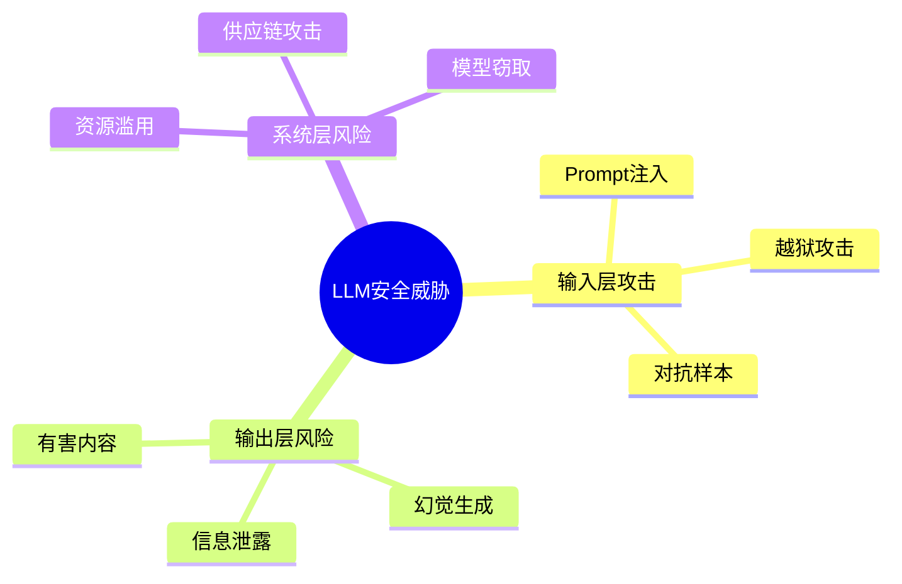
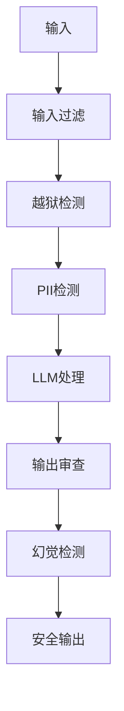

# 08 - 模型安全与对齐（Model Safety & Alignment）

本模块系统介绍 LLM 应用的安全风险、防护机制与对齐技术，重点面向 Java 后端开发者的生产实践需求。

## 目录

| # | 文档 | 简介 |
|---|------|------|
| 1 | [安全概述](./08-model-safety-alignment/01-safety-overview.md) | LLM 安全风险概览、安全生命周期 |
| 2 | [Prompt 注入](./08-model-safety-alignment/02-prompt-injection.md) | 攻击类型与防护策略、Java 实现 |
| 3 | [输出审查](./08-model-safety-alignment/03-output-safety.md) | 有害内容检测、敏感信息过滤 |
| 4 | [隐私保护](./08-model-safety-alignment/04-privacy-protection.md) | PII 检测、数据脱敏、差分隐私 |
| 5 | [越狱防御](./08-model-safety-alignment/05-jailbreak-defense.md) | 越狱攻击类型与防御策略 |
| 6 | [幻觉缓解](./08-model-safety-alignment/06-hallucination-mitigation.md) | 幻觉检测方法与缓解策略 |
| 7 | [Java 实战](./08-model-safety-alignment/07-java-safety-practice.md) | Spring Boot 安全系统完整实现 |

## 核心概念速览

### 安全威胁模型



### 防御层次



## 学习路径建议

```
安全概述（01）
    ↓
输入层防护
    ├── Prompt 注入（02）
    └── 越狱防御（05）
    ↓
输出层防护
    ├── 输出审查（03）
    └── 幻觉缓解（06）
    ↓
数据层防护
    └── 隐私保护（04）
    ↓
Java 实战（07）
```

## 与其他模块的关系

- 本模块为 [06 - RAG](./06-rag-knowledge-retrieval.md) 提供安全增强
- 本模块与 [07 - 多智能体系统](./07-multi-agent-systems.md) 结合实现安全的多 Agent 协作
- 本模块为生产部署提供安全保障

---

> 📌 详细内容见各子章节，Java 实战示例见 [07-java-safety-practice.md](./08-model-safety-alignment/07-java-safety-practice.md)
