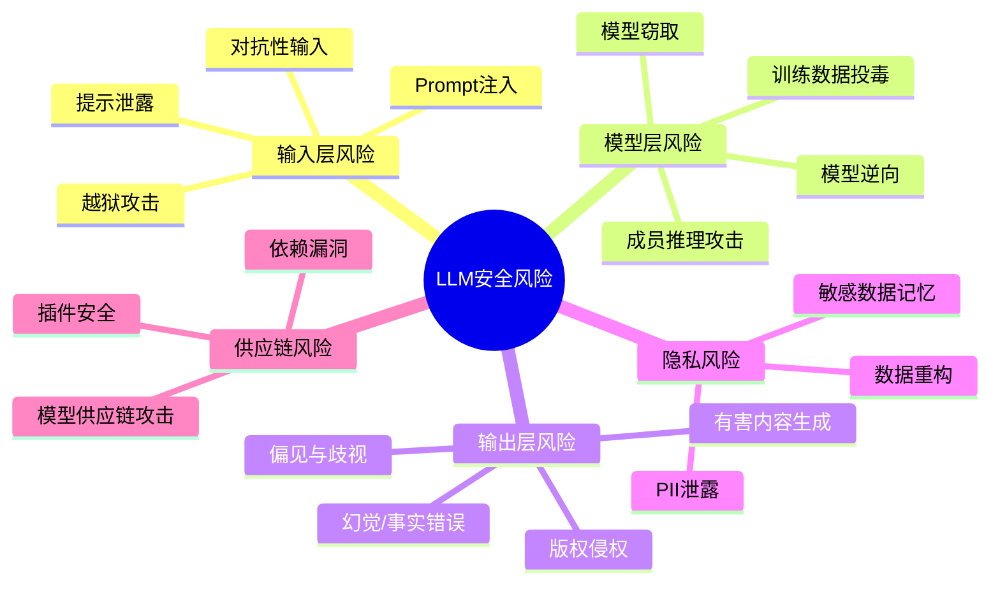
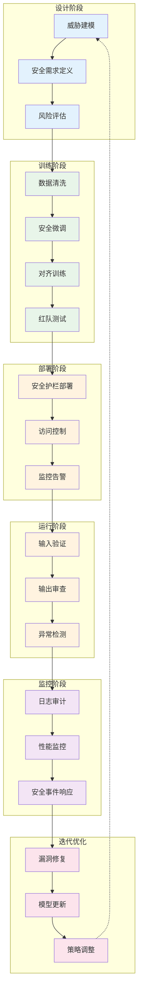
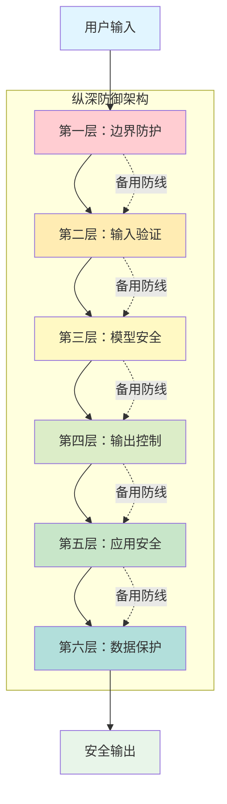
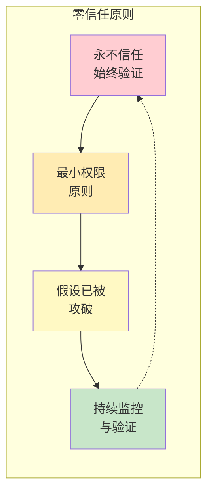
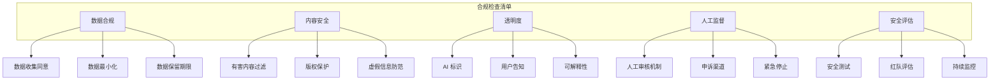
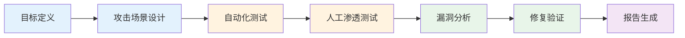

# 01 - 安全概述

## LLM 安全风险概览

大语言模型（LLM）在带来强大能力的同时，也引入了多种安全风险。了解这些风险是构建安全 AI 应用的第一步。

### 主要安全风险分类

### 风险详细说明

| 风险类别 | 具体风险 | 描述 | 严重程度 |
|---------|---------|------|---------|
| **输入层** | Prompt 注入 | 攻击者通过精心构造的输入覆盖系统提示，获取未授权信息或执行恶意操作 | 🔴 高 |
| | 越狱攻击 | 绕过模型的安全限制，诱导模型生成有害内容 | 🔴 高 |
| | 提示泄露 | 诱导模型泄露系统提示词或训练数据 | 🟡 中 |
| **模型层** | 训练数据投毒 | 在训练数据中注入恶意样本，影响模型行为 | 🔴 高 |
| | 模型窃取 | 通过 API 调用提取模型参数或架构 | 🟡 中 |
| **输出层** | 有害内容 | 生成违法、暴力、仇恨言论等内容 | 🔴 高 |
| | 幻觉 | 生成看似真实但实际错误的信息 | 🟡 中 |
| | 偏见输出 | 基于训练数据中的偏见产生歧视性内容 | 🟡 中 |
| **隐私层** | PII 泄露 | 输出包含个人身份信息 | 🔴 高 |
| | 敏感数据记忆 | 模型记忆并输出训练中的敏感数据 | 🔴 高 |

## 安全生命周期

LLM 安全是一个贯穿整个生命周期的持续过程。

### 各阶段安全活动

#### 1. 设计阶段
- **威胁建模**：识别潜在攻击向量和威胁场景
- **安全需求定义**：明确安全目标和合规要求
- **风险评估**：评估各类风险的可能性和影响

#### 2. 训练阶段
- **数据清洗**：移除训练数据中的有害内容和敏感信息
- **安全微调**：在安全数据集上进行微调
- **对齐训练**：使用 RLHF 等技术对齐模型与人类价值观
- **红队测试**：模拟攻击者发现模型漏洞

#### 3. 部署阶段
- **安全护栏部署**：实施输入/输出过滤机制
- **访问控制**：配置身份验证和授权策略
- **监控告警**：建立安全监控体系

#### 4. 运行阶段
- **输入验证**：实时检测恶意输入
- **输出审查**：过滤有害或敏感输出
- **异常检测**：识别异常使用模式

#### 5. 监控阶段
- **日志审计**：记录和分析所有交互
- **性能监控**：监控模型性能和安全指标
- **安全事件响应**：建立应急响应流程

#### 6. 迭代优化
- **漏洞修复**：及时修补发现的安全漏洞
- **模型更新**：定期更新模型以修复安全问题
- **策略调整**：根据新威胁调整安全策略

## 安全架构原则

### 纵深防御（Defense in Depth）

### 零信任安全模型

## 合规与标准

### 主要合规框架

| 框架/标准 | 适用范围 | 关键要求 |
|---------|---------|---------|
| **欧盟 AI 法案** | 欧盟市场 | 风险分级、透明度、人工监督 |
| **GDPR** | 欧盟个人数据 | 数据最小化、目的限制、被遗忘权 |
| **CCPA/CPRA** | 加州消费者 | 知情权、删除权、选择退出 |
| **ISO/IEC 42001** | AI 管理系统 | AI 治理、风险管理、持续改进 |
| **NIST AI RMF** | 美国 | 治理、映射、测量、管理 |
| **中国生成式 AI 办法** | 中国市场 | 内容安全、数据标注、安全评估 |

### 合规检查清单

## 安全评估方法

### 红队测试（Red Teaming）

### 评估维度

| 维度 | 评估内容 | 方法 |
|-----|---------|------|
| **有害内容** | 暴力、仇恨、违法内容生成 | 对抗性提示测试 |
| **隐私泄露** | PII、敏感信息输出 | 成员推理攻击 |
| **越狱抗性** | 绕过安全限制的能力 | 越狱提示库测试 |
| **偏见公平** | 性别、种族、文化偏见 | 公平性基准测试 |
| **事实准确性** | 幻觉、错误信息 | 事实核查基准 |
| **鲁棒性** | 对抗样本抗性 | 对抗攻击测试 |

## 最佳实践总结

### 开发阶段
1. **安全左移**：在设计阶段就考虑安全问题
2. **数据治理**：建立严格的数据收集和清洗流程
3. **持续测试**：集成安全测试到 CI/CD 流程

### 部署阶段
1. **分层防护**：实施多层安全控制
2. **最小权限**：限制模型和系统的访问权限
3. **监控告警**：建立实时安全监控

### 运维阶段
1. **日志审计**：保留完整的交互日志
2. **定期评估**：定期进行安全评估和红队测试
3. **应急响应**：制定安全事件响应计划

---

> 📌 下一节：[Prompt 注入攻击与防护](./02-prompt-injection.md)
