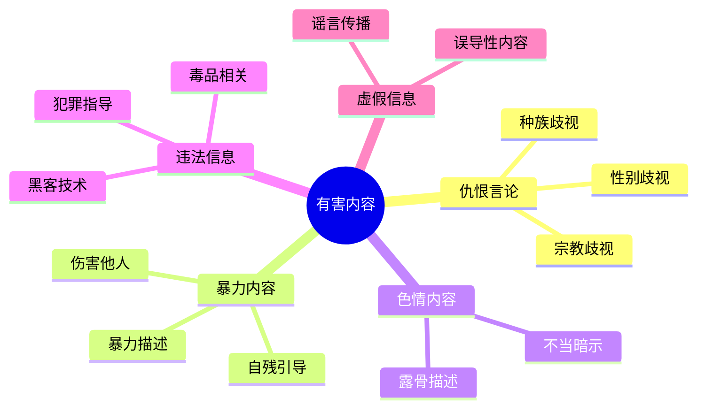
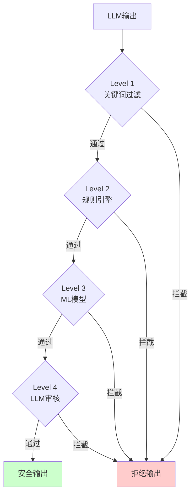
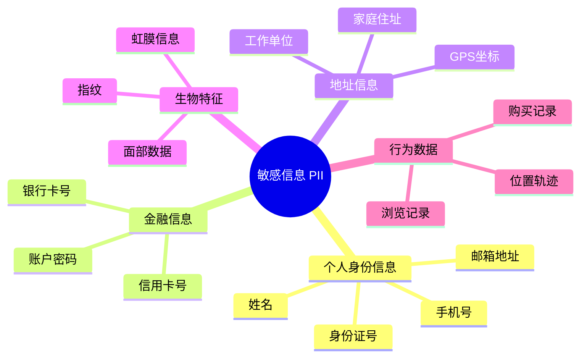
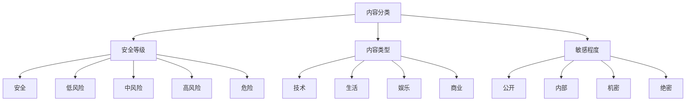

# 03 - 输出内容审查

## 目录

1. [有害内容检测](#1-有害内容检测)
2. [敏感信息过滤](#2-敏感信息过滤)
3. [内容分类与标签](#3-内容分类与标签)
4. [Java 实现示例](#4-java-实现示例)

---

## 1. 有害内容检测

### 1.1 有害内容类型



### 1.2 检测方法

| 方法 | 原理 | 优点 | 缺点 |
|------|------|------|------|
| **关键词匹配** | 黑名单词表 | 简单快速 | 易绕过、误报高 |
| **规则引擎** | 正则表达式 + 规则 | 可解释性强 | 维护成本高 |
| **机器学习** | 分类模型 | 准确率高 | 需要训练数据 |
| **LLM 判断** | 大模型审核 | 理解能力强 | 成本高、延迟大 |
| **混合方案** | 多层级过滤 | 综合优势 | 系统复杂 |

### 1.3 多层级过滤架构



---

## 2. 敏感信息过滤

### 2.1 PII 类型



### 2.2 脱敏策略

| 策略 | 示例 | 适用场景 |
|------|------|---------|
| **掩码** | 138****8888 | 日志展示 |
| **哈希** | SHA256(身份证) | 数据存储 |
| **加密** | AES(手机号) | 传输存储 |
| **替换** | [姓名] | 训练数据 |
| **删除** | - | 完全移除 |

---

## 3. 内容分类与标签

### 3.1 分类体系



---

## 4. Java 实现示例

### 4.1 内容审查服务

```java
@Service
@Slf4j
public class ContentSafetyService {
    
    @Autowired
    private KeywordFilter keywordFilter;
    
    @Autowired
    private RuleEngine ruleEngine;
    
    @Autowired
    private SafetyClassifier classifier;
    
    /**
     * 多层级内容审查
     */
    public SafetyCheckResult checkContent(String content) {
        // Level 1: 关键词过滤
        KeywordCheckResult keywordResult = keywordFilter.check(content);
        if (keywordResult.isBlocked()) {
            return SafetyCheckResult.blocked("关键词拦截: " + keywordResult.getMatchedWords());
        }
        
        // Level 2: 规则引擎
        RuleCheckResult ruleResult = ruleEngine.check(content);
        if (ruleResult.isBlocked()) {
            return SafetyCheckResult.blocked("规则拦截: " + ruleResult.getTriggeredRules());
        }
        
        // Level 3: ML 分类器
        ClassificationResult classification = classifier.classify(content);
        if (classification.getSafetyScore() < 0.3) {
            return SafetyCheckResult.blocked("分类器拦截，安全分数: " + classification.getSafetyScore());
        }
        
        // 通过审查
        return SafetyCheckResult.passed(classification.getSafetyScore());
    }
}

// 审查结果
@Data
@Builder
public class SafetyCheckResult {
    private boolean passed;
    private String reason;
    private double safetyScore;
    private List<String> labels;
    
    public static SafetyCheckResult passed(double score) {
        return SafetyCheckResult.builder()
            .passed(true)
            .safetyScore(score)
            .build();
    }
    
    public static SafetyCheckResult blocked(String reason) {
        return SafetyCheckResult.builder()
            .passed(false)
            .reason(reason)
            .build();
    }
}
```

### 4.2 PII 检测与脱敏

```java
@Service
public class PIIDetector {
    
    private final List<PIIPattern> patterns;
    
    public PIIDetector() {
        this.patterns = List.of(
            // 手机号
            new PIIPattern("PHONE", "1[3-9]\\d{9}", "****"),
            // 身份证号
            new PIIPattern("ID_CARD", "\\d{17}[\\dXx]", "********"),
            // 邮箱
            new PIIPattern("EMAIL", "[\\w.-]+@[\\w.-]+\\.\\w+", "***@***.com"),
            // 银行卡
            new PIIPattern("BANK_CARD", "\\d{16,19}", "****")
        );
    }
    
    /**
     * 检测 PII
     */
    public List<PIIFinding> detect(String text) {
        List<PIIFinding> findings = new ArrayList<>();
        
        for (PIIPattern pattern : patterns) {
            Matcher matcher = pattern.getRegex().matcher(text);
            while (matcher.find()) {
                findings.add(PIIFinding.builder()
                    .type(pattern.getType())
                    .start(matcher.start())
                    .end(matcher.end())
                    .value(matcher.group())
                    .build());
            }
        }
        
        return findings;
    }
    
    /**
     * 脱敏处理
     */
    public String mask(String text) {
        String result = text;
        
        for (PIIPattern pattern : patterns) {
            result = pattern.getRegex().matcher(result)
                .replaceAll(pattern.getMask());
        }
        
        return result;
    }
}

@Data
@Builder
public class PIIFinding {
    private String type;
    private int start;
    private int end;
    private String value;
}

@Data
@AllArgsConstructor
public class PIIPattern {
    private String type;
    private Pattern regex;
    private String mask;
    
    public PIIPattern(String type, String regex, String mask) {
        this.type = type;
        this.regex = Pattern.compile(regex);
        this.mask = mask;
    }
}
```

### 4.3 REST API 集成

```java
@RestController
@RequestMapping("/api/safety")
public class SafetyController {
    
    @Autowired
    private ContentSafetyService safetyService;
    
    @Autowired
    private PIIDetector piiDetector;
    
    @PostMapping("/check")
    public ResponseEntity<SafetyCheckResult> checkContent(
        @RequestBody CheckRequest request
    ) {
        SafetyCheckResult result = safetyService.checkContent(request.getContent());
        return ResponseEntity.ok(result);
    }
    
    @PostMapping("/mask")
    public ResponseEntity<MaskResponse> maskPII(
        @RequestBody MaskRequest request
    ) {
        String masked = piiDetector.mask(request.getContent());
        List<PIIFinding> findings = piiDetector.detect(request.getContent());
        
        return ResponseEntity.ok(MaskResponse.builder()
            .original(request.getContent())
            .masked(masked)
            .findings(findings)
            .build());
    }
}
```

---

> 📌 下一步学习：
> - [04-privacy-protection.md](./04-privacy-protection.md) - 隐私保护
> - [05-jailbreak-defense.md](./05-jailbreak-defense.md) - 越狱攻击与防御
