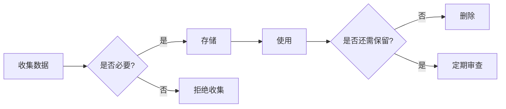

# 04 - 隐私保护

## 1. 隐私保护原则

### 1.1 数据最小化



### 1.2 隐私保护技术栈

| 层级 | 技术 | 作用 |
|------|------|------|
| 传输层 | TLS/SSL | 加密传输 |
| 存储层 | AES-256 | 加密存储 |
| 应用层 | Tokenization | 令牌化 |
| 数据层 | 差分隐私 | 噪声添加 |

## 2. Java 实现

```java
@Service
public class PrivacyService {
    
    /**
     * 数据脱敏
     */
    public String anonymize(String data, DataType type) {
        return switch (type) {
            case PHONE -> data.replaceAll("(\\d{3})\\d{4}(\\d{4})", "$1****$2");
            case EMAIL -> data.replaceAll("(\\w{2})\\w+(@\\w+)", "$1***$2");
            case ID_CARD -> data.replaceAll("(\\d{6})\\d{8}(\\d{4})", "$1********$2");
            default -> data;
        };
    }
    
    /**
     * 差分隐私（添加噪声）
     */
    public double addNoise(double value, double epsilon) {
        double sensitivity = 1.0;
        double scale = sensitivity / epsilon;
        return value + laplaceNoise(scale);
    }
    
    private double laplaceNoise(double scale) {
        double u = Math.random() - 0.5;
        return -scale * Math.signum(u) * Math.log(1 - 2 * Math.abs(u));
    }
}
```

---

> 📌 下一步：[05-jailbreak-defense.md](./05-jailbreak-defense.md)
