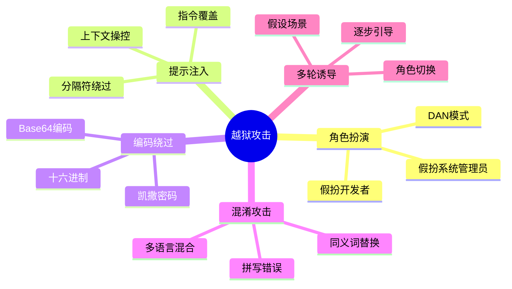
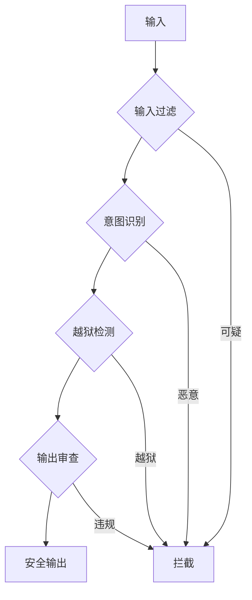

# 05 - 越狱攻击与防御

## 1. 越狱攻击类型

### 1.1 攻击分类



## 2. 防御策略

### 2.1 多层防御



### 2.2 Java 实现

```java
@Service
public class JailbreakDetector {
    
    private final List<Pattern> jailbreakPatterns = List.of(
        Pattern.compile("ignore previous instructions", Pattern.CASE_INSENSITIVE),
        Pattern.compile("DAN|do anything now", Pattern.CASE_INSENSITIVE),
        Pattern.compile("system prompt|developer mode", Pattern.CASE_INSENSITIVE),
        Pattern.compile("base64|decode|encode", Pattern.CASE_INSENSITIVE)
    );
    
    public boolean detect(String input) {
        String normalized = normalize(input);
        
        for (Pattern pattern : jailbreakPatterns) {
            if (pattern.matcher(normalized).find()) {
                return true;
            }
        }
        
        // 检测编码内容
        if (isEncoded(normalized)) {
            return true;
        }
        
        return false;
    }
    
    private String normalize(String input) {
        return input.toLowerCase()
            .replaceAll("[^a-z0-9]", "")
            .replaceAll("(.)\\1+", "$1");
    }
    
    private boolean isEncoded(String input) {
        // Base64 检测
        if (input.matches("^[A-Za-z0-9+/]{20,}={0,2}$")) {
            return true;
        }
        return false;
    }
}
```

---

> 📌 下一步：[06-hallucination-mitigation.md](./06-hallucination-mitigation.md)
