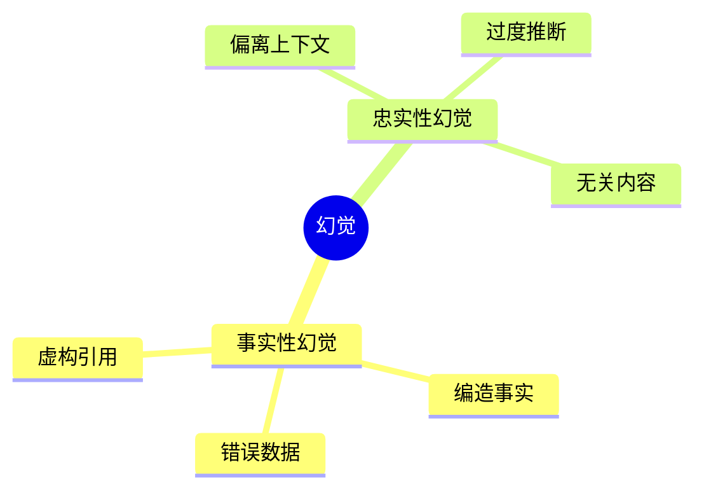
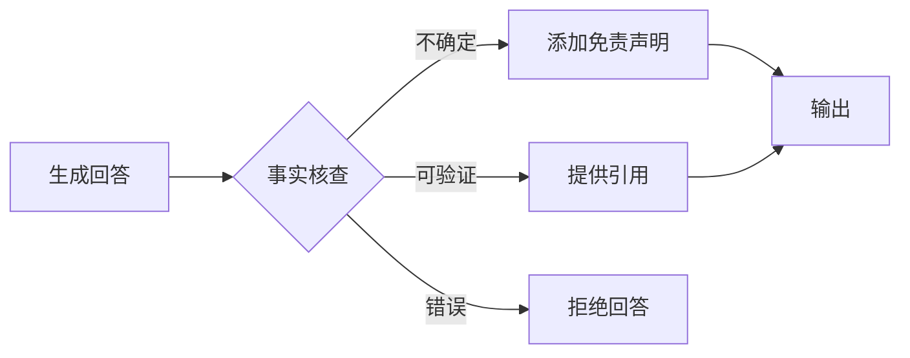

# 06 - 幻觉检测与缓解

## 1. 幻觉类型



## 2. 检测方法

| 方法 | 描述 | 实现 |
|------|------|------|
| 事实核查 | 与知识库对比 | RAG + 引用验证 |
| 一致性检查 | 多次生成对比 | Self-consistency |
| NLI 验证 | 自然语言推理 | 蕴含/矛盾检测 |
| 置信度评分 | 模型输出概率 | Token probability |

## 3. 缓解策略



## 4. Java 实现

```java
@Service
public class HallucinationMitigator {
    
    @Autowired
    private FactChecker factChecker;
    
    /**
     * 检测幻觉
     */
    public HallucinationCheck check(String answer, String context) {
        List<Claim> claims = extractClaims(answer);
        List<Claim> unsupported = new ArrayList<>();
        
        for (Claim claim : claims) {
            if (!factChecker.verify(claim, context)) {
                unsupported.add(claim);
            }
        }
        
        return HallucinationCheck.builder()
            .hasHallucination(!unsupported.isEmpty())
            .unsupportedClaims(unsupported)
            .build();
    }
    
    /**
     * 添加安全提示
     */
    public String addDisclaimer(String answer, HallucinationCheck check) {
        if (check.hasHallucination()) {
            return answer + "\n\n[注意：部分内容可能未经验证，请核实关键信息]";
        }
        return answer;
    }
}
```

---

> 📌 下一步：[07-java-safety-practice.md](./07-java-safety-practice.md)
