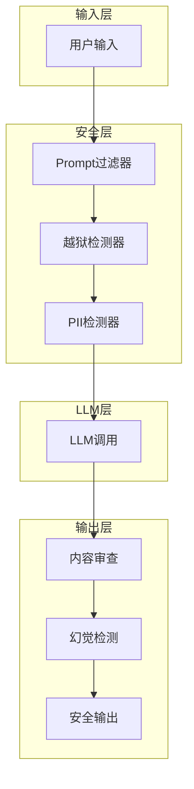

# 07 - Java 实战：安全系统

## 1. 项目架构



## 2. 核心代码

```java
@Service
public class SecureLLMService {
    
    @Autowired
    private PromptFilter promptFilter;
    
    @Autowired
    private JailbreakDetector jailbreakDetector;
    
    @Autowired
    private ContentSafetyService safetyService;
    
    @Autowired
    private ChatClient chatClient;
    
    public SecureResponse generate(SecureRequest request) {
        // 1. 输入安全检查
        InputCheck inputCheck = checkInput(request.getPrompt());
        if (!inputCheck.isSafe()) {
            return SecureResponse.error(inputCheck.getReason());
        }
        
        // 2. 调用 LLM
        String response = chatClient.prompt()
            .user(request.getPrompt())
            .call()
            .content();
        
        // 3. 输出安全检查
        OutputCheck outputCheck = checkOutput(response);
        if (!outputCheck.isSafe()) {
            return SecureResponse.error("输出内容不安全");
        }
        
        return SecureResponse.success(response);
    }
    
    private InputCheck checkInput(String prompt) {
        // 越狱检测
        if (jailbreakDetector.detect(prompt)) {
            return InputCheck.unsafe("检测到越狱攻击");
        }
        
        // Prompt 注入检测
        if (promptFilter.detectInjection(prompt)) {
            return InputCheck.unsafe("检测到Prompt注入");
        }
        
        return InputCheck.safe();
    }
    
    private OutputCheck checkOutput(String response) {
        // 内容安全审查
        SafetyCheckResult result = safetyService.checkContent(response);
        if (!result.isPassed()) {
            return OutputCheck.unsafe(result.getReason());
        }
        
        return OutputCheck.safe();
    }
}

@RestController
@RequestMapping("/api/secure-llm")
public class SecureLLMController {
    
    @Autowired
    private SecureLLMService secureLLMService;
    
    @PostMapping("/generate")
    public ResponseEntity<SecureResponse> generate(
        @RequestBody SecureRequest request
    ) {
        SecureResponse response = secureLLMService.generate(request);
        return ResponseEntity.ok(response);
    }
}
```

## 3. 配置

```yaml
security:
  prompt-filter:
    enabled: true
    blacklist: ["ignore", "system", "developer"]
  jailbreak-detection:
    enabled: true
    sensitivity: HIGH
  content-safety:
    enabled: true
    levels: 4
```

---

> 📌 至此，模型安全与对齐模块全部完成。
