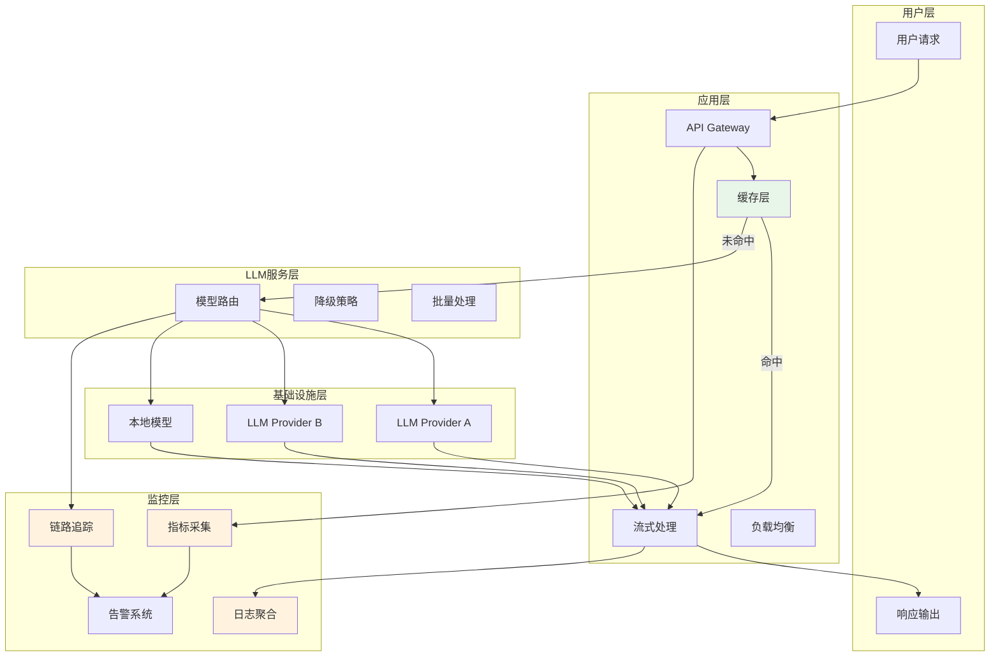
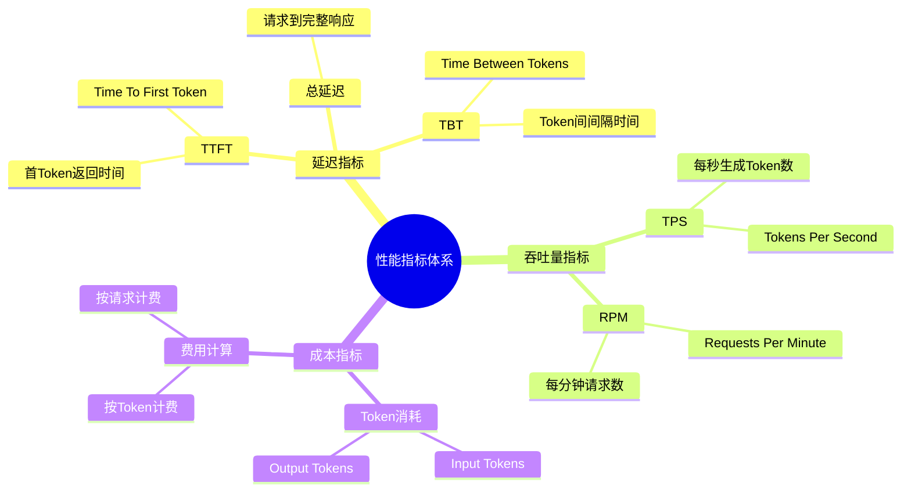
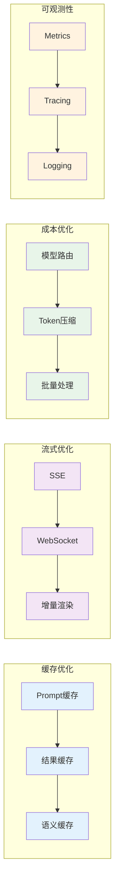
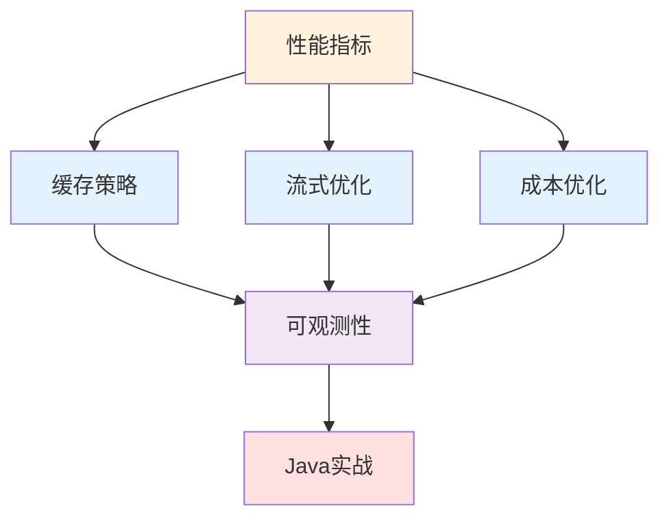

# 09 - 性能优化与监控（Performance Monitoring & Optimization）

本模块系统介绍 LLM 应用的性能优化与监控体系，涵盖性能指标定义、缓存策略、流式优化、成本控制、可观测性建设以及 Java 生产环境实战，帮助开发者构建高性能、低成本、可观测的 LLM 应用系统。

## 目录

| # | 文档 | 简介 |
|---|------|------|
| 1 | [性能指标](./09-performance-monitoring/01-performance-metrics.md) | 延迟指标、吞吐量指标、成本指标定义与计算 |
| 2 | [缓存策略](./09-performance-monitoring/02-caching-strategies.md) | Prompt缓存、结果缓存、语义缓存实现 |
| 3 | [流式优化](./09-performance-monitoring/03-streaming-optimization.md) | SSE、WebSocket、增量渲染技术 |
| 4 | [成本优化](./09-performance-monitoring/04-cost-optimization.md) | 模型选择策略、Token优化、批量处理 |
| 5 | [可观测性](./09-performance-monitoring/05-observability.md) | Logging、Tracing、Metrics 与工具推荐 |
| 6 | [Java 实战](./09-performance-monitoring/06-java-performance-practice.md) | Spring Boot 性能优化与 Micrometer 集成 |

## 核心概念速览

### 为什么需要性能优化与监控？

LLM 应用与传统应用相比，具有响应延迟高、成本波动大、资源消耗不可预测等特点，因此需要专门的性能优化与监控体系。

| 传统应用 | LLM 应用 |
|---------|---------|
| 响应时间毫秒级 | 响应时间秒级甚至分钟级 |
| 成本相对固定 | 成本与Token消耗直接挂钩 |
| 资源消耗可预测 | 上下文长度影响资源消耗 |
| 简单监控即可 | 需要多维度可观测性 |

### 性能优化与监控架构

## 关键性能指标

## 优化策略全景

## 学习路径建议

## 与其他模块的关系

- 本模块为 [03 - LLM 模型研究](./03-llm-models-research.md) 中的模型选型提供成本参考
- 本模块为 [04 - Agent 框架](./04-agent-frameworks.md) 提供性能监控集成方案
- 本模块与 [05 - LLM API 与提供商](./05-llm-apis-providers.md) 结合实现多提供商路由与降级
- 本模块为 [06 - RAG / 知识检索](./06-rag-knowledge-retrieval.md) 提供检索性能优化
- 本模块为 [07 - 多智能体系统](./07-multi-agent-systems.md) 提供分布式监控方案

## 推荐工具

| 类别 | 工具 | 用途 |
|-----|------|------|
| 可观测性 | Langfuse | LLM 应用可观测性平台 |
| 可观测性 | LangSmith | LangChain 官方监控工具 |
| 指标采集 | Micrometer | Java 指标采集标准 |
| 链路追踪 | OpenTelemetry | 分布式链路追踪 |
| 日志聚合 | ELK Stack | 日志收集与分析 |
| 监控告警 | Prometheus + Grafana | 指标监控与可视化 |

---

> 📌 详细内容见各子章节，Java 实战示例见 [06-java-performance-practice.md](./09-performance-monitoring/06-java-performance-practice.md)
