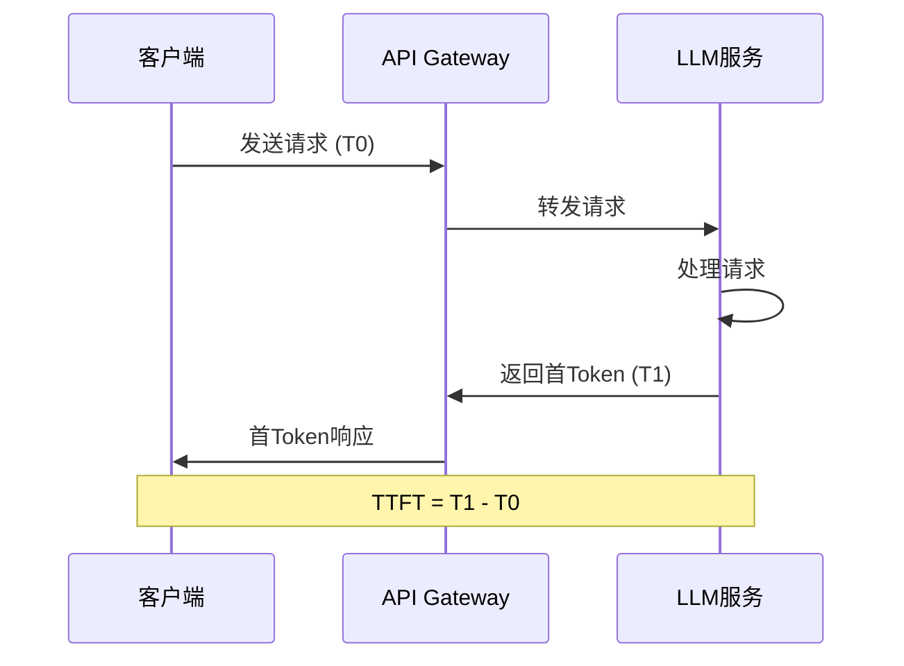
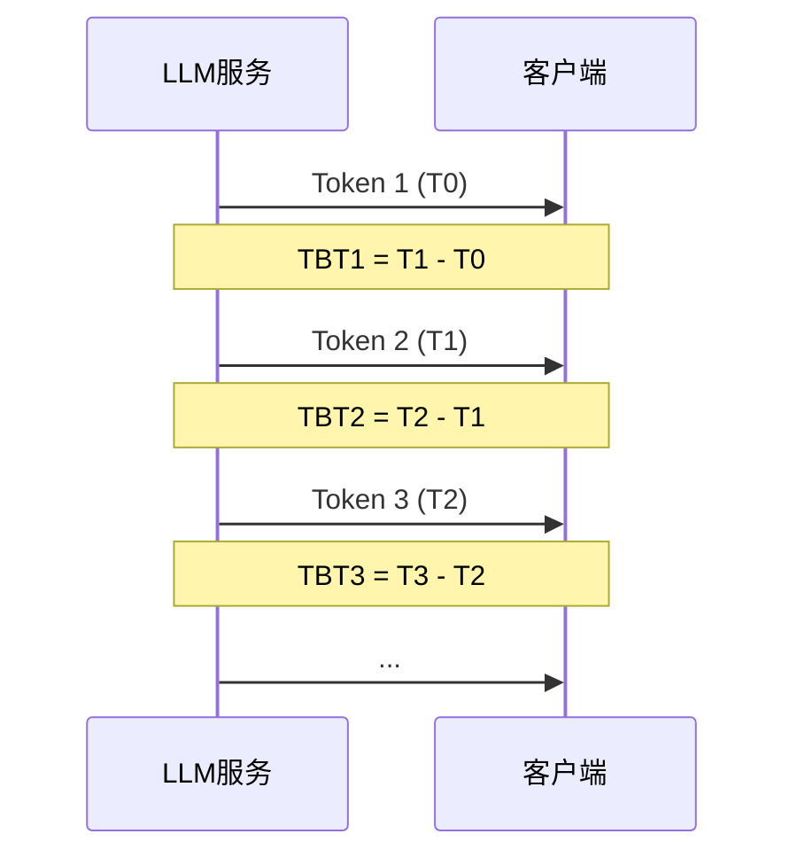
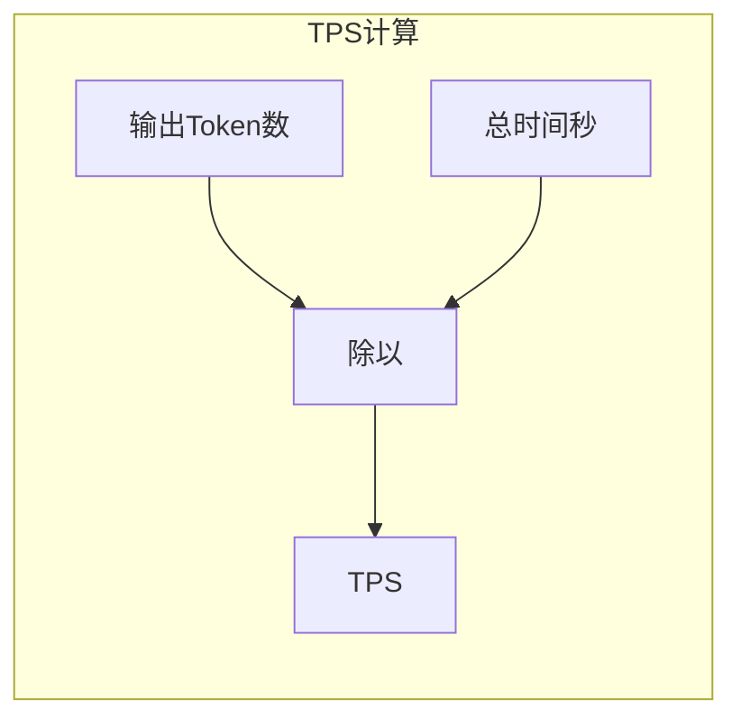
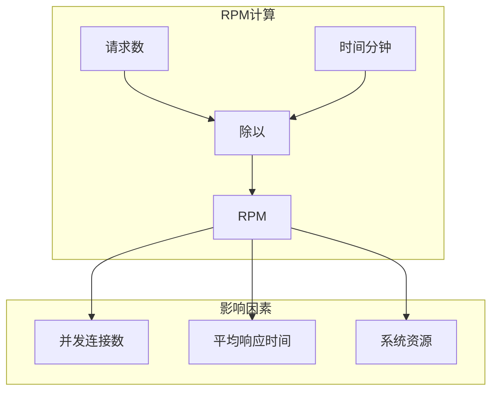
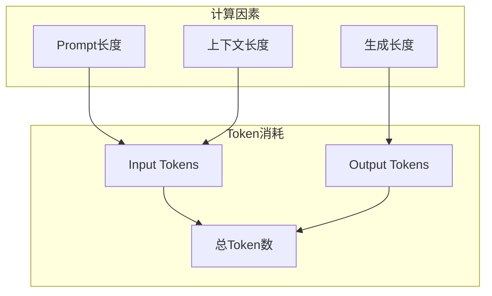
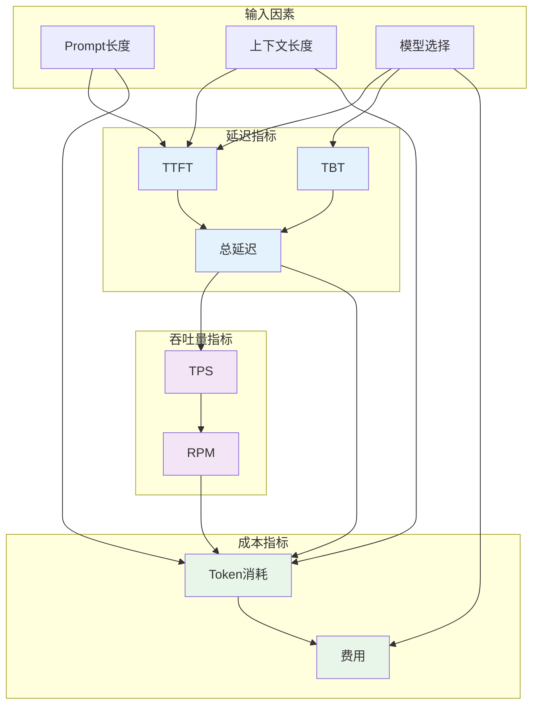

# 性能指标（Performance Metrics）

本文档详细介绍 LLM 应用中的核心性能指标，包括延迟指标、吞吐量指标和成本指标的定义、计算方法与监控实践。

## 目录

1. [延迟指标](#延迟指标)
2. [吞吐量指标](#吞吐量指标)
3. [成本指标](#成本指标)
4. [指标关系图](#指标关系图)
5. [Java 实现示例](#java-实现示例)

## 延迟指标

延迟是 LLM 应用最重要的性能指标之一，直接影响用户体验。

### TTFT（Time To First Token）

**定义**：从发送请求到接收到第一个 Token 的时间间隔。



**影响因素**：
- 网络延迟
- 模型加载时间
- 输入 Token 数量
- 当前服务负载

**典型值**：
| 模型类型 | 典型 TTFT |
|---------|----------|
| GPT-3.5 | 100-300ms |
| GPT-4 | 200-500ms |
| Claude 3 | 150-400ms |
| 本地 7B 模型 | 500ms-2s |

### TBT（Time Between Tokens）

**定义**：相邻 Token 生成的时间间隔，反映流式输出的流畅度。



**影响因素**：
- 模型推理速度
- 输出 Token 数量
- 硬件性能（GPU/CPU）
- 批处理大小

**典型值**：
| 模型类型 | 典型 TBT |
|---------|---------|
| GPT-3.5 | 10-30ms |
| GPT-4 | 20-50ms |
| Claude 3 | 15-40ms |
| 本地 7B 模型 | 50-200ms |

### 总延迟（Total Latency）

**定义**：从发送请求到接收完整响应的总时间。

```
总延迟 = TTFT + (输出Token数 - 1) × TBT + 网络开销
```

**示例计算**：
```
场景：生成 500 个 Token 的响应
- TTFT = 200ms
- TBT = 20ms
- 网络开销 = 50ms

总延迟 = 200ms + (500 - 1) × 20ms + 50ms
       = 200ms + 9980ms + 50ms
       = 10.23s
```

## 吞吐量指标

### TPS（Tokens Per Second）

**定义**：每秒生成的 Token 数量，是衡量模型生成速度的核心指标。



**计算公式**：
```
TPS = 输出Token数 / (TTFT + (输出Token数 - 1) × TBT) × 1000
```

**示例**：
```
输出Token数 = 1000
总时间 = 15s
TPS = 1000 / 15 = 66.7 tokens/s
```

**典型值**：
| 模型类型 | 典型 TPS |
|---------|---------|
| GPT-3.5 | 50-100 |
| GPT-4 | 30-60 |
| Claude 3 | 40-80 |
| 本地 7B 模型 | 10-30 |

### RPM（Requests Per Minute）

**定义**：每分钟处理的请求数量，反映系统并发处理能力。



**计算公式**：
```
RPM = 请求数 / 时间(分钟)
理论最大 RPM = 并发连接数 × (60 / 平均响应时间秒)
```

**示例**：
```
场景：100 个并发连接，平均响应时间 5s
理论最大 RPM = 100 × (60 / 5) = 1200 RPM
```

## 成本指标

### Token 消耗

**定义**：LLM API 调用中输入和输出 Token 的总数量。



**Token 估算方法**：
```
中文：1 Token ≈ 1-2 个汉字
英文：1 Token ≈ 0.75 个单词
代码：1 Token ≈ 1-4 个字符
```

### 费用计算

**定价模式**：
| 计费方式 | 说明 | 适用场景 |
|---------|------|---------|
| 按 Token 计费 | 输入 + 输出 Token 分别计价 | 大多数 LLM API |
| 按请求计费 | 固定费用/请求 | 某些 Embedding API |
| 按时间计费 | 模型实例运行时间 | 专用实例 |

**计算公式**：
```
总费用 = (输入Token数 × 输入单价) + (输出Token数 × 输出单价)
```

**主流模型定价参考**（2024）：
| 模型 | 输入单价 | 输出单价 |
|-----|---------|---------|
| GPT-4o | $5/M tokens | $15/M tokens |
| GPT-3.5-turbo | $0.5/M tokens | $1.5/M tokens |
| Claude 3 Opus | $15/M tokens | $75/M tokens |
| Claude 3 Sonnet | $3/M tokens | $15/M tokens |

## 指标关系图



## Java 实现示例

### 性能指标采集器

```java
import java.time.Duration;
import java.time.Instant;
import java.util.concurrent.atomic.AtomicLong;
import java.util.concurrent.atomic.LongAdder;

/**
 * LLM性能指标采集器
 */
public class LLMMetricsCollector {
    
    // 延迟指标
    private final LongAdder totalRequests = new LongAdder();
    private final LongAdder totalLatencyMs = new LongAdder();
    private final LongAdder totalTTFTMs = new LongAdder();
    private final LongAdder totalTokens = new LongAdder();
    
    // Token消耗
    private final LongAdder inputTokens = new LongAdder();
    private final LongAdder outputTokens = new LongAdder();
    
    // 并发控制
    private final AtomicLong activeRequests = new AtomicLong(0);
    private final AtomicLong maxConcurrentRequests = new AtomicLong(0);
    
    /**
     * 记录请求开始
     */
    public RequestContext startRequest() {
        long current = activeRequests.incrementAndGet();
        maxConcurrentRequests.updateAndGet(max -> Math.max(max, current));
        return new RequestContext(Instant.now());
    }
    
    /**
     * 记录首Token返回
     */
    public void recordFirstToken(RequestContext context) {
        context.setFirstTokenTime(Instant.now());
    }
    
    /**
     * 记录请求完成
     */
    public void recordComplete(RequestContext context, int inputTokenCount, int outputTokenCount) {
        Instant now = Instant.now();
        long latencyMs = Duration.between(context.getStartTime(), now).toMillis();
        long ttftMs = context.getFirstTokenTime() != null 
            ? Duration.between(context.getStartTime(), context.getFirstTokenTime()).toMillis()
            : latencyMs;
        
        totalRequests.increment();
        totalLatencyMs.add(latencyMs);
        totalTTFTMs.add(ttftMs);
        totalTokens.add(outputTokenCount);
        inputTokens.add(inputTokenCount);
        outputTokens.add(outputTokenCount);
        activeRequests.decrementAndGet();
    }
    
    /**
     * 获取当前指标快照
     */
    public MetricsSnapshot getSnapshot() {
        long requests = totalRequests.sum();
        return new MetricsSnapshot(
            requests,
            requests > 0 ? totalLatencyMs.sum() / requests : 0,
            requests > 0 ? totalTTFTMs.sum() / requests : 0,
            totalTokens.sum(),
            inputTokens.sum(),
            outputTokens.sum(),
            activeRequests.get(),
            maxConcurrentRequests.get()
        );
    }
    
    /**
     * 计算TPS
     */
    public double calculateTPS(long outputTokens, long latencyMs) {
        return latencyMs > 0 ? (outputTokens * 1000.0) / latencyMs : 0;
    }
    
    /**
     * 计算RPM
     */
    public double calculateRPM(long requests, long durationMinutes) {
        return durationMinutes > 0 ? (double) requests / durationMinutes : 0;
    }
    
    /**
     * 计算预估成本（以GPT-3.5为例）
     */
    public double calculateCost(long inputTokens, long outputTokens) {
        // GPT-3.5-turbo: 输入 $0.5/M, 输出 $1.5/M
        double inputCost = (inputTokens / 1_000_000.0) * 0.5;
        double outputCost = (outputTokens / 1_000_000.0) * 1.5;
        return inputCost + outputCost;
    }
    
    // 请求上下文
    public static class RequestContext {
        private final Instant startTime;
        private volatile Instant firstTokenTime;
        
        public RequestContext(Instant startTime) {
            this.startTime = startTime;
        }
        
        public Instant getStartTime() { return startTime; }
        public Instant getFirstTokenTime() { return firstTokenTime; }
        public void setFirstTokenTime(Instant firstTokenTime) { 
            this.firstTokenTime = firstTokenTime; 
        }
    }
    
    // 指标快照
    public record MetricsSnapshot(
        long totalRequests,
        long avgLatencyMs,
        long avgTTFTMs,
        long totalOutputTokens,
        long totalInputTokens,
        long totalOutputTokenCount,
        long activeRequests,
        long maxConcurrentRequests
    ) {
        public double getAvgTPS() {
            return avgLatencyMs > 0 ? (totalOutputTokens * 1000.0) / (totalRequests * avgLatencyMs) : 0;
        }
        
        @Override
        public String toString() {
            return String.format(
                "Metrics{requests=%d, avgLatency=%dms, avgTTFT=%dms, avgTPS=%.2f, active=%d, maxConcurrent=%d}",
                totalRequests, avgLatencyMs, avgTTFTMs, getAvgTPS(), activeRequests, maxConcurrentRequests
            );
        }
    }
}
```

### 指标监控服务

```java
import io.micrometer.core.instrument.*;
import io.micrometer.core.instrument.simple.SimpleMeterRegistry;
import java.time.Duration;
import java.util.concurrent.TimeUnit;

/**
 * LLM指标监控服务（Micrometer集成）
 */
@Service
public class LLMMetricsService {
    
    private final MeterRegistry meterRegistry;
    private final LLMMetricsCollector metricsCollector;
    
    // Micrometer指标
    private final Timer latencyTimer;
    private final Timer ttftTimer;
    private final DistributionSummary tokenSummary;
    private final Counter requestCounter;
    private final Counter tokenCounter;
    private final Gauge activeRequestsGauge;
    
    public LLMMetricsService(MeterRegistry meterRegistry) {
        this.meterRegistry = meterRegistry;
        this.metricsCollector = new LLMMetricsCollector();
        
        // 初始化指标
        this.latencyTimer = Timer.builder("llm.request.latency")
            .description("LLM请求总延迟")
            .publishPercentiles(0.5, 0.95, 0.99)
            .register(meterRegistry);
            
        this.ttftTimer = Timer.builder("llm.request.ttft")
            .description("首Token返回时间")
            .publishPercentiles(0.5, 0.95, 0.99)
            .register(meterRegistry);
            
        this.tokenSummary = DistributionSummary.builder("llm.tokens.generated")
            .description("生成的Token数量分布")
            .publishPercentiles(0.5, 0.95, 0.99)
            .register(meterRegistry);
            
        this.requestCounter = Counter.builder("llm.requests.total")
            .description("总请求数")
            .register(meterRegistry);
            
        this.tokenCounter = Counter.builder("llm.tokens.total")
            .description("总Token数")
            .register(meterRegistry);
            
        this.activeRequestsGauge = Gauge.builder("llm.requests.active")
            .description("活跃请求数")
            .register(meterRegistry, metricsCollector, 
                c -> c.getSnapshot().activeRequests());
    }
    
    /**
     * 记录请求指标
     */
    public void recordRequest(Duration latency, Duration ttft, int inputTokens, int outputTokens) {
        latencyTimer.record(latency);
        ttftTimer.record(ttft);
        tokenSummary.record(outputTokens);
        requestCounter.increment();
        tokenCounter.increment(inputTokens + outputTokens);
    }
    
    /**
     * 获取Prometheus格式的指标
     */
    public String getPrometheusMetrics() {
        // 返回Prometheus格式的指标数据
        return ((SimpleMeterRegistry) meterRegistry).getMetersAsString();
    }
}
```

### 使用示例

```java
@RestController
@RequestMapping("/api/llm")
public class LLMController {
    
    @Autowired
    private LLMMetricsCollector metricsCollector;
    
    @Autowired
    private LLMClient llmClient;
    
    @PostMapping("/chat")
    public ResponseEntity<ChatResponse> chat(@RequestBody ChatRequest request) {
        // 开始记录
        var context = metricsCollector.startRequest();
        
        try {
            // 调用LLM
            var response = llmClient.chat(request.getPrompt());
            
            // 模拟流式响应，记录首Token时间
            metricsCollector.recordFirstToken(context);
            
            // 记录完成
            int inputTokens = estimateTokens(request.getPrompt());
            int outputTokens = estimateTokens(response.getContent());
            metricsCollector.recordComplete(context, inputTokens, outputTokens);
            
            return ResponseEntity.ok(response);
        } catch (Exception e) {
            // 异常处理
            throw e;
        }
    }
    
    @GetMapping("/metrics")
    public ResponseEntity<String> getMetrics() {
        var snapshot = metricsCollector.getSnapshot();
        double tps = snapshot.getAvgTPS();
        double cost = metricsCollector.calculateCost(
            snapshot.totalInputTokens(), 
            snapshot.totalOutputTokenCount()
        );
        
        String report = String.format(
            "LLM Performance Metrics:\n" +
            "- Total Requests: %d\n" +
            "- Avg Latency: %d ms\n" +
            "- Avg TTFT: %d ms\n" +
            "- Avg TPS: %.2f\n" +
            "- Active Requests: %d\n" +
            "- Max Concurrent: %d\n" +
            "- Total Cost: $%.4f",
            snapshot.totalRequests(),
            snapshot.avgLatencyMs(),
            snapshot.avgTTFTMs(),
            tps,
            snapshot.activeRequests(),
            snapshot.maxConcurrentRequests(),
            cost
        );
        
        return ResponseEntity.ok(report);
    }
    
    private int estimateTokens(String text) {
        // 简化的Token估算：中文按字，英文按词
        if (text == null) return 0;
        return text.length() / 2; // 粗略估算
    }
}
```

---

> 📌 下一节：[缓存策略](./02-caching-strategies.md)
