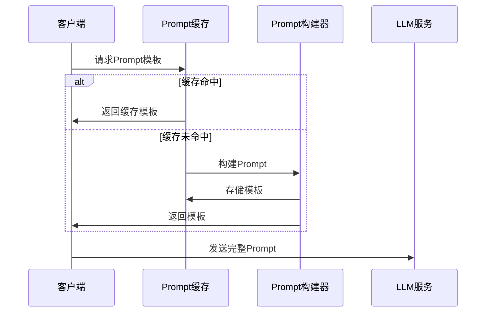
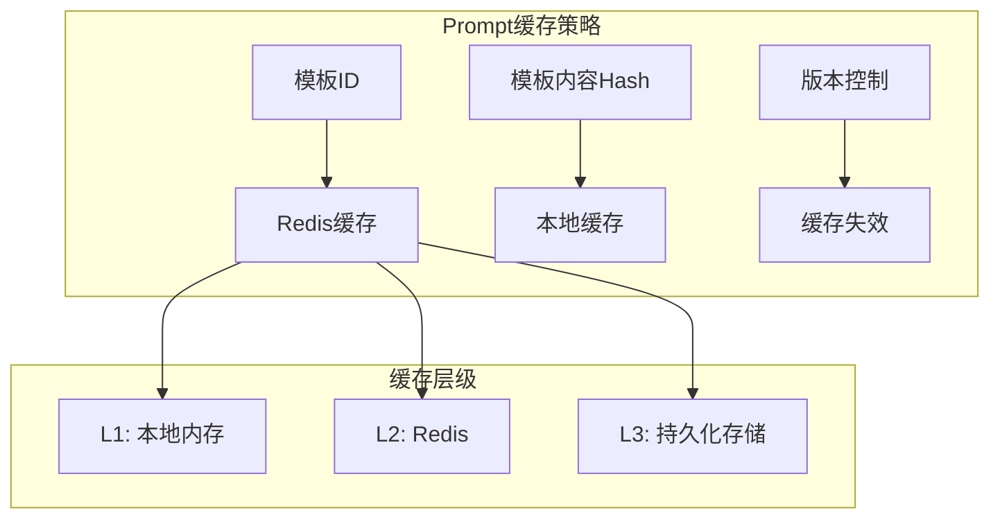
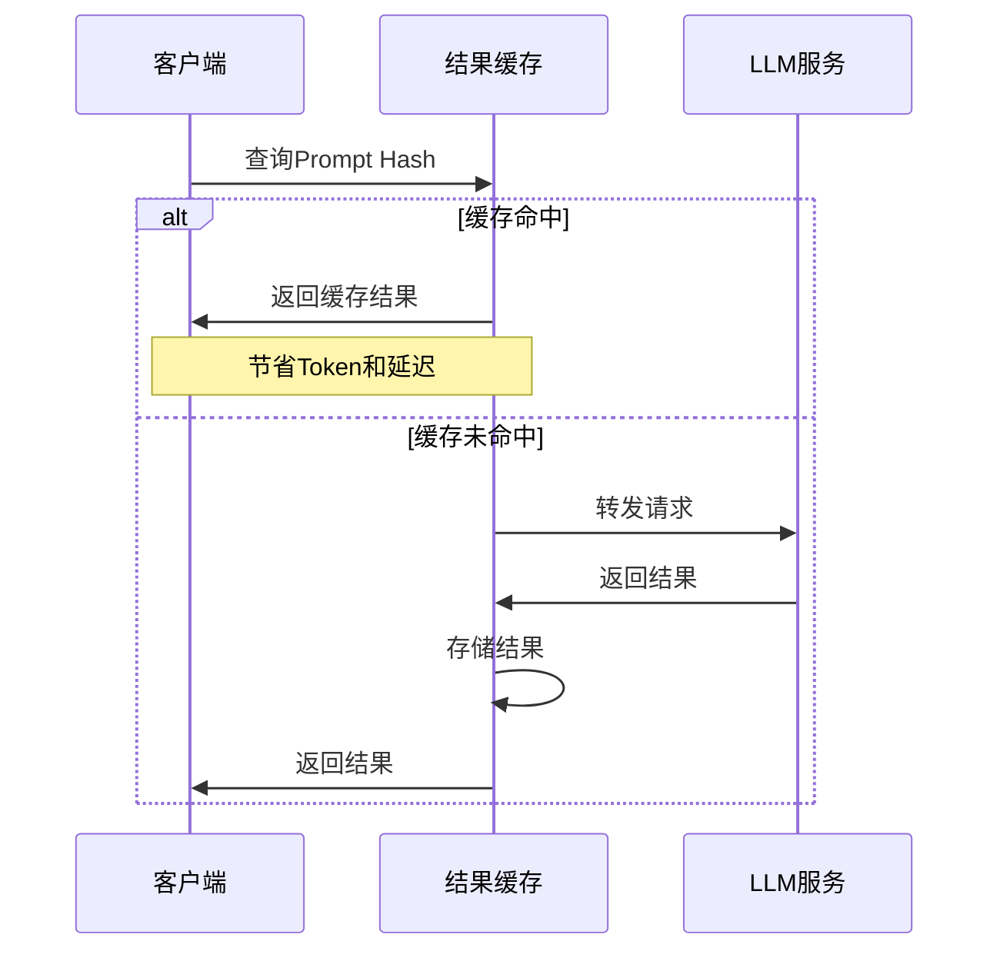
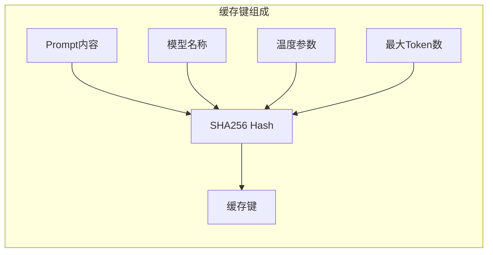
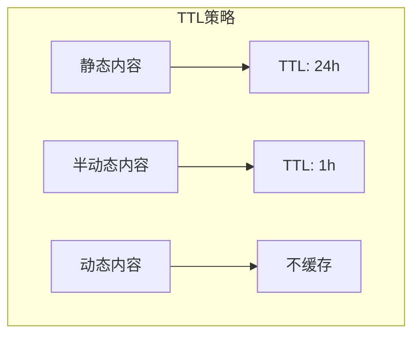
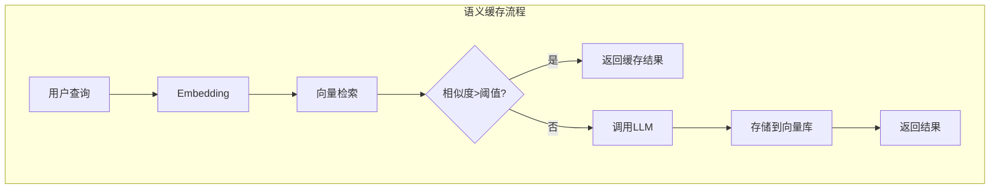
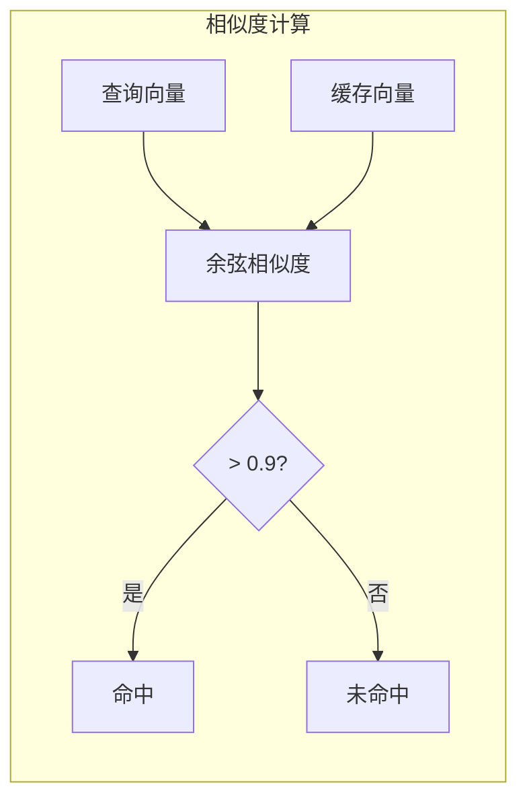
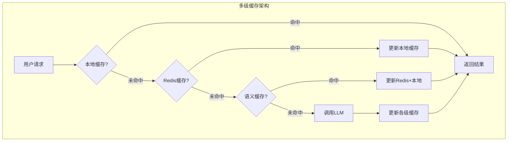
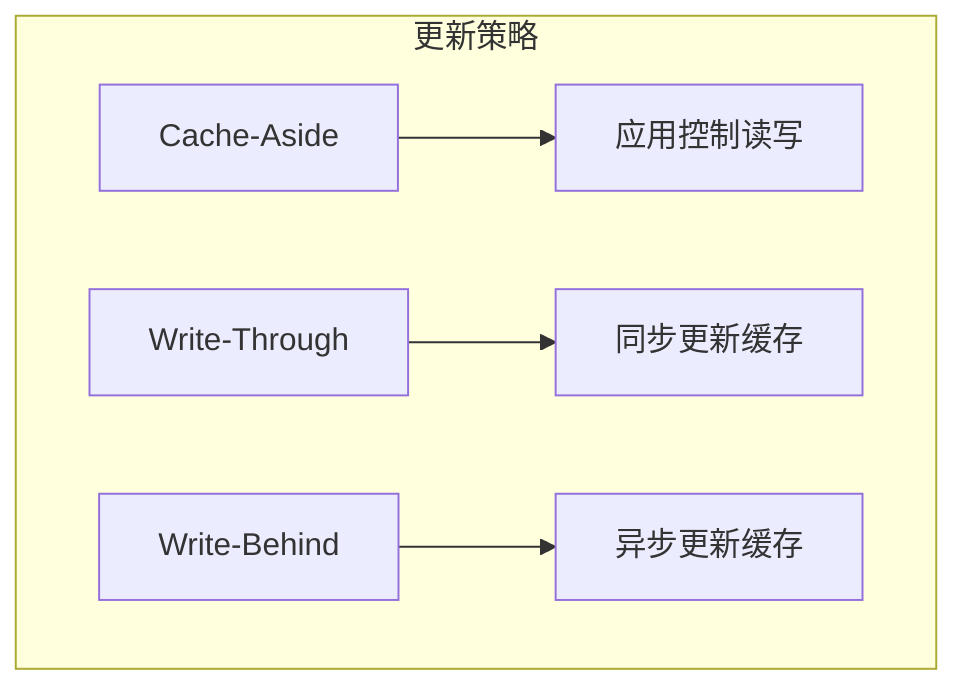
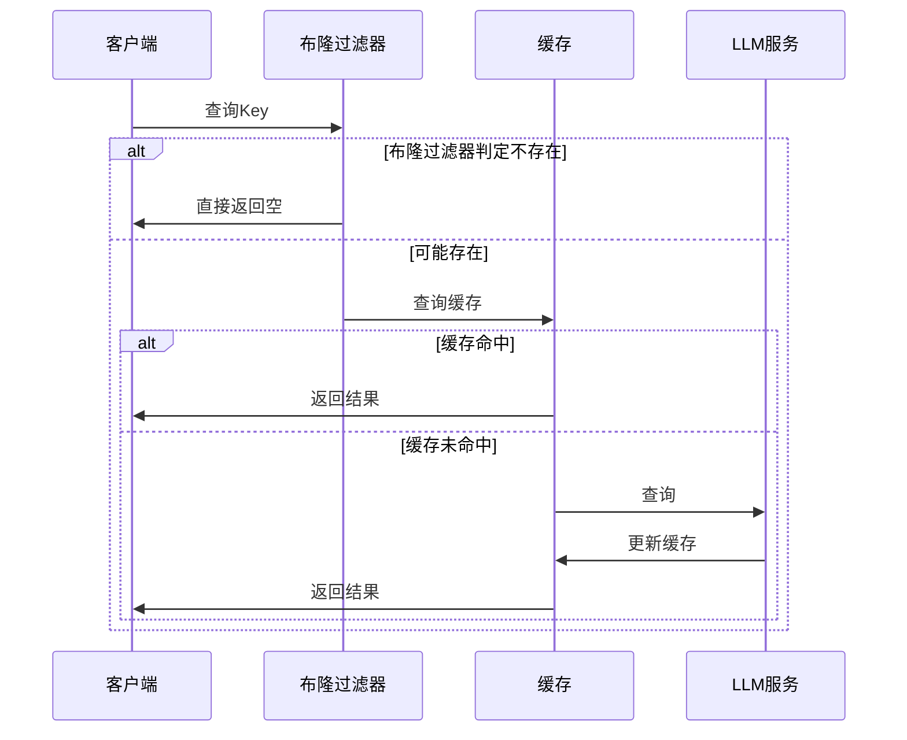

# 缓存策略（Caching Strategies）

本文档详细介绍 LLM 应用中的缓存策略，包括 Prompt 缓存、结果缓存和语义缓存的实现方法与最佳实践。

## 目录

1. [Prompt 缓存](#prompt-缓存)
2. [结果缓存](#结果缓存)
3. [语义缓存](#语义缓存)
4. [缓存架构设计](#缓存架构设计)
5. [Java 实现示例](#java-实现示例)

## Prompt 缓存

Prompt 缓存通过存储常用 Prompt 模板，减少重复构建的开销。

### 工作原理



### 适用场景

| 场景 | 示例 |
|-----|------|
| 系统 Prompt | 角色定义、安全约束 |
| Few-shot示例 | 固定的示例集合 |
| 工具描述 | Function Calling 工具定义 |
| 上下文模板 | RAG 检索结果格式化 |

### 缓存策略



## 结果缓存

结果缓存存储 LLM 的完整响应，对于重复查询可直接返回缓存结果。

### 工作原理



### 缓存键设计



**缓存键公式**：
```
CacheKey = SHA256(Model + Temperature + MaxTokens + Prompt)
```

### 适用场景

| 场景 | 说明 |
|-----|------|
| FAQ问答 | 常见问题固定答案 |
| 代码生成 | 标准代码模板 |
| 数据分析 | 相同数据集的重复分析 |
| 翻译任务 | 固定文本的翻译 |

### TTL策略



## 语义缓存

语义缓存通过向量相似度匹配，缓存语义等价但字面不同的查询。

### 工作原理



### 相似度匹配



### 适用场景

| 场景 | 示例 |
|-----|------|
| 问答系统 | "如何重置密码" vs "密码忘记了怎么办" |
| 客服机器人 | 不同表述的相同问题 |
| 搜索建议 | 相似查询的推荐 |
| 文档检索 | 语义相关的文档 |

### 阈值设置

| 相似度阈值 | 适用场景 |
|-----------|---------|
| > 0.95 | 极高精度要求 |
| > 0.90 | 一般问答场景 |
| > 0.85 | 容忍一定变体 |
| > 0.80 | 探索性场景 |

## 缓存架构设计

### 多级缓存架构



### 缓存更新策略



### 缓存穿透防护



## Java 实现示例

### Prompt 缓存实现

```java
import com.github.benmanes.caffeine.cache.Caffeine;
import com.github.benmanes.caffeine.cache.Cache;
import java.util.concurrent.TimeUnit;

/**
 * Prompt模板缓存管理器
 */
@Component
public class PromptTemplateCache {
    
    private final Cache<String, PromptTemplate> localCache;
    private final StringRedisTemplate redisTemplate;
    
    private static final String REDIS_KEY_PREFIX = "prompt:template:";
    private static final long LOCAL_TTL_MINUTES = 10;
    private static final long REDIS_TTL_HOURS = 24;
    
    public PromptTemplateCache(StringRedisTemplate redisTemplate) {
        this.redisTemplate = redisTemplate;
        this.localCache = Caffeine.newBuilder()
            .maximumSize(1000)
            .expireAfterWrite(LOCAL_TTL_MINUTES, TimeUnit.MINUTES)
            .recordStats()
            .build();
    }
    
    /**
     * 获取Prompt模板
     */
    public PromptTemplate getTemplate(String templateId) {
        // L1: 本地缓存
        PromptTemplate template = localCache.getIfPresent(templateId);
        if (template != null) {
            return template;
        }
        
        // L2: Redis缓存
        String redisKey = REDIS_KEY_PREFIX + templateId;
        String cached = redisTemplate.opsForValue().get(redisKey);
        if (cached != null) {
            template = deserialize(cached);
            localCache.put(templateId, template);
            return template;
        }
        
        return null;
    }
    
    /**
     * 存储Prompt模板
     */
    public void putTemplate(String templateId, PromptTemplate template) {
        // 更新本地缓存
        localCache.put(templateId, template);
        
        // 更新Redis
        String redisKey = REDIS_KEY_PREFIX + templateId;
        redisTemplate.opsForValue().set(redisKey, serialize(template));
        redisTemplate.expire(redisKey, REDIS_TTL_HOURS, TimeUnit.HOURS);
    }
    
    /**
     * 构建完整Prompt
     */
    public String buildPrompt(String templateId, Map<String, Object> variables) {
        PromptTemplate template = getTemplate(templateId);
        if (template == null) {
            throw new TemplateNotFoundException(templateId);
        }
        return template.render(variables);
    }
    
    private String serialize(PromptTemplate template) {
        return JsonUtils.toJson(template);
    }
    
    private PromptTemplate deserialize(String json) {
        return JsonUtils.fromJson(json, PromptTemplate.class);
    }
}

/**
 * Prompt模板
 */
@Data
public class PromptTemplate {
    private String id;
    private String template;
    private String description;
    private long version;
    
    public String render(Map<String, Object> variables) {
        String result = template;
        for (Map.Entry<String, Object> entry : variables.entrySet()) {
            result = result.replace("{{" + entry.getKey() + "}}", 
                String.valueOf(entry.getValue()));
        }
        return result;
    }
}
```

### 结果缓存实现

```java
import org.springframework.data.redis.core.StringRedisTemplate;
import java.security.MessageDigest;
import java.nio.charset.StandardCharsets;
import java.util.concurrent.TimeUnit;

/**
 * LLM结果缓存管理器
 */
@Component
public class LLMResultCache {
    
    private final StringRedisTemplate redisTemplate;
    private final Cache<String, LLMResponse> localCache;
    
    private static final String CACHE_KEY_PREFIX = "llm:result:";
    private static final double SIMILARITY_THRESHOLD = 0.95;
    
    public LLMResultCache(StringRedisTemplate redisTemplate) {
        this.redisTemplate = redisTemplate;
        this.localCache = Caffeine.newBuilder()
            .maximumSize(5000)
            .expireAfterWrite(30, TimeUnit.MINUTES)
            .build();
    }
    
    /**
     * 生成缓存键
     */
    public String generateCacheKey(String model, double temperature, 
                                    int maxTokens, String prompt) {
        String content = model + ":" + temperature + ":" + maxTokens + ":" + prompt;
        return sha256(content);
    }
    
    /**
     * 获取缓存结果
     */
    public LLMResponse get(String cacheKey) {
        // L1: 本地缓存
        LLMResponse response = localCache.getIfPresent(cacheKey);
        if (response != null) {
            return response;
        }
        
        // L2: Redis缓存
        String redisKey = CACHE_KEY_PREFIX + cacheKey;
        String cached = redisTemplate.opsForValue().get(redisKey);
        if (cached != null) {
            response = deserialize(cached);
            localCache.put(cacheKey, response);
            return response;
        }
        
        return null;
    }
    
    /**
     * 存储缓存结果
     */
    public void put(String cacheKey, LLMResponse response, long ttlMinutes) {
        // 本地缓存
        localCache.put(cacheKey, response);
        
        // Redis缓存
        String redisKey = CACHE_KEY_PREFIX + cacheKey;
        redisTemplate.opsForValue().set(redisKey, serialize(response));
        redisTemplate.expire(redisKey, ttlMinutes, TimeUnit.MINUTES);
    }
    
    /**
     * 根据内容智能选择TTL
     */
    public long calculateTTL(String prompt, String response) {
        // 静态内容：24小时
        if (isStaticContent(prompt)) {
            return 24 * 60;
        }
        // 半动态内容：1小时
        if (isSemiDynamic(prompt)) {
            return 60;
        }
        // 动态内容：不缓存
        return 0;
    }
    
    private String sha256(String content) {
        try {
            MessageDigest digest = MessageDigest.getInstance("SHA-256");
            byte[] hash = digest.digest(content.getBytes(StandardCharsets.UTF_8));
            StringBuilder hexString = new StringBuilder();
            for (byte b : hash) {
                String hex = Integer.toHexString(0xff & b);
                if (hex.length() == 1) hexString.append('0');
                hexString.append(hex);
            }
            return hexString.toString();
        } catch (Exception e) {
            throw new RuntimeException("SHA-256 error", e);
        }
    }
    
    private boolean isStaticContent(String prompt) {
        // 判断是否为静态内容
        return prompt.contains("FAQ") || prompt.contains("模板");
    }
    
    private boolean isSemiDynamic(String prompt) {
        // 判断是否为半动态内容
        return prompt.contains("分析") || prompt.contains("总结");
    }
    
    private String serialize(LLMResponse response) {
        return JsonUtils.toJson(response);
    }
    
    private LLMResponse deserialize(String json) {
        return JsonUtils.fromJson(json, LLMResponse.class);
    }
}
```

### 语义缓存实现

```java
import io.milvus.client.MilvusClient;
import io.milvus.param.dml.*;
import io.milvus.response.SearchResultsWrapper;
import org.springframework.beans.factory.annotation.Autowired;
import org.springframework.stereotype.Component;
import java.util.*;

/**
 * 语义缓存管理器
 */
@Component
public class SemanticCache {
    
    @Autowired
    private MilvusClient milvusClient;
    
    @Autowired
    private EmbeddingService embeddingService;
    
    private static final String COLLECTION_NAME = "semantic_cache";
    private static final double SIMILARITY_THRESHOLD = 0.90;
    private static final int TOP_K = 3;
    
    /**
     * 语义缓存查询
     */
    public Optional<CacheEntry> semanticGet(String query, String model) {
        // 生成查询向量
        List<Float> queryVector = embeddingService.embed(query);
        
        // 向量检索
        SearchParam searchParam = SearchParam.newBuilder()
            .withCollectionName(COLLECTION_NAME)
            .withVectors(Collections.singletonList(queryVector))
            .withVectorFieldName("embedding")
            .withTopK(TOP_K)
            .withMetricType(MetricType.COSINE)
            .withParams("{\"nprobe\": 10}")
            .build();
        
        SearchResultsWrapper results = milvusClient.search(searchParam);
        
        // 检查相似度
        if (results.getRowCount() > 0) {
            double similarity = results.getScore(0);
            if (similarity >= SIMILARITY_THRESHOLD) {
                String cachedQuery = results.getId(0).toString();
                String response = results.getFieldData("response", 0).toString();
                
                return Optional.of(new CacheEntry(cachedQuery, response, similarity));
            }
        }
        
        return Optional.empty();
    }
    
    /**
     * 存储语义缓存
     */
    public void semanticPut(String query, String model, 
                           String response, List<Float> embedding) {
        // 构建插入数据
        Map<String, Object> fields = new HashMap<>();
        fields.put("id", UUID.randomUUID().toString());
        fields.put("query", query);
        fields.put("model", model);
        fields.put("response", response);
        fields.put("embedding", embedding);
        fields.put("timestamp", System.currentTimeMillis());
        fields.put("hit_count", 0);
        
        InsertParam insertParam = InsertParam.newBuilder()
            .withCollectionName(COLLECTION_NAME)
            .withFields(Collections.singletonList(fields))
            .build();
        
        milvusClient.insert(insertParam);
    }
    
    /**
     * 更新命中计数
     */
    public void incrementHitCount(String id) {
        // 更新命中次数，用于缓存淘汰策略
        String expr = "id == '" + id + "'";
        // Milvus 不支持直接更新，需要删除后重新插入
        // 或者使用其他数据库记录统计信息
    }
    
    /**
     * 缓存清理（定期任务）
     */
    @Scheduled(cron = "0 0 2 * * ?") // 每天凌晨2点
    public void cleanup() {
        // 删除过期或低命中率的缓存
        long expireTime = System.currentTimeMillis() - (7 * 24 * 60 * 60 * 1000L);
        String expr = "timestamp < " + expireTime;
        
        DeleteParam deleteParam = DeleteParam.newBuilder()
            .withCollectionName(COLLECTION_NAME)
            .withExpr(expr)
            .build();
        
        milvusClient.delete(deleteParam);
    }
    
    /**
     * 缓存条目
     */
    @Data
    public static class CacheEntry {
        private final String query;
        private final String response;
        private final double similarity;
        
        public CacheEntry(String query, String response, double similarity) {
            this.query = query;
            this.response = response;
            this.similarity = similarity;
        }
    }
}
```

### 综合缓存服务

```java
import org.springframework.beans.factory.annotation.Autowired;
import org.springframework.stereotype.Service;
import java.util.Optional;

/**
 * 综合缓存服务
 */
@Service
public class LLMCacheService {
    
    @Autowired
    private PromptTemplateCache promptCache;
    
    @Autowired
    private LLMResultCache resultCache;
    
    @Autowired
    private SemanticCache semanticCache;
    
    @Autowired
    private LLMMetricsCollector metricsCollector;
    
    /**
     * 获取Prompt模板
     */
    public String getPromptTemplate(String templateId, Map<String, Object> variables) {
        return promptCache.buildPrompt(templateId, variables);
    }
    
    /**
     * 查询缓存（多级缓存）
     */
    public Optional<LLMResponse> getCachedResponse(LLMRequest request) {
        String cacheKey = resultCache.generateCacheKey(
            request.getModel(),
            request.getTemperature(),
            request.getMaxTokens(),
            request.getPrompt()
        );
        
        // L1: 精确匹配缓存
        LLMResponse response = resultCache.get(cacheKey);
        if (response != null) {
            metricsCollector.recordCacheHit("exact");
            return Optional.of(response);
        }
        
        // L2: 语义缓存
        Optional<SemanticCache.CacheEntry> semanticEntry = 
            semanticCache.semanticGet(request.getPrompt(), request.getModel());
        if (semanticEntry.isPresent()) {
            metricsCollector.recordCacheHit("semantic");
            return Optional.of(new LLMResponse(
                semanticEntry.get().getResponse(),
                semanticEntry.get().getSimilarity()
            ));
        }
        
        metricsCollector.recordCacheMiss();
        return Optional.empty();
    }
    
    /**
     * 存储缓存结果
     */
    public void cacheResponse(LLMRequest request, LLMResponse response) {
        // 存储精确缓存
        String cacheKey = resultCache.generateCacheKey(
            request.getModel(),
            request.getTemperature(),
            request.getMaxTokens(),
            request.getPrompt()
        );
        
        long ttl = resultCache.calculateTTL(request.getPrompt(), response.getContent());
        if (ttl > 0) {
            resultCache.put(cacheKey, response, ttl);
        }
        
        // 存储语义缓存
        if (shouldCacheSemantically(request)) {
            List<Float> embedding = embeddingService.embed(request.getPrompt());
            semanticCache.semanticPut(
                request.getPrompt(),
                request.getModel(),
                response.getContent(),
                embedding
            );
        }
    }
    
    private boolean shouldCacheSemantically(LLMRequest request) {
        // 判断是否应该进行语义缓存
        return request.getPrompt().length() > 20 && // 长度足够
               request.getTemperature() < 0.5;      // 温度较低，结果稳定
    }
}
```

### 缓存监控指标

```java
import io.micrometer.core.instrument.Counter;
import io.micrometer.core.instrument.Gauge;
import io.micrometer.core.instrument.MeterRegistry;
import org.springframework.stereotype.Component;
import java.util.Map;
import java.util.concurrent.ConcurrentHashMap;
import java.util.concurrent.atomic.AtomicLong;

/**
 * 缓存监控指标
 */
@Component
public class CacheMetrics {
    
    private final Counter exactHitCounter;
    private final Counter semanticHitCounter;
    private final Counter missCounter;
    private final AtomicLong cacheSize;
    
    private final Map<String, AtomicLong> cacheStats = new ConcurrentHashMap<>();
    
    public CacheMetrics(MeterRegistry meterRegistry) {
        this.exactHitCounter = Counter.builder("llm.cache.exact.hit")
            .description("精确缓存命中次数")
            .register(meterRegistry);
            
        this.semanticHitCounter = Counter.builder("llm.cache.semantic.hit")
            .description("语义缓存命中次数")
            .register(meterRegistry);
            
        this.missCounter = Counter.builder("llm.cache.miss")
            .description("缓存未命中次数")
            .register(meterRegistry);
            
        this.cacheSize = new AtomicLong(0);
        
        Gauge.builder("llm.cache.size")
            .description("缓存条目数")
            .register(meterRegistry, cacheSize, AtomicLong::get);
    }
    
    public void recordCacheHit(String type) {
        if ("exact".equals(type)) {
            exactHitCounter.increment();
        } else if ("semantic".equals(type)) {
            semanticHitCounter.increment();
        }
    }
    
    public void recordCacheMiss() {
        missCounter.increment();
    }
    
    public void updateCacheSize(long size) {
        cacheSize.set(size);
    }
    
    /**
     * 获取缓存命中率
     */
    public double getHitRate() {
        double hits = exactHitCounter.count() + semanticHitCounter.count();
        double total = hits + missCounter.count();
        return total > 0 ? hits / total : 0;
    }
}
```

---

> 📌 下一节：[流式优化](./03-streaming-optimization.md)
