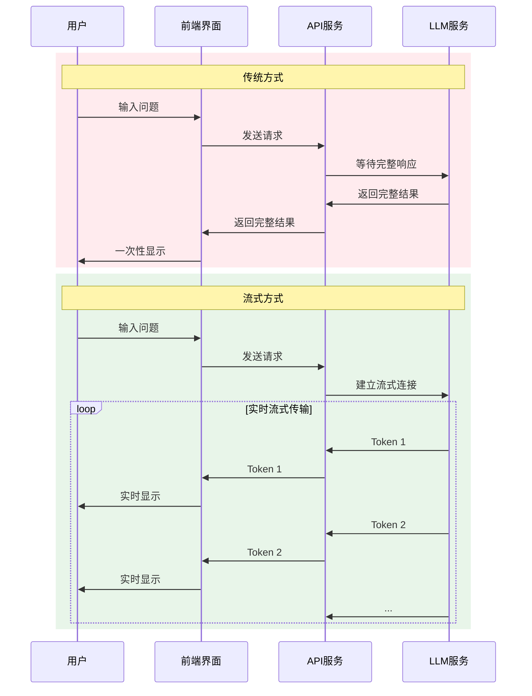
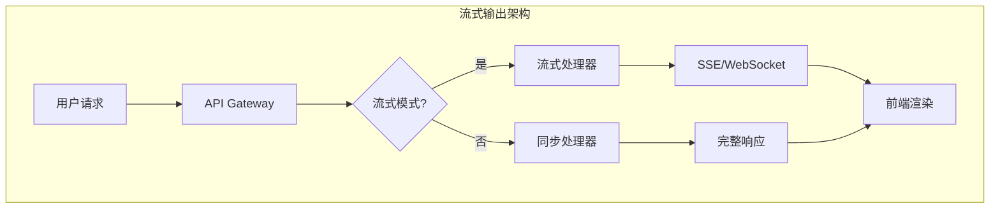
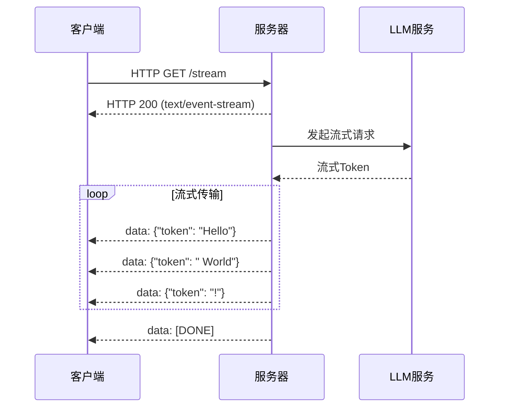
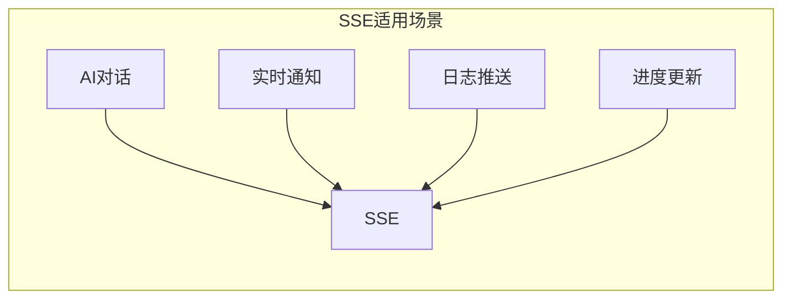
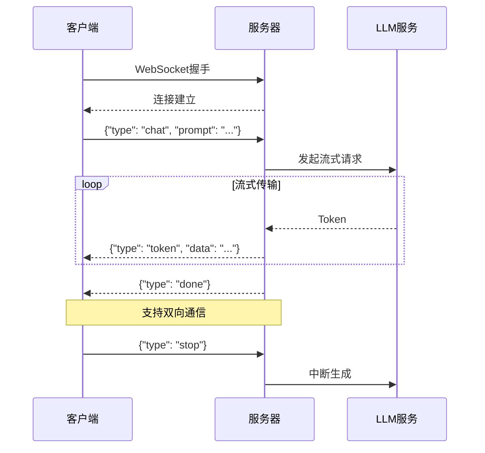
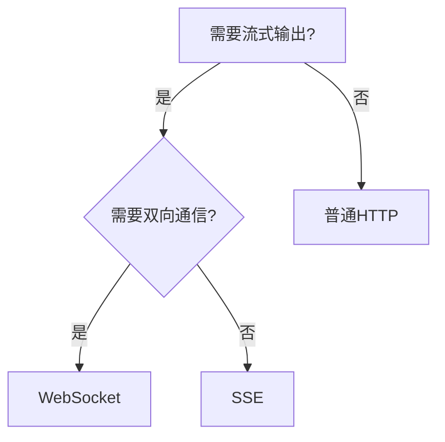
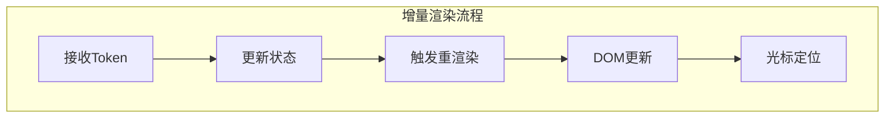
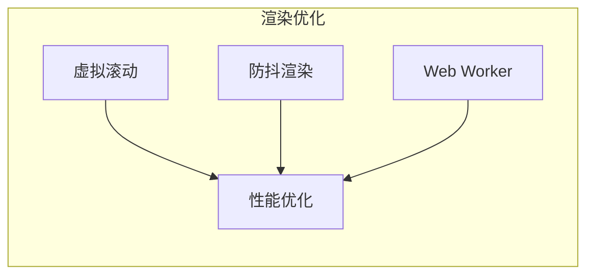

# 流式优化（Streaming Optimization）

本文档详细介绍 LLM 应用的流式输出优化技术，包括 SSE、WebSocket 和增量渲染的实现方法与最佳实践。

## 目录

1. [为什么需要流式输出](#为什么需要流式输出)
2. [SSE 实现](#sse-实现)
3. [WebSocket 实现](#websocket-实现)
4. [增量渲染](#增量渲染)
5. [Java 实现示例](#java-实现示例)

## 为什么需要流式输出

### 传统 vs 流式输出



### 流式输出优势

| 优势 | 说明 |
|-----|------|
| 降低感知延迟 | 首Token到达即开始显示 |
| 提升用户体验 | 类似打字效果，更自然 |
| 减少内存占用 | 无需缓存完整响应 |
| 支持中断 | 用户可随时停止生成 |
| 实时反馈 | 可展示生成进度 |

### 流式架构



## SSE 实现

SSE（Server-Sent Events）是一种服务器向客户端推送实时数据的技术，适合单向流式输出。

### SSE 工作原理



### SSE 消息格式

```
HTTP/1.1 200 OK
Content-Type: text/event-stream
Cache-Control: no-cache
Connection: keep-alive

data: {"id": "1", "token": "Hello", "finish": false}

data: {"id": "1", "token": " world", "finish": false}

data: {"id": "1", "token": "!", "finish": true}

event: done
data: [DONE]
```

### 适用场景



## WebSocket 实现

WebSocket 提供全双工通信，适合需要双向交互的场景。

### WebSocket 工作原理



### WebSocket vs SSE

| 特性 | SSE | WebSocket |
|-----|-----|-----------|
| 通信模式 | 单向（服务器→客户端） | 双向 |
| 协议 | HTTP | WebSocket |
| 连接 | 保持HTTP连接 | 独立TCP连接 |
| 复杂度 | 简单 | 较复杂 |
| 适用场景 | 单向推送 | 双向交互 |
| 自动重连 | 浏览器自动处理 | 需手动实现 |
| 代理支持 | 良好 | 需特殊配置 |

### 选择建议



## 增量渲染

增量渲染是指前端逐步显示收到的 Token，实现打字机效果。

### 渲染流程



### 渲染策略

| 策略 | 说明 | 适用场景 |
|-----|------|---------|
| 字符级 | 每个字符单独渲染 | 精确控制 |
| Token级 | 按Token批次渲染 | 平衡性能 |
| 句子级 | 按句子渲染 | 减少重绘 |
| 自适应 | 根据速度动态调整 | 通用场景 |

### 前端渲染优化



## Java 实现示例

### SSE 流式控制器

```java
import org.springframework.http.MediaType;
import org.springframework.web.bind.annotation.*;
import org.springframework.web.servlet.mvc.method.annotation.SseEmitter;
import reactor.core.publisher.Flux;
import reactor.core.scheduler.Schedulers;
import java.io.IOException;
import java.util.concurrent.CompletableFuture;
import java.util.concurrent.ExecutorService;
import java.util.concurrent.Executors;

/**
 * SSE流式输出控制器
 */
@RestController
@RequestMapping("/api/stream")
public class StreamingController {
    
    @Autowired
    private LLMClient llmClient;
    
    @Autowired
    private StreamingMetrics metrics;
    
    private final ExecutorService executor = Executors.newCachedThreadPool();
    
    /**
     * SSE流式聊天
     */
    @GetMapping(value = "/chat", produces = MediaType.TEXT_EVENT_STREAM_VALUE)
    public SseEmitter streamChat(@RequestParam String prompt) {
        SseEmitter emitter = new SseEmitter(300_000L); // 5分钟超时
        
        CompletableFuture.runAsync(() -> {
            try {
                long startTime = System.currentTimeMillis();
                
                // 流式调用LLM
                llmClient.streamChat(prompt, new StreamCallback() {
                    @Override
                    public void onToken(String token) {
                        try {
                            StreamResponse response = new StreamResponse(
                                token,
                                false,
                                System.currentTimeMillis() - startTime
                            );
                            emitter.send(SseEmitter.event()
                                .data(response)
                                .id(String.valueOf(System.currentTimeMillis()))
                            );
                        } catch (IOException e) {
                            emitter.completeWithError(e);
                        }
                    }
                    
                    @Override
                    public void onComplete() {
                        try {
                            emitter.send(SseEmitter.event()
                                .data(new StreamResponse("", true, 0))
                                .name("done")
                            );
                            emitter.complete();
                            metrics.recordStreamComplete();
                        } catch (IOException e) {
                            emitter.completeWithError(e);
                        }
                    }
                    
                    @Override
                    public void onError(Throwable error) {
                        emitter.completeWithError(error);
                        metrics.recordStreamError();
                    }
                });
            } catch (Exception e) {
                emitter.completeWithError(e);
            }
        }, executor);
        
        // 超时处理
        emitter.onTimeout(() -> {
            emitter.complete();
            metrics.recordStreamTimeout();
        });
        
        // 完成处理
        emitter.onCompletion(() -> {
            metrics.recordStreamClose();
        });
        
        return emitter;
    }
    
    /**
     * 使用Flux的响应式流式输出
     */
    @GetMapping(value = "/chat/flux", produces = MediaType.TEXT_EVENT_STREAM_VALUE)
    public Flux<StreamResponse> streamChatFlux(@RequestParam String prompt) {
        return Flux.create(sink -> {
            llmClient.streamChat(prompt, new StreamCallback() {
                @Override
                public void onToken(String token) {
                    sink.next(new StreamResponse(token, false, 0));
                }
                
                @Override
                public void onComplete() {
                    sink.next(new StreamResponse("", true, 0));
                    sink.complete();
                }
                
                @Override
                public void onError(Throwable error) {
                    sink.error(error);
                }
            });
        }).subscribeOn(Schedulers.boundedElastic());
    }
}

/**
 * 流式响应
 */
@Data
@AllArgsConstructor
public class StreamResponse {
    private String token;
    private boolean finish;
    private long elapsedMs;
}

/**
 * 流式回调接口
 */
public interface StreamCallback {
    void onToken(String token);
    void onComplete();
    void onError(Throwable error);
}
```

### WebSocket 实现

```java
import org.springframework.stereotype.Component;
import org.springframework.web.socket.CloseStatus;
import org.springframework.web.socket.TextMessage;
import org.springframework.web.socket.WebSocketSession;
import org.springframework.web.socket.handler.TextWebSocketHandler;
import com.fasterxml.jackson.databind.ObjectMapper;
import java.util.Map;
import java.util.concurrent.ConcurrentHashMap;
import java.util.concurrent.atomic.AtomicBoolean;

/**
 * WebSocket流式处理器
 */
@Component
public class LLMWebSocketHandler extends TextWebSocketHandler {
    
    @Autowired
    private LLMClient llmClient;
    
    @Autowired
    private ObjectMapper objectMapper;
    
    // 存储活跃的生成任务
    private final Map<String, AtomicBoolean> activeTasks = new ConcurrentHashMap<>();
    
    @Override
    public void afterConnectionEstablished(WebSocketSession session) throws Exception {
        // 连接建立
        session.sendMessage(new TextMessage(
            objectMapper.writeValueAsString(
                Map.of("type", "connected", "sessionId", session.getId())
            )
        ));
    }
    
    @Override
    protected void handleTextMessage(WebSocketSession session, TextMessage message) throws Exception {
        WebSocketRequest request = objectMapper.readValue(
            message.getPayload(), 
            WebSocketRequest.class
        );
        
        switch (request.getType()) {
            case "chat":
                handleChatRequest(session, request);
                break;
            case "stop":
                handleStopRequest(session, request);
                break;
            default:
                sendError(session, "Unknown message type: " + request.getType());
        }
    }
    
    private void handleChatRequest(WebSocketSession session, WebSocketRequest request) {
        String sessionId = session.getId();
        AtomicBoolean shouldStop = new AtomicBoolean(false);
        activeTasks.put(sessionId, shouldStop);
        
        llmClient.streamChat(request.getPrompt(), new StreamCallback() {
            @Override
            public void onToken(String token) {
                if (shouldStop.get()) {
                    return;
                }
                try {
                    sendMessage(session, Map.of(
                        "type", "token",
                        "data", token,
                        "timestamp", System.currentTimeMillis()
                    ));
                } catch (Exception e) {
                    onError(e);
                }
            }
            
            @Override
            public void onComplete() {
                if (!shouldStop.get()) {
                    try {
                        sendMessage(session, Map.of(
                            "type", "done",
                            "timestamp", System.currentTimeMillis()
                        ));
                    } catch (Exception e) {
                        // ignore
                    }
                }
                activeTasks.remove(sessionId);
            }
            
            @Override
            public void onError(Throwable error) {
                try {
                    sendError(session, error.getMessage());
                } catch (Exception e) {
                    // ignore
                }
                activeTasks.remove(sessionId);
            }
        });
    }
    
    private void handleStopRequest(WebSocketSession session, WebSocketRequest request) {
        AtomicBoolean shouldStop = activeTasks.get(session.getId());
        if (shouldStop != null) {
            shouldStop.set(true);
            try {
                sendMessage(session, Map.of(
                    "type", "stopped",
                    "timestamp", System.currentTimeMillis()
                ));
            } catch (Exception e) {
                // ignore
            }
        }
    }
    
    private void sendMessage(WebSocketSession session, Map<String, Object> message) throws Exception {
        if (session.isOpen()) {
            session.sendMessage(new TextMessage(objectMapper.writeValueAsString(message)));
        }
    }
    
    private void sendError(WebSocketSession session, String error) throws Exception {
        sendMessage(session, Map.of(
            "type", "error",
            "message", error,
            "timestamp", System.currentTimeMillis()
        ));
    }
    
    @Override
    public void afterConnectionClosed(WebSocketSession session, CloseStatus status) throws Exception {
        // 清理任务
        AtomicBoolean shouldStop = activeTasks.remove(session.getId());
        if (shouldStop != null) {
            shouldStop.set(true);
        }
    }
}

/**
 * WebSocket请求
 */
@Data
public class WebSocketRequest {
    private String type;
    private String prompt;
    private String messageId;
}

/**
 * WebSocket配置
 */
@Configuration
@EnableWebSocket
public class WebSocketConfig implements WebSocketConfigurer {
    
    @Autowired
    private LLMWebSocketHandler llmWebSocketHandler;
    
    @Override
    public void registerWebSocketHandlers(WebSocketHandlerRegistry registry) {
        registry.addHandler(llmWebSocketHandler, "/ws/llm")
            .setAllowedOrigins("*");
    }
}
```

### 流式客户端实现

```java
import okhttp3.*;
import java.io.BufferedReader;
import java.io.InputStreamReader;
import java.util.concurrent.TimeUnit;

/**
 * 流式LLM客户端
 */
@Component
public class StreamingLLMClient {
    
    private final OkHttpClient httpClient;
    private final String apiUrl;
    private final String apiKey;
    
    public StreamingLLMClient(@Value("${llm.api.url}") String apiUrl,
                              @Value("${llm.api.key}") String apiKey) {
        this.apiUrl = apiUrl;
        this.apiKey = apiKey;
        this.httpClient = new OkHttpClient.Builder()
            .connectTimeout(30, TimeUnit.SECONDS)
            .readTimeout(300, TimeUnit.SECONDS)
            .build();
    }
    
    /**
     * 流式聊天
     */
    public void streamChat(String prompt, StreamCallback callback) {
        RequestBody body = RequestBody.create(
            JsonUtils.toJson(Map.of(
                "model", "gpt-3.5-turbo",
                "messages", List.of(Map.of("role", "user", "content", prompt)),
                "stream", true
            )),
            MediaType.parse("application/json")
        );
        
        Request request = new Request.Builder()
            .url(apiUrl + "/chat/completions")
            .header("Authorization", "Bearer " + apiKey)
            .post(body)
            .build();
        
        httpClient.newCall(request).enqueue(new Callback() {
            @Override
            public void onFailure(Call call, IOException e) {
                callback.onError(e);
            }
            
            @Override
            public void onResponse(Call call, Response response) throws IOException {
                if (!response.isSuccessful()) {
                    callback.onError(new IOException("Unexpected code " + response));
                    return;
                }
                
                try (BufferedReader reader = new BufferedReader(
                        new InputStreamReader(response.body().byteStream()))) {
                    String line;
                    while ((line = reader.readLine()) != null) {
                        if (line.startsWith("data: ")) {
                            String data = line.substring(6);
                            if ("[DONE]".equals(data)) {
                                callback.onComplete();
                                return;
                            }
                            
                            StreamChunk chunk = JsonUtils.fromJson(data, StreamChunk.class);
                            if (chunk.getChoices() != null && !chunk.getChoices().isEmpty()) {
                                String token = chunk.getChoices().get(0).getDelta().getContent();
                                if (token != null) {
                                    callback.onToken(token);
                                }
                            }
                        }
                    }
                }
            }
        });
    }
}

/**
 * 流式分块
 */
@Data
public class StreamChunk {
    private String id;
    private List<Choice> choices;
    
    @Data
    public static class Choice {
        private Delta delta;
        private int index;
    }
    
    @Data
    public static class Delta {
        private String content;
        private String role;
    }
}
```

### 前端增量渲染示例

```javascript
// React Hook 示例
import { useState, useCallback, useRef } from 'react';

export function useStreamingChat() {
  const [messages, setMessages] = useState([]);
  const [isStreaming, setIsStreaming] = useState(false);
  const eventSourceRef = useRef(null);
  
  const sendMessage = useCallback(async (prompt) => {
    setIsStreaming(true);
    
    // 添加用户消息
    setMessages(prev => [...prev, { role: 'user', content: prompt }]);
    
    // 添加空的助手消息（用于流式更新）
    const assistantMessageId = Date.now();
    setMessages(prev => [...prev, { 
      id: assistantMessageId,
      role: 'assistant', 
      content: '' 
    }]);
    
    // 创建EventSource连接
    const eventSource = new EventSource(
      `/api/stream/chat?prompt=${encodeURIComponent(prompt)}`
    );
    eventSourceRef.current = eventSource;
    
    eventSource.onmessage = (event) => {
      const data = JSON.parse(event.data);
      
      if (data.finish) {
        setIsStreaming(false);
        eventSource.close();
      } else {
        // 增量更新内容
        setMessages(prev => prev.map(msg => 
          msg.id === assistantMessageId 
            ? { ...msg, content: msg.content + data.token }
            : msg
        ));
      }
    };
    
    eventSource.onerror = (error) => {
      console.error('SSE error:', error);
      setIsStreaming(false);
      eventSource.close();
    };
  }, []);
  
  const stopStreaming = useCallback(() => {
    if (eventSourceRef.current) {
      eventSourceRef.current.close();
      setIsStreaming(false);
    }
  }, []);
  
  return { messages, isStreaming, sendMessage, stopStreaming };
}

// 防抖渲染优化
function useDebouncedContent(content, delay = 16) {
  const [displayContent, setDisplayContent] = useState('');
  const frameRef = useRef(null);
  
  useEffect(() => {
    if (frameRef.current) {
      cancelAnimationFrame(frameRef.current);
    }
    
    frameRef.current = requestAnimationFrame(() => {
      setDisplayContent(content);
    });
    
    return () => {
      if (frameRef.current) {
        cancelAnimationFrame(frameRef.current);
      }
    };
  }, [content]);
  
  return displayContent;
}
```

### 流式性能监控

```java
import io.micrometer.core.instrument.*;
import org.springframework.stereotype.Component;
import java.util.concurrent.atomic.AtomicLong;

/**
 * 流式性能监控
 */
@Component
public class StreamingMetrics {
    
    private final Counter streamStartCounter;
    private final Counter streamCompleteCounter;
    private final Counter streamErrorCounter;
    private final Counter streamTimeoutCounter;
    private final Timer streamDurationTimer;
    private final DistributionSummary tokenRateSummary;
    private final AtomicLong activeStreams;
    
    public StreamingMetrics(MeterRegistry meterRegistry) {
        this.streamStartCounter = Counter.builder("llm.stream.start")
            .description("流式请求开始次数")
            .register(meterRegistry);
            
        this.streamCompleteCounter = Counter.builder("llm.stream.complete")
            .description("流式请求完成次数")
            .register(meterRegistry);
            
        this.streamErrorCounter = Counter.builder("llm.stream.error")
            .description("流式请求错误次数")
            .register(meterRegistry);
            
        this.streamTimeoutCounter = Counter.builder("llm.stream.timeout")
            .description("流式请求超时次数")
            .register(meterRegistry);
            
        this.streamDurationTimer = Timer.builder("llm.stream.duration")
            .description("流式请求持续时间")
            .publishPercentiles(0.5, 0.95, 0.99)
            .register(meterRegistry);
            
        this.tokenRateSummary = DistributionSummary.builder("llm.stream.token_rate")
            .description("Token生成速率（tokens/秒）")
            .publishPercentiles(0.5, 0.95, 0.99)
            .register(meterRegistry);
            
        this.activeStreams = new AtomicLong(0);
        
        Gauge.builder("llm.stream.active")
            .description("活跃流式连接数")
            .register(meterRegistry, activeStreams, AtomicLong::get);
    }
    
    public void recordStreamStart() {
        streamStartCounter.increment();
        activeStreams.incrementAndGet();
    }
    
    public void recordStreamComplete() {
        streamCompleteCounter.increment();
        activeStreams.decrementAndGet();
    }
    
    public void recordStreamError() {
        streamErrorCounter.increment();
        activeStreams.decrementAndGet();
    }
    
    public void recordStreamTimeout() {
        streamTimeoutCounter.increment();
        activeStreams.decrementAndGet();
    }
    
    public void recordStreamClose() {
        activeStreams.decrementAndGet();
    }
    
    public Timer.Sample startTimer() {
        return Timer.start();
    }
    
    public void recordDuration(Timer.Sample sample, int tokenCount) {
        long durationMs = sample.stop(streamDurationTimer);
        double tokenRate = durationMs > 0 ? (tokenCount * 1000.0) / durationMs : 0;
        tokenRateSummary.record(tokenRate);
    }
}
```

---

> 📌 下一节：[成本优化](./04-cost-optimization.md)
