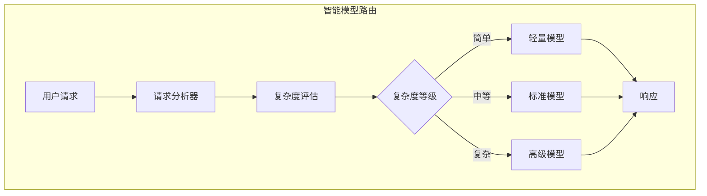
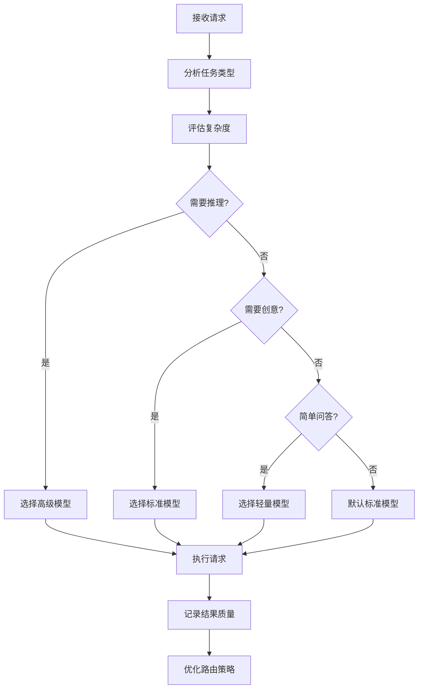
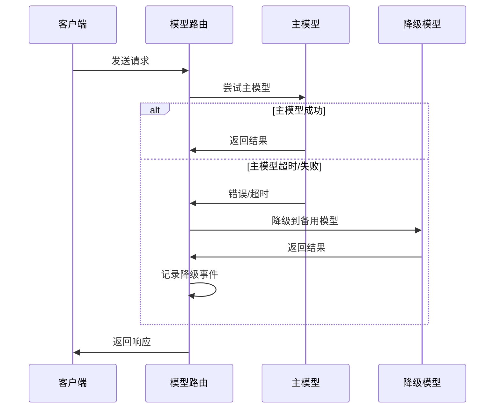
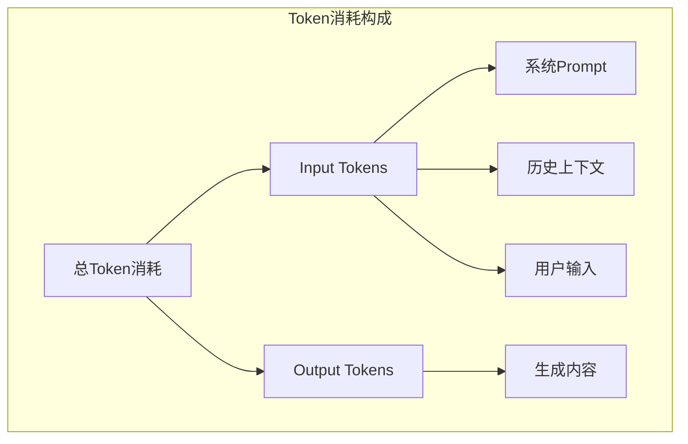
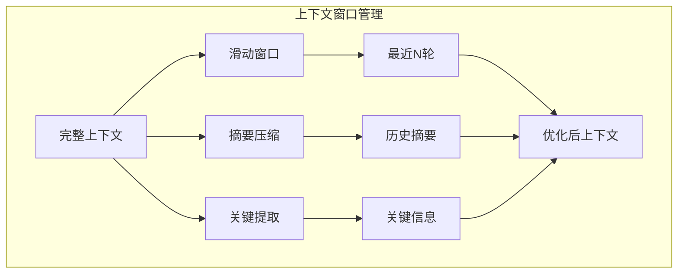
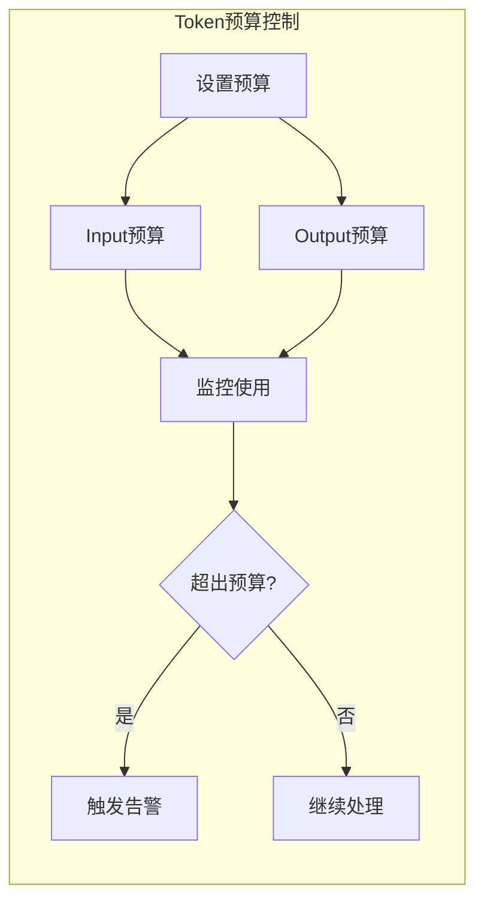
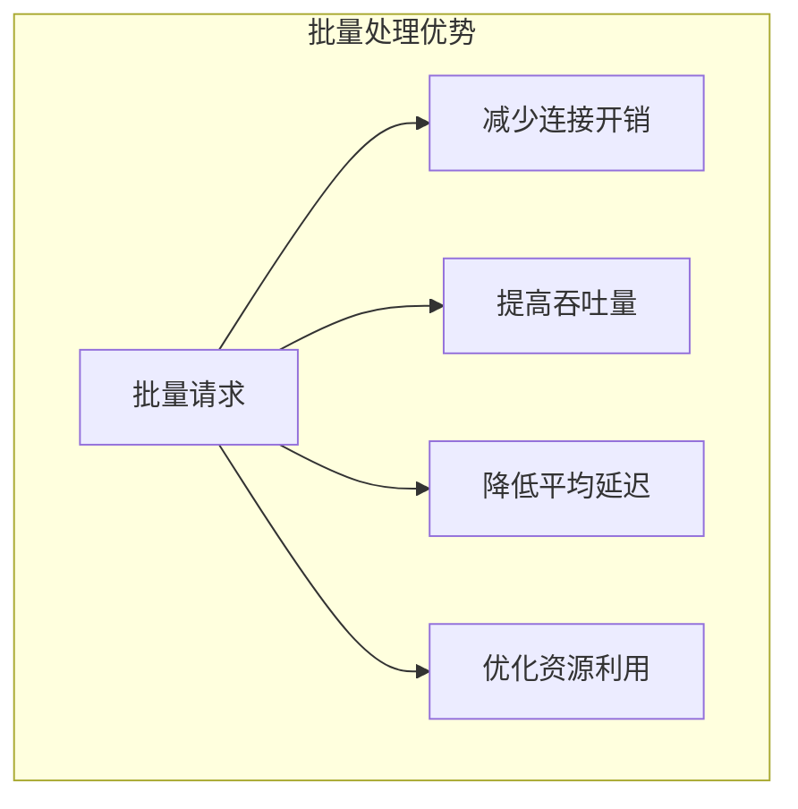
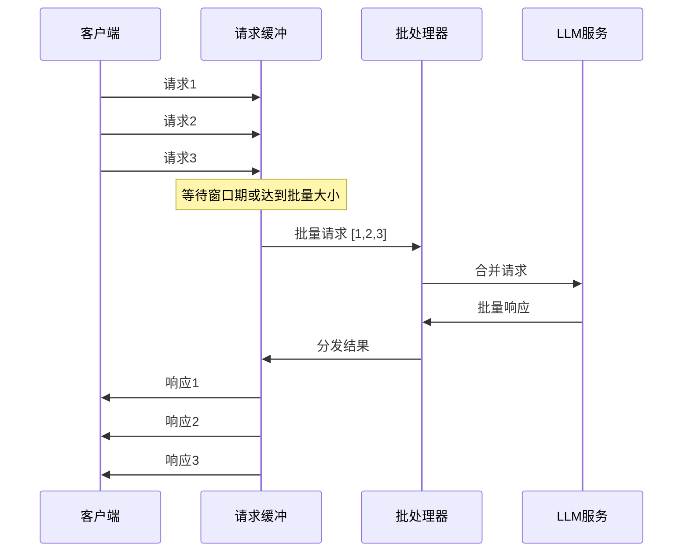
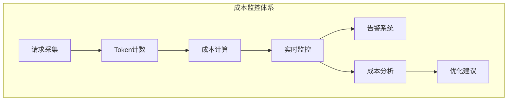
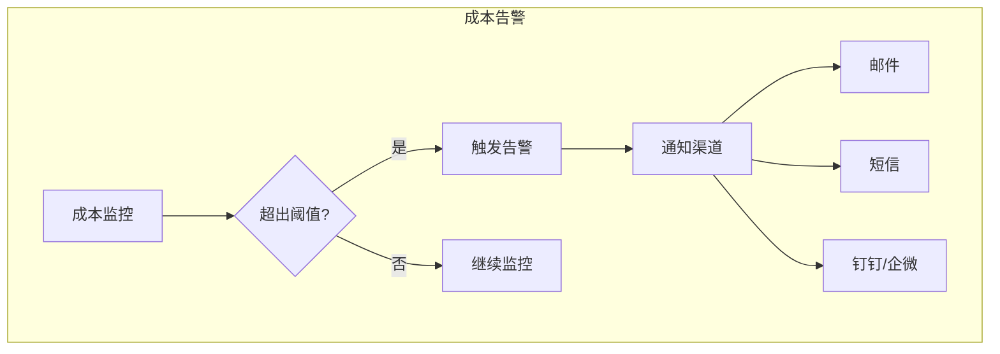

# 成本优化（Cost Optimization）

本文档详细介绍 LLM 应用的成本优化策略，包括模型选择策略、Token 优化、批量处理和成本监控的最佳实践。

## 目录

1. [模型选择策略](#模型选择策略)
2. [Token 优化](#token-优化)
3. [批量处理](#批量处理)
4. [成本监控](#成本监控)
5. [Java 实现示例](#java-实现示例)

## 模型选择策略

### 智能路由架构



### 模型分级策略

| 级别 | 模型示例 | 适用场景 | 相对成本 |
|-----|---------|---------|---------|
| 轻量 | GPT-3.5, Claude Haiku | FAQ、简单分类、摘要 | 1x |
| 标准 | GPT-4o-mini, Claude Sonnet | 一般对话、代码生成 | 5x |
| 高级 | GPT-4o, Claude Opus | 复杂推理、创意写作 | 20x |
| 专用 | 微调模型 | 特定领域任务 | 3-10x |

### 路由决策流程



### 动态降级策略



## Token 优化

### Token 消耗构成



### Prompt 压缩技术

| 技术 | 说明 | 节省效果 |
|-----|------|---------|
| 摘要历史 | 压缩对话历史 | 30-50% |
| 关键词提取 | 只保留关键信息 | 20-40% |
| 向量化检索 | 用向量代替长文本 | 50-80% |
| 模板优化 | 精简系统Prompt | 10-20% |

### 上下文窗口管理



### Token 预算控制



## 批量处理

### 批量请求优势



### 批量处理架构



### 批量策略对比

| 策略 | 说明 | 适用场景 |
|-----|------|---------|
| 固定大小 | 达到N个请求后批量发送 | 高并发场景 |
| 时间窗口 | 等待固定时间后批量发送 | 实时性要求中等 |
| 混合策略 | 大小或时间满足任一条件 | 通用场景 |
| 自适应 | 根据负载动态调整 | 波动负载 |

## 成本监控

### 成本监控架构



### 成本指标定义

| 指标 | 说明 | 计算方式 |
|-----|------|---------|
| 单次请求成本 | 单个请求的费用 | Input×单价 + Output×单价 |
| 平均成本 | 平均每个请求的费用 | 总成本/请求数 |
| Token效率 | 单位Token的价值 | 业务价值/Token数 |
| 成本趋势 | 成本变化趋势 | 时间序列分析 |

### 成本告警策略



## Java 实现示例

### 智能模型路由器

```java
import org.springframework.stereotype.Component;
import java.util.*;
import java.util.concurrent.ConcurrentHashMap;

/**
 * 智能模型路由器
 */
@Component
public class SmartModelRouter {
    
    private final Map<String, ModelConfig> modelConfigs;
    private final RequestComplexityAnalyzer complexityAnalyzer;
    private final ModelPerformanceTracker performanceTracker;
    
    public SmartModelRouter() {
        this.modelConfigs = new HashMap<>();
        initializeModels();
        this.complexityAnalyzer = new RequestComplexityAnalyzer();
        this.performanceTracker = new ModelPerformanceTracker();
    }
    
    private void initializeModels() {
        // 轻量模型
        modelConfigs.put("gpt-3.5-turbo", new ModelConfig(
            "gpt-3.5-turbo",
            ModelTier.LIGHT,
            0.5, 1.5,  // 输入/输出单价 ($/M tokens)
            100,       // 最大RPM
            0.8        // 质量评分
        ));
        
        // 标准模型
        modelConfigs.put("gpt-4o-mini", new ModelConfig(
            "gpt-4o-mini",
            ModelTier.STANDARD,
            0.15, 0.6,
            200,
            0.9
        ));
        
        // 高级模型
        modelConfigs.put("gpt-4o", new ModelConfig(
            "gpt-4o",
            ModelTier.PREMIUM,
            5.0, 15.0,
            50,
            0.95
        ));
    }
    
    /**
     * 选择最优模型
     */
    public ModelSelection selectModel(String prompt, RoutingStrategy strategy) {
        // 分析请求复杂度
        ComplexityScore complexity = complexityAnalyzer.analyze(prompt);
        
        // 根据策略选择模型
        return switch (strategy) {
            case COST_OPTIMIZED -> selectByCost(complexity);
            case QUALITY_OPTIMIZED -> selectByQuality(complexity);
            case BALANCED -> selectBalanced(complexity);
            case ADAPTIVE -> selectAdaptive(prompt, complexity);
        };
    }
    
    /**
     * 成本优先选择
     */
    private ModelSelection selectByCost(ComplexityScore complexity) {
        ModelTier targetTier = complexity.getScore() > 0.7 
            ? ModelTier.STANDARD 
            : ModelTier.LIGHT;
        
        return modelConfigs.values().stream()
            .filter(config -> config.tier() == targetTier)
            .min(Comparator.comparingDouble(this::calculateEffectiveCost))
            .map(config -> new ModelSelection(config.modelId(), config, "cost_optimized"))
            .orElseThrow();
    }
    
    /**
     * 质量优先选择
     */
    private ModelSelection selectByQuality(ComplexityScore complexity) {
        ModelTier targetTier = complexity.getScore() > 0.5 
            ? ModelTier.PREMIUM 
            : ModelTier.STANDARD;
        
        return modelConfigs.values().stream()
            .filter(config -> config.tier() == targetTier)
            .max(Comparator.comparingDouble(ModelConfig::qualityScore))
            .map(config -> new ModelSelection(config.modelId(), config, "quality_optimized"))
            .orElseThrow();
    }
    
    /**
     * 平衡选择
     */
    private ModelSelection selectBalanced(ComplexityScore complexity) {
        return modelConfigs.values().stream()
            .max(Comparator.comparingDouble(config -> 
                config.qualityScore() / calculateEffectiveCost(config)))
            .map(config -> new ModelSelection(config.modelId(), config, "balanced"))
            .orElseThrow();
    }
    
    /**
     * 自适应选择（基于历史表现）
     */
    private ModelSelection selectAdaptive(String prompt, ComplexityScore complexity) {
        // 获取历史表现数据
        Map<String, ModelPerformance> performances = performanceTracker.getPerformances();
        
        // 计算每个模型的期望价值
        return modelConfigs.values().stream()
            .map(config -> {
                ModelPerformance perf = performances.get(config.modelId());
                double expectedValue = calculateExpectedValue(config, perf, complexity);
                return new ModelSelection(config.modelId(), config, "adaptive", expectedValue);
            })
            .max(Comparator.comparingDouble(ModelSelection::expectedValue))
            .orElse(selectBalanced(complexity));
    }
    
    /**
     * 计算有效成本（考虑成功率）
     */
    private double calculateEffectiveCost(ModelConfig config) {
        ModelPerformance perf = performanceTracker.getPerformance(config.modelId());
        double successRate = perf != null ? perf.successRate() : 0.95;
        return (config.inputPrice() + config.outputPrice()) / successRate;
    }
    
    /**
     * 计算期望价值
     */
    private double calculateExpectedValue(ModelConfig config, 
                                         ModelPerformance perf,
                                         ComplexityScore complexity) {
        if (perf == null) return config.qualityScore() / calculateEffectiveCost(config);
        
        double qualityMatch = 1 - Math.abs(config.qualityScore() - complexity.getScore());
        double costEfficiency = 1 / calculateEffectiveCost(config);
        double reliability = perf.successRate();
        
        return qualityMatch * 0.4 + costEfficiency * 0.3 + reliability * 0.3;
    }
    
    /**
     * 降级策略
     */
    public ModelSelection fallback(String originalModelId) {
        ModelConfig original = modelConfigs.get(originalModelId);
        if (original == null) return null;
        
        // 降级到下一级别
        ModelTier fallbackTier = switch (original.tier()) {
            case PREMIUM -> ModelTier.STANDARD;
            case STANDARD -> ModelTier.LIGHT;
            case LIGHT -> ModelTier.LIGHT;
        };
        
        return modelConfigs.values().stream()
            .filter(config -> config.tier() == fallbackTier)
            .findFirst()
            .map(config -> new ModelSelection(config.modelId(), config, "fallback"))
            .orElse(null);
    }
}

/**
 * 模型配置
 */
public record ModelConfig(
    String modelId,
    ModelTier tier,
    double inputPrice,
    double outputPrice,
    int maxRpm,
    double qualityScore
) {}

/**
 * 模型选择结果
 */
public record ModelSelection(
    String modelId,
    ModelConfig config,
    String strategy,
    double expectedValue
) {
    public ModelSelection(String modelId, ModelConfig config, String strategy) {
        this(modelId, config, strategy, 0);
    }
}

enum ModelTier { LIGHT, STANDARD, PREMIUM }
enum RoutingStrategy { COST_OPTIMIZED, QUALITY_OPTIMIZED, BALANCED, ADAPTIVE }
```

### Token 优化器

```java
import org.springframework.stereotype.Component;
import java.util.*;
import java.util.regex.Pattern;

/**
 * Token优化器
 */
@Component
public class TokenOptimizer {
    
    private static final int MAX_CONTEXT_LENGTH = 4000;
    private static final int SUMMARY_THRESHOLD = 2000;
    
    /**
     * 优化Prompt
     */
    public OptimizedPrompt optimizePrompt(String systemPrompt, 
                                          List<Message> history,
                                          String userPrompt) {
        // 估算当前Token数
        int estimatedTokens = estimateTokens(systemPrompt) 
            + estimateMessagesTokens(history) 
            + estimateTokens(userPrompt);
        
        // 如果超出预算，进行压缩
        if (estimatedTokens > MAX_CONTEXT_LENGTH) {
            history = compressHistory(history, estimatedTokens - MAX_CONTEXT_LENGTH);
        }
        
        // 优化系统Prompt
        String optimizedSystem = optimizeSystemPrompt(systemPrompt);
        
        return new OptimizedPrompt(optimizedSystem, history, userPrompt, 
            estimateTokens(optimizedSystem) + estimateMessagesTokens(history) + estimateTokens(userPrompt));
    }
    
    /**
     * 压缩历史消息
     */
    private List<Message> compressHistory(List<Message> history, int tokensToRemove) {
        if (history.isEmpty()) return history;
        
        List<Message> compressed = new ArrayList<>();
        
        // 保留最近的对话
        int recentCount = Math.min(4, history.size());
        for (int i = history.size() - recentCount; i < history.size(); i++) {
            compressed.add(history.get(i));
        }
        
        // 对更早的历史进行摘要
        if (history.size() > recentCount) {
            StringBuilder summary = new StringBuilder("历史对话摘要：\n");
            for (int i = 0; i < history.size() - recentCount; i++) {
                Message msg = history.get(i);
                summary.append(msg.getRole()).append(": ")
                       .append(summarize(msg.getContent())).append("\n");
            }
            compressed.add(0, new Message("system", summary.toString()));
        }
        
        return compressed;
    }
    
    /**
     * 优化系统Prompt
     */
    private String optimizeSystemPrompt(String systemPrompt) {
        // 移除多余空白
        String optimized = systemPrompt.replaceAll("\\s+", " ").trim();
        
        // 简化冗余表述
        optimized = optimized.replaceAll("(?i)please", "")
                           .replaceAll("(?i)kindly", "")
                           .replaceAll("(?i)i would like you to", "")
                           .trim();
        
        return optimized;
    }
    
    /**
     * 生成摘要
     */
    private String summarize(String content) {
        if (content.length() < 100) return content;
        
        // 提取关键句子（简化实现）
        String[] sentences = content.split("[。！？.!?]");
        if (sentences.length <= 2) return content;
        
        return sentences[0] + "..." + sentences[sentences.length - 1];
    }
    
    /**
     * 估算Token数
     */
    public int estimateTokens(String text) {
        if (text == null || text.isEmpty()) return 0;
        
        // 简化的Token估算
        // 中文：约1-2字符/Token
        // 英文：约0.75词/Token
        int chineseChars = countChineseChars(text);
        int englishWords = countEnglishWords(text);
        
        return (int) (chineseChars / 1.5 + englishWords / 0.75);
    }
    
    /**
     * 估算消息列表Token数
     */
    public int estimateMessagesTokens(List<Message> messages) {
        int total = 0;
        for (Message msg : messages) {
            // 每条消息有额外开销（角色标记等）
            total += estimateTokens(msg.getContent()) + 4;
        }
        return total;
    }
    
    private int countChineseChars(String text) {
        return (int) text.chars().filter(c -> c >= 0x4E00 && c <= 0x9FA5).count();
    }
    
    private int countEnglishWords(String text) {
        return text.split("\\s+").length;
    }
}

/**
 * 优化后的Prompt
 */
public record OptimizedPrompt(
    String systemPrompt,
    List<Message> history,
    String userPrompt,
    int estimatedTokens
) {}

/**
 * 消息
 */
public record Message(String role, String content) {}
```

### 批量请求处理器

```java
import org.springframework.stereotype.Component;
import reactor.core.publisher.Flux;
import reactor.core.publisher.Mono;
import reactor.core.scheduler.Schedulers;
import java.time.Duration;
import java.util.*;
import java.util.concurrent.*;
import java.util.concurrent.atomic.AtomicInteger;

/**
 * 批量请求处理器
 */
@Component
public class BatchRequestProcessor {
    
    private final LLMClient llmClient;
    private final BlockingQueue<PendingRequest> requestQueue;
    private final ScheduledExecutorService batchScheduler;
    private final int batchSize;
    private final int batchTimeoutMs;
    
    public BatchRequestProcessor(LLMClient llmClient, 
                                  @Value("${llm.batch.size:10}") int batchSize,
                                  @Value("${llm.batch.timeout:100}") int batchTimeoutMs) {
        this.llmClient = llmClient;
        this.batchSize = batchSize;
        this.batchTimeoutMs = batchTimeoutMs;
        this.requestQueue = new LinkedBlockingQueue<>();
        this.batchScheduler = Executors.newSingleThreadScheduledExecutor();
        
        startBatchProcessor();
    }
    
    /**
     * 提交请求（异步）
     */
    public CompletableFuture<LLMResponse> submit(String prompt) {
        CompletableFuture<LLMResponse> future = new CompletableFuture<>();
        PendingRequest request = new PendingRequest(prompt, future);
        requestQueue.offer(request);
        return future;
    }
    
    /**
     * 启动批量处理器
     */
    private void startBatchProcessor() {
        batchScheduler.scheduleAtFixedRate(() -> {
            try {
                processBatch();
            } catch (Exception e) {
                // 记录错误
            }
        }, batchTimeoutMs, batchTimeoutMs, TimeUnit.MILLISECONDS);
    }
    
    /**
     * 处理批量请求
     */
    private void processBatch() {
        List<PendingRequest> batch = new ArrayList<>();
        requestQueue.drainTo(batch, batchSize);
        
        if (batch.isEmpty()) return;
        
        // 合并请求
        String combinedPrompt = combinePrompts(batch);
        
        // 批量调用
        llmClient.chat(combinedPrompt)
            .flatMap(response -> splitResponses(response, batch.size()))
            .subscribe(
                responses -> {
                    for (int i = 0; i < batch.size(); i++) {
                        batch.get(i).future().complete(responses.get(i));
                    }
                },
                error -> {
                    for (PendingRequest request : batch) {
                        request.future().completeExceptionally(error);
                    }
                }
            );
    }
    
    /**
     * 合并Prompts
     */
    private String combinePrompts(List<PendingRequest> requests) {
        StringBuilder combined = new StringBuilder();
        combined.append("请分别回答以下").append(requests.size()).append("个问题：\n\n");
        
        for (int i = 0; i < requests.size(); i++) {
            combined.append("问题").append(i + 1).append(": ")
                   .append(requests.get(i).prompt()).append("\n\n");
        }
        
        combined.append("请按以下格式回答：\n");
        for (int i = 0; i < requests.size(); i++) {
            combined.append("回答").append(i + 1).append(": [你的回答]\n");
        }
        
        return combined.toString();
    }
    
    /**
     * 分割响应
     */
    private Mono<List<LLMResponse>> splitResponses(LLMResponse combined, int count) {
        return Mono.fromCallable(() -> {
            String content = combined.getContent();
            List<LLMResponse> responses = new ArrayList<>();
            
            for (int i = 0; i < count; i++) {
                String marker = "回答" + (i + 1) + ":";
                int start = content.indexOf(marker);
                int end = (i < count - 1) 
                    ? content.indexOf("回答" + (i + 2) + ":", start)
                    : content.length();
                
                if (start >= 0) {
                    String answer = content.substring(start + marker.length(), end).trim();
                    responses.add(new LLMResponse(answer, combined.getModel(), 
                        combined.getUsage() / count)); // 平均分配usage
                } else {
                    responses.add(new LLMResponse("", combined.getModel(), 0));
                }
            }
            
            return responses;
        }).subscribeOn(Schedulers.boundedElastic());
    }
    
    /**
     * 同步批量处理
     */
    public List<LLMResponse> processSync(List<String> prompts) {
        List<CompletableFuture<LLMResponse>> futures = prompts.stream()
            .map(this::submit)
            .toList();
        
        return futures.stream()
            .map(CompletableFuture::join)
            .toList();
    }
    
    /**
     * 获取队列状态
     */
    public BatchQueueStatus getStatus() {
        return new BatchQueueStatus(
            requestQueue.size(),
            batchSize,
            batchTimeoutMs
        );
    }
}

/**
 * 待处理请求
 */
record PendingRequest(String prompt, CompletableFuture<LLMResponse> future) {}

/**
 * 队列状态
 */
public record BatchQueueStatus(int queueSize, int batchSize, int batchTimeoutMs) {}
```

### 成本监控服务

```java
import io.micrometer.core.instrument.*;
import org.springframework.stereotype.Service;
import java.time.LocalDate;
import java.util.Map;
import java.util.concurrent.ConcurrentHashMap;
import java.util.concurrent.atomic.AtomicLong;
import java.util.concurrent.atomic.DoubleAdder;

/**
 * 成本监控服务
 */
@Service
public class CostMonitoringService {
    
    private final MeterRegistry meterRegistry;
    private final Map<String, ModelCostStats> modelStats;
    private final DoubleAdder totalCost;
    private final AtomicLong totalTokens;
    
    public CostMonitoringService(MeterRegistry meterRegistry) {
        this.meterRegistry = meterRegistry;
        this.modelStats = new ConcurrentHashMap<>();
        this.totalCost = new DoubleAdder();
        this.totalTokens = new AtomicLong(0);
        
        initializeMetrics();
    }
    
    private void initializeMetrics() {
        Gauge.builder("llm.cost.total")
            .description("总成本（美元）")
            .register(meterRegistry, totalCost, DoubleAdder::sum);
            
        Gauge.builder("llm.tokens.total")
            .description("总Token数")
            .register(meterRegistry, totalTokens, AtomicLong::get);
    }
    
    /**
     * 记录请求成本
     */
    public void recordCost(String modelId, int inputTokens, int outputTokens) {
        double cost = calculateCost(modelId, inputTokens, outputTokens);
        
        // 更新总成本
        totalCost.add(cost);
        totalTokens.add(inputTokens + outputTokens);
        
        // 更新模型统计
        ModelCostStats stats = modelStats.computeIfAbsent(modelId, 
            k -> new ModelCostStats(modelId));
        stats.record(inputTokens, outputTokens, cost);
        
        // Micrometer指标
        Counter.builder("llm.cost.request")
            .tag("model", modelId)
            .register(meterRegistry)
            .increment(cost);
            
        DistributionSummary.builder("llm.tokens.input")
            .tag("model", modelId)
            .register(meterRegistry)
            .record(inputTokens);
            
        DistributionSummary.builder("llm.tokens.output")
            .tag("model", modelId)
            .register(meterRegistry)
            .record(outputTokens);
    }
    
    /**
     * 计算成本
     */
    private double calculateCost(String modelId, int inputTokens, int outputTokens) {
        return switch (modelId) {
            case "gpt-4o" -> (inputTokens / 1_000_000.0) * 5.0 + (outputTokens / 1_000_000.0) * 15.0;
            case "gpt-4o-mini" -> (inputTokens / 1_000_000.0) * 0.15 + (outputTokens / 1_000_000.0) * 0.6;
            case "gpt-3.5-turbo" -> (inputTokens / 1_000_000.0) * 0.5 + (outputTokens / 1_000_000.0) * 1.5;
            default -> 0;
        };
    }
    
    /**
     * 获取成本报告
     */
    public CostReport generateReport(LocalDate startDate, LocalDate endDate) {
        return new CostReport(
            totalCost.sum(),
            totalTokens.get(),
            modelStats.values().stream()
                .map(ModelCostStats::toModelReport)
                .toList()
        );
    }
    
    /**
     * 检查预算
     */
    public BudgetStatus checkBudget(double dailyBudget, double monthlyBudget) {
        double dailyCost = modelStats.values().stream()
            .mapToDouble(ModelCostStats::getTodayCost)
            .sum();
        double monthlyCost = modelStats.values().stream()
            .mapToDouble(ModelCostStats::getMonthCost)
            .sum();
        
        return new BudgetStatus(
            dailyCost,
            dailyBudget,
            dailyCost > dailyBudget * 0.8,
            monthlyCost,
            monthlyBudget,
            monthlyCost > monthlyBudget * 0.8
        );
    }
}

/**
 * 模型成本统计
 */
class ModelCostStats {
    private final String modelId;
    private final AtomicLong inputTokens = new AtomicLong(0);
    private final AtomicLong outputTokens = new AtomicLong(0);
    private final DoubleAdder totalCost = new DoubleAdder();
    private final DoubleAdder todayCost = new DoubleAdder();
    private final DoubleAdder monthCost = new DoubleAdder();
    
    public ModelCostStats(String modelId) {
        this.modelId = modelId;
    }
    
    public void record(int input, int output, double cost) {
        inputTokens.add(input);
        outputTokens.add(output);
        totalCost.add(cost);
        todayCost.add(cost);
        monthCost.add(cost);
    }
    
    public double getTodayCost() { return todayCost.sum(); }
    public double getMonthCost() { return monthCost.sum(); }
    
    public ModelReport toModelReport() {
        return new ModelReport(
            modelId,
            inputTokens.get(),
            outputTokens.get(),
            totalCost.sum()
        );
    }
}

/**
 * 成本报告
 */
public record CostReport(
    double totalCost,
    long totalTokens,
    List<ModelReport> modelReports
) {}

/**
 * 模型报告
 */
public record ModelReport(
    String modelId,
    long inputTokens,
    long outputTokens,
    double totalCost
) {}

/**
 * 预算状态
 */
public record BudgetStatus(
    double dailyCost,
    double dailyBudget,
    boolean dailyWarning,
    double monthlyCost,
    double monthlyBudget,
    boolean monthlyWarning
) {}
```

---

> 📌 下一节：[可观测性](./05-observability.md)
