# 可观测性（Observability）

本文档详细介绍 LLM 应用的可观测性建设，包括 Logging、Tracing、Metrics 三大支柱以及主流工具的使用方法。

## 目录

1. [可观测性概述](#可观测性概述)
2. [Logging](#logging)
3. [Tracing](#tracing)
4. [Metrics](#metrics)
5. [工具推荐](#工具推荐)
6. [Java 实现示例](#java-实现示例)

## 可观测性概述

### 什么是可观测性

可观测性是指通过系统的外部输出（日志、指标、追踪）来理解系统内部状态的能力。

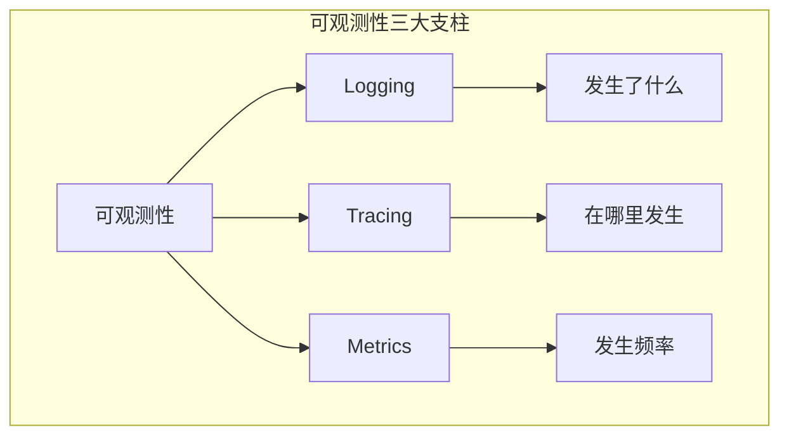

### LLM 应用可观测性特点

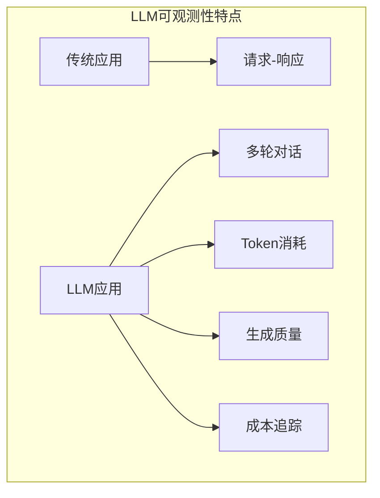

### 可观测性架构

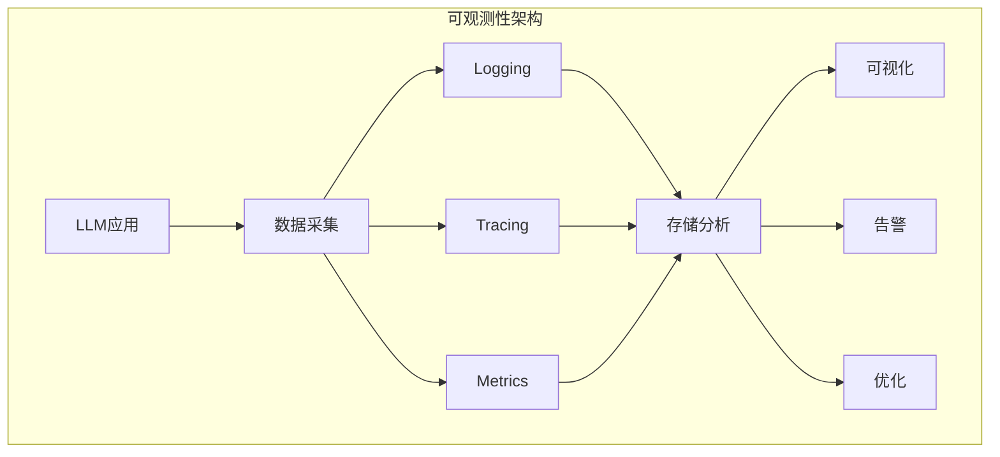

## Logging

### 日志记录内容

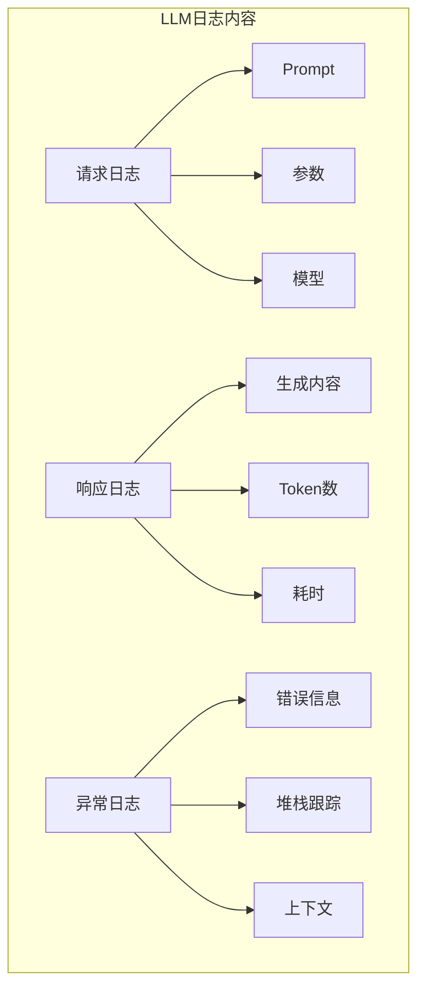

### 日志级别策略

| 级别 | 使用场景 | 示例 |
|-----|---------|------|
| ERROR | 系统错误 | API调用失败、连接超时 |
| WARN | 警告信息 | Token超限、降级触发 |
| INFO | 正常流程 | 请求开始/完成、缓存命中 |
| DEBUG | 调试信息 | 完整Prompt、原始响应 |
| TRACE | 详细追踪 | 函数调用、参数变化 |

### 结构化日志

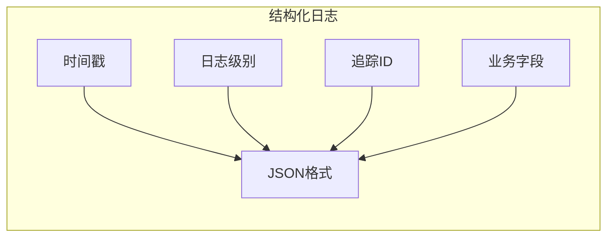

## Tracing

### 分布式追踪

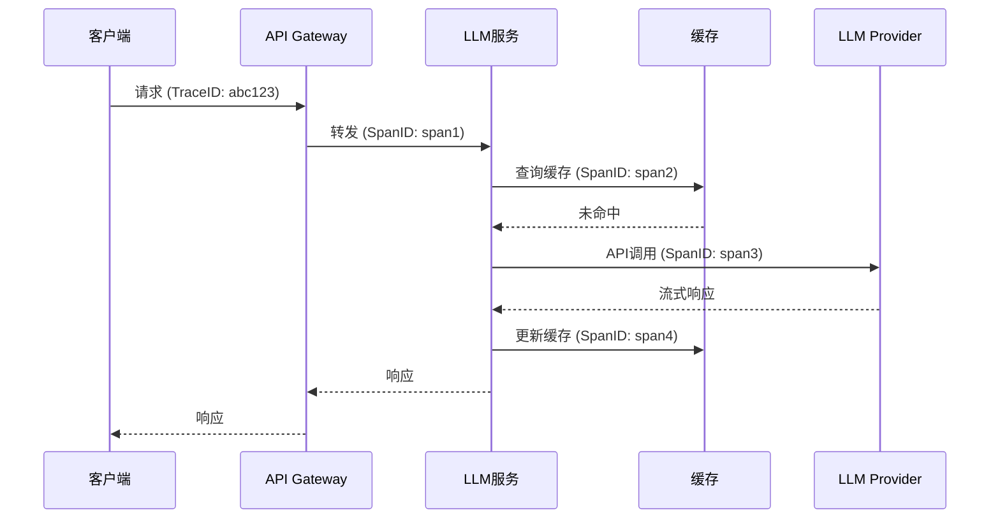

### 追踪维度

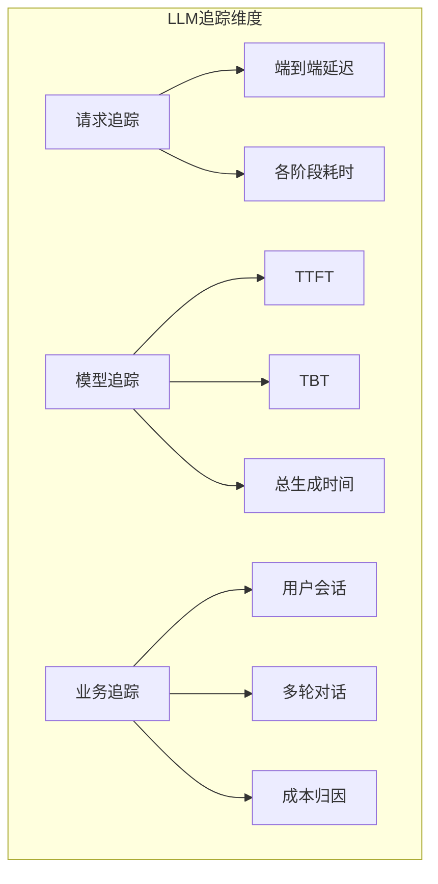

### Span 设计

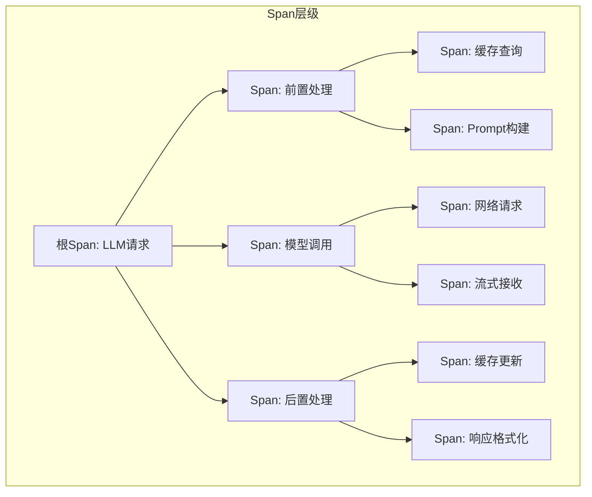

## Metrics

### 核心指标分类

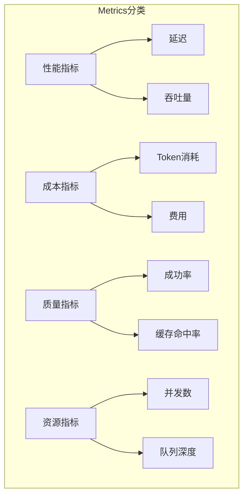

### 指标类型

| 类型 | 说明 | 示例 |
|-----|------|------|
| Counter | 单调递增计数器 | 请求总数、Token总数 |
| Gauge | 可增可减的值 | 并发数、队列长度 |
| Histogram | 分布统计 | 延迟分布 |
| Summary | 分位数统计 | P99延迟 |

### 指标标签设计

```mermaid
graph LR
    subgraph "标签设计"
        A[模型标签] --> E[llm_requests_total{model="gpt-4"}]
        B[状态标签] --> E
        C[操作标签] --> E
        D[环境标签] --> E
    end
```

## 工具推荐

### 工具对比

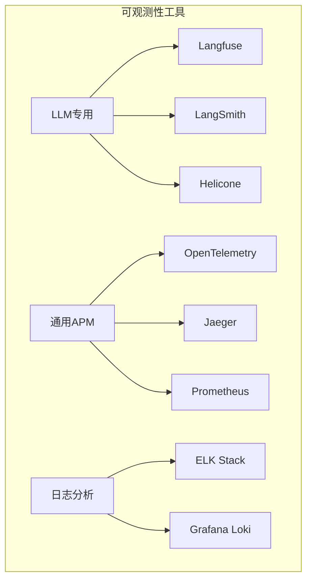

### Langfuse

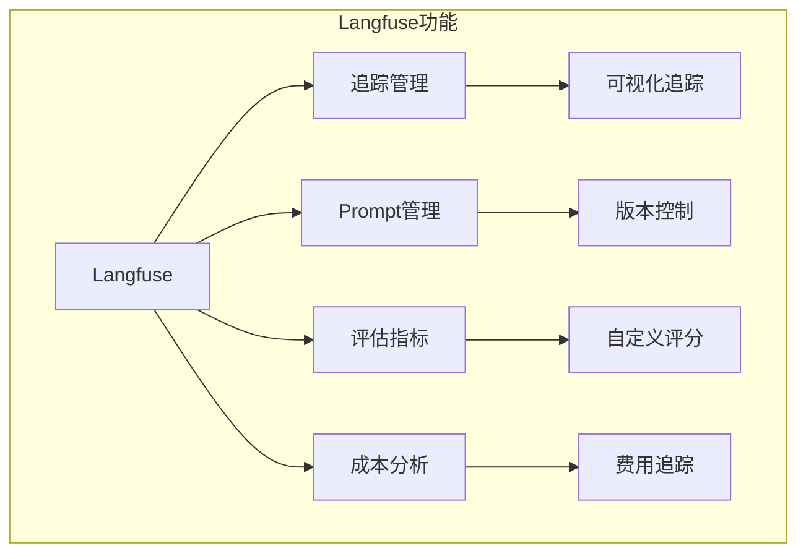

**特点**：
- 开源可自托管
- LLM专用追踪
- Prompt版本管理
- 评估工作流

### LangSmith

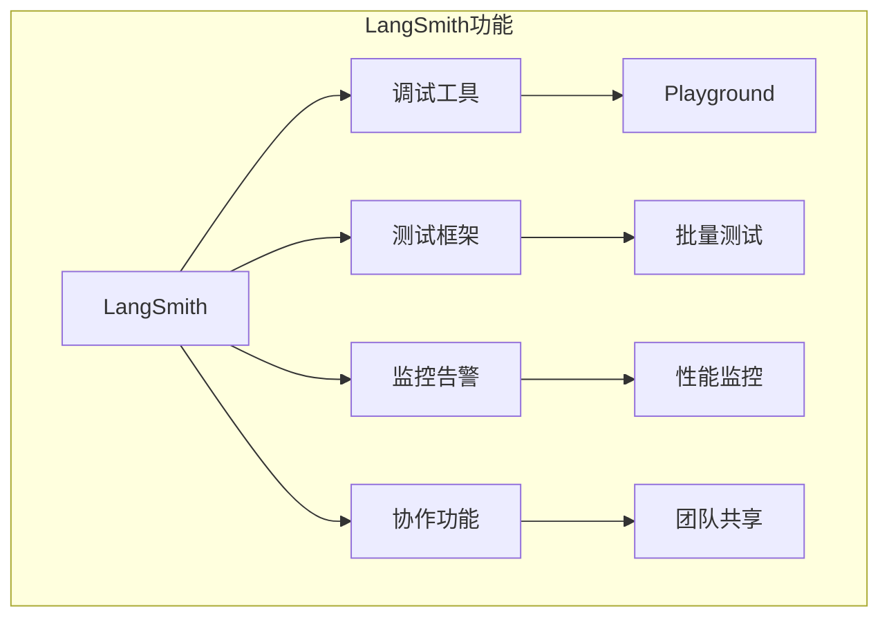

**特点**：
- LangChain官方出品
- 深度集成LangChain
- 丰富的调试功能
- 托管服务

### 工具选型建议

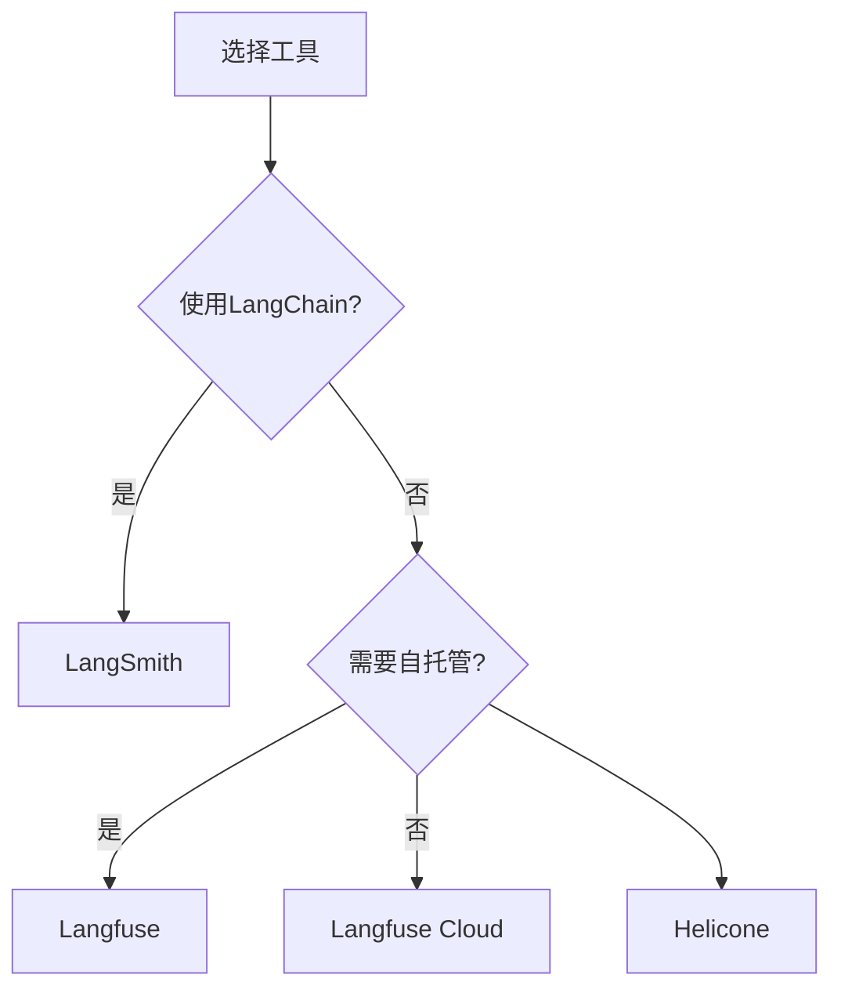

## Java 实现示例

### 结构化日志配置

```java
import org.slf4j.Logger;
import org.slf4j.LoggerFactory;
import org.slf4j.MDC;
import org.springframework.stereotype.Component;
import java.util.UUID;

/**
 * 结构化日志记录器
 */
@Component
public class StructuredLogger {
    
    private static final Logger logger = LoggerFactory.getLogger("LLMLogger");
    
    /**
     * 记录LLM请求
     */
    public void logRequest(String traceId, String model, String prompt, 
                          Map<String, Object> parameters) {
        MDC.put("traceId", traceId);
        MDC.put("model", model);
        MDC.put("type", "request");
        
        try {
            LogEntry entry = new LogEntry(
                System.currentTimeMillis(),
                traceId,
                model,
                "request",
                Map.of(
                    "promptLength", prompt.length(),
                    "parameters", parameters
                )
            );
            
            logger.info("LLM Request: {}", JsonUtils.toJson(entry));
        } finally {
            MDC.clear();
        }
    }
    
    /**
     * 记录LLM响应
     */
    public void logResponse(String traceId, String model, String response,
                           int inputTokens, int outputTokens, long latencyMs) {
        MDC.put("traceId", traceId);
        MDC.put("model", model);
        MDC.put("type", "response");
        
        try {
            LogEntry entry = new LogEntry(
                System.currentTimeMillis(),
                traceId,
                model,
                "response",
                Map.of(
                    "responseLength", response.length(),
                    "inputTokens", inputTokens,
                    "outputTokens", outputTokens,
                    "latencyMs", latencyMs,
                    "cost", calculateCost(model, inputTokens, outputTokens)
                )
            );
            
            logger.info("LLM Response: {}", JsonUtils.toJson(entry));
        } finally {
            MDC.clear();
        }
    }
    
    /**
     * 记录错误
     */
    public void logError(String traceId, String model, Throwable error, 
                        Map<String, Object> context) {
        MDC.put("traceId", traceId);
        MDC.put("model", model);
        MDC.put("type", "error");
        
        try {
            LogEntry entry = new LogEntry(
                System.currentTimeMillis(),
                traceId,
                model,
                "error",
                Map.of(
                    "errorType", error.getClass().getName(),
                    "errorMessage", error.getMessage(),
                    "context", context
                )
            );
            
            logger.error("LLM Error: {}", JsonUtils.toJson(entry), error);
        } finally {
            MDC.clear();
        }
    }
    
    private double calculateCost(String model, int inputTokens, int outputTokens) {
        return switch (model) {
            case "gpt-4o" -> (inputTokens / 1_000_000.0) * 5.0 + (outputTokens / 1_000_000.0) * 15.0;
            case "gpt-3.5-turbo" -> (inputTokens / 1_000_000.0) * 0.5 + (outputTokens / 1_000_000.0) * 1.5;
            default -> 0;
        };
    }
}

/**
 * 日志条目
 */
public record LogEntry(
    long timestamp,
    String traceId,
    String model,
    String type,
    Map<String, Object> data
) {}
```

### OpenTelemetry 追踪

```java
import io.opentelemetry.api.OpenTelemetry;
import io.opentelemetry.api.trace.Span;
import io.opentelemetry.api.trace.SpanKind;
import io.opentelemetry.api.trace.StatusCode;
import io.opentelemetry.api.trace.Tracer;
import io.opentelemetry.context.Context;
import io.opentelemetry.context.Scope;
import io.opentelemetry.context.propagation.TextMapPropagator;
import io.opentelemetry.semconv.SemanticAttributes;
import org.springframework.stereotype.Component;

/**
 * LLM追踪器
 */
@Component
public class LLMTracer {
    
    private final Tracer tracer;
    private final TextMapPropagator propagator;
    
    public LLMTracer(OpenTelemetry openTelemetry) {
        this.tracer = openTelemetry.getTracer("llm-service");
        this.propagator = openTelemetry.getPropagators().getTextMapPropagator();
    }
    
    /**
     * 开始LLM请求追踪
     */
    public LLMTraceContext startTrace(String operation, String model) {
        Span span = tracer.spanBuilder(operation)
            .setSpanKind(SpanKind.CLIENT)
            .setAttribute("llm.model", model)
            .setAttribute("llm.operation", operation)
            .startSpan();
        
        return new LLMTraceContext(span);
    }
    
    /**
     * 记录Prompt
     */
    public void recordPrompt(LLMTraceContext context, String prompt) {
        context.span().setAttribute("llm.prompt.length", prompt.length());
        // 注意：生产环境不要记录完整Prompt，可能包含敏感信息
        if (prompt.length() < 1000) {
            context.span().setAttribute("llm.prompt.preview", 
                prompt.substring(0, Math.min(100, prompt.length())));
        }
    }
    
    /**
     * 记录响应
     */
    public void recordResponse(LLMTraceContext context, String response,
                               int inputTokens, int outputTokens) {
        Span span = context.span();
        span.setAttribute("llm.response.length", response.length());
        span.setAttribute("llm.tokens.input", inputTokens);
        span.setAttribute("llm.tokens.output", outputTokens);
        span.setAttribute("llm.tokens.total", inputTokens + outputTokens);
    }
    
    /**
     * 记录生成参数
     */
    public void recordParameters(LLMTraceContext context, double temperature,
                                  int maxTokens, double topP) {
        Span span = context.span();
        span.setAttribute("llm.temperature", temperature);
        span.setAttribute("llm.max_tokens", maxTokens);
        span.setAttribute("llm.top_p", topP);
    }
    
    /**
     * 记录错误
     */
    public void recordError(LLMTraceContext context, Throwable error) {
        Span span = context.span();
        span.recordException(error);
        span.setStatus(StatusCode.ERROR, error.getMessage());
    }
    
    /**
     * 结束追踪
     */
    public void endTrace(LLMTraceContext context) {
        context.span().end();
    }
    
    /**
     * 创建子Span
     */
    public LLMTraceContext createChildSpan(LLMTraceContext parent, String name) {
        Span childSpan = tracer.spanBuilder(name)
            .setParent(Context.current().with(parent.span()))
            .startSpan();
        return new LLMTraceContext(childSpan);
    }
}

/**
 * 追踪上下文
 */
public class LLMTraceContext implements AutoCloseable {
    private final Span span;
    private final Scope scope;
    
    public LLMTraceContext(Span span) {
        this.span = span;
        this.scope = span.makeCurrent();
    }
    
    public Span span() {
        return span;
    }
    
    @Override
    public void close() {
        scope.close();
        span.end();
    }
}
```

### Micrometer 指标

```java
import io.micrometer.core.instrument.*;
import org.springframework.stereotype.Component;
import java.util.concurrent.TimeUnit;

/**
 * LLM指标收集器
 */
@Component
public class LLMMetricsCollector {
    
    private final MeterRegistry meterRegistry;
    
    // 计数器
    private final Counter requestCounter;
    private final Counter tokenCounter;
    private final Counter errorCounter;
    
    // 计时器
    private final Timer requestTimer;
    private final Timer ttftTimer;
    
    // 分布摘要
    private final DistributionSummary inputTokenSummary;
    private final DistributionSummary outputTokenSummary;
    
    // Gauge
    private final AtomicInteger activeRequests;
    
    public LLMMetricsCollector(MeterRegistry meterRegistry) {
        this.meterRegistry = meterRegistry;
        
        // 初始化计数器
        this.requestCounter = Counter.builder("llm.requests.total")
            .description("LLM请求总数")
            .register(meterRegistry);
            
        this.tokenCounter = Counter.builder("llm.tokens.total")
            .description("LLM Token总数")
            .register(meterRegistry);
            
        this.errorCounter = Counter.builder("llm.errors.total")
            .description("LLM错误总数")
            .register(meterRegistry);
        
        // 初始化计时器
        this.requestTimer = Timer.builder("llm.request.duration")
            .description("LLM请求耗时")
            .publishPercentiles(0.5, 0.95, 0.99)
            .register(meterRegistry);
            
        this.ttftTimer = Timer.builder("llm.request.ttft")
            .description("首Token返回时间")
            .publishPercentiles(0.5, 0.95, 0.99)
            .register(meterRegistry);
        
        // 初始化分布摘要
        this.inputTokenSummary = DistributionSummary.builder("llm.tokens.input")
            .description("输入Token数量分布")
            .publishPercentiles(0.5, 0.95, 0.99)
            .register(meterRegistry);
            
        this.outputTokenSummary = DistributionSummary.builder("llm.tokens.output")
            .description("输出Token数量分布")
            .publishPercentiles(0.5, 0.95, 0.99)
            .register(meterRegistry);
        
        // 初始化Gauge
        this.activeRequests = new AtomicInteger(0);
        Gauge.builder("llm.requests.active")
            .description("活跃请求数")
            .register(meterRegistry, activeRequests, AtomicInteger::get);
    }
    
    /**
     * 记录请求开始
     */
    public void recordRequestStart() {
        requestCounter.increment();
        activeRequests.incrementAndGet();
    }
    
    /**
     * 记录请求完成
     */
    public void recordRequestComplete(long durationMs, int inputTokens, int outputTokens) {
        requestTimer.record(durationMs, TimeUnit.MILLISECONDS);
        tokenCounter.increment(inputTokens + outputTokens);
        inputTokenSummary.record(inputTokens);
        outputTokenSummary.record(outputTokens);
        activeRequests.decrementAndGet();
    }
    
    /**
     * 记录TTFT
     */
    public void recordTTFT(long ttftMs) {
        ttftTimer.record(ttftMs, TimeUnit.MILLISECONDS);
    }
    
    /**
     * 记录错误
     */
    public void recordError(String errorType) {
        errorCounter.increment();
        Counter.builder("llm.errors.by_type")
            .tag("type", errorType)
            .register(meterRegistry)
            .increment();
    }
    
    /**
     * 创建带标签的计时器
     */
    public Timer.Sample startTimer() {
        return Timer.start(meterRegistry);
    }
    
    /**
     * 记录带标签的请求
     */
    public void recordRequestWithTags(String model, String operation, 
                                       long durationMs, boolean success) {
        Timer.builder("llm.request.duration")
            .tag("model", model)
            .tag("operation", operation)
            .tag("status", success ? "success" : "error")
            .register(meterRegistry)
            .record(durationMs, TimeUnit.MILLISECONDS);
    }
}
```

### Langfuse 集成

```java
import com.langfuse.client.LangfuseClient;
import com.langfuse.client.model.*;
import org.springframework.stereotype.Component;
import java.util.Map;
import java.util.UUID;

/**
 * Langfuse集成服务
 */
@Component
public class LangfuseIntegration {
    
    private final LangfuseClient langfuse;
    
    public LangfuseIntegration(@Value("${langfuse.url}") String url,
                               @Value("${langfuse.publicKey}") String publicKey,
                               @Value("${langfuse.secretKey}") String secretKey) {
        this.langfuse = LangfuseClient.builder()
            .baseUrl(url)
            .publicKey(publicKey)
            .secretKey(secretKey)
            .build();
    }
    
    /**
     * 创建追踪
     */
    public String createTrace(String name, Map<String, String> metadata) {
        String traceId = UUID.randomUUID().toString();
        
        TraceCreate trace = TraceCreate.builder()
            .id(traceId)
            .name(name)
            .metadata(metadata)
            .build();
        
        langfuse.createTrace(trace);
        return traceId;
    }
    
    /**
     * 记录Generation
     */
    public String recordGeneration(String traceId, String name,
                                    String model, String prompt,
                                    Map<String, Object> modelParameters) {
        String generationId = UUID.randomUUID().toString();
        
        GenerationCreate generation = GenerationCreate.builder()
            .id(generationId)
            .traceId(traceId)
            .name(name)
            .model(model)
            .prompt(prompt)
            .modelParameters(modelParameters)
            .startTime(java.time.Instant.now())
            .build();
        
        langfuse.createGeneration(generation);
        return generationId;
    }
    
    /**
     * 完成Generation
     */
    public void completeGeneration(String generationId, String output,
                                    int inputTokens, int outputTokens,
                                    double cost) {
        GenerationUpdate update = GenerationUpdate.builder()
            .id(generationId)
            .output(output)
            .completionStartTime(java.time.Instant.now())
            .endTime(java.time.Instant.now())
            .usage(Usage.builder()
                .inputTokens(inputTokens)
                .outputTokens(outputTokens)
                .totalCost(cost)
                .build())
            .build();
        
        langfuse.updateGeneration(update);
    }
    
    /**
     * 记录评分
     */
    public void recordScore(String traceId, String name, 
                           double value, String comment) {
        ScoreCreate score = ScoreCreate.builder()
            .traceId(traceId)
            .name(name)
            .value(value)
            .comment(comment)
            .build();
        
        langfuse.createScore(score);
    }
    
    /**
     * 创建Span
     */
    public String createSpan(String traceId, String parentId, 
                            String name, Map<String, String> metadata) {
        String spanId = UUID.randomUUID().toString();
        
        SpanCreate span = SpanCreate.builder()
            .id(spanId)
            .traceId(traceId)
            .parentObservationId(parentId)
            .name(name)
            .metadata(metadata)
            .startTime(java.time.Instant.now())
            .build();
        
        langfuse.createSpan(span);
        return spanId;
    }
    
    /**
     * 完成Span
     */
    public void completeSpan(String spanId, Map<String, Object> output) {
        SpanUpdate update = SpanUpdate.builder()
            .id(spanId)
            .output(output)
            .endTime(java.time.Instant.now())
            .build();
        
        langfuse.updateSpan(update);
    }
}
```

### 综合可观测性服务

```java
import org.springframework.stereotype.Service;

/**
 * 综合可观测性服务
 */
@Service
public class ObservabilityService {
    
    @Autowired
    private StructuredLogger logger;
    
    @Autowired
    private LLMTracer tracer;
    
    @Autowired
    private LLMMetricsCollector metrics;
    
    @Autowired
    private LangfuseIntegration langfuse;
    
    /**
     * 完整的请求追踪
     */
    public <T> T traceRequest(String operation, String model, String prompt,
                              Map<String, Object> parameters,
                              RequestExecutor<T> executor) {
        String traceId = UUID.randomUUID().toString();
        long startTime = System.currentTimeMillis();
        
        // 开始追踪
        LLMTraceContext traceContext = tracer.startTrace(operation, model);
        tracer.recordPrompt(traceContext, prompt);
        tracer.recordParameters(traceContext, 
            (Double) parameters.getOrDefault("temperature", 0.7),
            (Integer) parameters.getOrDefault("maxTokens", 1000),
            (Double) parameters.getOrDefault("topP", 1.0));
        
        // 记录日志
        logger.logRequest(traceId, model, prompt, parameters);
        
        // 记录指标
        metrics.recordRequestStart();
        Timer.Sample timer = metrics.startTimer();
        
        // Langfuse追踪
        String langfuseTraceId = langfuse.createTrace(operation, 
            Map.of("model", model));
        String generationId = langfuse.recordGeneration(langfuseTraceId, 
            operation, model, prompt, parameters);
        
        try {
            // 执行请求
            T result = executor.execute();
            
            long duration = System.currentTimeMillis() - startTime;
            
            // 记录成功
            int inputTokens = estimateTokens(prompt);
            int outputTokens = estimateTokens(result.toString());
            
            tracer.recordResponse(traceContext, result.toString(), 
                inputTokens, outputTokens);
            logger.logResponse(traceId, model, result.toString(), 
                inputTokens, outputTokens, duration);
            metrics.recordRequestComplete(duration, inputTokens, outputTokens);
            
            double cost = calculateCost(model, inputTokens, outputTokens);
            langfuse.completeGeneration(generationId, result.toString(),
                inputTokens, outputTokens, cost);
            
            return result;
            
        } catch (Exception e) {
            // 记录错误
            tracer.recordError(traceContext, e);
            logger.logError(traceId, model, e, parameters);
            metrics.recordError(e.getClass().getSimpleName());
            
            throw e;
            
        } finally {
            tracer.endTrace(traceContext);
            timer.stop(metrics.requestTimer);
        }
    }
    
    private int estimateTokens(String text) {
        return text.length() / 2; // 简化估算
    }
    
    private double calculateCost(String model, int inputTokens, int outputTokens) {
        return switch (model) {
            case "gpt-4o" -> (inputTokens / 1_000_000.0) * 5.0 + (outputTokens / 1_000_000.0) * 15.0;
            case "gpt-3.5-turbo" -> (inputTokens / 1_000_000.0) * 0.5 + (outputTokens / 1_000_000.0) * 1.5;
            default -> 0;
        };
    }
}

/**
 * 请求执行器接口
 */
@FunctionalInterface
public interface RequestExecutor<T> {
    T execute() throws Exception;
}
```

---

> 📌 下一节：[Java 实战](./06-java-performance-practice.md)
