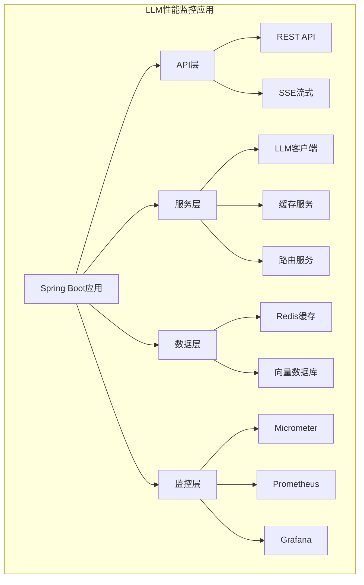
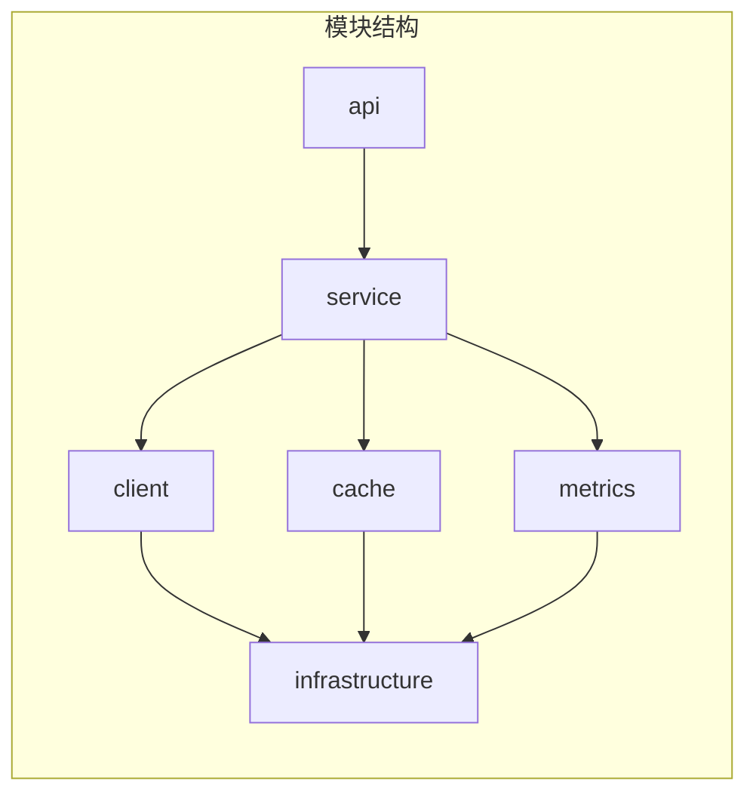

# Java 实战：性能优化与监控

本文档提供完整的 Spring Boot + LLM 性能优化与监控实战示例，涵盖性能优化、Micrometer 集成、Prometheus/Grafana 监控等完整方案。

## 目录

1. [项目架构](#项目架构)
2. [性能优化实践](#性能优化实践)
3. [Micrometer 集成](#micrometer-集成)
4. [Prometheus + Grafana](#prometheus--grafana)
5. [完整代码示例](#完整代码示例)

## 项目架构

### 整体架构



### 模块结构



## 性能优化实践

### 1. 连接池优化

```java
import okhttp3.ConnectionPool;
import okhttp3.Dispatcher;
import okhttp3.OkHttpClient;
import org.springframework.context.annotation.Bean;
import org.springframework.context.annotation.Configuration;
import java.util.concurrent.TimeUnit;

/**
 * HTTP客户端优化配置
 */
@Configuration
public class HttpClientConfig {
    
    @Bean
    public OkHttpClient optimizedHttpClient() {
        // 自定义Dispatcher以控制并发
        Dispatcher dispatcher = new Dispatcher();
        dispatcher.setMaxRequests(100);        // 最大并发请求数
        dispatcher.setMaxRequestsPerHost(20);  // 每个主机最大并发
        
        // 连接池配置
        ConnectionPool connectionPool = new ConnectionPool(
            50,           // 最大空闲连接数
            5,            // 连接存活时间（分钟）
            TimeUnit.MINUTES
        );
        
        return new OkHttpClient.Builder()
            .dispatcher(dispatcher)
            .connectionPool(connectionPool)
            .connectTimeout(10, TimeUnit.SECONDS)
            .readTimeout(60, TimeUnit.SECONDS)
            .writeTimeout(10, TimeUnit.SECONDS)
            .retryOnConnectionFailure(true)
            .build();
    }
}
```

### 2. 异步处理优化

```java
import org.springframework.scheduling.annotation.Async;
import org.springframework.scheduling.annotation.AsyncConfigurer;
import org.springframework.scheduling.concurrent.ThreadPoolTaskExecutor;
import org.springframework.stereotype.Service;
import java.util.concurrent.CompletableFuture;
import java.util.concurrent.Executor;

/**
 * 异步LLM服务
 */
@Service
public class AsyncLLMService implements AsyncConfigurer {
    
    @Override
    @Bean(name = "llmTaskExecutor")
    public Executor getAsyncExecutor() {
        ThreadPoolTaskExecutor executor = new ThreadPoolTaskExecutor();
        executor.setCorePoolSize(10);
        executor.setMaxPoolSize(50);
        executor.setQueueCapacity(200);
        executor.setThreadNamePrefix("llm-async-");
        executor.setRejectedExecutionHandler(new ThreadPoolExecutor.CallerRunsPolicy());
        executor.initialize();
        return executor;
    }
    
    /**
     * 异步调用LLM
     */
    @Async("llmTaskExecutor")
    public CompletableFuture<LLMResponse> asyncChat(String prompt) {
        return CompletableFuture.supplyAsync(() -> {
            // 调用LLM
            return llmClient.chat(prompt);
        });
    }
    
    /**
     * 批量异步处理
     */
    public List<LLMResponse> batchProcessAsync(List<String> prompts) {
        List<CompletableFuture<LLMResponse>> futures = prompts.stream()
            .map(this::asyncChat)
            .toList();
        
        // 等待所有完成
        CompletableFuture<Void> allDone = CompletableFuture.allOf(
            futures.toArray(new CompletableFuture[0])
        );
        
        return allDone.thenApply(v -> 
            futures.stream()
                .map(CompletableFuture::join)
                .toList()
        ).join();
    }
}
```

### 3. 缓存优化

```java
import com.github.benmanes.caffeine.cache.Caffeine;
import org.springframework.cache.CacheManager;
import org.springframework.cache.annotation.EnableCaching;
import org.springframework.cache.caffeine.CaffeineCacheManager;
import org.springframework.context.annotation.Bean;
import org.springframework.context.annotation.Configuration;
import org.springframework.data.redis.cache.RedisCacheConfiguration;
import org.springframework.data.redis.cache.RedisCacheManager;
import org.springframework.data.redis.serializer.GenericJackson2JsonRedisSerializer;
import org.springframework.data.redis.serializer.RedisSerializationContext;
import java.time.Duration;
import java.util.HashMap;
import java.util.Map;

/**
 * 多级缓存配置
 */
@Configuration
@EnableCaching
public class CacheConfig {
    
    /**
     * Caffeine本地缓存
     */
    @Bean
    public CacheManager caffeineCacheManager() {
        CaffeineCacheManager cacheManager = new CaffeineCacheManager();
        cacheManager.setCaffeine(Caffeine.newBuilder()
            .maximumSize(10000)
            .expireAfterWrite(Duration.ofMinutes(10))
            .recordStats()
        );
        return cacheManager;
    }
    
    /**
     * Redis缓存配置
     */
    @Bean
    public CacheManager redisCacheManager(RedisConnectionFactory connectionFactory) {
        RedisCacheConfiguration defaultConfig = RedisCacheConfiguration.defaultCacheConfig()
            .entryTtl(Duration.ofHours(1))
            .serializeValuesWith(RedisSerializationContext.SerializationPair
                .fromSerializer(new GenericJackson2JsonRedisSerializer()));
        
        // 针对不同缓存的TTL配置
        Map<String, RedisCacheConfiguration> configMap = new HashMap<>();
        configMap.put("llm:prompt", defaultConfig.entryTtl(Duration.ofHours(24)));
        configMap.put("llm:result", defaultConfig.entryTtl(Duration.ofMinutes(30)));
        configMap.put("llm:semantic", defaultConfig.entryTtl(Duration.ofHours(2)));
        
        return RedisCacheManager.builder(connectionFactory)
            .cacheDefaults(defaultConfig)
            .withInitialCacheConfigurations(configMap)
            .build();
    }
}

/**
 * 缓存服务
 */
@Service
public class OptimizedCacheService {
    
    @Autowired
    @Qualifier("caffeineCacheManager")
    private CacheManager localCacheManager;
    
    @Autowired
    @Qualifier("redisCacheManager")
    private CacheManager redisCacheManager;
    
    /**
     * 多级缓存获取
     */
    public <T> T getWithMultiLevel(String key, Class<T> type, Supplier<T> loader) {
        // L1: 本地缓存
        Cache localCache = localCacheManager.getCache("llm:local");
        T value = localCache.get(key, type);
        if (value != null) {
            return value;
        }
        
        // L2: Redis缓存
        Cache redisCache = redisCacheManager.getCache("llm:result");
        value = redisCache.get(key, type);
        if (value != null) {
            // 回填本地缓存
            localCache.put(key, value);
            return value;
        }
        
        // 加载数据
        value = loader.get();
        if (value != null) {
            redisCache.put(key, value);
            localCache.put(key, value);
        }
        
        return value;
    }
}
```

### 4. JVM 优化

```yaml
# application.yml JVM优化配置
server:
  tomcat:
    threads:
      max: 200
      min-spare: 20
    max-connections: 10000
    accept-count: 100

spring:
  jackson:
    # 禁用默认日期格式化，提升性能
    serialization:
      write-dates-as-timestamps: true
    # 禁用失败空bean
    deserialization:
      fail-on-unknown-properties: false
  
  reactor:
    netty:
      pool:
        max-connections: 500
        max-idle-time: 30s

# 自定义线程池配置
llm:
  thread-pool:
    core-size: 20
    max-size: 100
    queue-capacity: 500
    keep-alive-seconds: 60
```

## Micrometer 集成

### 基础配置

```java
import io.micrometer.core.aop.TimedAspect;
import io.micrometer.core.instrument.MeterRegistry;
import io.micrometer.core.instrument.simple.SimpleMeterRegistry;
import io.micrometer.prometheus.PrometheusConfig;
import io.micrometer.prometheus.PrometheusMeterRegistry;
import org.springframework.context.annotation.Bean;
import org.springframework.context.annotation.Configuration;

/**
 * Micrometer配置
 */
@Configuration
public class MicrometerConfig {
    
    @Bean
    public PrometheusMeterRegistry prometheusMeterRegistry() {
        return new PrometheusMeterRegistry(PrometheusConfig.DEFAULT);
    }
    
    @Bean
    public TimedAspect timedAspect(MeterRegistry registry) {
        return new TimedAspect(registry);
    }
}
```

### 自定义指标

```java
import io.micrometer.core.annotation.Timed;
import io.micrometer.core.instrument.*;
import org.springframework.stereotype.Component;
import java.util.concurrent.TimeUnit;
import java.util.concurrent.atomic.AtomicInteger;

/**
 * LLM性能指标
 */
@Component
public class LLMPerformanceMetrics {
    
    private final MeterRegistry registry;
    
    // 性能指标
    private final Timer requestLatency;
    private final Timer ttftLatency;
    private final DistributionSummary tokenThroughput;
    
    // 业务指标
    private final Counter requestCounter;
    private final Counter tokenCounter;
    private final Counter costCounter;
    
    // 资源指标
    private final AtomicInteger activeConnections;
    private final AtomicInteger queueDepth;
    
    public LLMPerformanceMetrics(MeterRegistry registry) {
        this.registry = registry;
        
        // 延迟指标
        this.requestLatency = Timer.builder("llm.request.latency")
            .description("请求总延迟")
            .publishPercentiles(0.5, 0.9, 0.95, 0.99)
            .register(registry);
            
        this.ttftLatency = Timer.builder("llm.request.ttft")
            .description("首Token延迟")
            .publishPercentiles(0.5, 0.9, 0.95, 0.99)
            .register(registry);
        
        // 吞吐量指标
        this.tokenThroughput = DistributionSummary.builder("llm.token.throughput")
            .description("Token吞吐量(tokens/s)")
            .publishPercentiles(0.5, 0.9, 0.95)
            .register(registry);
        
        // 计数器
        this.requestCounter = Counter.builder("llm.requests")
            .description("请求计数")
            .register(registry);
            
        this.tokenCounter = Counter.builder("llm.tokens")
            .description("Token计数")
            .register(registry);
            
        this.costCounter = Counter.builder("llm.cost")
            .description("成本计数(美元)")
            .register(registry);
        
        // Gauge
        this.activeConnections = new AtomicInteger(0);
        Gauge.builder("llm.connections.active")
            .description("活跃连接数")
            .register(registry, activeConnections, AtomicInteger::get);
            
        this.queueDepth = new AtomicInteger(0);
        Gauge.builder("llm.queue.depth")
            .description("队列深度")
            .register(registry, queueDepth, AtomicInteger::get);
    }
    
    /**
     * 记录请求指标
     */
    public void recordRequest(String model, long latencyMs, long ttftMs,
                               int inputTokens, int outputTokens, double cost) {
        // 标签
        String[] tags = {"model", model};
        
        // 记录延迟
        requestLatency.record(latencyMs, TimeUnit.MILLISECONDS);
        if (ttftMs > 0) {
            ttftLatency.record(ttftMs, TimeUnit.MILLISECONDS);
        }
        
        // 记录吞吐量
        double tps = latencyMs > 0 ? (outputTokens * 1000.0) / latencyMs : 0;
        tokenThroughput.record(tps);
        
        // 记录计数
        requestCounter.increment();
        tokenCounter.increment(inputTokens + outputTokens);
        costCounter.increment(cost);
    }
    
    /**
     * 更新活跃连接数
     */
    public void incrementActiveConnections() {
        activeConnections.incrementAndGet();
    }
    
    public void decrementActiveConnections() {
        activeConnections.decrementAndGet();
    }
    
    /**
     * 更新队列深度
     */
    public void setQueueDepth(int depth) {
        queueDepth.set(depth);
    }
}
```

### AOP 监控

```java
import io.micrometer.core.annotation.Timed;
import io.micrometer.core.instrument.Timer;
import org.aspectj.lang.ProceedingJoinPoint;
import org.aspectj.lang.annotation.Around;
import org.aspectj.lang.annotation.Aspect;
import org.springframework.stereotype.Component;

/**
 * LLM调用监控切面
 */
@Aspect
@Component
public class LLMMonitoringAspect {
    
    @Autowired
    private LLMPerformanceMetrics metrics;
    
    /**
     * 监控LLM服务方法
     */
    @Around("@annotation(timed)")
    public Object aroundTimed(ProceedingJoinPoint pjp, Timed timed) throws Throwable {
        Timer.Sample sample = Timer.start();
        String methodName = pjp.getSignature().getName();
        
        try {
            return pjp.proceed();
        } finally {
            sample.stop(metrics.getRegistry().timer("llm.method",
                "method", methodName,
                "class", pjp.getTarget().getClass().getSimpleName()));
        }
    }
    
    /**
     * 监控Controller层
     */
    @Around("@within(org.springframework.web.bind.annotation.RestController)")
    public Object aroundController(ProceedingJoinPoint pjp) throws Throwable {
        long start = System.currentTimeMillis();
        metrics.incrementActiveConnections();
        
        try {
            return pjp.proceed();
        } finally {
            metrics.decrementActiveConnections();
            long duration = System.currentTimeMillis() - start;
            // 记录API延迟
        }
    }
}
```

## Prometheus + Grafana

### Prometheus 配置

```yaml
# prometheus.yml
global:
  scrape_interval: 15s
  evaluation_interval: 15s

scrape_configs:
  - job_name: 'llm-service'
    metrics_path: '/actuator/prometheus'
    static_configs:
      - targets: ['localhost:8080']
    
  - job_name: 'prometheus'
    static_configs:
      - targets: ['localhost:9090']
```

### Grafana Dashboard JSON

```json
{
  "dashboard": {
    "title": "LLM Performance Dashboard",
    "panels": [
      {
        "title": "Request Rate",
        "type": "graph",
        "targets": [
          {
            "expr": "rate(llm_requests_total[5m])",
            "legendFormat": "{{model}}"
          }
        ]
      },
      {
        "title": "Latency P99",
        "type": "graph",
        "targets": [
          {
            "expr": "histogram_quantile(0.99, rate(llm_request_latency_bucket[5m]))",
            "legendFormat": "P99"
          },
          {
            "expr": "histogram_quantile(0.95, rate(llm_request_latency_bucket[5m]))",
            "legendFormat": "P95"
          }
        ]
      },
      {
        "title": "Token Throughput",
        "type": "graph",
        "targets": [
          {
            "expr": "rate(llm_tokens_total[5m])",
            "legendFormat": "Tokens/sec"
          }
        ]
      },
      {
        "title": "Cost",
        "type": "stat",
        "targets": [
          {
            "expr": "llm_cost_total",
            "legendFormat": "Total Cost ($)"
          }
        ]
      },
      {
        "title": "Active Connections",
        "type": "gauge",
        "targets": [
          {
            "expr": "llm_connections_active",
            "legendFormat": "Connections"
          }
        ]
      }
    ]
  }
}
```

## 完整代码示例

### 主应用类

```java
import org.springframework.boot.SpringApplication;
import org.springframework.boot.autoconfigure.SpringBootApplication;
import org.springframework.cache.annotation.EnableCaching;
import org.springframework.scheduling.annotation.EnableAsync;

@SpringBootApplication
@EnableCaching
@EnableAsync
public class LLMPerformanceApplication {
    
    public static void main(String[] args) {
        SpringApplication.run(LLMPerformanceApplication.class, args);
    }
}
```

### 性能优化服务

```java
import org.springframework.beans.factory.annotation.Autowired;
import org.springframework.stereotype.Service;
import reactor.core.publisher.Flux;
import reactor.core.publisher.Mono;
import reactor.core.scheduler.Schedulers;
import java.time.Duration;
import java.util.List;
import java.util.concurrent.CompletableFuture;

/**
 * 性能优化LLM服务
 */
@Service
public class OptimizedLLMService {
    
    @Autowired
    private LLMClient llmClient;
    
    @Autowired
    private OptimizedCacheService cacheService;
    
    @Autowired
    private LLMPerformanceMetrics metrics;
    
    @Autowired
    private CircuitBreaker circuitBreaker;
    
    /**
     * 优化的聊天方法（带缓存）
     */
    @Timed(value = "llm.chat", percentiles = {0.5, 0.95, 0.99})
    public ChatResponse chat(ChatRequest request) {
        String cacheKey = generateCacheKey(request);
        
        // 检查缓存
        CachedResponse cached = cacheService.getWithMultiLevel(
            cacheKey, 
            CachedResponse.class,
            () -> null
        );
        
        if (cached != null) {
            return new ChatResponse(cached.getContent(), true);
        }
        
        // 执行请求
        long startTime = System.currentTimeMillis();
        metrics.incrementActiveConnections();
        
        try {
            // 断路器保护
            ChatResponse response = circuitBreaker.execute(() -> {
                return llmClient.chat(request.getPrompt());
            });
            
            long latency = System.currentTimeMillis() - startTime;
            int tokens = estimateTokens(response.getContent());
            
            // 记录指标
            metrics.recordRequest(
                request.getModel(),
                latency,
                0, // TTFT
                estimateTokens(request.getPrompt()),
                tokens,
                calculateCost(request.getModel(), tokens)
            );
            
            // 缓存结果
            cacheService.put(cacheKey, new CachedResponse(response.getContent()));
            
            return response;
            
        } finally {
            metrics.decrementActiveConnections();
        }
    }
    
    /**
     * 流式响应（优化版）
     */
    public Flux<StreamChunk> streamChat(ChatRequest request) {
        String cacheKey = generateCacheKey(request);
        
        return Flux.defer(() -> {
            long startTime = System.currentTimeMillis();
            AtomicLong firstTokenTime = new AtomicLong(0);
            AtomicInteger tokenCount = new AtomicInteger(0);
            
            return llmClient.streamChat(request.getPrompt())
                .doOnNext(chunk -> {
                    if (firstTokenTime.get() == 0) {
                        firstTokenTime.set(System.currentTimeMillis());
                    }
                    tokenCount.incrementAndGet();
                })
                .doOnComplete(() -> {
                    long latency = System.currentTimeMillis() - startTime;
                    long ttft = firstTokenTime.get() - startTime;
                    
                    metrics.recordRequest(
                        request.getModel(),
                        latency,
                        ttft,
                        estimateTokens(request.getPrompt()),
                        tokenCount.get(),
                        calculateCost(request.getModel(), tokenCount.get())
                    );
                })
                .subscribeOn(Schedulers.boundedElastic());
        });
    }
    
    /**
     * 批量处理（优化版）
     */
    public List<ChatResponse> batchChat(List<ChatRequest> requests) {
        return Flux.fromIterable(requests)
            .flatMap(req -> Mono.fromCallable(() -> chat(req))
                .subscribeOn(Schedulers.boundedElastic()),
                10) // 并发度
            .collectList()
            .block(Duration.ofMinutes(5));
    }
    
    /**
     * 异步批量处理
     */
    public CompletableFuture<List<ChatResponse>> asyncBatchChat(List<ChatRequest> requests) {
        List<CompletableFuture<ChatResponse>> futures = requests.stream()
            .map(req -> CompletableFuture.supplyAsync(
                () -> chat(req),
                asyncExecutor
            ))
            .toList();
        
        return CompletableFuture.allOf(futures.toArray(new CompletableFuture[0]))
            .thenApply(v -> futures.stream()
                .map(CompletableFuture::join)
                .toList());
    }
    
    private String generateCacheKey(ChatRequest request) {
        return DigestUtils.sha256Hex(
            request.getModel() + ":" + 
            request.getTemperature() + ":" + 
            request.getPrompt()
        );
    }
    
    private int estimateTokens(String text) {
        return text.length() / 2;
    }
    
    private double calculateCost(String model, int tokens) {
        return switch (model) {
            case "gpt-4o" -> tokens / 1_000_000.0 * 10;
            case "gpt-3.5-turbo" -> tokens / 1_000_000.0 * 2;
            default -> 0;
        };
    }
}
```

### 控制器

```java
import org.springframework.beans.factory.annotation.Autowired;
import org.springframework.http.MediaType;
import org.springframework.web.bind.annotation.*;
import reactor.core.publisher.Flux;
import java.util.List;

/**
 * LLM性能优化控制器
 */
@RestController
@RequestMapping("/api/v1/llm")
public class LLMPerformanceController {
    
    @Autowired
    private OptimizedLLMService llmService;
    
    @Autowired
    private LLMPerformanceMetrics metrics;
    
    /**
     * 标准聊天接口
     */
    @PostMapping("/chat")
    public ChatResponse chat(@RequestBody ChatRequest request) {
        return llmService.chat(request);
    }
    
    /**
     * 流式聊天接口
     */
    @PostMapping(value = "/chat/stream", produces = MediaType.TEXT_EVENT_STREAM_VALUE)
    public Flux<StreamChunk> streamChat(@RequestBody ChatRequest request) {
        return llmService.streamChat(request);
    }
    
    /**
     * 批量处理接口
     */
    @PostMapping("/chat/batch")
    public List<ChatResponse> batchChat(@RequestBody List<ChatRequest> requests) {
        return llmService.batchChat(requests);
    }
    
    /**
     * 异步批量处理接口
     */
    @PostMapping("/chat/batch/async")
    public CompletableFuture<List<ChatResponse>> asyncBatchChat(
            @RequestBody List<ChatRequest> requests) {
        return llmService.asyncBatchChat(requests);
    }
    
    /**
     * 健康检查
     */
    @GetMapping("/health")
    public HealthStatus health() {
        return new HealthStatus(
            "UP",
            metrics.getActiveConnections(),
            metrics.getQueueDepth()
        );
    }
    
    /**
     * 性能指标
     */
    @GetMapping("/metrics/summary")
    public MetricsSummary getMetricsSummary() {
        return new MetricsSummary(
            metrics.getTotalRequests(),
            metrics.getAvgLatency(),
            metrics.getP99Latency(),
            metrics.getTotalTokens(),
            metrics.getTotalCost()
        );
    }
}

// DTO类
@Data
public class ChatRequest {
    private String prompt;
    private String model = "gpt-3.5-turbo";
    private double temperature = 0.7;
    private int maxTokens = 1000;
}

@Data
@AllArgsConstructor
public class ChatResponse {
    private String content;
    private boolean cached;
    private long latencyMs;
    private int tokens;
}

@Data
@AllArgsConstructor
public class HealthStatus {
    private String status;
    private int activeConnections;
    private int queueDepth;
}

@Data
@AllArgsConstructor
public class MetricsSummary {
    private long totalRequests;
    private double avgLatency;
    private double p99Latency;
    private long totalTokens;
    private double totalCost;
}
```

### 依赖配置

```xml
<!-- pom.xml -->
<dependencies>
    <!-- Spring Boot -->
    <dependency>
        <groupId>org.springframework.boot</groupId>
        <artifactId>spring-boot-starter-web</artifactId>
    </dependency>
    <dependency>
        <groupId>org.springframework.boot</groupId>
        <artifactId>spring-boot-starter-webflux</artifactId>
    </dependency>
    
    <!-- 缓存 -->
    <dependency>
        <groupId>org.springframework.boot</groupId>
        <artifactId>spring-boot-starter-cache</artifactId>
    </dependency>
    <dependency>
        <groupId>com.github.ben-manes.caffeine</groupId>
        <artifactId>caffeine</artifactId>
    </dependency>
    <dependency>
        <groupId>org.springframework.boot</groupId>
        <artifactId>spring-boot-starter-data-redis</artifactId>
    </dependency>
    
    <!-- Micrometer + Prometheus -->
    <dependency>
        <groupId>io.micrometer</groupId>
        <artifactId>micrometer-registry-prometheus</artifactId>
    </dependency>
    <dependency>
        <groupId>org.springframework.boot</groupId>
        <artifactId>spring-boot-starter-actuator</artifactId>
    </dependency>
    
    <!-- HTTP客户端 -->
    <dependency>
        <groupId>com.squareup.okhttp3</groupId>
        <artifactId>okhttp</artifactId>
    </dependency>
    
    <!-- 断路器 -->
    <dependency>
        <groupId>io.github.resilience4j</groupId>
        <artifactId>resilience4j-spring-boot3</artifactId>
    </dependency>
    
    <!-- 工具类 -->
    <dependency>
        <groupId>org.apache.commons</groupId>
        <artifactId>commons-lang3</artifactId>
    </dependency>
</dependencies>
```

---

> 📌 本模块完整代码示例至此结束。如需了解更多细节，请参考各子章节文档。
