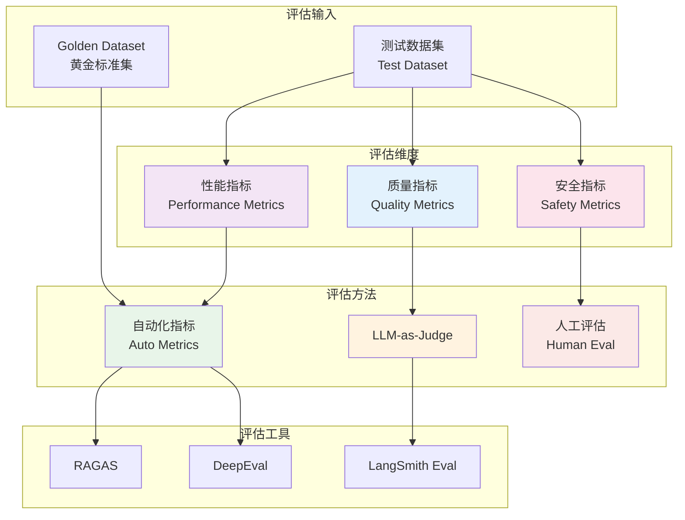
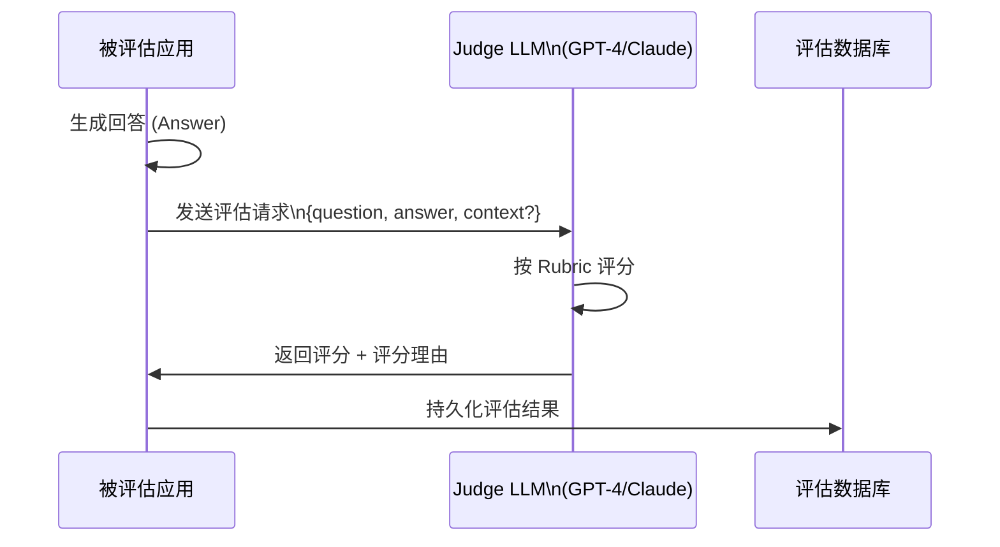
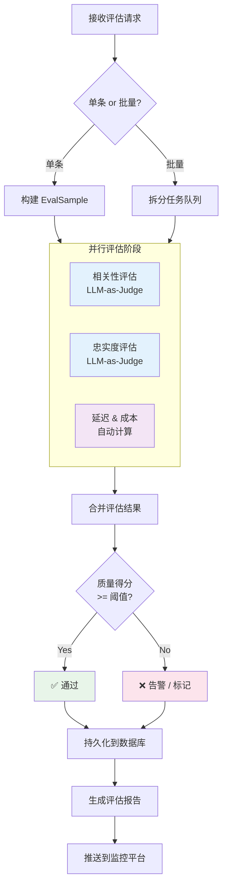

# LLM 应用评估（LLM Evaluation）

本文档全面介绍 LLM 应用的评估体系，涵盖评估指标、LLM-as-Judge 模式、自动化评估工具及 Java 工程落地实践。

## 目录

1. [概念与原理](#一概念与原理)
2. [评估指标体系](#二技术详解)
3. [Java 代码示例](#三java-代码示例)
4. [最佳实践](#四最佳实践)
5. [常见问题](#五常见问题)

---

## 一、概念与原理

### 为什么需要评估 LLM 应用

LLM 应用不同于传统软件——输出结果是开放式文本，无法用简单的断言（assert）验证正确性。随着应用走向生产，以下问题亟需回答：

- **质量保障**：模型升级或 Prompt 修改后，回答质量是否退步？
- **RAG 可靠性**：检索增强生成中，答案是否真正基于检索到的上下文？
- **安全合规**：输出是否包含有害内容（Toxicity）？
- **成本与性能**：Token 消耗、延迟是否在预算范围内？
- **A/B 对比**：哪个模型/Prompt 方案效果更好？

> 没有评估体系的 LLM 应用，就像没有测试套件的软件——上线即赌博。

### 评估的核心挑战

| 挑战 | 说明 |
|------|------|
| **无标准答案** | 同一问题可以有多个合理回答，无法用精确匹配衡量 |
| **评估成本高** | 人工标注费时费力，难以大规模覆盖 |
| **指标多维** | 质量、安全、性能、成本需综合权衡 |
| **分布漂移** | 真实用户输入分布难以预测 |
| **评估者偏差** | LLM-as-Judge 存在自我偏好（Self-preference）问题 |

### 评估体系全景



---

## 二、技术详解

### 2.1 评估指标体系

#### Accuracy（准确性）

衡量模型回答是否与事实一致。对于有明确答案的任务（如问答、分类），可与黄金标准对比。

```
Accuracy = 正确回答数 / 总回答数
```

**适用场景**：客服知识库问答、代码生成、信息抽取

#### Relevance（相关性）

衡量回答是否切题，是否真正回答了用户的问题。通常由 LLM-as-Judge 评分（0~1）。

**计算维度**：
- 问题与回答的语义相似度
- 回答是否覆盖问题的关键点
- 是否存在无关内容（Hallucination 的一种形式）

#### Faithfulness（忠实度）

**RAG 专属指标**：衡量生成答案是否忠实于检索到的上下文，不无中生有。

```
Faithfulness = 能在上下文中找到依据的陈述数 / 回答中的总陈述数
```

> Faithfulness 低 → 模型在"幻觉"（Hallucination）

#### Latency（延迟）

- **TTFT**（Time To First Token）：首 Token 延迟，影响用户感知
- **E2E Latency**：端到端总延迟
- **P95/P99 延迟**：长尾延迟，生产环境关键指标

#### Cost（成本）

```
单次请求成本 = (Input Tokens × 输入单价) + (Output Tokens × 输出单价)
```

评估时关注：平均成本、成本/质量比（Cost-Quality Tradeoff）。

#### Toxicity（毒性）

检测输出是否包含有害内容：仇恨言论、暴力内容、违规信息等。
常用工具：Perspective API、OpenAI Moderation API、自定义分类器。

### 2.2 LLM-as-Judge 模式

#### 原理

用一个强大的 LLM（通常是 GPT-4 或 Claude）来评判另一个 LLM 的输出质量。



#### 评估 Prompt 模板（Rubric-based）

```
你是一个专业的 AI 评估专家。请根据以下标准评估回答质量。

问题：{question}
回答：{answer}
参考上下文：{context}

评分标准（1-5分）：
5分：完全准确、相关，完整回答了问题
4分：基本准确，轻微遗漏或表述不够清晰
3分：部分准确，存在一些错误或偏差
2分：大部分不准确，关键信息缺失
1分：完全错误或与问题无关

请输出 JSON 格式：
{"score": <1-5>, "reason": "<评分理由>", "issues": ["<问题1>", ...]}
```

#### LLM-as-Judge 的优缺点

| 维度 | 优点 | 缺点 |
|------|------|------|
| **覆盖率** | 可大规模自动化，无需人工 | 评判本身有成本（API 费用） |
| **灵活性** | 可评估开放式、主观性强的回答 | 评判标准难以精确控制 |
| **一致性** | 同一 Rubric 下结果较稳定 | 存在自我偏好：偏向与自身风格相近的回答 |
| **可解释性** | 可输出评分理由 | 评分理由可能不可靠（Judge 也会幻觉） |

### 2.3 自动化评估工具对比

| 工具 | 定位 | 主要指标 | 语言支持 | 与 Java 集成 |
|------|------|---------|---------|------------|
| **RAGAS** | RAG 评估专用 | Faithfulness、Answer Relevance、Context Recall/Precision | Python SDK | 通过 REST API |
| **DeepEval** | 通用 LLM 评估框架 | G-Eval、Hallucination、Toxicity、Bias 等 14+ 指标 | Python SDK | 通过 REST API / CLI |
| **LangSmith Eval** | LangChain 生态评估 | 自定义指标 + 内置评估器 | Python/JS | 通过 LangSmith API |
| **PromptFoo** | Prompt 测试框架 | 自定义断言、LLM 评分 | Node.js | CLI + CI/CD 集成 |

#### RAGAS 核心指标详解

```
Context Precision   = 相关上下文块 / 检索到的上下文块总数
Context Recall      = 被覆盖的黄金答案要点 / 黄金答案要点总数
Faithfulness        = 有依据的陈述 / 总陈述数
Answer Relevance    = 生成问题与原问题的相似度均值（逆向评估）

RAG Score = (Context Precision + Context Recall + Faithfulness + Answer Relevance) / 4
```

---

## 三、Java 代码示例

### Maven 依赖配置

```xml
<dependencies>
    <!-- Spring Boot Web -->
    <dependency>
        <groupId>org.springframework.boot</groupId>
        <artifactId>spring-boot-starter-web</artifactId>
    </dependency>

    <!-- Spring AI (OpenAI) -->
    <dependency>
        <groupId>org.springframework.ai</groupId>
        <artifactId>spring-ai-openai-spring-boot-starter</artifactId>
        <version>1.0.0</version>
    </dependency>

    <!-- LangChain4j Core -->
    <dependency>
        <groupId>dev.langchain4j</groupId>
        <artifactId>langchain4j</artifactId>
        <version>0.32.0</version>
    </dependency>

    <!-- LangChain4j OpenAI -->
    <dependency>
        <groupId>dev.langchain4j</groupId>
        <artifactId>langchain4j-open-ai</artifactId>
        <version>0.32.0</version>
    </dependency>

    <!-- Jackson for JSON -->
    <dependency>
        <groupId>com.fasterxml.jackson.core</groupId>
        <artifactId>jackson-databind</artifactId>
    </dependency>

    <!-- Micrometer for metrics -->
    <dependency>
        <groupId>io.micrometer</groupId>
        <artifactId>micrometer-core</artifactId>
    </dependency>

    <!-- Lombok -->
    <dependency>
        <groupId>org.projectlombok</groupId>
        <artifactId>lombok</artifactId>
        <optional>true</optional>
    </dependency>
</dependencies>
```

### 3.1 评估数据模型

```java
import lombok.Builder;
import lombok.Data;
import java.time.Instant;
import java.util.List;
import java.util.Map;

/**
 * 单条评估样本
 */
@Data
@Builder
public class EvalSample {
    // 1. 样本标识
    private String id;
    private String category;

    // 2. 输入
    private String question;
    private String context;          // RAG 场景下检索到的上下文

    // 3. 输出
    private String actualAnswer;     // 被测应用的实际回答
    private String expectedAnswer;   // 黄金标准答案（可选）

    // 4. 元数据
    private Instant createdAt;
    private Map<String, String> metadata;
}

/**
 * 单条评估结果
 */
@Data
@Builder
public class EvalResult {
    // 1. 关联样本
    private String sampleId;

    // 2. 质量指标
    private double accuracy;         // 准确性 [0, 1]
    private double relevance;        // 相关性 [0, 1]
    private double faithfulness;     // 忠实度 [0, 1]（RAG 专用）

    // 3. 安全指标
    private double toxicity;         // 毒性   [0, 1]，越低越好

    // 4. 性能指标
    private long latencyMs;          // 端到端延迟（毫秒）
    private int inputTokens;         // 输入 Token 数
    private int outputTokens;        // 输出 Token 数
    private double costUsd;          // 本次请求成本（美元）

    // 5. Judge 详情
    private String judgeReason;      // LLM Judge 的评分理由
    private List<String> issues;     // 发现的问题列表

    /**
     * 计算综合质量得分（Quality Score）
     */
    public double getQualityScore() {
        // 6. 加权平均：相关性权重最高
        return accuracy * 0.35 + relevance * 0.40 + faithfulness * 0.25;
    }
}

/**
 * 批量评估汇总报告
 */
@Data
@Builder
public class EvalReport {
    private String reportId;
    private Instant generatedAt;
    private int totalSamples;

    // 均值指标
    private double avgAccuracy;
    private double avgRelevance;
    private double avgFaithfulness;
    private double avgToxicity;
    private double avgQualityScore;

    // 性能汇总
    private double avgLatencyMs;
    private double p95LatencyMs;
    private double totalCostUsd;

    // 分类明细
    private Map<String, Double> qualityByCategory;
}
```

### 3.2 LLM-as-Judge 评估器

```java
import com.fasterxml.jackson.databind.JsonNode;
import com.fasterxml.jackson.databind.ObjectMapper;
import dev.langchain4j.model.chat.ChatLanguageModel;
import dev.langchain4j.model.openai.OpenAiChatModel;
import lombok.RequiredArgsConstructor;
import lombok.extern.slf4j.Slf4j;
import org.springframework.stereotype.Component;

import java.util.ArrayList;
import java.util.List;

/**
 * LLM-as-Judge 评估器
 * 使用强模型（GPT-4）评判被测应用的输出质量
 */
@Slf4j
@Component
@RequiredArgsConstructor
public class LlmJudgeEvaluator {

    private final ObjectMapper objectMapper;

    // 1. Judge 模型（通常选用更强的模型）
    private final ChatLanguageModel judgeModel = OpenAiChatModel.builder()
            .apiKey(System.getenv("OPENAI_API_KEY"))
            .modelName("gpt-4o")
            .temperature(0.0)   // 确保评分稳定
            .build();

    // 2. 相关性评估 Prompt 模板
    private static final String RELEVANCE_PROMPT = """
            你是专业的 AI 回答质量评估专家。请评估以下回答的相关性。

            用户问题：%s

            模型回答：%s

            评分标准：
            1.0 = 完全相关，直接且完整地回答了问题
            0.8 = 高度相关，回答了问题但有轻微冗余或遗漏
            0.6 = 部分相关，回答了部分问题
            0.4 = 低相关，基本未回答核心问题
            0.0 = 完全不相关

            请严格按照以下 JSON 格式输出，不要包含其他内容：
            {"score": <0.0-1.0>, "reason": "<50字以内的评分理由>", "issues": []}
            """;

    // 3. 忠实度评估 Prompt 模板（RAG 专用）
    private static final String FAITHFULNESS_PROMPT = """
            你是专业的 RAG 系统评估专家。请评估模型回答是否忠实于给定上下文。

            参考上下文：%s

            模型回答：%s

            评估规则：
            - 只统计回答中的事实性陈述
            - 每条陈述：能在上下文中找到依据 → 算作忠实；无法找到依据 → 算作幻觉
            - Faithfulness = 忠实陈述数 / 总陈述数

            请严格按照以下 JSON 格式输出：
            {"score": <0.0-1.0>, "reason": "<评分理由>", "hallucinated_claims": ["<幻觉陈述1>"]}
            """;

    /**
     * 评估回答相关性
     */
    public EvalResult evaluateRelevance(EvalSample sample) {
        // 4. 构建评估请求
        String prompt = String.format(RELEVANCE_PROMPT,
                sample.getQuestion(), sample.getActualAnswer());

        long start = System.currentTimeMillis();
        String judgeResponse = judgeModel.generate(prompt);
        long latencyMs = System.currentTimeMillis() - start;

        // 5. 解析 Judge 返回的 JSON
        JudgeOutput output = parseJudgeOutput(judgeResponse);

        return EvalResult.builder()
                .sampleId(sample.getId())
                .relevance(output.score())
                .latencyMs(latencyMs)
                .judgeReason(output.reason())
                .issues(output.issues())
                .build();
    }

    /**
     * 评估 RAG 忠实度
     */
    public EvalResult evaluateFaithfulness(EvalSample sample) {
        if (sample.getContext() == null || sample.getContext().isBlank()) {
            log.warn("样本 {} 缺少 context，跳过忠实度评估", sample.getId());
            return EvalResult.builder().sampleId(sample.getId()).faithfulness(1.0).build();
        }

        // 6. 构建忠实度评估请求
        String prompt = String.format(FAITHFULNESS_PROMPT,
                sample.getContext(), sample.getActualAnswer());

        String judgeResponse = judgeModel.generate(prompt);
        JudgeOutput output = parseJudgeOutput(judgeResponse);

        return EvalResult.builder()
                .sampleId(sample.getId())
                .faithfulness(output.score())
                .judgeReason(output.reason())
                .build();
    }

    /**
     * 解析 Judge 输出的 JSON
     */
    private JudgeOutput parseJudgeOutput(String response) {
        try {
            // 7. 提取 JSON 块（防止模型输出多余文字）
            String json = extractJson(response);
            JsonNode node = objectMapper.readTree(json);
            double score = node.path("score").asDouble(0.5);
            String reason = node.path("reason").asText("");
            List<String> issues = new ArrayList<>();
            node.path("issues").forEach(n -> issues.add(n.asText()));
            return new JudgeOutput(score, reason, issues);
        } catch (Exception e) {
            log.error("解析 Judge 输出失败: {}", response, e);
            return new JudgeOutput(0.5, "解析失败", List.of());
        }
    }

    private String extractJson(String text) {
        int start = text.indexOf('{');
        int end = text.lastIndexOf('}');
        return (start >= 0 && end > start) ? text.substring(start, end + 1) : text;
    }

    private record JudgeOutput(double score, String reason, List<String> issues) {}
}
```

### 3.3 评估流水线服务

```java
import io.micrometer.core.instrument.MeterRegistry;
import io.micrometer.core.instrument.Timer;
import lombok.RequiredArgsConstructor;
import lombok.extern.slf4j.Slf4j;
import org.springframework.stereotype.Service;

import java.time.Instant;
import java.util.*;
import java.util.concurrent.*;
import java.util.stream.Collectors;

/**
 * LLM 评估流水线服务
 * 支持单条评估和批量评估，并持久化评估报告
 */
@Slf4j
@Service
@RequiredArgsConstructor
public class LlmEvaluationPipelineService {

    private final LlmJudgeEvaluator judgeEvaluator;
    private final MeterRegistry meterRegistry;

    // 1. 批量评估线程池（避免阻塞主线程）
    private final ExecutorService evalExecutor =
            Executors.newFixedThreadPool(4, r -> {
                Thread t = new Thread(r, "eval-worker");
                t.setDaemon(true);
                return t;
            });

    /**
     * 单条样本完整评估
     */
    public EvalResult evaluate(EvalSample sample) {
        Timer.Sample timerSample = Timer.start(meterRegistry);
        log.info("开始评估样本: {}", sample.getId());

        try {
            // 2. 并行执行相关性和忠实度评估
            CompletableFuture<EvalResult> relevanceFuture =
                    CompletableFuture.supplyAsync(
                            () -> judgeEvaluator.evaluateRelevance(sample), evalExecutor);

            CompletableFuture<EvalResult> faithfulnessFuture =
                    CompletableFuture.supplyAsync(
                            () -> judgeEvaluator.evaluateFaithfulness(sample), evalExecutor);

            EvalResult relevanceResult = relevanceFuture.get(30, TimeUnit.SECONDS);
            EvalResult faithfulnessResult = faithfulnessFuture.get(30, TimeUnit.SECONDS);

            // 3. 合并评估结果
            EvalResult merged = EvalResult.builder()
                    .sampleId(sample.getId())
                    .relevance(relevanceResult.getRelevance())
                    .faithfulness(faithfulnessResult.getFaithfulness())
                    .latencyMs(relevanceResult.getLatencyMs())
                    .judgeReason(relevanceResult.getJudgeReason())
                    .issues(mergeIssues(relevanceResult, faithfulnessResult))
                    .build();

            // 4. 记录 Micrometer 指标
            meterRegistry.gauge("llm.eval.quality_score",
                    merged.getQualityScore());
            timerSample.stop(meterRegistry.timer("llm.eval.duration",
                    "sample_id", sample.getId()));

            log.info("样本 {} 评估完成，质量得分: {}", sample.getId(),
                    String.format("%.2f", merged.getQualityScore()));
            return merged;

        } catch (TimeoutException e) {
            log.error("样本 {} 评估超时", sample.getId());
            throw new EvaluationException("评估超时", e);
        } catch (Exception e) {
            log.error("样本 {} 评估失败", sample.getId(), e);
            throw new EvaluationException("评估失败: " + e.getMessage(), e);
        }
    }

    /**
     * 批量评估并生成报告
     */
    public EvalReport evaluateBatch(List<EvalSample> samples) {
        log.info("开始批量评估，共 {} 条样本", samples.size());
        Instant startTime = Instant.now();

        // 5. 并发执行批量评估
        List<CompletableFuture<EvalResult>> futures = samples.stream()
                .map(sample -> CompletableFuture
                        .supplyAsync(() -> evaluate(sample), evalExecutor)
                        .exceptionally(ex -> {
                            log.warn("样本 {} 评估异常: {}", sample.getId(), ex.getMessage());
                            return EvalResult.builder().sampleId(sample.getId()).build();
                        }))
                .collect(Collectors.toList());

        List<EvalResult> results = futures.stream()
                .map(f -> {
                    try { return f.get(60, TimeUnit.SECONDS); }
                    catch (Exception e) { return null; }
                })
                .filter(Objects::nonNull)
                .collect(Collectors.toList());

        // 6. 汇总生成报告
        return buildReport(results, samples);
    }

    /**
     * 构建评估汇总报告
     */
    private EvalReport buildReport(List<EvalResult> results, List<EvalSample> samples) {
        DoubleSummaryStatistics relevanceStats = results.stream()
                .mapToDouble(EvalResult::getRelevance).summaryStatistics();
        DoubleSummaryStatistics faithfulnessStats = results.stream()
                .mapToDouble(EvalResult::getFaithfulness).summaryStatistics();
        DoubleSummaryStatistics latencyStats = results.stream()
                .mapToDouble(EvalResult::getLatencyMs).summaryStatistics();

        // 7. 按分类计算质量得分
        Map<String, Double> qualityByCategory = samples.stream()
                .collect(Collectors.groupingBy(
                        s -> s.getCategory() != null ? s.getCategory() : "default",
                        Collectors.averagingDouble(s -> results.stream()
                                .filter(r -> r.getSampleId().equals(s.getId()))
                                .mapToDouble(EvalResult::getQualityScore)
                                .average().orElse(0.0))));

        // 8. 计算 P95 延迟
        double p95Latency = calculatePercentile(
                results.stream().mapToDouble(EvalResult::getLatencyMs).toArray(), 0.95);

        return EvalReport.builder()
                .reportId(UUID.randomUUID().toString())
                .generatedAt(Instant.now())
                .totalSamples(results.size())
                .avgRelevance(relevanceStats.getAverage())
                .avgFaithfulness(faithfulnessStats.getAverage())
                .avgQualityScore(results.stream()
                        .mapToDouble(EvalResult::getQualityScore).average().orElse(0))
                .avgLatencyMs(latencyStats.getAverage())
                .p95LatencyMs(p95Latency)
                .qualityByCategory(qualityByCategory)
                .build();
    }

    private List<String> mergeIssues(EvalResult r1, EvalResult r2) {
        List<String> merged = new ArrayList<>();
        if (r1.getIssues() != null) merged.addAll(r1.getIssues());
        if (r2.getIssues() != null) merged.addAll(r2.getIssues());
        return merged;
    }

    private double calculatePercentile(double[] values, double percentile) {
        if (values.length == 0) return 0;
        Arrays.sort(values);
        int index = (int) Math.ceil(percentile * values.length) - 1;
        return values[Math.max(0, index)];
    }
}
```

### 3.4 评估 REST API 控制器

```java
import lombok.RequiredArgsConstructor;
import org.springframework.http.ResponseEntity;
import org.springframework.web.bind.annotation.*;

import java.util.List;

/**
 * LLM 评估 REST API
 */
@RestController
@RequestMapping("/api/v1/eval")
@RequiredArgsConstructor
public class LlmEvaluationController {

    private final LlmEvaluationPipelineService pipelineService;

    /**
     * 单条样本评估
     */
    @PostMapping("/single")
    public ResponseEntity<EvalResult> evaluateSingle(
            @RequestBody EvalSample sample) {
        EvalResult result = pipelineService.evaluate(sample);
        return ResponseEntity.ok(result);
    }

    /**
     * 批量样本评估（异步）
     */
    @PostMapping("/batch")
    public ResponseEntity<EvalReport> evaluateBatch(
            @RequestBody List<EvalSample> samples) {
        // 1. 限制单次批量大小，防止超时
        if (samples.size() > 100) {
            return ResponseEntity.badRequest().build();
        }
        EvalReport report = pipelineService.evaluateBatch(samples);
        return ResponseEntity.ok(report);
    }

    /**
     * 快速健康检查（验证 Judge 模型可用）
     */
    @GetMapping("/health")
    public ResponseEntity<String> health() {
        // 2. 使用最小样本探测 Judge 模型连通性
        EvalSample probe = EvalSample.builder()
                .id("health-check")
                .question("1+1=?")
                .actualAnswer("2")
                .build();
        EvalResult result = pipelineService.evaluate(probe);
        return ResponseEntity.ok("Judge OK, score=" + result.getRelevance());
    }
}
```

### 3.5 评估流程图



---

## 四、最佳实践

### 4.1 构建高质量测试数据集

- **多样性**：覆盖边界情况、多语言、长短文本、专业术语
- **分层抽样**：按业务场景分类，每类至少 50 条样本
- **持续更新**：定期将生产中的真实问题加入测试集（去敏感化）
- **黄金答案维护**：由业务专家定期审核和更新标准答案

### 4.2 评估频率策略

| 触发时机 | 评估范围 | 目的 |
|---------|---------|------|
| 每次 Prompt 变更 | 全量测试集 | 回归测试，防止质量退步 |
| 模型版本升级 | 全量 + A/B 对比 | 评估新模型是否优于旧模型 |
| 生产日常监控 | 采样 5%~10% | 持续监控生产质量 |
| 重大故障后 | 相关样本集 | 根因分析 |

### 4.3 成本控制

```
评估成本优化策略：
1. 分层评估：先用轻量规则过滤明显错误，再用 LLM Judge
2. Judge 模型降级：非关键场景用 GPT-3.5 代替 GPT-4
3. 结果缓存：相同 {question, answer} 对缓存 Judge 结果（TTL 24h）
4. 批量请求：将多条评估合并为一个 Judge 调用（注意准确性权衡）
```

### 4.4 评估指标阈值参考

| 指标 | 优秀 | 合格 | 需关注 |
|------|------|------|-------|
| Relevance | ≥ 0.85 | 0.70~0.85 | < 0.70 |
| Faithfulness | ≥ 0.90 | 0.75~0.90 | < 0.75 |
| Quality Score | ≥ 0.80 | 0.65~0.80 | < 0.65 |
| Toxicity | ≤ 0.05 | 0.05~0.10 | > 0.10 |
| P95 Latency | ≤ 3s | 3s~8s | > 8s |

### 4.5 与 CI/CD 集成

```yaml
# .github/workflows/llm-eval.yml 示例
name: LLM Evaluation Gate

on:
  pull_request:
    paths:
      - 'src/main/resources/prompts/**'

jobs:
  eval:
    runs-on: ubuntu-latest
    steps:
      - uses: actions/checkout@v4
      - name: Run LLM Evaluation
        run: |
          mvn spring-boot:run -Dspring-boot.run.profiles=eval &
          sleep 15
          curl -X POST http://localhost:8080/api/v1/eval/batch \
               -H "Content-Type: application/json" \
               -d @src/test/resources/eval-dataset.json \
               | python scripts/check_eval_threshold.py
        env:
          OPENAI_API_KEY: ${{ secrets.OPENAI_API_KEY }}
```

---

## 五、常见问题

### Q1：LLM-as-Judge 的评分结果不一致，怎么办？

**原因**：LLM 的非确定性（temperature > 0）导致相同输入评分不同。

**解决方案**：
1. 将 Judge 模型的 `temperature` 设置为 `0`
2. 对同一样本执行 3 次评估，取均值（增加成本）
3. 在 Prompt 中要求输出 JSON，并添加严格的格式约束

---

### Q2：评估时发现 Faithfulness 低，但回答看起来是正确的？

**原因**：回答引用了训练数据中的知识，而非检索到的 Context，这仍然属于 RAG 系统的"幻觉"——因为用户期望回答基于提供的文档。

**解决方案**：
- 在 Prompt 中强调"只能基于以下文档回答"
- 对检索结果排名靠后的 Context，考虑过滤掉（提高 Context Precision）

---

### Q3：如何处理中文评估？Judge 模型对中文支持好吗？

**建议**：
- GPT-4o 和 Claude 3.5 对中文支持良好，可直接使用
- 评估 Prompt 使用中文撰写，减少语言切换带来的误差
- 对专业领域（医疗、法律、金融），建议在 Prompt 中提供领域背景说明

---

### Q4：测试数据集应该多大？

| 应用规模 | 建议样本量 | 说明 |
|---------|---------|------|
| 原型/小项目 | 50~100 条 | 覆盖主要场景即可 |
| 中等规模应用 | 200~500 条 | 分类覆盖，每类 ≥ 30 条 |
| 生产关键系统 | 1000+ 条 | 含边界案例、对抗样本 |

---

### Q5：评估成本太高，有低成本替代方案吗？

**梯度方案**：

```
Level 1（零成本）：基于规则的检查
  - 输出长度检查（是否过短/过长）
  - 关键词存在性检查
  - 格式合规性验证（JSON、Markdown）

Level 2（低成本）：轻量模型评估
  - 使用 embedding 相似度替代 LLM 评分
  - 使用 GPT-3.5 作为 Judge（成本约为 GPT-4 的 1/10）

Level 3（完整评估）：LLM-as-Judge
  - 仅对关键业务场景使用 GPT-4
  - 设置采样率，不必 100% 评估
```

---

> 📌 上一节：[告警系统](./06-alerting-systems.md) | 返回：[性能监控总览](../09-performance-monitoring.md)
