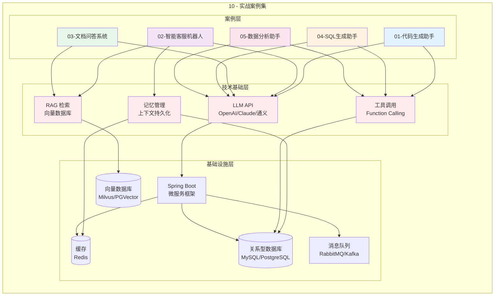
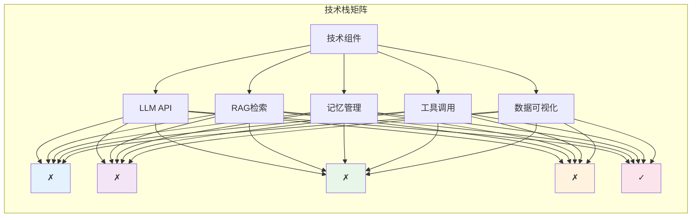
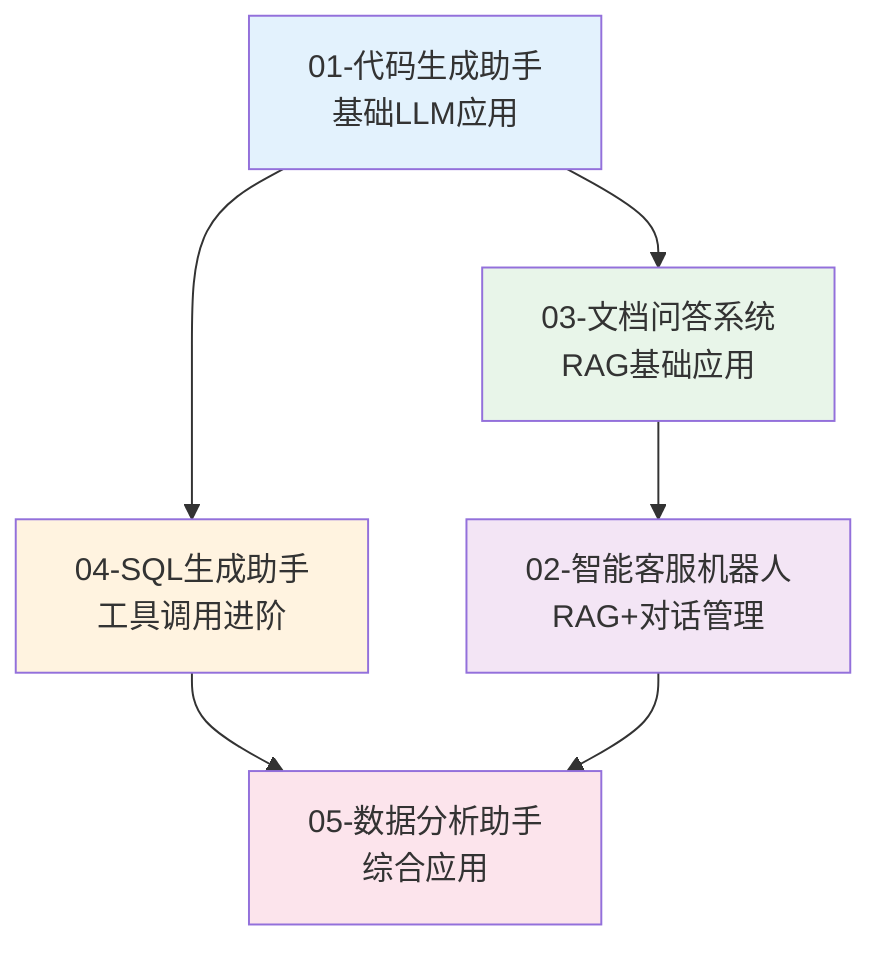

# 10 - 实战案例集（Practical Cases）

本模块通过 5 个完整的实战案例，展示如何将 LLM 技术应用于实际业务场景。每个案例包含完整的需求分析、架构设计、核心功能实现和 Java 代码示例，帮助开发者快速掌握 LLM 应用开发的核心技能。

## 目录

| # | 文档 | 简介 |
|---|------|------|
| 1 | [代码生成助手](./10-practical-cases/01-code-assistant.md) | 基于 LLM 的智能代码生成、补全与优化工具 |
| 2 | [智能客服机器人](./10-practical-cases/02-customer-service-bot.md) | RAG + 多轮对话的企业级客服解决方案 |
| 3 | [文档问答系统](./10-practical-cases/03-doc-qa-system.md) | 基于私有文档的知识问答平台 |
| 4 | [SQL 生成助手](./10-practical-cases/04-sql-assistant.md) | 自然语言转 SQL 的智能数据库查询工具 |
| 5 | [数据分析助手](./10-practical-cases/05-data-analysis-assistant.md) | 自动化数据分析与可视化报告生成 |

## 实战案例架构总览



## 案例技术栈对比



## 各案例核心能力

### 01 - 代码生成助手
- **核心能力**: 代码生成、代码补全、代码解释、代码优化
- **技术亮点**: Prompt 工程、Function Calling、代码解析
- **适用场景**: 开发者工具、IDE 插件、代码审查

### 02 - 智能客服机器人
- **核心能力**: 意图识别、多轮对话、知识检索、工单创建
- **技术亮点**: RAG、对话状态管理、情感分析
- **适用场景**: 企业客服、售后支持、售前咨询

### 03 - 文档问答系统
- **核心能力**: 文档解析、知识检索、问答生成、引用溯源
- **技术亮点**: 文档分块、Embedding、向量检索
- **适用场景**: 企业知识库、产品文档、技术手册

### 04 - SQL 生成助手
- **核心能力**: 自然语言理解、Schema 解析、SQL 生成、结果验证
- **技术亮点**: Text2SQL、数据库元数据、查询优化
- **适用场景**: 数据查询、BI 工具、报表生成

### 05 - 数据分析助手
- **核心能力**: 数据理解、分析建议、可视化生成、报告撰写
- **技术亮点**: 数据分析 Agent、图表生成、Markdown 报告
- **适用场景**: 业务分析、数据探索、自动化报告

## 学习路径建议



## 前置知识要求

在学习本模块之前，建议先掌握以下内容：

1. **[02 - LLM 基础](./02-llm-fundamentals.md)**: 理解 LLM 基本原理和 API 使用
2. **[04 - Agent 框架](./04-agent-frameworks.md)**: 掌握 Agent 设计模式
3. **[06 - RAG / 知识检索](./06-rag-knowledge-retrieval.md)**: 了解 RAG 架构（案例 02、03 需要）
4. **Java/Spring Boot**: 具备基础的后端开发能力

## 项目结构参考

每个案例的完整项目结构：

```
code-assistant/
├── src/
│   ├── main/
│   │   ├── java/
│   │   │   └── com/example/
│   │   │       ├── config/          # 配置类
│   │   │       ├── controller/      # API 接口
│   │   │       ├── service/         # 业务逻辑
│   │   │       ├── domain/          # 领域模型
│   │   │       ├── repository/      # 数据访问
│   │   │       └── client/          # LLM 客户端
│   │   └── resources/
│   │       ├── application.yml      # 配置文件
│   │       └── prompts/             # Prompt 模板
│   └── test/                        # 测试代码
├── pom.xml                          # Maven 配置
└── README.md                        # 项目说明
```

## 推荐开发环境

- **JDK**: 17 或更高版本
- **Spring Boot**: 3.2.x
- **构建工具**: Maven 或 Gradle
- **数据库**: PostgreSQL / MySQL
- **向量数据库**: Milvus / PGVector / Chroma
- **缓存**: Redis
- **LLM API**: OpenAI / 通义千问 / Claude

## 与其他模块的关系

- 本模块依赖 [02 - LLM 基础](./02-llm-fundamentals.md) 的 API 调用知识
- 本模块依赖 [04 - Agent 框架](./04-agent-frameworks.md) 的设计模式
- 案例 02、03 依赖 [06 - RAG / 知识检索](./06-rag-knowledge-retrieval.md)
- 案例 05 可与 [07 - 多智能体系统](./07-multi-agent-systems.md) 结合扩展

---

> 📌 详细内容见各子章节，每个案例都包含完整的可运行代码示例。
