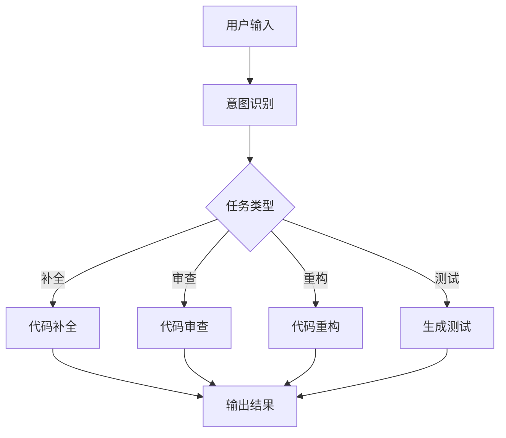

# 01 - 代码生成助手

## 1. 功能概述

代码生成助手帮助开发者：
- 代码补全
- 代码审查
- 代码重构
- 生成单元测试

## 2. 架构设计



## 3. Java 实现

```java
@Service
public class CodeAssistantService {
    
    @Autowired
    private ChatClient chatClient;
    
    public String completeCode(String context, String partial) {
        String prompt = String.format("""
            基于以下上下文代码，补全代码：
            %s
            
            需要补全的部分：
            %s
            """, context, partial);
        
        return chatClient.prompt()
            .user(prompt)
            .call()
            .content();
    }
    
    public String reviewCode(String code) {
        String prompt = String.format("""
            审查以下代码，找出潜在问题：
            ```java
            %s
            ```
            """, code);
        
        return chatClient.prompt()
            .user(prompt)
            .call()
            .content();
    }
}
```

---

> 更多实战案例见其他文档
