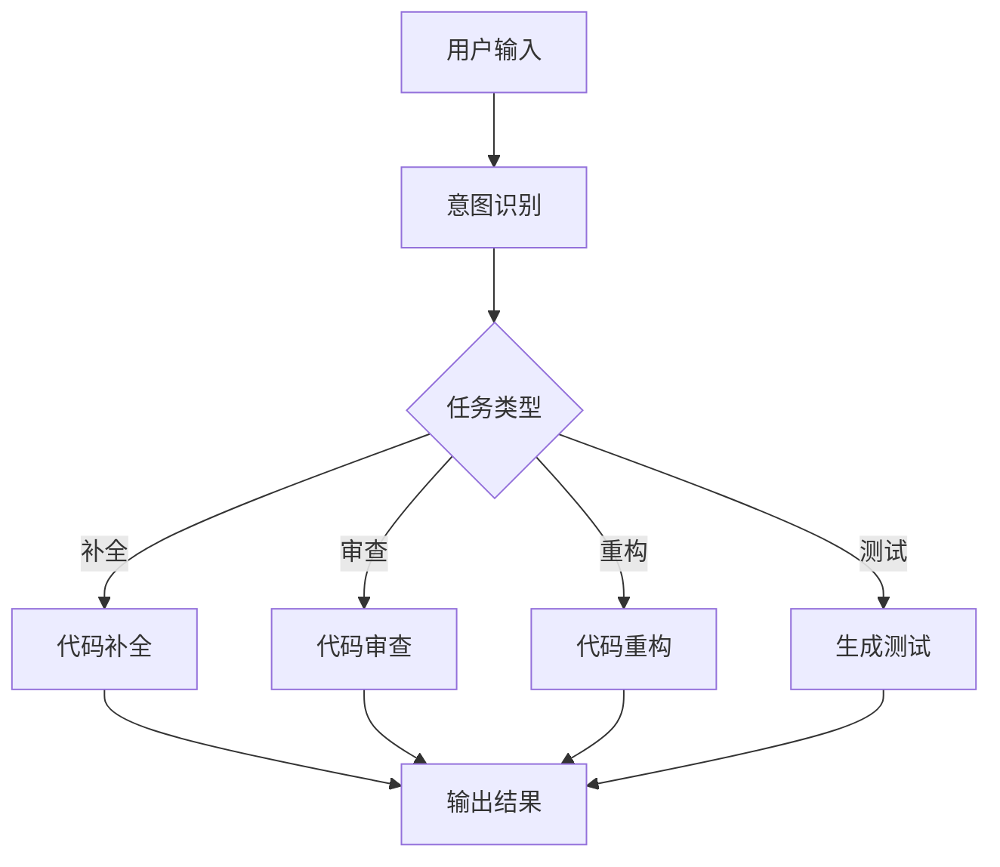

# 01 - 代码生成助手

## 1. 功能概述

代码生成助手帮助开发者：
- 代码补全
- 代码审查
- 代码重构
- 生成单元测试

## 2. 架构设计



## 3. 完整 Java 实现

### 3.1 代码助手服务

```java
@Service
public class CodeAssistantService {
    
    @Autowired
    private ChatClient chatClient;
    
    @Autowired
    private CodeReviewPromptBuilder promptBuilder;
    
    /**
     * 代码补全
     */
    public CodeCompletionResult completeCode(String context, String partial) {
        String prompt = promptBuilder.buildCompletionPrompt(context, partial);
        
        String response = chatClient.prompt()
            .user(prompt)
            .call()
            .content();
        
        return CodeCompletionResult.builder()
            .completedCode(extractCode(response))
            .explanation(extractExplanation(response))
            .build();
    }
    
    /**
     * 代码审查
     */
    public CodeReviewResult reviewCode(String code, String language) {
        String prompt = promptBuilder.buildReviewPrompt(code, language);
        
        String response = chatClient.prompt()
            .user(prompt)
            .call()
            .content();
        
        return parseReviewResult(response);
    }
    
    /**
     * 代码重构
     */
    public CodeRefactorResult refactorCode(String code, String refactorType) {
        String prompt = promptBuilder.buildRefactorPrompt(code, refactorType);
        
        String response = chatClient.prompt()
            .user(prompt)
            .call()
            .content();
        
        return CodeRefactorResult.builder()
            .refactoredCode(extractCode(response))
            .changes(extractChanges(response))
            .build();
    }
    
    /**
     * 生成单元测试
     */
    public TestGenerationResult generateTests(String code, String testFramework) {
        String prompt = promptBuilder.buildTestPrompt(code, testFramework);
        
        String response = chatClient.prompt()
            .user(prompt)
            .call()
            .content();
        
        return TestGenerationResult.builder()
            .testCode(extractCode(response))
            .testCases(parseTestCases(response))
            .build();
    }
    
    /**
     * 解释代码
     */
    public String explainCode(String code) {
        String prompt = String.format("""
            请解释以下代码的功能和实现逻辑：
            ```java
            %s
            ```
            """, code);
        
        return chatClient.prompt()
            .user(prompt)
            .call()
            .content();
    }
    
    private String extractCode(String response) {
        // 提取代码块
        Pattern pattern = Pattern.compile("```\\w*\\n(.*?)\\n```", Pattern.DOTALL);
        Matcher matcher = pattern.matcher(response);
        return matcher.find() ? matcher.group(1) : response;
    }
    
    private String extractExplanation(String response) {
        // 提取解释部分
        return response.replaceAll("```[\\w\\s]*\\n.*?\\n```", "").trim();
    }
    
    private CodeReviewResult parseReviewResult(String response) {
        List<CodeIssue> issues = new ArrayList<>();
        
        // 解析审查结果
        Pattern pattern = Pattern.compile("(\\d+)\\.\\s*\\[(\\w+)\\]\\s*(.+?)(?=\\n\\d+\\.|$)", Pattern.DOTALL);
        Matcher matcher = pattern.matcher(response);
        
        while (matcher.find()) {
            issues.add(CodeIssue.builder()
                .severity(matcher.group(2))
                .description(matcher.group(3).trim())
                .build());
        }
        
        return CodeReviewResult.builder()
            .issues(issues)
            .overallAssessment(extractOverallAssessment(response))
            .build();
    }
    
    private List<TestCase> parseTestCases(String response) {
        List<TestCase> testCases = new ArrayList<>();
        
        // 解析测试用例
        Pattern pattern = Pattern.compile("-\\s*(.+?):\\s*(.+?)(?=\\n-|$)", Pattern.DOTALL);
        Matcher matcher = pattern.matcher(response);
        
        while (matcher.find()) {
            testCases.add(TestCase.builder()
                .name(matcher.group(1).trim())
                .description(matcher.group(2).trim())
                .build());
        }
        
        return testCases;
    }
}
```

### 3.2 Prompt 构建器

```java
@Component
public class CodeReviewPromptBuilder {
    
    public String buildCompletionPrompt(String context, String partial) {
        return String.format("""
            基于以下上下文代码，补全代码：
            ```java
            %s
            ```
            
            需要补全的部分：
            ```java
            %s
            ```
            
            请补全代码，并简要说明实现思路。
            """, context, partial);
    }
    
    public String buildReviewPrompt(String code, String language) {
        return String.format("""
            请作为资深%s开发工程师，审查以下代码：
            ```%s
            %s
            ```
            
            请从以下方面进行审查：
            1. 代码规范（命名、格式）
            2. 潜在 Bug（空指针、资源泄漏等）
            3. 性能问题
            4. 安全漏洞
            5. 可维护性
            
            按以下格式输出：
            1. [严重/警告/建议] 问题描述
            2. [严重/警告/建议] 问题描述
            ...
            
            总体评价：...
            """, language, language.toLowerCase(), code);
    }
    
    public String buildRefactorPrompt(String code, String refactorType) {
        return String.format("""
            请对以下代码进行%s重构：
            ```java
            %s
            ```
            
            重构要求：
            - 保持原有功能不变
            - 提高代码可读性和可维护性
            - 遵循最佳实践
            
            请输出重构后的代码，并说明所做的修改。
            """, refactorType, code);
    }
    
    public String buildTestPrompt(String code, String testFramework) {
        return String.format("""
            请为以下代码生成%s单元测试：
            ```java
            %s
            ```
            
            要求：
            1. 覆盖主要业务逻辑
            2. 包含边界条件测试
            3. 包含异常场景测试
            4. 测试方法命名清晰
            
            请输出完整的测试代码。
            """, testFramework, code);
    }
}
```

### 3.3 REST API 控制器

```java
@RestController
@RequestMapping("/api/code-assistant")
public class CodeAssistantController {
    
    @Autowired
    private CodeAssistantService codeAssistantService;
    
    @PostMapping("/complete")
    public ResponseEntity<CodeCompletionResult> completeCode(
            @RequestBody CodeCompletionRequest request) {
        CodeCompletionResult result = codeAssistantService.completeCode(
            request.getContext(),
            request.getPartial()
        );
        return ResponseEntity.ok(result);
    }
    
    @PostMapping("/review")
    public ResponseEntity<CodeReviewResult> reviewCode(
            @RequestBody CodeReviewRequest request) {
        CodeReviewResult result = codeAssistantService.reviewCode(
            request.getCode(),
            request.getLanguage()
        );
        return ResponseEntity.ok(result);
    }
    
    @PostMapping("/refactor")
    public ResponseEntity<CodeRefactorResult> refactorCode(
            @RequestBody CodeRefactorRequest request) {
        CodeRefactorResult result = codeAssistantService.refactorCode(
            request.getCode(),
            request.getRefactorType()
        );
        return ResponseEntity.ok(result);
    }
    
    @PostMapping("/generate-tests")
    public ResponseEntity<TestGenerationResult> generateTests(
            @RequestBody TestGenerationRequest request) {
        TestGenerationResult result = codeAssistantService.generateTests(
            request.getCode(),
            request.getTestFramework()
        );
        return ResponseEntity.ok(result);
    }
    
    @PostMapping("/explain")
    public ResponseEntity<String> explainCode(
            @RequestBody CodeExplainRequest request) {
        String explanation = codeAssistantService.explainCode(request.getCode());
        return ResponseEntity.ok(explanation);
    }
}
```

### 3.4 数据模型

```java
@Data
@Builder
public class CodeCompletionRequest {
    private String context;
    private String partial;
}

@Data
@Builder
public class CodeCompletionResult {
    private String completedCode;
    private String explanation;
}

@Data
@Builder
public class CodeReviewRequest {
    private String code;
    private String language;
}

@Data
@Builder
public class CodeReviewResult {
    private List<CodeIssue> issues;
    private String overallAssessment;
}

@Data
@Builder
public class CodeIssue {
    private String severity;
    private String description;
    private String lineNumber;
    private String suggestion;
}

@Data
@Builder
public class CodeRefactorRequest {
    private String code;
    private String refactorType;
}

@Data
@Builder
public class CodeRefactorResult {
    private String refactoredCode;
    private List<String> changes;
}

@Data
@Builder
public class TestGenerationRequest {
    private String code;
    private String testFramework;
}

@Data
@Builder
public class TestGenerationResult {
    private String testCode;
    private List<TestCase> testCases;
}

@Data
@Builder
public class TestCase {
    private String name;
    private String description;
}

@Data
@Builder
public class CodeExplainRequest {
    private String code;
}
```

### 3.5 配置类

```java
@Configuration
public class CodeAssistantConfig {
    
    @Bean
    public ChatClient chatClient(ChatClient.Builder builder) {
        return builder.build();
    }
    
    @Bean
    public CodeReviewPromptBuilder codeReviewPromptBuilder() {
        return new CodeReviewPromptBuilder();
    }
}
```

### 3.6 使用示例

```java
@SpringBootTest
public class CodeAssistantServiceTest {
    
    @Autowired
    private CodeAssistantService codeAssistantService;
    
    @Test
    public void testCompleteCode() {
        String context = """
            public class UserService {
                private UserRepository userRepository;
                
                public User findById(Long id) {
            """;
        
        String partial = "// 实现根据ID查找用户逻辑";
        
        CodeCompletionResult result = codeAssistantService.completeCode(context, partial);
        
        assertNotNull(result.getCompletedCode());
        assertNotNull(result.getExplanation());
    }
    
    @Test
    public void testReviewCode() {
        String code = """
            public String getUserName(Long id) {
                User user = userRepository.findById(id);
                return user.getName();
            }
            """;
        
        CodeReviewResult result = codeAssistantService.reviewCode(code, "Java");
        
        assertNotNull(result.getIssues());
        assertNotNull(result.getOverallAssessment());
    }
}
```

## 4. 最佳实践

1. **上下文管理**：提供足够的上下文以获得更准确的补全
2. **增量审查**：对大文件采用增量审查策略
3. **安全过滤**：审查生成的代码，避免安全漏洞
4. **版本控制**：重构前确保代码已提交版本控制

---

> 更多实战案例见其他文档
