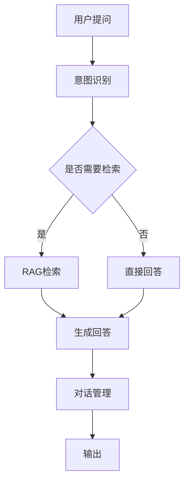

# 02 - 智能客服机器人

## 1. 功能概述

基于 RAG 的智能客服系统：
- 知识库问答
- 多轮对话
- 意图识别
- 人工接管

## 2. 架构设计



## 3. Java 实现

```java
@Service
public class CustomerServiceBot {
    
    @Autowired
    private RAGPipeline ragPipeline;
    
    @Autowired
    private ChatClient chatClient;
    
    public String handleQuery(String sessionId, String query) {
        // 1. 检索相关知识
        RAGResponse ragResponse = ragPipeline.query(
            RAGRequest.builder()
                .query(query)
                .topK(3)
                .build()
        );
        
        // 2. 生成回答
        String prompt = buildPrompt(query, ragResponse);
        
        return chatClient.prompt()
            .user(prompt)
            .call()
            .content();
    }
}
```

---

> 更多实战案例见其他文档
