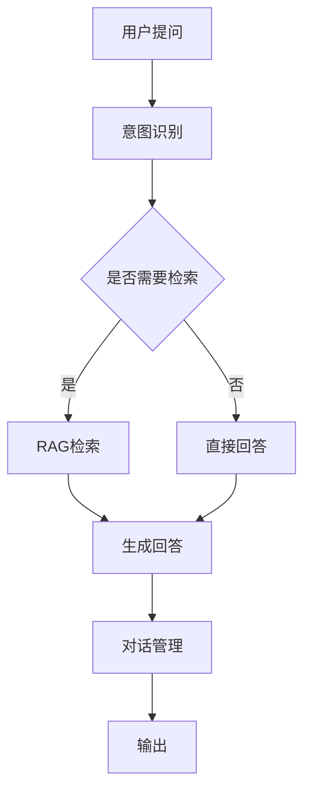

# 02 - 智能客服机器人

## 1. 功能概述

基于 RAG 的智能客服系统：
- 知识库问答
- 多轮对话
- 意图识别
- 人工接管

## 2. 架构设计



## 3. 完整 Java 实现

### 3.1 客服机器人服务

```java
@Service
@Slf4j
public class CustomerServiceBot {
    
    @Autowired
    private RAGPipeline ragPipeline;
    
    @Autowired
    private ChatClient chatClient;
    
    @Autowired
    private IntentClassifier intentClassifier;
    
    @Autowired
    private ConversationManager conversationManager;
    
    @Autowired
    private HumanHandoffService humanHandoffService;
    
    @Autowired
    private ResponseCacheService cacheService;
    
    /**
     * 处理用户查询
     */
    public BotResponse handleQuery(String sessionId, String query) {
        log.info("Processing query for session {}: {}", sessionId, query);
        
        // 1. 意图识别
        Intent intent = intentClassifier.classify(query);
        log.debug("Detected intent: {}", intent.getType());
        
        // 2. 根据意图类型处理
        switch (intent.getType()) {
            case GREETING:
                return handleGreeting(sessionId);
            
            case FAREWELL:
                return handleFarewell(sessionId);
            
            case KNOWLEDGE_QUERY:
                return handleKnowledgeQuery(sessionId, query);
            
            case ORDER_QUERY:
                return handleOrderQuery(sessionId, intent);
            
            case COMPLAINT:
                return handleComplaint(sessionId, query);
            
            case HUMAN_HANDOFF:
                return handleHumanHandoff(sessionId, query);
            
            default:
                return handleGeneralQuery(sessionId, query);
        }
    }
    
    /**
     * 处理知识库查询
     */
    private BotResponse handleKnowledgeQuery(String sessionId, String query) {
        // 检查缓存
        String cacheKey = generateCacheKey(query);
        BotResponse cachedResponse = cacheService.get(cacheKey);
        if (cachedResponse != null) {
            log.debug("Cache hit for query: {}", query);
            return cachedResponse;
        }
        
        // 1. RAG 检索
        RAGResponse ragResponse = ragPipeline.query(
            RAGRequest.builder()
                .query(query)
                .topK(3)
                .build()
        );
        
        // 2. 构建对话上下文
        String conversationContext = conversationManager.getContext(sessionId);
        
        // 3. 生成回答
        String prompt = buildPrompt(query, ragResponse, conversationContext);
        String answer = chatClient.prompt()
            .user(prompt)
            .call()
            .content();
        
        // 4. 更新对话历史
        conversationManager.addMessage(sessionId, "user", query);
        conversationManager.addMessage(sessionId, "assistant", answer);
        
        BotResponse response = BotResponse.builder()
            .answer(answer)
            .sources(ragResponse.getSources())
            .confidence(calculateConfidence(ragResponse))
            .suggestedQuestions(generateSuggestedQuestions(query, answer))
            .build();
        
        // 缓存结果
        cacheService.put(cacheKey, response, Duration.ofMinutes(30));
        
        return response;
    }
    
    /**
     * 处理问候语
     */
    private BotResponse handleGreeting(String sessionId) {
        String[] greetings = {
            "您好！我是智能客服助手，有什么可以帮助您的吗？",
            "欢迎！请问您想了解什么信息？",
            "您好！很高兴为您服务，请问有什么可以帮您？"
        };
        
        String greeting = greetings[(int) (Math.random() * greetings.length)];
        
        return BotResponse.builder()
            .answer(greeting)
            .type(ResponseType.GREETING)
            .build();
    }
    
    /**
     * 处理结束语
     */
    private BotResponse handleFarewell(String sessionId) {
        // 清空对话历史
        conversationManager.clearSession(sessionId);
        
        return BotResponse.builder()
            .answer("感谢您的咨询，祝您生活愉快！如有其他问题，随时欢迎再次联系。")
            .type(ResponseType.FAREWELL)
            .build();
    }
    
    /**
     * 处理订单查询
     */
    private BotResponse handleOrderQuery(String sessionId, Intent intent) {
        String orderId = intent.getEntities().get("orderId");
        
        if (orderId == null) {
            return BotResponse.builder()
                .answer("请提供您的订单号，我可以帮您查询订单状态。")
                .type(ResponseType.CLARIFICATION)
                .build();
        }
        
        // 查询订单信息
        OrderInfo orderInfo = queryOrderInfo(orderId);
        
        if (orderInfo == null) {
            return BotResponse.builder()
                .answer("抱歉，未找到订单号为 " + orderId + " 的订单。请确认订单号是否正确。")
                .type(ResponseType.ERROR)
                .build();
        }
        
        String answer = String.format("""
            订单号：%s
            订单状态：%s
            下单时间：%s
            预计送达：%s
            """, 
            orderInfo.getOrderId(),
            orderInfo.getStatus(),
            orderInfo.getOrderTime(),
            orderInfo.getEstimatedDelivery()
        );
        
        return BotResponse.builder()
            .answer(answer)
            .type(ResponseType.ORDER_INFO)
            .data(Map.of("order", orderInfo))
            .build();
    }
    
    /**
     * 处理投诉
     */
    private BotResponse handleComplaint(String sessionId, String query) {
        // 记录投诉
        ComplaintRecord record = ComplaintRecord.builder()
            .sessionId(sessionId)
            .content(query)
            .timestamp(LocalDateTime.now())
            .build();
        
        saveComplaint(record);
        
        // 生成安抚回复
        String prompt = String.format("""
            用户提出了以下投诉/不满：
            %s
            
            请生成一个专业、诚恳的安抚回复，表达歉意并提供解决方案。
            """, query);
        
        String answer = chatClient.prompt()
            .user(prompt)
            .call()
            .content();
        
        return BotResponse.builder()
            .answer(answer)
            .type(ResponseType.COMPLAINT)
            .requiresFollowUp(true)
            .build();
    }
    
    /**
     * 处理人工接管
     */
    private BotResponse handleHumanHandoff(String sessionId, String query) {
        // 创建人工服务请求
        HandoffRequest handoffRequest = HandoffRequest.builder()
            .sessionId(sessionId)
            .conversationHistory(conversationManager.getHistory(sessionId))
            .reason(query)
            .timestamp(LocalDateTime.now())
            .build();
        
        // 提交人工服务
        boolean success = humanHandoffService.requestHandoff(handoffRequest);
        
        if (success) {
            return BotResponse.builder()
                .answer("正在为您转接人工客服，请稍候...")
                .type(ResponseType.HANDOFF)
                .handoffStatus(HandoffStatus.PENDING)
                .build();
        } else {
            return BotResponse.builder()
                .answer("抱歉，当前人工客服繁忙。您可以留言，我们会尽快回复您。")
                .type(ResponseType.HANDOFF)
                .handoffStatus(HandoffStatus.QUEUED)
                .build();
        }
    }
    
    /**
     * 处理一般查询
     */
    private BotResponse handleGeneralQuery(String sessionId, String query) {
        return handleKnowledgeQuery(sessionId, query);
    }
    
    /**
     * 构建 Prompt
     */
    private String buildPrompt(String query, RAGResponse ragResponse, String conversationContext) {
        StringBuilder contextBuilder = new StringBuilder();
        
        // 添加检索到的知识
        if (ragResponse.getDocuments() != null && !ragResponse.getDocuments().isEmpty()) {
            contextBuilder.append("参考知识：\n");
            for (int i = 0; i < ragResponse.getDocuments().size(); i++) {
                Document doc = ragResponse.getDocuments().get(i);
                contextBuilder.append(String.format("[%d] %s\n", i + 1, doc.getContent()));
            }
            contextBuilder.append("\n");
        }
        
        // 添加对话上下文
        if (StringUtils.hasText(conversationContext)) {
            contextBuilder.append("对话历史：\n");
            contextBuilder.append(conversationContext);
            contextBuilder.append("\n");
        }
        
        return String.format("""
            你是一个专业的客服助手。请基于以下信息回答用户问题。
            如果参考知识中没有相关信息，请礼貌地告知用户您无法回答。
            回答要简洁、专业、有帮助。
            
            %s
            
            用户问题：%s
            
            请回答：
            """, contextBuilder.toString(), query);
    }
    
    /**
     * 计算置信度
     */
    private double calculateConfidence(RAGResponse ragResponse) {
        if (ragResponse.getDocuments() == null || ragResponse.getDocuments().isEmpty()) {
            return 0.0;
        }
        
        // 基于检索分数计算置信度
        double avgScore = ragResponse.getDocuments().stream()
            .mapToDouble(Document::getScore)
            .average()
            .orElse(0.0);
        
        return Math.min(avgScore * 1.2, 1.0); // 简单映射到 0-1
    }
    
    /**
     * 生成建议问题
     */
    private List<String> generateSuggestedQuestions(String query, String answer) {
        // 基于当前对话生成建议问题
        String prompt = String.format("""
            基于以下对话，生成3个用户可能接下来会问的问题：
            
            用户：%s
            助手：%s
            
            请只输出问题列表，每行一个。
            """, query, answer);
        
        String response = chatClient.prompt()
            .user(prompt)
            .call()
            .content();
        
        return Arrays.stream(response.split("\\n"))
            .filter(StringUtils::hasText)
            .map(String::trim)
            .collect(Collectors.toList());
    }
    
    private String generateCacheKey(String query) {
        return "cs:" + DigestUtils.md5DigestAsHex(query.getBytes());
    }
    
    private OrderInfo queryOrderInfo(String orderId) {
        // 模拟订单查询
        return OrderInfo.builder()
            .orderId(orderId)
            .status("配送中")
            .orderTime("2024-03-10 10:30:00")
            .estimatedDelivery("2024-03-11")
            .build();
    }
    
    private void saveComplaint(ComplaintRecord record) {
        // 保存投诉记录
        log.info("Complaint saved: {}", record);
    }
}
```

### 3.2 意图分类器

```java
@Service
public class IntentClassifier {
    
    @Autowired
    private ChatClient chatClient;
    
    private final List<IntentPattern> patterns;
    
    public IntentClassifier() {
        this.patterns = initializePatterns();
    }
    
    /**
     * 分类意图
     */
    public Intent classify(String query) {
        // 1. 规则匹配
        for (IntentPattern pattern : patterns) {
            if (pattern.matches(query)) {
                return Intent.builder()
                    .type(pattern.getIntentType())
                    .confidence(0.9)
                    .entities(extractEntities(query, pattern))
                    .build();
            }
        }
        
        // 2. LLM 分类
        return classifyWithLLM(query);
    }
    
    /**
     * 使用 LLM 分类
     */
    private Intent classifyWithLLM(String query) {
        String prompt = String.format("""
            请将以下用户输入分类为以下意图之一：
            - GREETING: 问候语（你好、您好等）
            - FAREWELL: 结束语（再见、谢谢等）
            - KNOWLEDGE_QUERY: 知识查询
            - ORDER_QUERY: 订单查询
            - COMPLAINT: 投诉/抱怨
            - HUMAN_HANDOFF: 请求人工
            - OTHER: 其他
            
            用户输入：%s
            
            请以JSON格式返回：{"intent": "类型", "confidence": 0.95, "entities": {}}
            """, query);
        
        String response = chatClient.prompt()
            .user(prompt)
            .call()
            .content();
        
        try {
            JsonNode json = new ObjectMapper().readTree(response);
            return Intent.builder()
                .type(IntentType.valueOf(json.get("intent").asText()))
                .confidence(json.get("confidence").asDouble())
                .entities(new HashMap<>())
                .build();
        } catch (Exception e) {
            log.error("Failed to parse intent classification", e);
            return Intent.builder()
                .type(IntentType.OTHER)
                .confidence(0.5)
                .build();
        }
    }
    
    /**
     * 提取实体
     */
    private Map<String, String> extractEntities(String query, IntentPattern pattern) {
        Map<String, String> entities = new HashMap<>();
        
        // 提取订单号
        Pattern orderPattern = Pattern.compile("(订单号|订单编号)[：:]?\\s*([A-Za-z0-9]+)");
        Matcher matcher = orderPattern.matcher(query);
        if (matcher.find()) {
            entities.put("orderId", matcher.group(2));
        }
        
        return entities;
    }
    
    private List<IntentPattern> initializePatterns() {
        List<IntentPattern> list = new ArrayList<>();
        
        // 问候语
        list.add(new IntentPattern(
            IntentType.GREETING,
            Pattern.compile("^(你好|您好|嗨|hello|hi).*", Pattern.CASE_INSENSITIVE)
        ));
        
        // 结束语
        list.add(new IntentPattern(
            IntentType.FAREWELL,
            Pattern.compile("^(再见|拜拜|谢谢|bye|thanks).*", Pattern.CASE_INSENSITIVE)
        ));
        
        // 订单查询
        list.add(new IntentPattern(
            IntentType.ORDER_QUERY,
            Pattern.compile(".*(订单|物流|快递|发货).*", Pattern.CASE_INSENSITIVE)
        ));
        
        // 人工服务
        list.add(new IntentPattern(
            IntentType.HUMAN_HANDOFF,
            Pattern.compile(".*(人工|客服|转接|人工服务).*", Pattern.CASE_INSENSITIVE)
        ));
        
        return list;
    }
}

@Data
@Builder
class IntentPattern {
    private final IntentType intentType;
    private final Pattern pattern;
    
    public boolean matches(String text) {
        return pattern.matcher(text).matches();
    }
}
```

### 3.3 对话管理器

```java
@Service
public class ConversationManager {
    
    @Autowired
    private StringRedisTemplate redisTemplate;
    
    private static final String KEY_PREFIX = "conv:";
    private static final int MAX_HISTORY = 10;
    
    /**
     * 获取对话上下文
     */
    public String getContext(String sessionId) {
        List<String> history = getHistory(sessionId);
        
        StringBuilder context = new StringBuilder();
        for (int i = Math.max(0, history.size() - 5); i < history.size(); i++) {
            context.append(history.get(i)).append("\n");
        }
        
        return context.toString();
    }
    
    /**
     * 获取对话历史
     */
    public List<String> getHistory(String sessionId) {
        String key = KEY_PREFIX + sessionId;
        List<String> history = redisTemplate.opsForList().range(key, 0, -1);
        return history != null ? history : new ArrayList<>();
    }
    
    /**
     * 添加消息
     */
    public void addMessage(String sessionId, String role, String content) {
        String key = KEY_PREFIX + sessionId;
        String message = role + ": " + content;
        
        redisTemplate.opsForList().rightPush(key, message);
        redisTemplate.opsForList().trim(key, -MAX_HISTORY, -1);
        redisTemplate.expire(key, Duration.ofHours(2));
    }
    
    /**
     * 清空会话
     */
    public void clearSession(String sessionId) {
        String key = KEY_PREFIX + sessionId;
        redisTemplate.delete(key);
    }
}
```

### 3.4 人工接管服务

```java
@Service
public class HumanHandoffService {
    
    @Autowired
    private RedisTemplate<String, HandoffRequest> redisTemplate;
    
    @Autowired
    private ApplicationEventPublisher eventPublisher;
    
    private static final String QUEUE_KEY = "handoff:queue";
    
    /**
     * 请求人工接管
     */
    public boolean requestHandoff(HandoffRequest request) {
        try {
            // 添加到队列
            redisTemplate.opsForList().rightPush(QUEUE_KEY, request);
            
            // 发布事件
            eventPublisher.publishEvent(new HandoffRequestedEvent(request));
            
            return true;
        } catch (Exception e) {
            log.error("Failed to request handoff", e);
            return false;
        }
    }
    
    /**
     * 获取待处理请求
     */
    public HandoffRequest getPendingRequest() {
        return redisTemplate.opsForList().leftPop(QUEUE_KEY);
    }
    
    /**
     * 接受人工服务
     */
    public void acceptHandoff(String sessionId, String agentId) {
        // 更新状态
        HandoffStatusUpdate update = HandoffStatusUpdate.builder()
            .sessionId(sessionId)
            .agentId(agentId)
            .status(HandoffStatus.ACCEPTED)
            .timestamp(LocalDateTime.now())
            .build();
        
        eventPublisher.publishEvent(new HandoffAcceptedEvent(update));
    }
}
```

### 3.5 数据模型

```java
public enum IntentType {
    GREETING,
    FAREWELL,
    KNOWLEDGE_QUERY,
    ORDER_QUERY,
    COMPLAINT,
    HUMAN_HANDOFF,
    OTHER
}

@Data
@Builder
public class Intent {
    private IntentType type;
    private double confidence;
    private Map<String, String> entities;
}

@Data
@Builder
public class BotResponse {
    private String answer;
    private ResponseType type;
    private List<String> sources;
    private double confidence;
    private List<String> suggestedQuestions;
    private Object data;
    private boolean requiresFollowUp;
    private HandoffStatus handoffStatus;
}

public enum ResponseType {
    GREETING,
    FAREWELL,
    KNOWLEDGE,
    ORDER_INFO,
    COMPLAINT,
    HANDOFF,
    CLARIFICATION,
    ERROR
}

public enum HandoffStatus {
    PENDING,
    QUEUED,
    ACCEPTED,
    COMPLETED
}

@Data
@Builder
public class HandoffRequest {
    private String sessionId;
    private List<String> conversationHistory;
    private String reason;
    private LocalDateTime timestamp;
}

@Data
@Builder
public class OrderInfo {
    private String orderId;
    private String status;
    private String orderTime;
    private String estimatedDelivery;
}

@Data
@Builder
public class ComplaintRecord {
    private String sessionId;
    private String content;
    private LocalDateTime timestamp;
}
```

### 3.6 REST API 控制器

```java
@RestController
@RequestMapping("/api/customer-service")
@Slf4j
public class CustomerServiceController {
    
    @Autowired
    private CustomerServiceBot customerServiceBot;
    
    @PostMapping("/chat")
    public ResponseEntity<BotResponse> chat(
            @RequestHeader("X-Session-Id") String sessionId,
            @RequestBody ChatRequest request) {
        
        log.info("Chat request from session {}: {}", sessionId, request.getMessage());
        
        BotResponse response = customerServiceBot.handleQuery(
            sessionId, 
            request.getMessage()
        );
        
        return ResponseEntity.ok(response);
    }
    
    @PostMapping("/handoff/accept")
    public ResponseEntity<String> acceptHandoff(
            @RequestParam String sessionId,
            @RequestParam String agentId) {
        
        // 人工客服接受请求
        return ResponseEntity.ok("Handoff accepted");
    }
    
    @PostMapping("/feedback")
    public ResponseEntity<String> submitFeedback(
            @RequestBody FeedbackRequest request) {
        
        // 保存用户反馈
        log.info("Feedback received: {}", request);
        return ResponseEntity.ok("Feedback submitted");
    }
}

@Data
@Builder
class ChatRequest {
    private String message;
}

@Data
@Builder
class FeedbackRequest {
    private String sessionId;
    private boolean helpful;
    private String comment;
}
```

## 4. 最佳实践

1. **意图识别优化**：结合规则匹配和 LLM 分类
2. **对话上下文管理**：限制历史长度，避免 Token 超限
3. **缓存策略**：对常见问题结果进行缓存
4. **人工接管机制**：设置置信度阈值，低置信度时建议人工
5. **反馈收集**：收集用户反馈用于持续优化

---

> 更多实战案例见其他文档
