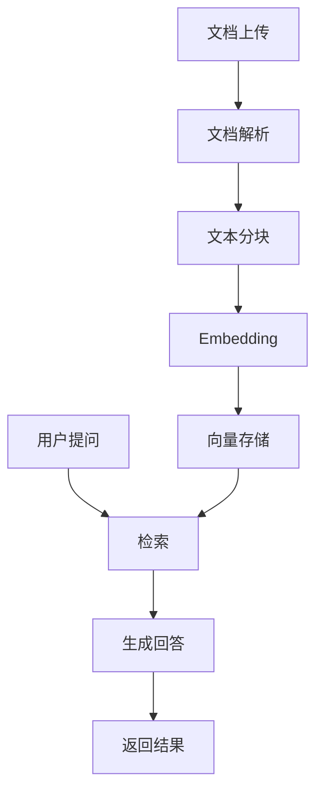

# 03 - 文档问答系统

## 1. 功能概述

企业知识库问答系统：
- 文档上传与解析
- 智能问答
- 来源引用
- 权限管理

## 2. 架构设计

```mermaid
flowchart TD
    A[文档上传] --> B[文档解析]
    B --> C[文本分块]
    C --> D[Embedding]
    D --> E[向量存储]
    
    F[用户提问] --> G[检索]
    E --> G
    G --> H[生成回答]
    H --> I[返回结果]
```

## 3. Java 实现

见 [06-RAG 模块](../06-rag-knowledge-retrieval/08-java-rag-practice.md) 完整实现。

---

> 更多实战案例见其他文档
