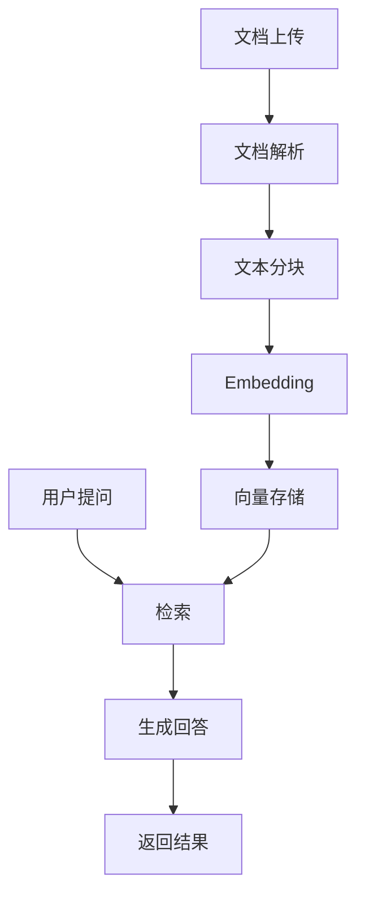

# 03 - 文档问答系统

## 1. 功能概述

企业知识库问答系统：
- 文档上传与解析
- 智能问答
- 来源引用
- 权限管理

## 2. 架构设计



## 3. 完整 Java 实现

### 3.1 文档问答服务

```java
@Service
@Slf4j
public class DocumentQAService {
    
    @Autowired
    private DocumentProcessingService documentProcessingService;
    
    @Autowired
    private VectorStore vectorStore;
    
    @Autowired
    private EmbeddingClient embeddingClient;
    
    @Autowired
    private ChatClient chatClient;
    
    @Autowired
    private PermissionService permissionService;
    
    @Autowired
    private AuditLogService auditLogService;
    
    /**
     * 上传文档
     */
    public DocumentUploadResult uploadDocument(
            MultipartFile file,
            String userId,
            DocumentMetadata metadata) {
        
        log.info("Uploading document: {} by user: {}", file.getOriginalFilename(), userId);
        
        try {
            // 1. 保存原始文件
            String fileId = saveOriginalFile(file);
            
            // 2. 解析文档
            String content = documentProcessingService.parseDocument(file);
            
            // 3. 文本分块
            List<TextChunk> chunks = documentProcessingService.splitText(
                content, 
                metadata.getChunkSize(),
                metadata.getChunkOverlap()
            );
            
            // 4. 生成嵌入并存储
            List<Document> documents = new ArrayList<>();
            for (int i = 0; i < chunks.size(); i++) {
                TextChunk chunk = chunks.get(i);
                
                // 生成嵌入
                Embedding embedding = embeddingClient.embed(chunk.getText());
                
                // 构建文档
                Document doc = Document.builder()
                    .id(fileId + "_chunk_" + i)
                    .content(chunk.getText())
                    .metadata(buildChunkMetadata(fileId, file.getOriginalFilename(), 
                        metadata, i, chunks.size()))
                    .build();
                
                documents.add(doc);
            }
            
            // 5. 批量存储到向量数据库
            vectorStore.add(documents);
            
            // 6. 保存文档元数据
            saveDocumentMetadata(fileId, file.getOriginalFilename(), 
                userId, metadata, documents.size());
            
            // 7. 记录审计日志
            auditLogService.logDocumentUpload(userId, fileId, file.getOriginalFilename());
            
            return DocumentUploadResult.builder()
                .fileId(fileId)
                .fileName(file.getOriginalFilename())
                .chunkCount(documents.size())
                .status(UploadStatus.SUCCESS)
                .build();
                
        } catch (Exception e) {
            log.error("Failed to upload document: {}", file.getOriginalFilename(), e);
            throw new DocumentProcessingException("文档上传失败: " + e.getMessage(), e);
        }
    }
    
    /**
     * 问答查询
     */
    public QAResult answerQuestion(QAQuery query) {
        log.info("Question from user {}: {}", query.getUserId(), query.getQuestion());
        
        long startTime = System.currentTimeMillis();
        
        // 1. 检查用户权限
        List<String> accessibleCategories = permissionService
            .getAccessibleCategories(query.getUserId());
        
        // 2. 生成查询向量
        Embedding queryEmbedding = embeddingClient.embed(query.getQuestion());
        
        // 3. 检索相关文档
        SearchRequest searchRequest = SearchRequest.builder()
            .query(query.getQuestion())
            .topK(query.getTopK() != null ? query.getTopK() : 5)
            .similarityThreshold(0.7)
            .filterExpression(buildPermissionFilter(accessibleCategories, query.getFilters()))
            .build();
        
        List<Document> relevantDocs = vectorStore.similaritySearch(searchRequest);
        
        if (relevantDocs.isEmpty()) {
            return QAResult.builder()
                .answer("抱歉，未找到与您问题相关的文档内容。")
                .sources(List.of())
                .confidence(0.0)
                .processingTime(System.currentTimeMillis() - startTime)
                .build();
        }
        
        // 4. 构建上下文
        String context = buildContext(relevantDocs);
        
        // 5. 生成回答
        String prompt = buildQAPrompt(query.getQuestion(), context, query.getStyle());
        String answer = chatClient.prompt()
            .user(prompt)
            .call()
            .content();
        
        long processingTime = System.currentTimeMillis() - startTime;
        
        // 6. 构建来源信息
        List<SourceInfo> sources = relevantDocs.stream()
            .map(doc -> SourceInfo.builder()
                .documentId(doc.getId())
                .documentName((String) doc.getMetadata().get("fileName"))
                .content(doc.getContent().substring(0, Math.min(200, doc.getContent().length())))
                .score(doc.getScore())
                .build())
            .collect(Collectors.toList());
        
        // 7. 记录查询日志
        auditLogService.logQuery(query.getUserId(), query.getQuestion(), 
            relevantDocs.size(), processingTime);
        
        return QAResult.builder()
            .answer(answer)
            .sources(sources)
            .confidence(calculateConfidence(relevantDocs))
            .processingTime(processingTime)
            .build();
    }
    
    /**
     * 批量上传文档
     */
    public BatchUploadResult batchUpload(
            List<MultipartFile> files,
            String userId,
            DocumentMetadata metadata) {
        
        List<DocumentUploadResult> results = new ArrayList<>();
        List<String> errors = new ArrayList<>();
        
        for (MultipartFile file : files) {
            try {
                DocumentUploadResult result = uploadDocument(file, userId, metadata);
                results.add(result);
            } catch (Exception e) {
                errors.add(file.getOriginalFilename() + ": " + e.getMessage());
                log.error("Failed to upload {}: {}", file.getOriginalFilename(), e.getMessage());
            }
        }
        
        return BatchUploadResult.builder()
            .successful(results)
            .failed(errors)
            .totalCount(files.size())
            .successCount(results.size())
            .build();
    }
    
    /**
     * 删除文档
     */
    public void deleteDocument(String fileId, String userId) {
        // 1. 检查权限
        if (!permissionService.canDelete(userId, fileId)) {
            throw new PermissionDeniedException("无权删除此文档");
        }
        
        // 2. 删除向量数据
        vectorStore.delete(List.of(fileId + "_*"));
        
        // 3. 删除元数据
        deleteDocumentMetadata(fileId);
        
        // 4. 记录日志
        auditLogService.logDocumentDelete(userId, fileId);
    }
    
    /**
     * 搜索文档
     */
    public List<DocumentSearchResult> searchDocuments(
            String query,
            String userId,
            Map<String, Object> filters) {
        
        // 1. 获取用户可访问的分类
        List<String> accessibleCategories = permissionService
            .getAccessibleCategories(userId);
        
        // 2. 生成查询向量
        Embedding queryEmbedding = embeddingClient.embed(query);
        
        // 3. 检索
        SearchRequest searchRequest = SearchRequest.builder()
            .query(query)
            .topK(20)
            .filterExpression(buildPermissionFilter(accessibleCategories, filters))
            .build();
        
        List<Document> docs = vectorStore.similaritySearch(searchRequest);
        
        // 4. 分组并返回结果
        Map<String, List<Document>> groupedByFile = docs.stream()
            .collect(Collectors.groupingBy(
                doc -> (String) doc.getMetadata().get("fileId")
            ));
        
        return groupedByFile.entrySet().stream()
            .map(entry -> DocumentSearchResult.builder()
                .fileId(entry.getKey())
                .fileName((String) entry.getValue().get(0).getMetadata().get("fileName"))
                .relevanceScore(entry.getValue().get(0).getScore())
                .matchingChunks(entry.getValue().size())
                .build())
            .collect(Collectors.toList());
    }
    
    // 辅助方法
    
    private String saveOriginalFile(MultipartFile file) throws IOException {
        String fileId = UUID.randomUUID().toString();
        Path uploadPath = Paths.get("uploads", fileId);
        Files.createDirectories(uploadPath.getParent());
        Files.copy(file.getInputStream(), uploadPath);
        return fileId;
    }
    
    private Map<String, Object> buildChunkMetadata(
            String fileId,
            String fileName,
            DocumentMetadata metadata,
            int chunkIndex,
            int totalChunks) {
        
        Map<String, Object> chunkMetadata = new HashMap<>();
        chunkMetadata.put("fileId", fileId);
        chunkMetadata.put("fileName", fileName);
        chunkMetadata.put("chunkIndex", chunkIndex);
        chunkMetadata.put("totalChunks", totalChunks);
        chunkMetadata.put("category", metadata.getCategory());
        chunkMetadata.put("department", metadata.getDepartment());
        chunkMetadata.put("uploadTime", System.currentTimeMillis());
        chunkMetadata.put("accessLevel", metadata.getAccessLevel());
        
        return chunkMetadata;
    }
    
    private String buildPermissionFilter(
            List<String> accessibleCategories,
            Map<String, Object> userFilters) {
        
        StringBuilder filter = new StringBuilder();
        
        // 添加分类过滤
        if (!accessibleCategories.isEmpty()) {
            filter.append("category in [");
            filter.append(accessibleCategories.stream()
                .map(c -> "'" + c + "'")
                .collect(Collectors.joining(",")));
            filter.append("]");
        }
        
        // 添加用户自定义过滤
        if (userFilters != null) {
            userFilters.forEach((key, value) -> {
                if (filter.length() > 0) {
                    filter.append(" && ");
                }
                filter.append(key).append(" == '").append(value).append("'");
            });
        }
        
        return filter.toString();
    }
    
    private String buildContext(List<Document> documents) {
        StringBuilder context = new StringBuilder();
        
        for (int i = 0; i < documents.size(); i++) {
            Document doc = documents.get(i);
            context.append("[").append(i + 1).append("] ");
            context.append("来源: ").append(doc.getMetadata().get("fileName")).append("\n");
            context.append(doc.getContent()).append("\n\n");
        }
        
        return context.toString();
    }
    
    private String buildQAPrompt(String question, String context, AnswerStyle style) {
        String styleInstruction = switch (style) {
            case CONCISE -> "请用简洁的语言回答，控制在100字以内。";
            case DETAILED -> "请提供详细的回答，包含相关细节和背景。";
            case PROFESSIONAL -> "请以专业、正式的语言回答。";
            default -> "请用清晰的语言回答。";
        };
        
        return String.format("""
            你是一个企业知识库问答助手。请基于以下参考文档回答用户问题。
            
            参考文档：
            %s
            
            用户问题：%s
            
            %s
            
            要求：
            1. 严格基于参考文档内容回答
            2. 如果参考文档中没有相关信息，请明确说明"根据现有文档无法回答"
            3. 回答时引用参考文档的序号，如[1]、[2]
            4. 不要编造信息
            
            请回答：
            """, context, question, styleInstruction);
    }
    
    private double calculateConfidence(List<Document> documents) {
        if (documents.isEmpty()) {
            return 0.0;
        }
        
        double avgScore = documents.stream()
            .mapToDouble(Document::getScore)
            .average()
            .orElse(0.0);
        
        // 映射到 0-1 范围
        return Math.min(avgScore * 1.5, 1.0);
    }
    
    private void saveDocumentMetadata(String fileId, String fileName, 
            String userId, DocumentMetadata metadata, int chunkCount) {
        // 保存到数据库
        log.info("Saving metadata for file: {}", fileId);
    }
    
    private void deleteDocumentMetadata(String fileId) {
        // 从数据库删除
        log.info("Deleting metadata for file: {}", fileId);
    }
}
```

### 3.2 文档处理服务

```java
@Service
public class DocumentProcessingService {
    
    @Autowired
    private TextSplitter textSplitter;
    
    /**
     * 解析文档
     */
    public String parseDocument(MultipartFile file) throws IOException {
        String fileName = file.getOriginalFilename();
        String extension = getFileExtension(fileName);
        
        return switch (extension.toLowerCase()) {
            case "pdf" -> parsePdf(file);
            case "docx" -> parseDocx(file);
            case "txt", "md" -> new String(file.getBytes(), StandardCharsets.UTF_8);
            case "html", "htm" -> parseHtml(file);
            default -> throw new UnsupportedOperationException(
                "不支持的文件类型: " + extension);
        };
    }
    
    /**
     * 文本分块
     */
    public List<TextChunk> splitText(String text, int chunkSize, int chunkOverlap) {
        return textSplitter.split(text, chunkSize, chunkOverlap);
    }
    
    private String parsePdf(MultipartFile file) throws IOException {
        try (PDDocument document = PDDocument.load(file.getInputStream())) {
            PDFTextStripper stripper = new PDFTextStripper();
            return stripper.getText(document);
        }
    }
    
    private String parseDocx(MultipartFile file) throws IOException {
        try (XWPFDocument document = new XWPFDocument(file.getInputStream())) {
            return document.getParagraphs().stream()
                .map(XWPFParagraph::getText)
                .collect(Collectors.joining("\n"));
        }
    }
    
    private String parseHtml(MultipartFile file) throws IOException {
        String html = new String(file.getBytes(), StandardCharsets.UTF_8);
        Document doc = Jsoup.parse(html);
        return doc.body().text();
    }
    
    private String getFileExtension(String fileName) {
        int lastDot = fileName.lastIndexOf('.');
        return lastDot > 0 ? fileName.substring(lastDot + 1) : "";
    }
}
```

### 3.3 权限服务

```java
@Service
public class PermissionService {
    
    @Autowired
    private UserRepository userRepository;
    
    @Autowired
    private DocumentRepository documentRepository;
    
    /**
     * 获取用户可访问的分类
     */
    public List<String> getAccessibleCategories(String userId) {
        User user = userRepository.findById(userId)
            .orElseThrow(() -> new UserNotFoundException(userId));
        
        // 管理员可以访问所有分类
        if (user.isAdmin()) {
            return List.of("*"); // 通配符表示所有
        }
        
        // 根据用户角色返回可访问分类
        return user.getAccessibleCategories();
    }
    
    /**
     * 检查是否可以删除文档
     */
    public boolean canDelete(String userId, String fileId) {
        User user = userRepository.findById(userId)
            .orElseThrow(() -> new UserNotFoundException(userId));
        
        // 管理员可以删除任何文档
        if (user.isAdmin()) {
            return true;
        }
        
        // 检查是否是文档上传者
        DocumentMetadata doc = documentRepository.findById(fileId)
            .orElseThrow(() -> new DocumentNotFoundException(fileId));
        
        return doc.getUploadedBy().equals(userId);
    }
}
```

### 3.4 REST API 控制器

```java
@RestController
@RequestMapping("/api/doc-qa")
@Slf4j
public class DocumentQAController {
    
    @Autowired
    private DocumentQAService documentQAService;
    
    @PostMapping("/upload")
    public ResponseEntity<DocumentUploadResult> uploadDocument(
            @RequestParam("file") MultipartFile file,
            @RequestParam("userId") String userId,
            @RequestParam(value = "category", defaultValue = "general") String category,
            @RequestParam(value = "department", defaultValue = "") String department,
            @RequestParam(value = "accessLevel", defaultValue = "public") String accessLevel) {
        
        DocumentMetadata metadata = DocumentMetadata.builder()
            .category(category)
            .department(department)
            .accessLevel(accessLevel)
            .chunkSize(512)
            .chunkOverlap(50)
            .build();
        
        DocumentUploadResult result = documentQAService.uploadDocument(
            file, userId, metadata);
        
        return ResponseEntity.ok(result);
    }
    
    @PostMapping("/batch-upload")
    public ResponseEntity<BatchUploadResult> batchUpload(
            @RequestParam("files") List<MultipartFile> files,
            @RequestParam("userId") String userId,
            @RequestParam(value = "category", defaultValue = "general") String category) {
        
        DocumentMetadata metadata = DocumentMetadata.builder()
            .category(category)
            .chunkSize(512)
            .chunkOverlap(50)
            .build();
        
        BatchUploadResult result = documentQAService.batchUpload(
            files, userId, metadata);
        
        return ResponseEntity.ok(result);
    }
    
    @PostMapping("/ask")
    public ResponseEntity<QAResult> askQuestion(
            @RequestBody QAQueryRequest request) {
        
        QAQuery query = QAQuery.builder()
            .question(request.getQuestion())
            .userId(request.getUserId())
            .topK(request.getTopK())
            .style(request.getStyle())
            .filters(request.getFilters())
            .build();
        
        QAResult result = documentQAService.answerQuestion(query);
        
        return ResponseEntity.ok(result);
    }
    
    @GetMapping("/search")
    public ResponseEntity<List<DocumentSearchResult>> searchDocuments(
            @RequestParam String query,
            @RequestParam String userId,
            @RequestParam(required = false) Map<String, Object> filters) {
        
        List<DocumentSearchResult> results = documentQAService.searchDocuments(
            query, userId, filters);
        
        return ResponseEntity.ok(results);
    }
    
    @DeleteMapping("/documents/{fileId}")
    public ResponseEntity<String> deleteDocument(
            @PathVariable String fileId,
            @RequestParam String userId) {
        
        documentQAService.deleteDocument(fileId, userId);
        
        return ResponseEntity.ok("Document deleted successfully");
    }
}
```

### 3.5 数据模型

```java
@Data
@Builder
public class DocumentMetadata {
    private String category;
    private String department;
    private String accessLevel;
    private int chunkSize;
    private int chunkOverlap;
}

@Data
@Builder
public class DocumentUploadResult {
    private String fileId;
    private String fileName;
    private int chunkCount;
    private UploadStatus status;
    private String errorMessage;
}

public enum UploadStatus {
    SUCCESS,
    FAILED,
    PROCESSING
}

@Data
@Builder
public class BatchUploadResult {
    private List<DocumentUploadResult> successful;
    private List<String> failed;
    private int totalCount;
    private int successCount;
}

@Data
@Builder
public class QAQuery {
    private String question;
    private String userId;
    private Integer topK;
    private AnswerStyle style;
    private Map<String, Object> filters;
}

@Data
@Builder
public class QAResult {
    private String answer;
    private List<SourceInfo> sources;
    private double confidence;
    private long processingTime;
}

@Data
@Builder
public class SourceInfo {
    private String documentId;
    private String documentName;
    private String content;
    private double score;
}

@Data
@Builder
public class DocumentSearchResult {
    private String fileId;
    private String fileName;
    private double relevanceScore;
    private int matchingChunks;
}

public enum AnswerStyle {
    CONCISE,
    DETAILED,
    PROFESSIONAL
}

@Data
@Builder
public class QAQueryRequest {
    private String question;
    private String userId;
    private Integer topK;
    private AnswerStyle style;
    private Map<String, Object> filters;
}
```

## 4. 最佳实践

1. **文档预处理**：清洗和标准化文档内容
2. **分块策略**：根据文档类型选择合适的分块大小
3. **权限控制**：细粒度的文档访问控制
4. **审计日志**：记录所有查询和文档操作
5. **缓存优化**：缓存常见问题的回答

---

> 更多实战案例见其他文档
