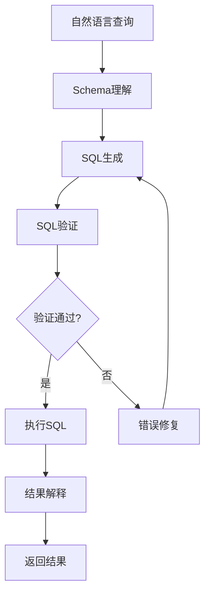

# 04 - SQL 生成助手

## 1. 功能概述

Text2SQL 助手：
- 自然语言转 SQL
- Schema 理解
- SQL 验证
- 结果解释

## 2. 架构设计



## 3. 完整 Java 实现

### 3.1 SQL 助手服务

```java
@Service
@Slf4j
public class SQLAssistantService {
    
    @Autowired
    private ChatClient chatClient;
    
    @Autowired
    private SchemaManager schemaManager;
    
    @Autowired
    private SQLValidator sqlValidator;
    
    @Autowired
    private JdbcTemplate jdbcTemplate;
    
    @Autowired
    private SQLCacheService cacheService;
    
    /**
     * 自然语言转 SQL
     */
    public SQLGenerationResult generateSQL(String naturalLanguage, String schemaName) {
        log.info("Generating SQL for: {}", naturalLanguage);
        
        // 1. 检查缓存
        String cacheKey = generateCacheKey(naturalLanguage, schemaName);
        SQLGenerationResult cached = cacheService.get(cacheKey);
        if (cached != null) {
            log.debug("Cache hit for query: {}", naturalLanguage);
            return cached;
        }
        
        // 2. 获取 Schema 信息
        SchemaInfo schema = schemaManager.getSchema(schemaName);
        if (schema == null) {
            throw new SchemaNotFoundException(schemaName);
        }
        
        // 3. 构建 Prompt
        String prompt = buildGenerationPrompt(naturalLanguage, schema);
        
        // 4. 生成 SQL
        String response = chatClient.prompt()
            .user(prompt)
            .call()
            .content();
        
        String generatedSQL = extractSQL(response);
        String explanation = extractExplanation(response);
        
        // 5. 验证 SQL
        SQLValidationResult validation = sqlValidator.validate(generatedSQL, schema);
        
        SQLGenerationResult result = SQLGenerationResult.builder()
            .naturalLanguage(naturalLanguage)
            .sql(generatedSQL)
            .explanation(explanation)
            .validationStatus(validation.getStatus())
            .validationErrors(validation.getErrors())
            .build();
        
        // 6. 缓存结果
        if (validation.getStatus() == ValidationStatus.VALID) {
            cacheService.put(cacheKey, result, Duration.ofHours(1));
        }
        
        return result;
    }
    
    /**
     * 执行 SQL 并返回结果
     */
    public SQLExecutionResult executeSQL(String sql, String schemaName, String userId) {
        log.info("Executing SQL: {}", sql);
        
        // 1. 权限检查
        if (!hasExecutePermission(userId, schemaName)) {
            throw new PermissionDeniedException("无权执行此操作");
        }
        
        // 2. SQL 安全检查
        if (!isSafeSQL(sql)) {
            throw new UnsafeSQLException("检测到不安全的 SQL 操作");
        }
        
        // 3. 执行 SQL
        long startTime = System.currentTimeMillis();
        
        try {
            List<Map<String, Object>> results = jdbcTemplate.queryForList(sql);
            
            long executionTime = System.currentTimeMillis() - startTime;
            
            // 4. 生成结果解释
            String resultExplanation = explainResults(results, sql);
            
            // 5. 记录执行日志
            logExecution(userId, sql, executionTime, results.size());
            
            return SQLExecutionResult.builder()
                .sql(sql)
                .results(results)
                .rowCount(results.size())
                .executionTime(executionTime)
                .explanation(resultExplanation)
                .status(ExecutionStatus.SUCCESS)
                .build();
                
        } catch (Exception e) {
            log.error("SQL execution failed: {}", sql, e);
            
            return SQLExecutionResult.builder()
                .sql(sql)
                .errorMessage(e.getMessage())
                .status(ExecutionStatus.FAILED)
                .build();
        }
    }
    
    /**
     * 解释 SQL 查询
     */
    public String explainSQL(String sql) {
        String prompt = String.format("""
            请解释以下 SQL 查询的功能和执行逻辑：
            ```sql
            %s
            ```
            
            请用通俗易懂的语言解释：
            1. 这个查询做什么
            2. 涉及哪些表
            3. 查询条件是什么
            4. 返回什么结果
            """, sql);
        
        return chatClient.prompt()
            .user(prompt)
            .call()
            .content();
    }
    
    /**
     * 优化 SQL
     */
    public SQLOptimizationResult optimizeSQL(String sql, SchemaInfo schema) {
        String prompt = String.format("""
            请优化以下 SQL 查询，提高其性能：
            ```sql
            %s
            ```
            
            数据库 Schema：
            %s
            
            请提供：
            1. 优化后的 SQL
            2. 优化说明（使用了哪些优化技术）
            3. 预期性能提升
            """, sql, formatSchema(schema));
        
        String response = chatClient.prompt()
            .user(prompt)
            .call()
            .content();
        
        return SQLOptimizationResult.builder()
            .originalSQL(sql)
            .optimizedSQL(extractSQL(response))
            .optimizationExplanation(extractExplanation(response))
            .build();
    }
    
    /**
     * 对话式 SQL 生成
     */
    public SQLConversationResult converse(
            String userInput,
            String schemaName,
            List<ConversationMessage> history) {
        
        SchemaInfo schema = schemaManager.getSchema(schemaName);
        
        // 构建对话上下文
        StringBuilder context = new StringBuilder();
        context.append("数据库 Schema：\n").append(formatSchema(schema)).append("\n\n");
        context.append("对话历史：\n");
        
        for (ConversationMessage msg : history) {
            context.append(msg.getRole()).append(": ").append(msg.getContent()).append("\n");
        }
        
        String prompt = String.format("""
            %s
            
            用户：%s
            
            请根据对话上下文，理解用户意图并生成相应的 SQL 查询。
            如果需要澄清，请直接询问用户。
            如果可以生成 SQL，请输出 SQL 并解释。
            """, context.toString(), userInput);
        
        String response = chatClient.prompt()
            .user(prompt)
            .call()
            .content();
        
        // 判断是澄清还是 SQL
        if (response.contains("```sql")) {
            String sql = extractSQL(response);
            SQLValidationResult validation = sqlValidator.validate(sql, schema);
            
            return SQLConversationResult.builder()
                .type(ConversationResultType.SQL)
                .sql(sql)
                .explanation(extractExplanation(response))
                .validationStatus(validation.getStatus())
                .build();
        } else {
            return SQLConversationResult.builder()
                .type(ConversationResultType.CLARIFICATION)
                .clarificationQuestion(response)
                .build();
        }
    }
    
    // 辅助方法
    
    private String buildGenerationPrompt(String naturalLanguage, SchemaInfo schema) {
        return String.format("""
            你是一个 SQL 专家。请将以下自然语言查询转换为 SQL。
            
            数据库 Schema：
            %s
            
            用户查询：%s
            
            要求：
            1. 只输出标准 SQL，不要包含特定数据库的扩展语法
            2. 使用有意义的表别名
            3. 添加适当的注释说明查询逻辑
            4. 如果查询涉及多个表，确保使用正确的 JOIN 条件
            5. 对字符串比较使用适当的匹配方式（LIKE/=）
            
            请按以下格式输出：
            ```sql
            -- SQL 查询
            SELECT ...
            ```
            
            解释：
            （简要说明这个 SQL 的功能）
            """, formatSchema(schema), naturalLanguage);
    }
    
    private String formatSchema(SchemaInfo schema) {
        StringBuilder sb = new StringBuilder();
        
        for (TableInfo table : schema.getTables()) {
            sb.append("表名: ").append(table.getName()).append("\n");
            sb.append("描述: ").append(table.getDescription()).append("\n");
            sb.append("字段:\n");
            
            for (ColumnInfo column : table.getColumns()) {
                sb.append(String.format("  - %s (%s): %s\n",
                    column.getName(),
                    column.getType(),
                    column.getDescription()));
            }
            
            sb.append("\n");
        }
        
        return sb.toString();
    }
    
    private String extractSQL(String response) {
        Pattern pattern = Pattern.compile("```sql\\n(.*?)\\n```", Pattern.DOTALL);
        Matcher matcher = pattern.matcher(response);
        return matcher.find() ? matcher.group(1).trim() : response.trim();
    }
    
    private String extractExplanation(String response) {
        String[] parts = response.split("解释：");
        return parts.length > 1 ? parts[1].trim() : "";
    }
    
    private String explainResults(List<Map<String, Object>> results, String sql) {
        if (results.isEmpty()) {
            return "查询未返回任何结果。";
        }
        
        String prompt = String.format("""
            SQL 查询：%s
            
            返回了 %d 条记录。
            
            请用一句话总结这些结果的含义。
            """, sql, results.size());
        
        return chatClient.prompt()
            .user(prompt)
            .call()
            .content();
    }
    
    private boolean isSafeSQL(String sql) {
        String lowerSQL = sql.toLowerCase();
        
        // 禁止危险操作
        List<String> forbiddenKeywords = List.of(
            "drop", "delete", "truncate", "update", "insert",
            "alter", "create", "grant", "revoke"
        );
        
        for (String keyword : forbiddenKeywords) {
            if (lowerSQL.contains(keyword)) {
                return false;
            }
        }
        
        return true;
    }
    
    private boolean hasExecutePermission(String userId, String schemaName) {
        // 权限检查逻辑
        return true; // 简化实现
    }
    
    private void logExecution(String userId, String sql, long executionTime, int rowCount) {
        log.info("SQL executed by {}: {} ({}ms, {} rows)", 
            userId, sql, executionTime, rowCount);
    }
    
    private String generateCacheKey(String naturalLanguage, String schemaName) {
        return "sql:" + schemaName + ":" + 
            DigestUtils.md5DigestAsHex(naturalLanguage.getBytes());
    }
}
```

### 3.2 Schema 管理器

```java
@Service
public class SchemaManager {
    
    @Autowired
    private JdbcTemplate jdbcTemplate;
    
    @Autowired
    private Cache<String, SchemaInfo> schemaCache;
    
    /**
     * 获取 Schema 信息
     */
    public SchemaInfo getSchema(String schemaName) {
        // 检查缓存
        SchemaInfo cached = schemaCache.getIfPresent(schemaName);
        if (cached != null) {
            return cached;
        }
        
        // 从数据库获取
        SchemaInfo schema = loadSchemaFromDatabase(schemaName);
        
        // 缓存
        schemaCache.put(schemaName, schema);
        
        return schema;
    }
    
    /**
     * 刷新 Schema
     */
    public void refreshSchema(String schemaName) {
        schemaCache.invalidate(schemaName);
    }
    
    /**
     * 从数据库加载 Schema
     */
    private SchemaInfo loadSchemaFromDatabase(String schemaName) {
        List<TableInfo> tables = new ArrayList<>();
        
        // 获取所有表
        String tableSql = """
            SELECT table_name, table_comment 
            FROM information_schema.tables 
            WHERE table_schema = ?
            """;
        
        List<Map<String, Object>> tableResults = jdbcTemplate.queryForList(
            tableSql, schemaName);
        
        for (Map<String, Object> tableRow : tableResults) {
            String tableName = (String) tableRow.get("table_name");
            String tableComment = (String) tableRow.get("table_comment");
            
            // 获取表字段
            List<ColumnInfo> columns = loadColumns(schemaName, tableName);
            
            tables.add(TableInfo.builder()
                .name(tableName)
                .description(tableComment)
                .columns(columns)
                .build());
        }
        
        return SchemaInfo.builder()
            .name(schemaName)
            .tables(tables)
            .build();
    }
    
    /**
     * 加载表字段
     */
    private List<ColumnInfo> loadColumns(String schemaName, String tableName) {
        String columnSql = """
            SELECT column_name, data_type, column_comment, is_nullable
            FROM information_schema.columns
            WHERE table_schema = ? AND table_name = ?
            ORDER BY ordinal_position
            """;
        
        List<Map<String, Object>> columnResults = jdbcTemplate.queryForList(
            columnSql, schemaName, tableName);
        
        return columnResults.stream()
            .map(row -> ColumnInfo.builder()
                .name((String) row.get("column_name"))
                .type((String) row.get("data_type"))
                .description((String) row.get("column_comment"))
                .nullable("YES".equals(row.get("is_nullable")))
                .build())
            .collect(Collectors.toList());
    }
}
```

### 3.3 SQL 验证器

```java
@Service
public class SQLValidator {
    
    /**
     * 验证 SQL
     */
    public SQLValidationResult validate(String sql, SchemaInfo schema) {
        List<String> errors = new ArrayList<>();
        List<String> warnings = new ArrayList<>();
        
        // 1. 语法验证
        try {
            CCJSqlParserUtil.parse(sql);
        } catch (JSQLParserException e) {
            errors.add("SQL 语法错误: " + e.getMessage());
            return SQLValidationResult.builder()
                .status(ValidationStatus.INVALID)
                .errors(errors)
                .build();
        }
        
        // 2. 表名验证
        Set<String> validTables = schema.getTables().stream()
            .map(TableInfo::getName)
            .collect(Collectors.toSet());
        
        Set<String> usedTables = extractTableNames(sql);
        for (String table : usedTables) {
            if (!validTables.contains(table)) {
                errors.add("表 '" + table + "' 不存在于 Schema 中");
            }
        }
        
        // 3. 字段验证
        Set<String> usedColumns = extractColumnNames(sql);
        // 简化实现，实际应该检查每个表的字段
        
        // 4. 安全检查
        if (sql.toLowerCase().contains("select *")) {
            warnings.add("建议使用明确的字段列表，避免使用 SELECT *");
        }
        
        if (!sql.toLowerCase().contains("limit") && 
            !sql.toLowerCase().contains("top")) {
            warnings.add("建议添加 LIMIT 限制返回行数");
        }
        
        ValidationStatus status = errors.isEmpty() ? 
            ValidationStatus.VALID : ValidationStatus.INVALID;
        
        return SQLValidationResult.builder()
            .status(status)
            .errors(errors)
            .warnings(warnings)
            .build();
    }
    
    private Set<String> extractTableNames(String sql) {
        Set<String> tables = new HashSet<>();
        
        try {
            Statement statement = CCJSqlParserUtil.parse(sql);
            
            if (statement instanceof Select) {
                Select select = (Select) statement;
                select.accept(new SelectVisitorAdapter() {
                    @Override
                    public void visit(PlainSelect plainSelect) {
                        if (plainSelect.getFromItem() instanceof Table) {
                            tables.add(((Table) plainSelect.getFromItem()).getName());
                        }
                    }
                });
            }
        } catch (JSQLParserException e) {
            log.error("Failed to parse SQL", e);
        }
        
        return tables;
    }
    
    private Set<String> extractColumnNames(String sql) {
        // 简化实现
        return new HashSet<>();
    }
}
```

### 3.4 REST API 控制器

```java
@RestController
@RequestMapping("/api/sql-assistant")
@Slf4j
public class SQLAssistantController {
    
    @Autowired
    private SQLAssistantService sqlAssistantService;
    
    @PostMapping("/generate")
    public ResponseEntity<SQLGenerationResult> generateSQL(
            @RequestBody SQLGenerationRequest request) {
        
        SQLGenerationResult result = sqlAssistantService.generateSQL(
            request.getNaturalLanguage(),
            request.getSchemaName()
        );
        
        return ResponseEntity.ok(result);
    }
    
    @PostMapping("/execute")
    public ResponseEntity<SQLExecutionResult> executeSQL(
            @RequestBody SQLExecutionRequest request,
            @RequestHeader("X-User-Id") String userId) {
        
        SQLExecutionResult result = sqlAssistantService.executeSQL(
            request.getSql(),
            request.getSchemaName(),
            userId
        );
        
        return ResponseEntity.ok(result);
    }
    
    @PostMapping("/explain")
    public ResponseEntity<String> explainSQL(
            @RequestBody SQLExplainRequest request) {
        
        String explanation = sqlAssistantService.explainSQL(request.getSql());
        
        return ResponseEntity.ok(explanation);
    }
    
    @PostMapping("/optimize")
    public ResponseEntity<SQLOptimizationResult> optimizeSQL(
            @RequestBody SQLOptimizationRequest request) {
        
        SchemaInfo schema = schemaManager.getSchema(request.getSchemaName());
        SQLOptimizationResult result = sqlAssistantService.optimizeSQL(
            request.getSql(),
            schema
        );
        
        return ResponseEntity.ok(result);
    }
    
    @PostMapping("/converse")
    public ResponseEntity<SQLConversationResult> converse(
            @RequestBody SQLConversationRequest request) {
        
        SQLConversationResult result = sqlAssistantService.converse(
            request.getUserInput(),
            request.getSchemaName(),
            request.getHistory()
        );
        
        return ResponseEntity.ok(result);
    }
}
```

### 3.5 数据模型

```java
@Data
@Builder
public class SQLGenerationRequest {
    private String naturalLanguage;
    private String schemaName;
}

@Data
@Builder
public class SQLGenerationResult {
    private String naturalLanguage;
    private String sql;
    private String explanation;
    private ValidationStatus validationStatus;
    private List<String> validationErrors;
}

@Data
@Builder
public class SQLExecutionRequest {
    private String sql;
    private String schemaName;
}

@Data
@Builder
public class SQLExecutionResult {
    private String sql;
    private List<Map<String, Object>> results;
    private int rowCount;
    private long executionTime;
    private String explanation;
    private ExecutionStatus status;
    private String errorMessage;
}

@Data
@Builder
public class SQLOptimizationResult {
    private String originalSQL;
    private String optimizedSQL;
    private String optimizationExplanation;
}

@Data
@Builder
public class SQLConversationResult {
    private ConversationResultType type;
    private String sql;
    private String explanation;
    private ValidationStatus validationStatus;
    private String clarificationQuestion;
}

@Data
@Builder
public class SchemaInfo {
    private String name;
    private List<TableInfo> tables;
}

@Data
@Builder
public class TableInfo {
    private String name;
    private String description;
    private List<ColumnInfo> columns;
}

@Data
@Builder
public class ColumnInfo {
    private String name;
    private String type;
    private String description;
    private boolean nullable;
}

@Data
@Builder
public class SQLValidationResult {
    private ValidationStatus status;
    private List<String> errors;
    private List<String> warnings;
}

@Data
@Builder
public class ConversationMessage {
    private String role;
    private String content;
}

public enum ValidationStatus {
    VALID,
    INVALID,
    WARNING
}

public enum ExecutionStatus {
    SUCCESS,
    FAILED
}

public enum ConversationResultType {
    SQL,
    CLARIFICATION
}
```

## 4. 最佳实践

1. **Schema 文档化**：为表和字段添加清晰的描述
2. **查询限制**：限制返回行数，避免大数据量查询
3. **权限控制**：根据用户角色限制可访问的表
4. **SQL 注入防护**：使用参数化查询，验证输入
5. **执行审计**：记录所有 SQL 执行日志

---

> 更多实战案例见其他文档
