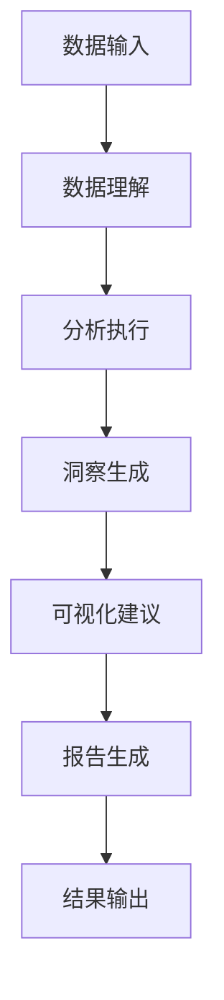

# 05 - 数据分析助手

## 1. 功能概述

数据分析助手：
- 数据洞察生成
- 可视化建议
- 报告生成
- 异常检测

## 2. 架构设计



## 3. 完整 Java 实现

### 3.1 数据分析服务

```java
@Service
@Slf4j
public class DataAnalysisService {
    
    @Autowired
    private ChatClient chatClient;
    
    @Autowired
    private DataSourceManager dataSourceManager;
    
    @Autowired
    private AnalysisExecutor analysisExecutor;
    
    @Autowired
    private VisualizationService visualizationService;
    
    @Autowired
    private ReportGenerator reportGenerator;
    
    /**
     * 分析数据并生成洞察
     */
    public AnalysisResult analyzeData(AnalysisRequest request) {
        log.info("Analyzing data for request: {}", request.getAnalysisId());
        
        long startTime = System.currentTimeMillis();
        
        // 1. 获取数据
        DataFrame data = loadData(request);
        
        // 2. 数据理解
        DataProfile profile = understandData(data);
        
        // 3. 执行分析
        List<AnalysisInsight> insights = generateInsights(data, profile, request);
        
        // 4. 生成可视化建议
        List<VisualizationRecommendation> visualizations = 
            recommendVisualizations(data, profile, insights);
        
        // 5. 异常检测
        List<Anomaly> anomalies = detectAnomalies(data, profile);
        
        long processingTime = System.currentTimeMillis() - startTime;
        
        return AnalysisResult.builder()
            .analysisId(request.getAnalysisId())
            .dataProfile(profile)
            .insights(insights)
            .visualizations(visualizations)
            .anomalies(anomalies)
            .processingTime(processingTime)
            .build();
    }
    
    /**
     * 生成分析报告
     */
    public AnalysisReport generateReport(ReportRequest request) {
        // 1. 获取分析结果
        AnalysisResult result = analyzeData(request.getAnalysisRequest());
        
        // 2. 生成报告内容
        String reportContent = generateReportContent(result, request);
        
        // 3. 生成可视化图表
        List<ChartData> charts = generateCharts(result.getVisualizations());
        
        // 4. 组装报告
        return AnalysisReport.builder()
            .reportId(UUID.randomUUID().toString())
            .title(request.getTitle())
            .content(reportContent)
            .charts(charts)
            .generatedAt(LocalDateTime.now())
            .build();
    }
    
    /**
     * 自然语言分析
     */
    public NLAnalysisResult analyzeWithNaturalLanguage(
            String question,
            String dataSourceId) {
        
        // 1. 获取数据源信息
        DataSourceInfo dataSource = dataSourceManager.getDataSource(dataSourceId);
        
        // 2. 生成分析计划
        AnalysisPlan plan = generateAnalysisPlan(question, dataSource);
        
        // 3. 执行分析
        AnalysisResult result = executeAnalysisPlan(plan, dataSource);
        
        // 4. 生成自然语言回答
        String answer = generateNLAnswer(question, result);
        
        return NLAnalysisResult.builder()
            .question(question)
            .answer(answer)
            .analysisResult(result)
            .build();
    }
    
    /**
     * 理解数据
     */
    private DataProfile understandData(DataFrame data) {
        DataProfile profile = new DataProfile();
        
        // 基本信息
        profile.setRowCount(data.rowCount());
        profile.setColumnCount(data.columnCount());
        
        // 字段分析
        List<ColumnProfile> columnProfiles = new ArrayList<>();
        for (String column : data.columns()) {
            ColumnProfile colProfile = analyzeColumn(data, column);
            columnProfiles.add(colProfile);
        }
        profile.setColumns(columnProfiles);
        
        // 数据质量
        profile.setQualityScore(calculateQualityScore(columnProfiles));
        
        return profile;
    }
    
    /**
     * 分析单个字段
     */
    private ColumnProfile analyzeColumn(DataFrame data, String columnName) {
        ColumnProfile profile = new ColumnProfile();
        profile.setName(columnName);
        
        // 数据类型推断
        ColumnType type = inferColumnType(data, columnName);
        profile.setType(type);
        
        // 统计信息
        profile.setStatistics(calculateStatistics(data, columnName, type));
        
        // 缺失值
        long nullCount = data.column(columnName).nullCount();
        profile.setNullCount(nullCount);
        profile.setNullRate((double) nullCount / data.rowCount());
        
        // 唯一值
        profile.setUniqueCount(data.column(columnName).uniqueCount());
        
        return profile;
    }
    
    /**
     * 生成洞察
     */
    private List<AnalysisInsight> generateInsights(
            DataFrame data,
            DataProfile profile,
            AnalysisRequest request) {
        
        List<AnalysisInsight> insights = new ArrayList<>();
        
        // 1. 基础统计洞察
        insights.addAll(generateBasicInsights(profile));
        
        // 2. 趋势分析
        if (request.getAnalysisTypes().contains(AnalysisType.TREND)) {
            insights.addAll(analyzeTrends(data, profile));
        }
        
        // 3. 相关性分析
        if (request.getAnalysisTypes().contains(AnalysisType.CORRELATION)) {
            insights.addAll(analyzeCorrelations(data, profile));
        }
        
        // 4. 分布分析
        if (request.getAnalysisTypes().contains(AnalysisType.DISTRIBUTION)) {
            insights.addAll(analyzeDistributions(data, profile));
        }
        
        // 5. 分组分析
        if (request.getAnalysisTypes().contains(AnalysisType.GROUPBY)) {
            insights.addAll(analyzeGroupBy(data, profile, request));
        }
        
        // 6. 使用 LLM 生成高级洞察
        insights.addAll(generateLLMInsights(data, profile, insights));
        
        return insights;
    }
    
    /**
     * 使用 LLM 生成洞察
     */
    private List<AnalysisInsight> generateLLMInsights(
            DataFrame data,
            DataProfile profile,
            List<AnalysisInsight> existingInsights) {
        
        // 构建数据摘要
        String dataSummary = buildDataSummary(profile, existingInsights);
        
        String prompt = String.format("""
            基于以下数据分析结果，生成3-5个关键业务洞察：
            
            数据概况：
            %s
            
            已有洞察：
            %s
            
            请生成新的洞察，每个洞察包含：
            1. 洞察标题
            2. 洞察描述
            3. 业务影响
            4. 建议行动
            
            格式：
            洞察1：
            标题：...
            描述：...
            影响：...
            建议：...
            """, dataSummary, formatInsights(existingInsights));
        
        String response = chatClient.prompt()
            .user(prompt)
            .call()
            .content();
        
        return parseLLMInsights(response);
    }
    
    /**
     * 推荐可视化
     */
    private List<VisualizationRecommendation> recommendVisualizations(
            DataFrame data,
            DataProfile profile,
            List<AnalysisInsight> insights) {
        
        List<VisualizationRecommendation> recommendations = new ArrayList<>();
        
        // 根据数据类型推荐
        for (ColumnProfile column : profile.getColumns()) {
            switch (column.getType()) {
                case NUMERIC:
                    recommendations.add(VisualizationRecommendation.builder()
                        .type(ChartType.HISTOGRAM)
                        .title(column.getName() + " 分布")
                        .description("显示 " + column.getName() + " 的数值分布")
                        .columns(List.of(column.getName()))
                        .build());
                    
                    if (profile.hasDateColumn()) {
                        recommendations.add(VisualizationRecommendation.builder()
                            .type(ChartType.LINE)
                            .title(column.getName() + " 趋势")
                            .description("显示 " + column.getName() + " 随时间的变化")
                            .columns(List.of(profile.getDateColumn(), column.getName()))
                            .build());
                    }
                    break;
                    
                case CATEGORICAL:
                    recommendations.add(VisualizationRecommendation.builder()
                        .type(ChartType.BAR)
                        .title(column.getName() + " 分布")
                        .description("显示 " + column.getName() + " 的分类分布")
                        .columns(List.of(column.getName()))
                        .build());
                    break;
                    
                case DATE:
                    recommendations.add(VisualizationRecommendation.builder()
                        .type(ChartType.TIMELINE)
                        .title("时间分布")
                        .description("数据的时间分布情况")
                        .columns(List.of(column.getName()))
                        .build());
                    break;
            }
        }
        
        // 根据洞察推荐
        for (AnalysisInsight insight : insights) {
            if (insight.getType() == InsightType.CORRELATION) {
                recommendations.add(VisualizationRecommendation.builder()
                    .type(ChartType.SCATTER)
                    .title(insight.getTitle())
                    .description(insight.getDescription())
                    .columns(insight.getRelatedColumns())
                    .build());
            }
        }
        
        return recommendations;
    }
    
    /**
     * 异常检测
     */
    private List<Anomaly> detectAnomalies(DataFrame data, DataProfile profile) {
        List<Anomaly> anomalies = new ArrayList<>();
        
        for (ColumnProfile column : profile.getColumns()) {
            if (column.getType() == ColumnType.NUMERIC) {
                // 使用 IQR 方法检测异常值
                double q1 = column.getStatistics().getPercentile25();
                double q3 = column.getStatistics().getPercentile75();
                double iqr = q3 - q1;
                double lowerBound = q1 - 1.5 * iqr;
                double upperBound = q3 + 1.5 * iqr;
                
                // 检测异常值
                List<Integer> outlierRows = findOutliers(data, column.getName(), 
                    lowerBound, upperBound);
                
                if (!outlierRows.isEmpty()) {
                    anomalies.add(Anomaly.builder()
                        .type(AnomalyType.OUTLIER)
                        .column(column.getName())
                        .description(String.format("%s 中发现 %d 个异常值", 
                            column.getName(), outlierRows.size()))
                        .affectedRows(outlierRows)
                        .severity(outlierRows.size() > data.rowCount() * 0.05 ? 
                            Severity.HIGH : Severity.MEDIUM)
                        .build());
                }
            }
        }
        
        return anomalies;
    }
    
    /**
     * 生成报告内容
     */
    private String generateReportContent(AnalysisResult result, ReportRequest request) {
        StringBuilder content = new StringBuilder();
        
        // 执行摘要
        content.append("# 执行摘要\n\n");
        content.append(generateExecutiveSummary(result)).append("\n\n");
        
        // 数据概况
        content.append("# 数据概况\n\n");
        content.append(formatDataProfile(result.getDataProfile())).append("\n\n");
        
        // 关键洞察
        content.append("# 关键洞察\n\n");
        for (AnalysisInsight insight : result.getInsights()) {
            content.append("## ").append(insight.getTitle()).append("\n\n");
            content.append(insight.getDescription()).append("\n\n");
            if (insight.getRecommendation() != null) {
                content.append("**建议：** ").append(insight.getRecommendation()).append("\n\n");
            }
        }
        
        // 异常检测
        if (!result.getAnomalies().isEmpty()) {
            content.append("# 异常检测\n\n");
            for (Anomaly anomaly : result.getAnomalies()) {
                content.append("- **").append(anomaly.getType()).append("**: ")
                    .append(anomaly.getDescription()).append("\n");
            }
            content.append("\n");
        }
        
        return content.toString();
    }
    
    // 辅助方法
    
    private DataFrame loadData(AnalysisRequest request) {
        DataSourceInfo dataSource = dataSourceManager.getDataSource(request.getDataSourceId());
        return dataSourceManager.loadData(dataSource, request.getQuery());
    }
    
    private ColumnType inferColumnType(DataFrame data, String columnName) {
        // 简化实现
        return ColumnType.STRING;
    }
    
    private ColumnStatistics calculateStatistics(DataFrame data, String columnName, ColumnType type) {
        // 简化实现
        return new ColumnStatistics();
    }
    
    private double calculateQualityScore(List<ColumnProfile> columns) {
        if (columns.isEmpty()) return 1.0;
        
        double totalScore = columns.stream()
            .mapToDouble(col -> 1.0 - col.getNullRate())
            .sum();
        
        return totalScore / columns.size();
    }
    
    private String buildDataSummary(DataProfile profile, List<AnalysisInsight> insights) {
        StringBuilder sb = new StringBuilder();
        sb.append(String.format("数据包含 %d 行，%d 列\n", 
            profile.getRowCount(), profile.getColumnCount()));
        sb.append(String.format("数据质量评分：%.2f\n", profile.getQualityScore()));
        sb.append(String.format("已发现 %d 个关键洞察\n", insights.size()));
        return sb.toString();
    }
    
    private String formatInsights(List<AnalysisInsight> insights) {
        StringBuilder sb = new StringBuilder();
        for (AnalysisInsight insight : insights) {
            sb.append("- ").append(insight.getTitle()).append("\n");
        }
        return sb.toString();
    }
    
    private List<AnalysisInsight> parseLLMInsights(String response) {
        // 简化实现
        return new ArrayList<>();
    }
    
    private List<Integer> findOutliers(DataFrame data, String column, 
            double lowerBound, double upperBound) {
        // 简化实现
        return new ArrayList<>();
    }
    
    private String generateExecutiveSummary(AnalysisResult result) {
        return String.format("""
            本次分析共处理 %d 条数据，生成 %d 个关键洞察，
            发现 %d 个异常情况。数据整体质量评分为 %.2f。
            建议重点关注 %s。
            """,
            result.getDataProfile().getRowCount(),
            result.getInsights().size(),
            result.getAnomalies().size(),
            result.getDataProfile().getQualityScore(),
            result.getInsights().isEmpty() ? "无" : result.getInsights().get(0).getTitle()
        );
    }
    
    private String formatDataProfile(DataProfile profile) {
        StringBuilder sb = new StringBuilder();
        sb.append("| 字段名 | 类型 | 非空率 | 唯一值数 |\n");
        sb.append("|--------|------|--------|----------|\n");
        
        for (ColumnProfile col : profile.getColumns()) {
            sb.append(String.format("| %s | %s | %.2f%% | %d |\n",
                col.getName(),
                col.getType(),
                (1 - col.getNullRate()) * 100,
                col.getUniqueCount()));
        }
        
        return sb.toString();
    }
}
```

### 3.2 数据模型

```java
@Data
@Builder
public class AnalysisRequest {
    private String analysisId;
    private String dataSourceId;
    private String query;
    private List<AnalysisType> analysisTypes;
    private Map<String, Object> parameters;
}

@Data
@Builder
public class AnalysisResult {
    private String analysisId;
    private DataProfile dataProfile;
    private List<AnalysisInsight> insights;
    private List<VisualizationRecommendation> visualizations;
    private List<Anomaly> anomalies;
    private long processingTime;
}

@Data
@Builder
public class DataProfile {
    private int rowCount;
    private int columnCount;
    private List<ColumnProfile> columns;
    private double qualityScore;
    
    public boolean hasDateColumn() {
        return columns.stream().anyMatch(c -> c.getType() == ColumnType.DATE);
    }
    
    public String getDateColumn() {
        return columns.stream()
            .filter(c -> c.getType() == ColumnType.DATE)
            .findFirst()
            .map(ColumnProfile::getName)
            .orElse(null);
    }
}

@Data
@Builder
public class ColumnProfile {
    private String name;
    private ColumnType type;
    private ColumnStatistics statistics;
    private long nullCount;
    private double nullRate;
    private long uniqueCount;
}

@Data
public class ColumnStatistics {
    private double min;
    private double max;
    private double mean;
    private double median;
    private double stdDev;
    private double percentile25;
    private double percentile75;
}

@Data
@Builder
public class AnalysisInsight {
    private String id;
    private String title;
    private String description;
    private InsightType type;
    private String recommendation;
    private List<String> relatedColumns;
    private double confidence;
}

@Data
@Builder
public class VisualizationRecommendation {
    private ChartType type;
    private String title;
    private String description;
    private List<String> columns;
    private Map<String, Object> config;
}

@Data
@Builder
public class Anomaly {
    private AnomalyType type;
    private String column;
    private String description;
    private List<Integer> affectedRows;
    private Severity severity;
}

@Data
@Builder
public class AnalysisReport {
    private String reportId;
    private String title;
    private String content;
    private List<ChartData> charts;
    private LocalDateTime generatedAt;
}

@Data
@Builder
public class NLAnalysisResult {
    private String question;
    private String answer;
    private AnalysisResult analysisResult;
}

@Data
@Builder
public class ReportRequest {
    private String title;
    private AnalysisRequest analysisRequest;
    private ReportFormat format;
    private List<String> sections;
}

@Data
@Builder
public class ChartData {
    private String chartId;
    private ChartType type;
    private String title;
    private Map<String, Object> data;
    private Map<String, Object> options;
}

public enum AnalysisType {
    TREND,
    CORRELATION,
    DISTRIBUTION,
    GROUPBY,
    ANOMALY
}

public enum ColumnType {
    NUMERIC,
    CATEGORICAL,
    DATE,
    STRING
}

public enum InsightType {
    TREND,
    CORRELATION,
    DISTRIBUTION,
    COMPARISON,
    ANOMALY,
    RECOMMENDATION
}

public enum ChartType {
    LINE,
    BAR,
    PIE,
    SCATTER,
    HISTOGRAM,
    HEATMAP,
    TIMELINE,
    BOX
}

public enum AnomalyType {
    OUTLIER,
    MISSING_VALUE,
    DUPLICATE,
    INCONSISTENCY
}

public enum Severity {
    LOW,
    MEDIUM,
    HIGH,
    CRITICAL
}

public enum ReportFormat {
    MARKDOWN,
    HTML,
    PDF
}
```

### 3.3 REST API 控制器

```java
@RestController
@RequestMapping("/api/data-analysis")
@Slf4j
public class DataAnalysisController {
    
    @Autowired
    private DataAnalysisService dataAnalysisService;
    
    @PostMapping("/analyze")
    public ResponseEntity<AnalysisResult> analyzeData(
            @RequestBody AnalysisRequest request) {
        
        AnalysisResult result = dataAnalysisService.analyzeData(request);
        
        return ResponseEntity.ok(result);
    }
    
    @PostMapping("/report")
    public ResponseEntity<AnalysisReport> generateReport(
            @RequestBody ReportRequest request) {
        
        AnalysisReport report = dataAnalysisService.generateReport(request);
        
        return ResponseEntity.ok(report);
    }
    
    @PostMapping("/ask")
    public ResponseEntity<NLAnalysisResult> askQuestion(
            @RequestBody NLAnalysisRequest request) {
        
        NLAnalysisResult result = dataAnalysisService.analyzeWithNaturalLanguage(
            request.getQuestion(),
            request.getDataSourceId()
        );
        
        return ResponseEntity.ok(result);
    }
    
    @GetMapping("/report/{reportId}/export")
    public ResponseEntity<byte[]> exportReport(
            @PathVariable String reportId,
            @RequestParam ReportFormat format) {
        
        // 导出报告
        byte[] reportData = reportGenerator.export(reportId, format);
        
        return ResponseEntity.ok()
            .header(HttpHeaders.CONTENT_DISPOSITION, 
                "attachment; filename=report." + format.name().toLowerCase())
            .body(reportData);
    }
}

@Data
@Builder
class NLAnalysisRequest {
    private String question;
    private String dataSourceId;
}
```

## 4. 最佳实践

1. **数据采样**：大数据集使用采样分析
2. **缓存结果**：缓存分析结果避免重复计算
3. **增量分析**：支持增量数据更新分析
4. **可视化交互**：支持图表交互和钻取
5. **报告定制**：提供报告模板和定制选项

---

> 至此，所有实战案例已完成
