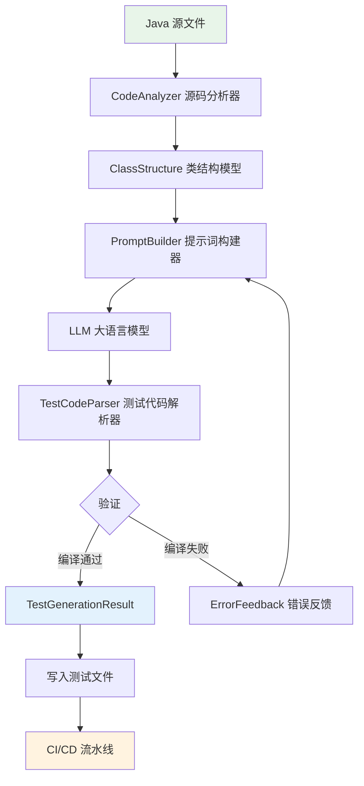

# AI 自动化测试生成助手

## 一、概念与原理

### 1.1 应用场景

AI 自动化测试生成助手利用大语言模型（LLM）分析 Java 源码，自动生成高质量的单元测试和集成测试代码，解决以下痛点：

- **测试覆盖率不足**：手写测试耗时，开发者往往省略边界条件和异常路径
- **测试质量参差不齐**：依赖个人经验，测试用例设计缺乏系统性
- **遗留代码缺少测试**：老项目补写测试成本极高
- **测试数据生成繁琐**：Mock 数据和测试夹具（Fixture）编写重复劳动多

### 1.2 核心能力

| 能力 | 说明 |
|------|------|
| 单元测试生成 | 基于方法签名和业务逻辑生成 JUnit 5 测试用例 |
| 集成测试生成 | 生成 Spring Boot Test、Testcontainers 集成测试 |
| 测试数据生成 | 自动生成边界值、正常值、异常值测试数据 |
| Mock 代码生成 | 生成 Mockito stub 和 verify 代码 |
| 覆盖率分析 | 分析现有测试缺口，针对性补充用例 |

### 1.3 架构设计



### 1.4 技术选型

- **LLM 框架**：Spring AI（推荐）或 LangChain4j
- **源码解析**：JavaParser（AST 分析）
- **测试框架**：JUnit 5 + Mockito + AssertJ
- **集成测试**：Spring Boot Test + Testcontainers
- **覆盖率**：JaCoCo

---

## 二、技术详解

### 2.1 源码解析策略

使用 JavaParser 对 Java 源文件进行 AST（抽象语法树）解析，提取：

- 类名、包名、注解
- 方法签名（参数类型、返回类型、异常声明）
- 字段依赖（用于推断 Mock 对象）
- 方法体（用于理解业务逻辑）

### 2.2 提示词工程

针对测试生成的关键提示词策略：

1. **结构化输入**：将类结构以 JSON 形式提供给 LLM，降低歧义
2. **分步生成**：先生成测试用例列表，再逐个生成测试方法体
3. **Few-shot 示例**：在提示词中内嵌 1-2 个高质量测试示例
4. **约束输出格式**：要求 LLM 输出可直接编译的完整 Java 代码

### 2.3 生成质量保证

```
源码 → 解析 → 生成 → 编译验证 → 运行验证 → 覆盖率检查
                ↑____________失败重试（最多3次）____________|
```

### 2.4 Maven 依赖

```xml
<dependencies>
    <!-- Spring AI -->
    <dependency>
        <groupId>org.springframework.ai</groupId>
        <artifactId>spring-ai-openai-spring-boot-starter</artifactId>
        <version>1.0.0</version>
    </dependency>

    <!-- JavaParser - AST 解析 -->
    <dependency>
        <groupId>com.github.javaparser</groupId>
        <artifactId>javaparser-core</artifactId>
        <version>3.25.10</version>
    </dependency>

    <!-- JUnit 5 -->
    <dependency>
        <groupId>org.junit.jupiter</groupId>
        <artifactId>junit-jupiter</artifactId>
        <version>5.10.2</version>
        <scope>test</scope>
    </dependency>

    <!-- Mockito -->
    <dependency>
        <groupId>org.mockito</groupId>
        <artifactId>mockito-core</artifactId>
        <version>5.11.0</version>
        <scope>test</scope>
    </dependency>

    <!-- AssertJ -->
    <dependency>
        <groupId>org.assertj</groupId>
        <artifactId>assertj-core</artifactId>
        <version>3.25.3</version>
        <scope>test</scope>
    </dependency>

    <!-- Lombok -->
    <dependency>
        <groupId>org.projectlombok</groupId>
        <artifactId>lombok</artifactId>
        <optional>true</optional>
    </dependency>
</dependencies>
```

---

## 三、Java 代码示例

### 3.1 类结构模型（ClassStructure）

```java
@Data
@Builder
public class ClassStructure {
    private String packageName;
    private String className;
    private String classBody;          // 完整类体（供 LLM 理解）
    private List<MethodInfo> methods;
    private List<FieldInfo> fields;
    private List<String> imports;
    private List<String> classAnnotations;

    @Data
    @Builder
    public static class MethodInfo {
        private String name;
        private String returnType;
        private List<String> parameterTypes;
        private List<String> parameterNames;
        private List<String> thrownExceptions;
        private List<String> annotations;
        private String methodBody;
        private boolean isPublic;
    }

    @Data
    @Builder
    public static class FieldInfo {
        private String name;
        private String type;
        private List<String> annotations;  // @Autowired, @Value 等
    }
}
```

### 3.2 源码分析器（CodeAnalyzer）

```java
@Component
public class CodeAnalyzer {

    /**
     * 解析 Java 源文件，提取类结构信息
     */
    public ClassStructure analyze(String sourceCode) {
        CompilationUnit cu = StaticJavaParser.parse(sourceCode);

        ClassOrInterfaceDeclaration classDecl = cu.findFirst(ClassOrInterfaceDeclaration.class)
            .orElseThrow(() -> new IllegalArgumentException("未找到类定义"));

        return ClassStructure.builder()
            .packageName(cu.getPackageDeclaration()
                .map(pd -> pd.getNameAsString()).orElse(""))
            .className(classDecl.getNameAsString())
            .classBody(sourceCode)
            .methods(extractMethods(classDecl))
            .fields(extractFields(classDecl))
            .imports(extractImports(cu))
            .classAnnotations(extractAnnotations(classDecl))
            .build();
    }

    private List<ClassStructure.MethodInfo> extractMethods(ClassOrInterfaceDeclaration classDecl) {
        return classDecl.getMethods().stream()
            .filter(m -> m.isPublic())
            .map(method -> ClassStructure.MethodInfo.builder()
                .name(method.getNameAsString())
                .returnType(method.getTypeAsString())
                .parameterTypes(method.getParameters().stream()
                    .map(p -> p.getTypeAsString())
                    .collect(Collectors.toList()))
                .parameterNames(method.getParameters().stream()
                    .map(p -> p.getNameAsString())
                    .collect(Collectors.toList()))
                .thrownExceptions(method.getThrownExceptions().stream()
                    .map(ReferenceType::asString)
                    .collect(Collectors.toList()))
                .annotations(method.getAnnotations().stream()
                    .map(a -> a.getNameAsString())
                    .collect(Collectors.toList()))
                .methodBody(method.getBody().map(Object::toString).orElse(""))
                .isPublic(method.isPublic())
                .build())
            .collect(Collectors.toList());
    }

    private List<ClassStructure.FieldInfo> extractFields(ClassOrInterfaceDeclaration classDecl) {
        return classDecl.getFields().stream()
            .flatMap(field -> field.getVariables().stream()
                .map(var -> ClassStructure.FieldInfo.builder()
                    .name(var.getNameAsString())
                    .type(field.getElementType().asString())
                    .annotations(field.getAnnotations().stream()
                        .map(a -> a.getNameAsString())
                        .collect(Collectors.toList()))
                    .build()))
            .collect(Collectors.toList());
    }

    private List<String> extractImports(CompilationUnit cu) {
        return cu.getImports().stream()
            .map(ImportDeclaration::getNameAsString)
            .collect(Collectors.toList());
    }

    private List<String> extractAnnotations(ClassOrInterfaceDeclaration classDecl) {
        return classDecl.getAnnotations().stream()
            .map(a -> a.getNameAsString())
            .collect(Collectors.toList());
    }
}
```

### 3.3 提示词构建器（TestPromptBuilder）

```java
@Component
public class TestPromptBuilder {

    private static final String SYSTEM_PROMPT = """
        你是一位资深 Java 测试工程师，专精于编写高质量的 JUnit 5 单元测试。
        你的测试代码需要满足：
        1. 使用 JUnit 5 注解（@Test, @BeforeEach, @ParameterizedTest 等）
        2. 使用 Mockito 进行依赖 Mock（@Mock, @InjectMocks, when().thenReturn()）
        3. 使用 AssertJ 进行断言（assertThat().isEqualTo() 等）
        4. 覆盖正常路径、边界条件、异常路径
        5. 方法名使用 given_when_then 或 should_xxx_when_xxx 命名规范
        6. 只输出可编译的完整 Java 测试类代码，不要任何解释
        """;

    /**
     * 构建单元测试生成提示词
     */
    public String buildUnitTestPrompt(ClassStructure classStructure) {
        return String.format("""
            请为以下 Java 类生成完整的 JUnit 5 单元测试类。
            
            ## 目标类信息
            - 包名：%s
            - 类名：%s
            - 依赖字段：%s
            
            ## 源代码
            ```java
            %s
            ```
            
            ## 要求
            - 测试类名：%sTest
            - 为每个 public 方法至少生成 3 个测试用例（正常、边界、异常）
            - 使用 @ExtendWith(MockitoExtension.class)
            - 所有依赖字段使用 @Mock 注解
            - 被测类使用 @InjectMocks 注解
            - 直接输出完整可编译的 Java 代码
            """,
            classStructure.getPackageName(),
            classStructure.getClassName(),
            formatFields(classStructure.getFields()),
            classStructure.getClassBody(),
            classStructure.getClassName()
        );
    }

    /**
     * 构建集成测试生成提示词
     */
    public String buildIntegrationTestPrompt(ClassStructure classStructure, String testType) {
        return String.format("""
            请为以下 Spring Boot Service 类生成 %s 集成测试。
            
            ## 源代码
            ```java
            %s
            ```
            
            ## 要求
            - 使用 @SpringBootTest 注解
            - 使用 @Transactional 保证测试隔离
            - 使用真实 Spring 容器，不 Mock 核心依赖
            - 覆盖主要业务场景
            - 直接输出完整可编译的 Java 代码
            """,
            testType,
            classStructure.getClassBody()
        );
    }

    /**
     * 构建测试数据生成提示词
     */
    public String buildTestDataPrompt(ClassStructure.MethodInfo method, String className) {
        return String.format("""
            为 %s.%s 方法生成测试数据集，参数类型为：%s。
            
            请以 JSON 格式返回，包含以下场景：
            1. 正常值（2-3组）
            2. 边界值（最小值、最大值、空集合等）
            3. 异常值（null、空字符串、负数等）
            
            格式示例：
            {
              "normal": [{"param1": "value1", "param2": 100}],
              "boundary": [{"param1": "", "param2": 0}],
              "invalid": [{"param1": null, "param2": -1}]
            }
            """,
            className,
            method.getName(),
            method.getParameterTypes()
        );
    }

    public String getSystemPrompt() {
        return SYSTEM_PROMPT;
    }

    private String formatFields(List<ClassStructure.FieldInfo> fields) {
        return fields.stream()
            .map(f -> f.getType() + " " + f.getName() +
                (f.getAnnotations().isEmpty() ? "" : " [" + String.join(", ", f.getAnnotations()) + "]"))
            .collect(Collectors.joining(", "));
    }
}
```

### 3.4 测试生成核心服务（TestGenerationService）

```java
@Service
@Slf4j
public class TestGenerationService {

    private final ChatClient chatClient;
    private final CodeAnalyzer codeAnalyzer;
    private final TestPromptBuilder promptBuilder;

    public TestGenerationService(ChatClient.Builder chatClientBuilder,
                                  CodeAnalyzer codeAnalyzer,
                                  TestPromptBuilder promptBuilder) {
        this.chatClient = chatClientBuilder
            .defaultSystem(promptBuilder.getSystemPrompt())
            .build();
        this.codeAnalyzer = codeAnalyzer;
        this.promptBuilder = promptBuilder;
    }

    /**
     * 从 Java 源码生成单元测试
     */
    public TestGenerationResult generateUnitTests(String sourceCode) {
        ClassStructure classStructure = codeAnalyzer.analyze(sourceCode);
        log.info("分析类结构完成：{}，方法数：{}", classStructure.getClassName(),
            classStructure.getMethods().size());

        String prompt = promptBuilder.buildUnitTestPrompt(classStructure);
        String generatedCode = callLlmWithRetry(prompt, 3);

        return TestGenerationResult.builder()
            .className(classStructure.getClassName())
            .testCode(extractJavaCode(generatedCode))
            .testType(TestType.UNIT)
            .methodCount(classStructure.getMethods().size())
            .build();
    }

    /**
     * 从 Java 源码生成集成测试
     */
    public TestGenerationResult generateIntegrationTests(String sourceCode, String testType) {
        ClassStructure classStructure = codeAnalyzer.analyze(sourceCode);
        String prompt = promptBuilder.buildIntegrationTestPrompt(classStructure, testType);
        String generatedCode = callLlmWithRetry(prompt, 3);

        return TestGenerationResult.builder()
            .className(classStructure.getClassName())
            .testCode(extractJavaCode(generatedCode))
            .testType(TestType.INTEGRATION)
            .methodCount(classStructure.getMethods().size())
            .build();
    }

    /**
     * 批量生成测试（适用于整个包或模块）
     */
    public List<TestGenerationResult> generateTestsForSources(List<String> sourceCodes) {
        return sourceCodes.parallelStream()
            .map(source -> {
                try {
                    return generateUnitTests(source);
                } catch (Exception e) {
                    log.error("生成测试失败: {}", e.getMessage());
                    return TestGenerationResult.failed(e.getMessage());
                }
            })
            .collect(Collectors.toList());
    }

    /**
     * 带重试机制的 LLM 调用
     */
    private String callLlmWithRetry(String prompt, int maxRetries) {
        for (int attempt = 1; attempt <= maxRetries; attempt++) {
            try {
                String response = chatClient.prompt()
                    .user(prompt)
                    .call()
                    .content();

                if (containsValidJavaCode(response)) {
                    return response;
                }
                log.warn("第 {} 次生成的代码格式不正确，重试中...", attempt);
            } catch (Exception e) {
                log.error("第 {} 次 LLM 调用失败: {}", attempt, e.getMessage());
                if (attempt == maxRetries) throw e;
            }
        }
        throw new TestGenerationException("经过 " + maxRetries + " 次重试仍未生成有效代码");
    }

    /**
     * 从 LLM 响应中提取 Java 代码块
     */
    private String extractJavaCode(String response) {
        Pattern pattern = Pattern.compile("```(?:java)?\\n(.*?)\\n```", Pattern.DOTALL);
        Matcher matcher = pattern.matcher(response);
        if (matcher.find()) {
            return matcher.group(1).trim();
        }
        return response.trim();
    }

    private boolean containsValidJavaCode(String response) {
        return response.contains("class") && response.contains("@Test");
    }
}
```

### 3.5 REST API 控制器（TestGenerationController）

```java
@RestController
@RequestMapping("/api/test-generator")
@Slf4j
public class TestGenerationController {

    @Autowired
    private TestGenerationService testGenerationService;

    /**
     * 上传 Java 源文件，生成单元测试
     */
    @PostMapping("/unit-tests")
    public ResponseEntity<TestGenerationResult> generateUnitTests(
            @RequestBody TestGenerationRequest request) {
        log.info("收到单元测试生成请求，源码长度：{}", request.getSourceCode().length());
        TestGenerationResult result = testGenerationService.generateUnitTests(request.getSourceCode());
        return ResponseEntity.ok(result);
    }

    /**
     * 生成集成测试
     */
    @PostMapping("/integration-tests")
    public ResponseEntity<TestGenerationResult> generateIntegrationTests(
            @RequestBody IntegrationTestRequest request) {
        TestGenerationResult result = testGenerationService.generateIntegrationTests(
            request.getSourceCode(), request.getTestType());
        return ResponseEntity.ok(result);
    }

    /**
     * 批量生成（接受多个源文件）
     */
    @PostMapping("/batch")
    public ResponseEntity<List<TestGenerationResult>> generateBatch(
            @RequestBody BatchGenerationRequest request) {
        List<TestGenerationResult> results =
            testGenerationService.generateTestsForSources(request.getSourceCodes());
        return ResponseEntity.ok(results);
    }
}
```

### 3.6 数据模型

```java
@Data
@Builder
public class TestGenerationRequest {
    private String sourceCode;
}

@Data
@Builder
public class IntegrationTestRequest {
    private String sourceCode;
    private String testType;  // "SpringBootTest" | "Testcontainers"
}

@Data
@Builder
public class BatchGenerationRequest {
    private List<String> sourceCodes;
}

@Data
@Builder
public class TestGenerationResult {
    private String className;
    private String testCode;
    private TestType testType;
    private int methodCount;
    private boolean success;
    private String errorMessage;

    public static TestGenerationResult failed(String errorMessage) {
        return TestGenerationResult.builder()
            .success(false)
            .errorMessage(errorMessage)
            .build();
    }
}

public enum TestType {
    UNIT, INTEGRATION
}
```

### 3.7 Spring AI 配置

```java
@Configuration
public class AiConfig {

    @Bean
    public ChatClient chatClient(ChatClient.Builder builder) {
        return builder
            .defaultOptions(OpenAiChatOptions.builder()
                .model("gpt-4o")
                .temperature(0.2)   // 低温度确保输出稳定
                .maxTokens(4096)
                .build())
            .build();
    }
}
```

```yaml
# application.yml
spring:
  ai:
    openai:
      api-key: ${OPENAI_API_KEY}
      chat:
        options:
          model: gpt-4o
          temperature: 0.2
```

### 3.8 生成效果示例

给定以下业务类：

```java
@Service
public class OrderService {

    @Autowired
    private OrderRepository orderRepository;

    @Autowired
    private InventoryService inventoryService;

    public Order createOrder(Long userId, Long productId, int quantity) {
        if (quantity <= 0) {
            throw new IllegalArgumentException("数量必须大于0");
        }
        boolean inStock = inventoryService.checkStock(productId, quantity);
        if (!inStock) {
            throw new InsufficientStockException("库存不足");
        }
        Order order = Order.builder()
            .userId(userId).productId(productId).quantity(quantity)
            .status(OrderStatus.PENDING).build();
        return orderRepository.save(order);
    }
}
```

LLM 自动生成的测试类：

```java
@ExtendWith(MockitoExtension.class)
class OrderServiceTest {

    @Mock
    private OrderRepository orderRepository;

    @Mock
    private InventoryService inventoryService;

    @InjectMocks
    private OrderService orderService;

    @Test
    void createOrder_shouldReturnOrder_whenValidInput() {
        when(inventoryService.checkStock(1L, 2)).thenReturn(true);
        when(orderRepository.save(any(Order.class))).thenAnswer(inv -> inv.getArgument(0));

        Order result = orderService.createOrder(100L, 1L, 2);

        assertThat(result.getUserId()).isEqualTo(100L);
        assertThat(result.getStatus()).isEqualTo(OrderStatus.PENDING);
        verify(orderRepository).save(any(Order.class));
    }

    @Test
    void createOrder_shouldThrowException_whenQuantityIsZero() {
        assertThatThrownBy(() -> orderService.createOrder(100L, 1L, 0))
            .isInstanceOf(IllegalArgumentException.class)
            .hasMessageContaining("数量必须大于0");

        verifyNoInteractions(inventoryService, orderRepository);
    }

    @Test
    void createOrder_shouldThrowException_whenInsufficientStock() {
        when(inventoryService.checkStock(1L, 5)).thenReturn(false);

        assertThatThrownBy(() -> orderService.createOrder(100L, 1L, 5))
            .isInstanceOf(InsufficientStockException.class)
            .hasMessageContaining("库存不足");

        verifyNoInteractions(orderRepository);
    }

    @ParameterizedTest
    @ValueSource(ints = {-1, 0, Integer.MIN_VALUE})
    void createOrder_shouldThrowException_whenQuantityIsNonPositive(int quantity) {
        assertThatThrownBy(() -> orderService.createOrder(100L, 1L, quantity))
            .isInstanceOf(IllegalArgumentException.class);
    }
}
```

---

## 四、最佳实践

### 4.1 提示词工程

- **提供完整上下文**：将整个类（而非单个方法）传给 LLM，模型能理解字段依赖关系
- **指定测试框架版本**：明确要求 JUnit 5 + Mockito 5，避免生成过时的 JUnit 4 代码
- **Few-shot 示例**：在系统提示词中内嵌一个完整的高质量测试示例，效果提升明显
- **低温度参数**：设置 temperature=0.1~0.3，减少代码随机性，提高编译通过率

### 4.2 测试质量验证

```java
// 生成后自动编译验证
public boolean validateGeneratedCode(String testCode) {
    JavaCompiler compiler = ToolProvider.getSystemJavaCompiler();
    // 写入临时文件，尝试编译，检查返回码
    return compiler.run(null, null, null, tempFile.getAbsolutePath()) == 0;
}
```

- 生成后立即进行编译检查，编译失败则携带错误信息重新请求 LLM
- 运行生成的测试，统计通过率，低于阈值时触发人工审核
- 用 JaCoCo 检查生成测试的代码覆盖率，目标达到 80% 以上

### 4.3 CI/CD 集成

```yaml
# .github/workflows/auto-test-generation.yml
name: Auto Test Generation
on:
  push:
    paths:
      - 'src/main/java/**/*.java'

jobs:
  generate-tests:
    runs-on: ubuntu-latest
    steps:
      - uses: actions/checkout@v4
      - name: Generate Tests for Changed Files
        run: |
          git diff --name-only HEAD~1 HEAD | grep '\.java$' | \
          xargs -I {} curl -s -X POST http://test-gen-service/api/test-generator/unit-tests \
            -H 'Content-Type: application/json' \
            -d "{\"sourceCode\": \"$(cat {})\"}" \
            -o {}.test.json
      - name: Commit Generated Tests
        run: |
          git config user.name "Test Bot"
          git commit -am "chore: auto-generate unit tests" && git push
```

### 4.4 成本控制

- **缓存机制**：对相同源文件的 MD5 哈希缓存生成结果，避免重复调用 LLM
- **增量生成**：只为有变更的方法重新生成测试，而非重新生成整个测试类
- **模型选择**：日常生成使用 GPT-4o-mini，仅复杂场景使用 GPT-4o

---

## 五、常见问题

**Q1：生成的测试代码无法编译怎么办？**

将编译错误信息追加到下一次请求的提示词中：`"上次生成的代码有以下编译错误，请修复：{error}"`。通常 1-2 次迭代即可修复。同时检查 LLM 是否遗漏了必要的 import 语句。

**Q2：生成的测试用例覆盖率低，只测试了 happy path？**

在提示词中明确要求覆盖边界条件和异常路径，并提供方法中所有 `if/else` 分支列表。也可以先用 JaCoCo 生成覆盖率报告，将未覆盖的行号提供给 LLM，让其针对性补充。

**Q3：Mock 代码生成不正确，`when().thenReturn()` 与实际调用不匹配？**

确保将完整的方法调用链（包括参数类型）提供给 LLM。对于复杂参数，使用 `any(ClassName.class)` 替代精确匹配往往更可靠。

**Q4：如何处理私有方法的测试？**

私有方法不应直接测试，应通过公共方法间接覆盖。在提示词中明确说明"不要为私有方法生成直接测试，通过 public 方法覆盖其逻辑"即可。

**Q5：生成测试后如何维护？源码修改后测试过期怎么办？**

在 CI 流水线中检测源文件变更，自动触发对应测试文件的重新生成。建议保留人工编写的测试不被覆盖，仅对 AI 生成的测试文件（可添加 `@Generated` 注解标记）进行自动更新。

---

> 更多实战案例见其他文档
