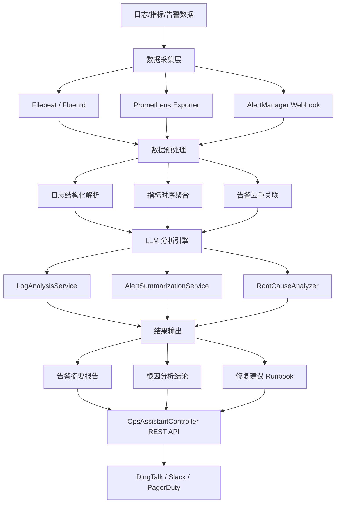

# 智能运维（AIOps）助手

## 一、概念与原理

### 1.1 什么是 AIOps

AIOps（Artificial Intelligence for IT Operations）是将人工智能和机器学习技术应用于 IT 运维领域的实践，通过 LLM 的强大语言理解与推理能力，实现对海量日志、指标、告警的自动化分析与智能处置。

**核心能力：**
- **日志分析**：自动解析非结构化日志，识别异常模式和错误根因
- **告警诊断**：聚合关联告警，消除告警噪音，提炼关键问题
- **根因分析（RCA）**：结合拓扑关系与历史数据，定位故障根因
- **自动化修复建议**：基于知识库和上下文生成可操作的修复步骤

### 1.2 传统运维 vs AIOps

| 维度 | 传统运维 | AIOps |
|------|----------|-------|
| 日志分析 | 人工搜索 Kibana/Grep | LLM 自动摘要异常 |
| 告警处理 | 逐条人工确认 | 自动聚合 + 优先级排序 |
| 根因定位 | 依赖专家经验 | 多源数据推理 |
| 修复建议 | 查 Wiki / 找同事 | 实时生成 Runbook |
| 响应速度 | 分钟~小时级 | 秒级 |

### 1.3 典型应用场景

```
生产故障应急
├── 日志异常检测 → 快速定位报错堆栈
├── 告警风暴治理 → 从 500 条告警提炼 3 个核心问题
├── 跨服务根因分析 → 识别上游服务导致的级联故障
└── SRE Runbook 生成 → 自动输出分步修复操作

日常运维
├── 日志模式发现 → 识别慢查询、内存泄漏趋势
├── 容量预测 → 结合指标趋势给出扩容建议
└── 变更风险评估 → 分析发布日志判断风险等级
```

---

## 二、技术详解

### 2.1 整体架构



### 2.2 与传统工具集成

**ELK Stack 集成：**
- 通过 Elasticsearch API 拉取最近 N 分钟的错误日志
- 将原始日志窗口传给 LLM 进行摘要与异常标注
- 分析结果写回 ES 索引，支持 Kibana Dashboard 可视化

**Prometheus / Alertmanager 集成：**
- Alertmanager 通过 Webhook 将告警推送到 AIOps 服务
- AIOps 服务调用 Prometheus HTTP API 补充历史指标作为上下文
- LLM 基于告警 + 指标联合推断根因

**集成拓扑：**
```
Prometheus ──alerting──▶ Alertmanager ──webhook──▶ AIOps Service
     │                                                    │
     └──query API──────────────────────────────────────▶ LLM
                                                          │
Elasticsearch ◀──write──────────────── analysis result ◀─┘
```

### 2.3 提示词工程要点

- **角色设定**：赋予 LLM 资深 SRE 工程师身份，提升专业性
- **结构化输出**：要求 JSON 格式输出，便于程序解析
- **上下文压缩**：超长日志先摘要再分析，避免超出 context window
- **Few-shot 示例**：提供 2~3 个典型故障案例提升推理准确率
- **Chain-of-Thought**：要求逐步推理，输出分析思路链

---

## 三、Java 代码示例

### 3.1 Maven 依赖

```xml
<dependencies>
    <!-- Spring AI - OpenAI -->
    <dependency>
        <groupId>org.springframework.ai</groupId>
        <artifactId>spring-ai-openai-spring-boot-starter</artifactId>
        <version>1.0.0</version>
    </dependency>

    <!-- Spring Web -->
    <dependency>
        <groupId>org.springframework.boot</groupId>
        <artifactId>spring-boot-starter-web</artifactId>
    </dependency>

    <!-- Elasticsearch Client -->
    <dependency>
        <groupId>co.elastic.clients</groupId>
        <artifactId>elasticsearch-java</artifactId>
        <version>8.12.0</version>
    </dependency>

    <!-- Prometheus Client (Micrometer) -->
    <dependency>
        <groupId>io.micrometer</groupId>
        <artifactId>micrometer-registry-prometheus</artifactId>
    </dependency>

    <!-- Lombok -->
    <dependency>
        <groupId>org.projectlombok</groupId>
        <artifactId>lombok</artifactId>
        <optional>true</optional>
    </dependency>

    <!-- Jackson -->
    <dependency>
        <groupId>com.fasterxml.jackson.core</groupId>
        <artifactId>jackson-databind</artifactId>
    </dependency>
</dependencies>
```

### 3.2 LogAnalysisService - 日志异常分析

```java
@Service
@Slf4j
public class LogAnalysisService {

    @Autowired
    private ChatClient chatClient;

    @Autowired
    private ElasticsearchClient esClient;

    private static final int MAX_LOG_CHARS = 12000;

    /**
     * 分析指定时间窗口内的日志，返回异常摘要
     */
    public LogAnalysisResult analyzeRecentLogs(String serviceName,
                                                Duration window) {
        log.info("Analyzing logs for service={}, window={}", serviceName, window);

        // 1. 从 ES 拉取原始日志
        List<String> rawLogs = fetchLogsFromES(serviceName, window);
        if (rawLogs.isEmpty()) {
            return LogAnalysisResult.noAnomalies(serviceName);
        }

        // 2. 压缩日志（防止超出 context window）
        String compressedLogs = compressLogs(rawLogs);

        // 3. 构建提示词并调用 LLM
        String prompt = buildLogAnalysisPrompt(serviceName, compressedLogs);
        String llmResponse = chatClient.prompt()
                .user(prompt)
                .call()
                .content();

        // 4. 解析 LLM JSON 响应
        return parseLogAnalysisResponse(serviceName, llmResponse);
    }

    /**
     * 从 Elasticsearch 查询错误日志
     */
    private List<String> fetchLogsFromES(String serviceName, Duration window) {
        try {
            Instant from = Instant.now().minus(window);
            SearchResponse<ObjectNode> response = esClient.search(s -> s
                    .index("app-logs-*")
                    .query(q -> q
                            .bool(b -> b
                                    .must(m -> m.term(t -> t
                                            .field("service.name")
                                            .value(serviceName)))
                                    .must(m -> m.range(r -> r
                                            .field("@timestamp")
                                            .gte(JsonData.of(from.toString()))))
                                    .should(sh -> sh.terms(t -> t
                                            .field("log.level")
                                            .terms(tv -> tv.value(List.of(
                                                    FieldValue.of("ERROR"),
                                                    FieldValue.of("WARN"))))))
                            )
                    )
                    .size(500)
                    .sort(so -> so.field(f -> f
                            .field("@timestamp")
                            .order(SortOrder.Desc))),
                    ObjectNode.class);

            return response.hits().hits().stream()
                    .map(hit -> hit.source())
                    .filter(Objects::nonNull)
                    .map(node -> node.path("message").asText(""))
                    .filter(msg -> !msg.isBlank())
                    .collect(Collectors.toList());

        } catch (Exception e) {
            log.error("Failed to fetch logs from ES for service={}", serviceName, e);
            return Collections.emptyList();
        }
    }

    /**
     * 日志压缩：截断超长日志，保留最新 N 个字符
     */
    private String compressLogs(List<String> logs) {
        String joined = String.join("\n", logs);
        if (joined.length() <= MAX_LOG_CHARS) {
            return joined;
        }
        // 保留最后部分（最新日志更有价值）
        return "...[已截断前半部分日志]...\n" +
               joined.substring(joined.length() - MAX_LOG_CHARS);
    }

    /**
     * 构建日志分析提示词
     */
    private String buildLogAnalysisPrompt(String serviceName, String logs) {
        return """
            你是一名资深 SRE 工程师，擅长分析分布式系统日志。
            请分析以下来自服务 [%s] 的日志片段，识别所有异常和错误。

            要求：
            1. 识别所有 ERROR / WARN 级别的日志模式
            2. 对相似错误进行归类，避免重复列举
            3. 评估每类异常的严重程度（CRITICAL / HIGH / MEDIUM / LOW）
            4. 推断可能的根因
            5. 以 JSON 格式输出，结构如下：
            {
              "anomalies": [
                {
                  "type": "异常类型",
                  "severity": "CRITICAL|HIGH|MEDIUM|LOW",
                  "occurrences": 出现次数,
                  "description": "异常描述",
                  "possibleCause": "可能原因",
                  "affectedComponent": "涉及组件"
                }
              ],
              "overallHealth": "HEALTHY|DEGRADED|CRITICAL",
              "summary": "整体日志健康状况摘要（一句话）"
            }

            日志内容：
            ---
            %s
            ---
            """.formatted(serviceName, logs);
    }

    /**
     * 解析 LLM 返回的 JSON 响应
     */
    private LogAnalysisResult parseLogAnalysisResponse(String serviceName,
                                                        String llmResponse) {
        try {
            ObjectMapper mapper = new ObjectMapper();
            // 提取 JSON 块（LLM 有时会在 JSON 外包裹说明文字）
            String json = extractJson(llmResponse);
            JsonNode root = mapper.readTree(json);

            List<Anomaly> anomalies = new ArrayList<>();
            root.path("anomalies").forEach(node -> anomalies.add(Anomaly.builder()
                    .type(node.path("type").asText())
                    .severity(Severity.valueOf(node.path("severity").asText("MEDIUM")))
                    .occurrences(node.path("occurrences").asInt(1))
                    .description(node.path("description").asText())
                    .possibleCause(node.path("possibleCause").asText())
                    .affectedComponent(node.path("affectedComponent").asText())
                    .build()));

            return LogAnalysisResult.builder()
                    .serviceName(serviceName)
                    .anomalies(anomalies)
                    .overallHealth(root.path("overallHealth").asText("UNKNOWN"))
                    .summary(root.path("summary").asText())
                    .analyzedAt(LocalDateTime.now())
                    .build();

        } catch (Exception e) {
            log.error("Failed to parse LLM log analysis response", e);
            return LogAnalysisResult.parseError(serviceName, llmResponse);
        }
    }

    private String extractJson(String text) {
        int start = text.indexOf('{');
        int end = text.lastIndexOf('}');
        if (start >= 0 && end > start) {
            return text.substring(start, end + 1);
        }
        return text;
    }
}
```

### 3.3 AlertSummarizationService - 告警聚合摘要

```java
@Service
@Slf4j
public class AlertSummarizationService {

    @Autowired
    private ChatClient chatClient;

    /**
     * 对告警风暴进行聚合摘要，输出优先处理建议
     */
    public AlertSummary summarizeAlerts(List<PrometheusAlert> alerts) {
        if (alerts.isEmpty()) {
            return AlertSummary.empty();
        }

        log.info("Summarizing {} alerts", alerts.size());

        // 1. 序列化告警列表
        String alertsJson = serializeAlerts(alerts);

        // 2. 调用 LLM 聚合
        String prompt = buildAlertSummarizationPrompt(alertsJson, alerts.size());
        String response = chatClient.prompt()
                .system("你是经验丰富的 SRE，负责处理生产告警风暴，擅长快速识别核心问题。")
                .user(prompt)
                .call()
                .content();

        // 3. 解析结果
        return parseAlertSummary(response, alerts.size());
    }

    private String buildAlertSummarizationPrompt(String alertsJson, int total) {
        return """
            当前系统共触发 %d 条告警，请帮我：
            1. 将相关告警归组（同一根因的告警归为一组）
            2. 识别最高优先级的 TOP 3 问题
            3. 判断是否存在告警风暴（同一问题重复触发）
            4. 给出立即需要处理的行动建议

            返回 JSON 格式：
            {
              "groups": [
                {
                  "groupName": "分组名称",
                  "alertCount": 告警数,
                  "rootCauseHypothesis": "根因假设",
                  "priority": 1
                }
              ],
              "top3Issues": ["问题1", "问题2", "问题3"],
              "isAlertStorm": true/false,
              "immediateActions": ["行动1", "行动2"],
              "executiveSummary": "给领导的一句话摘要"
            }

            告警数据（JSON）：
            %s
            """.formatted(total, alertsJson);
    }

    private String serializeAlerts(List<PrometheusAlert> alerts) {
        try {
            ObjectMapper mapper = new ObjectMapper();
            // 只取关键字段，避免超长
            List<Map<String, Object>> simplified = alerts.stream()
                    .map(a -> Map.of(
                            "name", a.getLabels().getOrDefault("alertname", ""),
                            "severity", a.getLabels().getOrDefault("severity", ""),
                            "instance", a.getLabels().getOrDefault("instance", ""),
                            "summary", a.getAnnotations().getOrDefault("summary", ""),
                            "startsAt", a.getStartsAt().toString()
                    ))
                    .collect(Collectors.toList());
            return mapper.writeValueAsString(simplified);
        } catch (Exception e) {
            return alerts.toString();
        }
    }

    private AlertSummary parseAlertSummary(String response, int totalAlerts) {
        try {
            ObjectMapper mapper = new ObjectMapper();
            String json = extractJson(response);
            JsonNode root = mapper.readTree(json);

            List<AlertGroup> groups = new ArrayList<>();
            root.path("groups").forEach(node -> groups.add(AlertGroup.builder()
                    .groupName(node.path("groupName").asText())
                    .alertCount(node.path("alertCount").asInt())
                    .rootCauseHypothesis(node.path("rootCauseHypothesis").asText())
                    .priority(node.path("priority").asInt())
                    .build()));

            List<String> top3 = new ArrayList<>();
            root.path("top3Issues").forEach(n -> top3.add(n.asText()));

            List<String> actions = new ArrayList<>();
            root.path("immediateActions").forEach(n -> actions.add(n.asText()));

            return AlertSummary.builder()
                    .totalAlerts(totalAlerts)
                    .groups(groups)
                    .top3Issues(top3)
                    .isAlertStorm(root.path("isAlertStorm").asBoolean(false))
                    .immediateActions(actions)
                    .executiveSummary(root.path("executiveSummary").asText())
                    .generatedAt(LocalDateTime.now())
                    .build();

        } catch (Exception e) {
            log.error("Failed to parse alert summary", e);
            return AlertSummary.error(totalAlerts, response);
        }
    }

    private String extractJson(String text) {
        int start = text.indexOf('{');
        int end = text.lastIndexOf('}');
        return (start >= 0 && end > start) ? text.substring(start, end + 1) : text;
    }
}
```

### 3.4 RootCauseAnalyzer - 根因分析

```java
@Service
@Slf4j
public class RootCauseAnalyzer {

    @Autowired
    private ChatClient chatClient;

    @Autowired
    private LogAnalysisService logAnalysisService;

    @Autowired
    private AlertSummarizationService alertSummarizationService;

    @Autowired
    private MetricsQueryService metricsQueryService;

    /**
     * 综合日志、告警、指标进行根因分析
     */
    public RootCauseReport analyze(RcaRequest request) {
        log.info("Starting RCA for incident={}", request.getIncidentId());

        // 1. 并行收集多源数据
        LogAnalysisResult logResult = logAnalysisService.analyzeRecentLogs(
                request.getServiceName(), request.getTimeWindow());

        MetricsSummary metrics = metricsQueryService.queryMetrics(
                request.getServiceName(), request.getTimeWindow());

        // 2. 构建综合上下文
        String context = buildRcaContext(request, logResult, metrics);

        // 3. LLM 根因推理（Chain-of-Thought）
        String prompt = buildRcaPrompt(context, request.getSymptomDescription());
        String response = chatClient.prompt()
                .system("""
                    你是一名经验丰富的分布式系统故障诊断专家，
                    精通微服务架构、JVM 调优、数据库性能分析。
                    请基于提供的证据，逐步推理故障根因，并给出可执行的修复建议。
                    """)
                .user(prompt)
                .call()
                .content();

        // 4. 解析输出
        return parseRcaReport(request.getIncidentId(), response);
    }

    private String buildRcaContext(RcaRequest request,
                                    LogAnalysisResult logResult,
                                    MetricsSummary metrics) {
        StringBuilder sb = new StringBuilder();
        sb.append("=== 服务信息 ===\n");
        sb.append("服务名称: ").append(request.getServiceName()).append("\n");
        sb.append("分析时间窗口: ").append(request.getTimeWindow()).append("\n\n");

        sb.append("=== 日志异常摘要 ===\n");
        sb.append("整体健康状态: ").append(logResult.getOverallHealth()).append("\n");
        logResult.getAnomalies().forEach(a ->
                sb.append(String.format("- [%s] %s (出现 %d 次): %s\n",
                        a.getSeverity(), a.getType(), a.getOccurrences(), a.getDescription())));

        sb.append("\n=== 关键指标 ===\n");
        sb.append("CPU 使用率: ").append(metrics.getCpuUsagePercent()).append("%\n");
        sb.append("内存使用率: ").append(metrics.getMemoryUsagePercent()).append("%\n");
        sb.append("P99 响应时间: ").append(metrics.getP99LatencyMs()).append("ms\n");
        sb.append("错误率: ").append(metrics.getErrorRate()).append("%\n");
        sb.append("GC 停顿时间: ").append(metrics.getGcPauseMs()).append("ms\n");

        if (request.getRelatedServices() != null) {
            sb.append("\n=== 依赖服务状态 ===\n");
            request.getRelatedServices().forEach(svc ->
                    sb.append("- ").append(svc).append("\n"));
        }

        return sb.toString();
    }

    private String buildRcaPrompt(String context, String symptom) {
        return """
            ## 故障现象
            %s

            ## 收集到的证据
            %s

            ## 分析任务
            请按照以下步骤进行根因分析（Chain-of-Thought）：

            **步骤1：列举所有可能的原因假设**
            **步骤2：根据证据逐一验证或排除**
            **步骤3：确定最可能的根因（置信度 0-100%%）**
            **步骤4：给出分步修复建议（Runbook）**
            **步骤5：给出预防复发的长期建议**

            请以 JSON 格式输出：
            {
              "symptomSummary": "故障现象摘要",
              "hypotheses": [
                {"hypothesis": "假设1", "confidence": 80, "evidence": "支持证据"}
              ],
              "rootCause": {
                "description": "根因描述",
                "confidence": 85,
                "category": "代码Bug|配置问题|资源不足|依赖故障|网络问题"
              },
              "runbook": [
                {"step": 1, "action": "操作步骤", "command": "具体命令（如有）"}
              ],
              "preventionAdvice": ["长期建议1", "长期建议2"]
            }
            """.formatted(symptom, context);
    }

    private RootCauseReport parseRcaReport(String incidentId, String response) {
        try {
            ObjectMapper mapper = new ObjectMapper();
            String json = extractJson(response);
            JsonNode root = mapper.readTree(json);

            List<Hypothesis> hypotheses = new ArrayList<>();
            root.path("hypotheses").forEach(n -> hypotheses.add(Hypothesis.builder()
                    .hypothesis(n.path("hypothesis").asText())
                    .confidence(n.path("confidence").asInt())
                    .evidence(n.path("evidence").asText())
                    .build()));

            JsonNode rcNode = root.path("rootCause");
            RootCause rootCause = RootCause.builder()
                    .description(rcNode.path("description").asText())
                    .confidence(rcNode.path("confidence").asInt())
                    .category(rcNode.path("category").asText())
                    .build();

            List<RunbookStep> runbook = new ArrayList<>();
            root.path("runbook").forEach(n -> runbook.add(RunbookStep.builder()
                    .step(n.path("step").asInt())
                    .action(n.path("action").asText())
                    .command(n.path("command").asText(""))
                    .build()));

            List<String> prevention = new ArrayList<>();
            root.path("preventionAdvice").forEach(n -> prevention.add(n.asText()));

            return RootCauseReport.builder()
                    .incidentId(incidentId)
                    .symptomSummary(root.path("symptomSummary").asText())
                    .hypotheses(hypotheses)
                    .rootCause(rootCause)
                    .runbook(runbook)
                    .preventionAdvice(prevention)
                    .generatedAt(LocalDateTime.now())
                    .build();

        } catch (Exception e) {
            log.error("Failed to parse RCA report for incident={}", incidentId, e);
            return RootCauseReport.parseError(incidentId, response);
        }
    }

    private String extractJson(String text) {
        int start = text.indexOf('{');
        int end = text.lastIndexOf('}');
        return (start >= 0 && end > start) ? text.substring(start, end + 1) : text;
    }
}
```

### 3.5 OpsAssistantController - REST API

```java
@RestController
@RequestMapping("/api/v1/ops")
@Slf4j
public class OpsAssistantController {

    @Autowired
    private LogAnalysisService logAnalysisService;

    @Autowired
    private AlertSummarizationService alertSummarizationService;

    @Autowired
    private RootCauseAnalyzer rootCauseAnalyzer;

    /**
     * POST /api/v1/ops/analyze-logs
     * 分析指定服务的近期日志
     */
    @PostMapping("/analyze-logs")
    public ResponseEntity<LogAnalysisResult> analyzeLogs(
            @RequestBody LogAnalysisRequest request) {
        log.info("Log analysis request for service={}", request.getServiceName());
        Duration window = Duration.ofMinutes(request.getWindowMinutes());
        LogAnalysisResult result = logAnalysisService.analyzeRecentLogs(
                request.getServiceName(), window);
        return ResponseEntity.ok(result);
    }

    /**
     * POST /api/v1/ops/summarize-alerts
     * Alertmanager Webhook 接入：聚合告警摘要
     */
    @PostMapping("/summarize-alerts")
    public ResponseEntity<AlertSummary> summarizeAlerts(
            @RequestBody AlertmanagerWebhookPayload payload) {
        log.info("Received {} alerts from Alertmanager", payload.getAlerts().size());
        AlertSummary summary = alertSummarizationService.summarizeAlerts(
                payload.getAlerts());
        return ResponseEntity.ok(summary);
    }

    /**
     * POST /api/v1/ops/root-cause-analysis
     * 触发根因分析
     */
    @PostMapping("/root-cause-analysis")
    public ResponseEntity<RootCauseReport> rootCauseAnalysis(
            @RequestBody RcaRequest request) {
        log.info("RCA request for incident={}, service={}",
                request.getIncidentId(), request.getServiceName());
        RootCauseReport report = rootCauseAnalyzer.analyze(request);
        return ResponseEntity.ok(report);
    }

    /**
     * GET /api/v1/ops/health-check/{serviceName}
     * 快速健康检查：获取服务近 15 分钟日志健康状态
     */
    @GetMapping("/health-check/{serviceName}")
    public ResponseEntity<Map<String, Object>> quickHealthCheck(
            @PathVariable String serviceName) {
        LogAnalysisResult result = logAnalysisService.analyzeRecentLogs(
                serviceName, Duration.ofMinutes(15));
        Map<String, Object> response = Map.of(
                "service", serviceName,
                "health", result.getOverallHealth(),
                "summary", result.getSummary(),
                "anomalyCount", result.getAnomalies().size(),
                "checkedAt", LocalDateTime.now().toString()
        );
        return ResponseEntity.ok(response);
    }
}
```

### 3.6 application.yml 配置

```yaml
spring:
  ai:
    openai:
      api-key: ${OPENAI_API_KEY}
      chat:
        options:
          model: gpt-4o
          temperature: 0.1       # 运维场景需要确定性输出，temperature 设低
          max-tokens: 4096

  elasticsearch:
    uris: http://es-cluster:9200
    username: ${ES_USER}
    password: ${ES_PASSWORD}

ops-assistant:
  log-analysis:
    max-log-chars: 12000         # 日志最大字符数（防超 context window）
    default-window-minutes: 30
  alert-summary:
    max-alerts-per-batch: 200
  rca:
    enable-chain-of-thought: true
```

---

## 四、最佳实践

### 4.1 提示词设计原则

**① 角色锚定**
```
"你是一名资深 SRE 工程师，拥有 10 年分布式系统运维经验，
熟悉 JVM 调优、MySQL 性能优化、Kubernetes 故障诊断。"
```
给 LLM 赋予专业角色，显著提升输出质量。

**② 结构化输出（强制 JSON）**
```
"请严格按照以下 JSON schema 输出，不要添加任何额外说明文字..."
```
在代码中调用 `chatClient.prompt().outputFormat(JsonSchema.of(...))` 可进一步约束输出格式。

**③ Few-shot 示例注入**
将历史典型故障案例（已知根因 + 已知修复步骤）注入 system prompt，提升相似问题的推理准确率。

**④ 思维链（Chain-of-Thought）**
要求 LLM 逐步推理：
```
"请先列出所有可能原因 → 再逐一验证 → 最后给出结论"
```

### 4.2 上下文窗口管理

| 策略 | 说明 | 适用场景 |
|------|------|----------|
| 滑动窗口截断 | 保留最新 N 字符 | 实时流式日志 |
| 分批摘要 | 先摘要再合并（Map-Reduce） | 超长历史日志 |
| 关键词过滤 | 只保留 ERROR/WARN 行 | 高吞吐日志流 |
| 向量检索补充 | RAG 检索相关历史故障 | 根因分析场景 |

```java
// Map-Reduce 摘要示例
public String summarizeLargeLogFile(List<String> logBatches) {
    // Map 阶段：分批摘要
    List<String> batchSummaries = logBatches.stream()
            .map(batch -> chatClient.prompt()
                    .user("请用 3 句话摘要以下日志的关键异常：\n" + batch)
                    .call()
                    .content())
            .collect(Collectors.toList());

    // Reduce 阶段：合并摘要
    String combined = String.join("\n---\n", batchSummaries);
    return chatClient.prompt()
            .user("请整合以下多段日志摘要，输出统一的异常报告：\n" + combined)
            .call()
            .content();
}
```

### 4.3 实时处理与性能优化

**异步处理告警**
```java
@Async("opsThreadPool")
public CompletableFuture<AlertSummary> summarizeAlertsAsync(
        List<PrometheusAlert> alerts) {
    AlertSummary summary = summarizeAlerts(alerts);
    return CompletableFuture.completedFuture(summary);
}
```

**LLM 调用限流（避免 API 超额）**
```java
@Bean
public RateLimiter llmRateLimiter() {
    return RateLimiter.create(10.0); // 每秒最多 10 次 LLM 调用
}
```

**结果缓存（相同日志内容不重复分析）**
```java
@Cacheable(value = "log-analysis", key = "#serviceName + ':' + #windowKey",
           unless = "#result.overallHealth == 'UNKNOWN'")
public LogAnalysisResult analyzeRecentLogs(String serviceName,
                                            Duration window) { ... }
```

### 4.4 监控 LLM 调用质量

- 记录每次 LLM 调用的 token 用量，控制成本
- 监控 LLM 响应时延（P99 通常在 3~10s，需设合理超时）
- 对 JSON 解析失败的响应进行人工审核，持续优化提示词
- 通过 A/B Test 比较不同提示词版本的分析准确率

---

## 五、常见问题

### Q1：LLM 分析日志的准确率如何保证？

**A：** 准确率依赖提示词质量和上下文完整性。建议：
- 在 system prompt 中注入领域知识（如服务的正常指标基线）
- 提供 2~3 个 few-shot 示例（已知故障 + 已知根因）
- 对高优先级告警，结合规则引擎做二次校验，不完全依赖 LLM

### Q2：日志量太大，超过 context window 怎么办？

**A：** 分三步处理：
1. **预过滤**：只保留 ERROR/WARN 级别日志
2. **分批摘要（Map-Reduce）**：每批 3000 tokens，先摘要再合并
3. **向量检索**：用 RAG 从历史日志库中检索最相关片段

### Q3：如何防止 LLM 输出格式不稳定（JSON 解析失败）？

**A：** 多层保障：
- 在提示词中明确要求"只输出 JSON，不要有任何额外文字"
- 使用 Spring AI 的 `BeanOutputConverter` 强制结构化输出
- 在代码中做 `extractJson()` 容错（截取第一个 `{` 到最后一个 `}`）
- 解析失败时降级返回原始文本，并记录 metrics 触发告警

### Q4：AIOps 服务本身的高可用如何保证？

**A：**
- LLM API 设置合理超时（建议 30s），避免级联阻塞
- 实现 Circuit Breaker（Resilience4j），LLM 不可用时降级为规则引擎
- 关键数据（ES 查询结果、指标数据）在 LLM 调用前先持久化，便于重试

### Q5：如何与现有 ITSM 流程（如 PagerDuty）集成？

**A：** 通过 Webhook + REST API：
1. PagerDuty Incident 创建时，通过 Webhook 触发 `/api/v1/ops/root-cause-analysis`
2. RCA 报告生成后，调用 PagerDuty API 将报告附加到 Incident Notes
3. 可配置置信度阈值：根因置信度 > 85% 时自动触发修复 Runbook 执行

### Q6：成本控制建议

| 场景 | 推荐模型 | 原因 |
|------|----------|------|
| 实时日志告警摘要 | GPT-4o-mini / Qwen-Turbo | 低延迟、低成本 |
| 根因深度分析 | GPT-4o / Claude 3.5 Sonnet | 需要强推理能力 |
| 批量历史日志分析 | GPT-4o-mini（批处理 API） | 成本降低 50% |

对于高频的日志摘要任务，优先使用轻量模型（如 GPT-4o-mini），仅在需要深度推理的根因分析时使用旗舰模型，可将 LLM API 成本降低 60%~80%。
