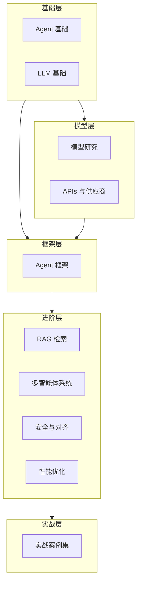

# 知识体系架构

> 描述 LLM Knowledge Base 的知识体系架构和模块依赖关系

---

## 架构总览



---

## 学习路径推荐

### 入门路线（Java 后端开发者）

```
01 Agent 基础 → 02 LLM 基础 → 04 Agent 框架 → 05 APIs
                      ↓
              03 LLM 模型研究（按需查阅）
```

### 进阶路线

```
06 RAG 知识检索 → 07 多智能体系统 → 08 安全与对齐
                      ↓
              09 性能优化与监控
```

### 实战路线

```
10 实战案例集（代码助手、客服机器人、文档问答等）
```

---

## 模块依赖关系

| 模块 | 依赖前置 | 被依赖后置 |
|------|----------|------------|
| 01-agent-basics | - | 04, 07, 08 |
| 02-llm-fundamentals | - | 03, 04, 05, 06 |
| 03-llm-models-research | 02 | 05 |
| 04-agent-frameworks | 01, 02 | 06, 07, 10 |
| 05-llm-apis-providers | 02, 03 | 10 |
| 06-rag-knowledge-retrieval | 02, 04 | 10 |
| 07-multi-agent-systems | 01, 04 | 10 |
| 08-model-safety-alignment | 01, 02, 04 | 10 |
| 09-performance-monitoring | 04, 05, 06 | 10 |
| 10-practical-cases | 全部前置 | - |

---

## 各模块定位

### 01-agent-basics - Agent 基础
**定位**：Agent 核心概念，入门必读
**核心内容**：
- Agent 定义、特征与分类
- 感知-推理-行动循环
- LLM 驱动的 Agent（ReAct、规划等）
- 工具调用与 Function Calling
- 记忆系统设计

### 02-llm-fundamentals - LLM 基础
**定位**：大模型底层原理
**核心内容**：
- Tokens 与上下文窗口
- Prompt 工程技巧
- Function Calling 机制
- 推理技术（CoT、ToT、ReAct）
- Embeddings 与向量表示

### 03-llm-models-research - 模型研究
**定位**：模型选型参考，持续更新
**核心内容**：
- 2025+ 主流模型全景
- OpenAI / Anthropic / Google / Meta 系列
- 国产模型（Qwen、DeepSeek、Kimi 等）
- 定价对比与选型指南

### 04-agent-frameworks - Agent 框架
**定位**：Java 生态框架选型
**核心内容**：
- LangChain / LangChain4j
- Spring AI
- Semantic Kernel
- LlamaIndex
- 框架对比与选型

### 05-llm-apis-providers - APIs 与供应商
**定位**：API 集成与部署
**核心内容**：
- OpenAI / Azure / Anthropic API
- Google Gemini API
- 本地 LLM 部署（Ollama、vLLM）
- 统一客户端抽象

### 06-rag-knowledge-retrieval - RAG 检索
**定位**：知识增强核心技术
**核心内容**：
- RAG 基础与架构演进
- Embedding 模型选型
- 向量数据库对比
- 检索策略与优化
- Java 实战项目

### 07-multi-agent-systems - 多智能体系统
**定位**：复杂任务协作
**核心内容**：
- 多 Agent 架构模式
- 通信与协作机制
- 任务分解与规划
- 主流框架对比

### 08-model-safety-alignment - 安全与对齐
**定位**：生产环境安全
**核心内容**：
- Prompt 注入防护
- 输出内容审查
- 隐私保护
- 幻觉检测与缓解

### 09-performance-monitoring - 性能优化
**定位**：生产环境运维
**核心内容**：
- 性能指标与监控
- 缓存策略
- 流式优化
- 成本优化
- 可观测性

### 10-practical-cases - 实战案例
**定位**：完整项目参考
**核心内容**：
- 代码生成助手
- 智能客服机器人
- 文档问答系统
- SQL 生成助手

---

## 文档规范

### 文件命名
- 使用小写字母
- 单词间用连字符 `-` 分隔
- 示例：`retrieval-strategies.md`, `agent-memory.md`

### 内容结构
每个主题文档应包含：
1. 概念与原理
2. 技术细节
3. Java 代码示例
4. 最佳实践
5. 常见问题

详见 [quality-standards.md](./quality-standards.md)
