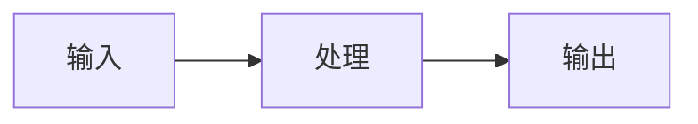

# 内容质量标准

> 定义 LLM Knowledge Base 的内容规范和质量要求

---

## 文档结构标准

每个主题文档必须包含以下章节：

```markdown
# 主题标题

## 一、概念与原理
- 核心概念解释
- 原理图解（mermaid 流程图）
- 关键公式（如有）

## 二、技术详解
- 技术细节分析
- 架构设计
- 工作流程

## 三、Java 代码示例
- 完整可运行的 Java 代码
- 关键类和方法
- 配置示例

## 四、最佳实践
- 工程实践经验
- 常见陷阱
- 性能优化建议

## 五、常见问题
- FAQ
- 故障排查
- 解决方案
```

---

## 内容质量标准

### 文档设计原则

| 维度 | 要求 | 示例 |
|------|------|------|
| **面向 Java** | 所有代码示例使用 Java | Spring Boot、LangChain4j 等 |
| **工程导向** | 不仅讲原理，还要讲落地 | 包含 Maven 依赖、配置文件 |
| **代码完整** | 提供可运行的代码 | 类定义、关键方法、注释完整 |
| **对比分析** | 多个方案对比 | 表格对比优缺点、适用场景 |
| **实战优先** | 结合真实工程场景 | 生产环境注意事项 |

### 文档数量建议

| 主题复杂度 | 文档数量 | 内容深度 |
|-----------|----------|----------|
| 简单主题 | 1-2 篇 | 概念 + 简单示例 |
| 中等主题 | 2-4 篇 | 原理 + 完整示例 + 最佳实践 |
| 复杂主题 | 4-8 篇 | 深度原理 + 多个示例 + 实战案例 |

---

## 代码示例标准

### Java 代码规范

```java
/**
 * 类功能说明
 * 
 * 使用场景：xxx
 * 核心思想：xxx
 */
@Component
public class ExampleService {
    
    // 关键配置参数
    @Value("${llm.api-key}")
    private String apiKey;
    
    private final ChatClient chatClient;
    
    public ExampleService(ChatClient chatClient) {
        this.chatClient = chatClient;
    }
    
    /**
     * 核心方法说明
     * 
     * @param input 输入参数说明
     * @return 返回值说明
     */
    public String process(String input) {
        // 1. 步骤一：xxx
        String step1 = doStep1(input);
        
        // 2. 步骤二：xxx
        String step2 = doStep2(step1);
        
        // 3. 返回结果
        return step2;
    }
    
    /**
     * 辅助方法
     */
    private String doStep1(String input) {
        // 实现逻辑...
        return input.trim();
    }
}
```

### 代码要求

| 要求 | 说明 |
|------|------|
| **完整性** | 包含类定义、依赖注入、关键方法 |
| **可读性** | 命名清晰，逻辑分步骤 |
| **实用性** | 可直接用于项目开发 |
| **注释** | 关键逻辑必须有注释 |
| **异常处理** | 展示基本的容错思维 |

### Maven 依赖示例

每个代码示例应包含必要的依赖：

```xml
<dependencies>
    <!-- Spring AI -->
    <dependency>
        <groupId>org.springframework.ai</groupId>
        <artifactId>spring-ai-openai-spring-boot-starter</artifactId>
    </dependency>
    
    <!-- LangChain4j -->
    <dependency>
        <groupId>dev.langchain4j</groupId>
        <artifactId>langchain4j-spring-boot-starter</artifactId>
        <version>0.35.0</version>
    </dependency>
</dependencies>
```

---

## 图表规范

### Mermaid 图表

优先使用 mermaid 绘制：
- 流程图（flowchart）
- 时序图（sequenceDiagram）
- 架构图（architecture）

示例：
```markdown

```

### 表格

对比类内容必须使用表格：

```markdown
| 维度 | A方案 | B方案 |
|------|-------|-------|
| 优点 | xxx | xxx |
| 缺点 | xxx | xxx |
| 适用 | xxx | xxx |
```

---

## 语言风格

### 中文表达

- 使用专业术语，避免口语化
- 技术名词保持英文（如 LLM、RAG、API）
- 长句拆分，一段一个核心观点

### 格式规范

| 元素 | 格式 |
|------|------|
| 文件标题 | `# 标题` - 一级标题 |
| 章节标题 | `## 一、xxx` - 二级标题，带序号 |
| 小节标题 | `### 1.1 xxx` - 三级标题 |
| 重点强调 | **加粗** 或 `代码块` |
| 引用 | > 引用内容 |
| 提示 | > 💡 **提示**：提示内容 |

---

## 质量检查清单

发布前自检：

- [ ] 文档结构完整（概念 → 技术 → 代码 → 实践 → FAQ）
- [ ] 包含完整的 Java 代码示例
- [ ] 包含 Maven/Gradle 依赖配置
- [ ] 有 mermaid 图表或对比表格
- [ ] 有最佳实践和常见问题
- [ ] 无错别字，语句通顺
- [ ] 技术概念准确

---

## 示例文档

参考以下已完成的高质量文档：
- [06-rag-knowledge-retrieval/01-rag-basics.md](../06-rag-knowledge-retrieval/01-rag-basics.md)
- [07-multi-agent-systems/01-multi-agent-basics.md](../07-multi-agent-systems/01-multi-agent-basics.md)
- [09-performance-monitoring/01-performance-metrics.md](../09-performance-monitoring/01-performance-metrics.md)
